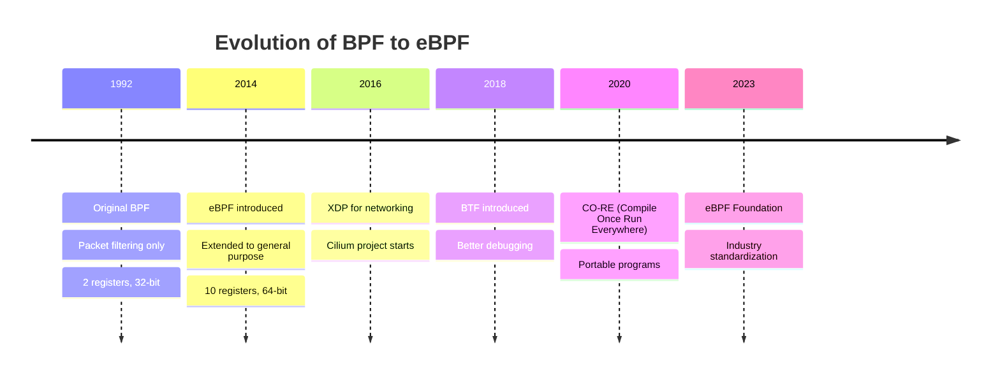
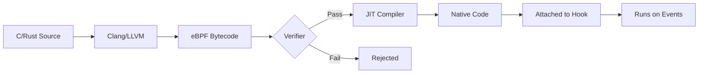
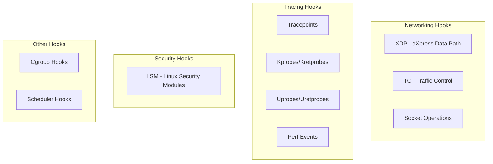
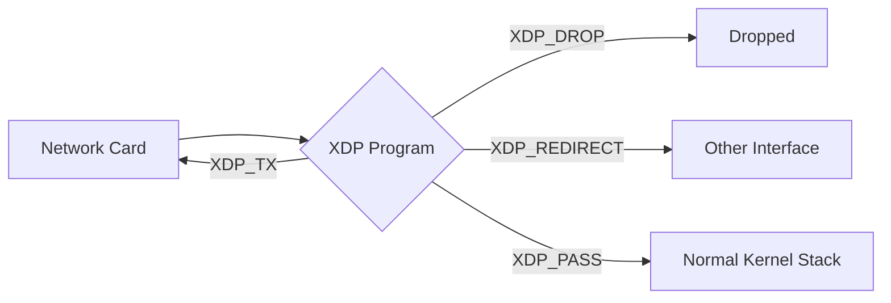
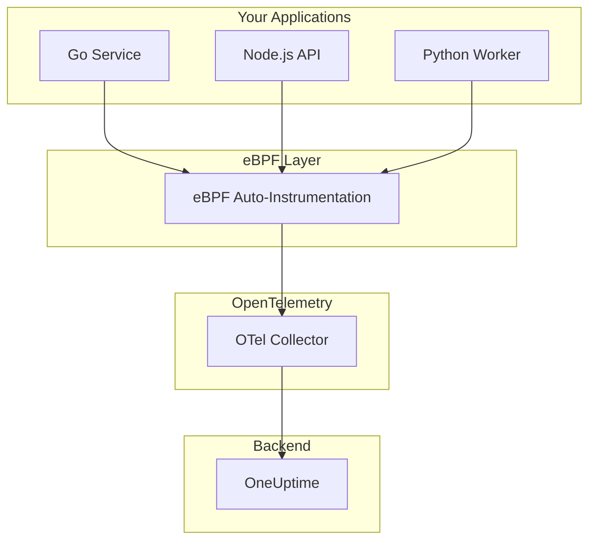

# What is eBPF and How Does It Work?

Author: [nawazdhandala](https://www.github.com/nawazdhandala)

Tags: eBPF, Linux, Observability, Security, Networking, Tracing, Performance, Kernel

Description: A comprehensive guide to eBPF (extended Berkeley Packet Filter)- what it is, how it works, why it's transforming observability and security, and how modern tools like Cilium, Falco, and continuous profilers leverage it for unprecedented system visibility.

---

> Traditional observability requires instrumenting your code. eBPF lets you observe your system **without changing a single line of application code**- directly from the kernel.

If you've been following the observability, security, or networking space recently, you've probably heard the term "eBPF" thrown around with increasing frequency. Companies like Meta, Google, Netflix, and Cloudflare are using it in production. Tools like Cilium, Falco, Pixie, and Parca are built on it. But what exactly *is* eBPF, and why is it generating so much excitement?

This post breaks down eBPF from first principles: what it is, how it works under the hood, what you can do with it, and how it's changing the game for observability, security, and networking.

---

## 1. What is eBPF?

**eBPF (extended Berkeley Packet Filter)** is a revolutionary technology that allows you to run sandboxed programs directly in the Linux kernel without changing kernel source code or loading kernel modules.

Think of it as a **safe, programmable way to extend the kernel's capabilities** at runtime. Instead of modifying the kernel (which requires recompilation, reboots, and carries significant risk), you can inject small programs that run in response to specific events- network packets arriving, system calls being made, functions being called, and more.

> eBPF is to the Linux kernel what JavaScript is to web browsers: a safe, sandboxed runtime that allows extending functionality without modifying the underlying engine.

Key characteristics:

| Property | Description |
|----------|-------------|
| **Sandboxed** | eBPF programs run in a restricted virtual machine; they can't crash the kernel |
| **Verified** | Every program is statically analyzed before execution to ensure safety |
| **JIT Compiled** | Programs are compiled to native machine code for near-native performance |
| **Event-Driven** | Programs attach to specific hook points and run when those events occur |
| **Zero-Copy** | Data can be accessed directly from kernel space without expensive copies |

---

## 2. A Brief History: From BPF to eBPF

Understanding where eBPF came from helps explain its design:

**1992 - Original BPF**: Steven McCanne and Van Jacobson at Lawrence Berkeley Laboratory created BPF (Berkeley Packet Filter) for efficient network packet filtering. It was a simple in-kernel virtual machine that could filter packets without copying them to userspace.

**2014 - eBPF Born**: Alexei Starovoitov extended BPF dramatically for Linux 3.18. The "extended" version added:
- More registers (10 vs 2)
- 64-bit registers (vs 32-bit)
- Maps for state storage
- Helper functions for kernel interaction
- Attachment to many more hook points beyond just networking

**2016-Present - Explosion of Use Cases**: eBPF grew beyond networking into tracing, security, and observability. Major companies adopted it for production workloads.



---

## 3. How eBPF Works Under the Hood

Here's the lifecycle of an eBPF program:

### Step 1: Write the Program

eBPF programs are typically written in a restricted subset of C, then compiled to eBPF bytecode. Modern tools also support Rust.

```c
// Simple example: Count system calls
SEC("tracepoint/raw_syscalls/sys_enter")
int count_syscalls(struct trace_event_raw_sys_enter *ctx) {
    u64 *count;
    u32 key = 0;
    
    count = bpf_map_lookup_elem(&syscall_count, &key);
    if (count) {
        __sync_fetch_and_add(count, 1);
    }
    return 0;
}
```

### Step 2: Compile to Bytecode

The C code is compiled using Clang/LLVM to eBPF bytecode- a portable intermediate representation similar to Java bytecode.

### Step 3: Verification

This is the **critical safety step**. The kernel's eBPF verifier performs exhaustive static analysis:

- No unbounded loops (must terminate)
- No out-of-bounds memory access
- No invalid pointer arithmetic
- Stack size limits (512 bytes)
- All code paths must be safe

If verification fails, the program is rejected before it ever runs.

### Step 4: JIT Compilation

Once verified, the bytecode is JIT (Just-In-Time) compiled to native machine instructions for near-native performance. On x86_64, eBPF instructions map almost 1:1 to native instructions.

### Step 5: Attach and Run

The compiled program is attached to a specific hook point (tracepoint, kprobe, socket, etc.) and runs every time that event occurs.



---

## 4. The eBPF Architecture

The eBPF subsystem consists of several key components:

### The Virtual Machine

eBPF programs run in a register-based virtual machine with:

| Component | Description |
|-----------|-------------|
| 11 Registers | R0-R10 (R10 is read-only frame pointer) |
| 64-bit | All registers are 64-bit |
| 512-byte stack | Limited but sufficient for most programs |
| Instruction Set | ~100 instructions (ALU, jump, load/store, call) |

### Helper Functions

eBPF programs can't call arbitrary kernel functions. Instead, they use a set of **helper functions** exposed by the kernel:

```c
// Common helpers
bpf_map_lookup_elem()    // Read from a map
bpf_map_update_elem()    // Write to a map
bpf_probe_read()         // Safely read kernel memory
bpf_get_current_pid_tgid()  // Get process ID
bpf_ktime_get_ns()       // Get timestamp
bpf_trace_printk()       // Debug output
bpf_perf_event_output()  // Send data to userspace
```

### Hook Points

eBPF programs attach to various kernel hook points:



---

## 5. Types of eBPF Programs

Different program types attach to different hooks and have different capabilities:

| Program Type | Hook Point | Use Case |
|--------------|------------|----------|
| `BPF_PROG_TYPE_SOCKET_FILTER` | Sockets | Packet filtering, monitoring |
| `BPF_PROG_TYPE_KPROBE` | Kernel functions | Tracing, debugging |
| `BPF_PROG_TYPE_TRACEPOINT` | Static tracepoints | Stable kernel tracing |
| `BPF_PROG_TYPE_XDP` | Network driver | High-performance packet processing |
| `BPF_PROG_TYPE_PERF_EVENT` | Perf events | Profiling, sampling |
| `BPF_PROG_TYPE_CGROUP_*` | Cgroup hooks | Container networking/security |
| `BPF_PROG_TYPE_LSM` | Security hooks | Security enforcement |
| `BPF_PROG_TYPE_STRUCT_OPS` | Kernel subsystems | TCP congestion control |

### XDP (eXpress Data Path)

XDP is particularly powerful for networking. It runs at the **earliest possible point**- before the kernel allocates a socket buffer:



This enables:
- DDoS mitigation at millions of packets/second
- Load balancing without kernel overhead
- Custom packet processing pipelines

---

## 6. eBPF Maps: Sharing Data

Maps are the **primary data structure** for eBPF programs. They enable:

1. **State persistence** between program invocations
2. **Communication** between eBPF programs and userspace
3. **Sharing** between multiple eBPF programs

### Common Map Types

| Map Type | Description | Use Case |
|----------|-------------|----------|
| `BPF_MAP_TYPE_HASH` | Hash table | Key-value lookups |
| `BPF_MAP_TYPE_ARRAY` | Array | Index-based access |
| `BPF_MAP_TYPE_PERCPU_HASH` | Per-CPU hash | Avoid lock contention |
| `BPF_MAP_TYPE_PERF_EVENT_ARRAY` | Ring buffer per CPU | Streaming to userspace |
| `BPF_MAP_TYPE_RINGBUF` | Single ring buffer | Efficient event streaming |
| `BPF_MAP_TYPE_LRU_HASH` | LRU eviction hash | Bounded memory usage |
| `BPF_MAP_TYPE_STACK_TRACE` | Stack trace storage | Profiling |

### Example: Counting Events by Process

```c
// Define a hash map: PID -> count
struct {
    __uint(type, BPF_MAP_TYPE_HASH);
    __uint(max_entries, 10240);
    __type(key, u32);      // PID
    __type(value, u64);    // Count
} syscall_counts SEC(".maps");

SEC("tracepoint/raw_syscalls/sys_enter")
int count_by_pid(void *ctx) {
    u32 pid = bpf_get_current_pid_tgid() >> 32;
    u64 *count, init_val = 1;
    
    count = bpf_map_lookup_elem(&syscall_counts, &pid);
    if (count) {
        __sync_fetch_and_add(count, 1);
    } else {
        bpf_map_update_elem(&syscall_counts, &pid, &init_val, BPF_ANY);
    }
    return 0;
}
```

---

## 7. Why eBPF Matters for Observability

Traditional observability approaches have significant drawbacks:

| Approach | Drawback |
|----------|----------|
| Application instrumentation | Requires code changes, language-specific |
| Agent-based monitoring | CPU/memory overhead, sampling limits |
| Kernel modules | Risky, requires maintenance per kernel version |
| Static tracepoints | Limited to what kernel developers exposed |

eBPF changes the game:

### Zero-Code Instrumentation

With eBPF, you can observe:
- Every system call made by any process
- Every network packet sent or received
- Every function call in the kernel
- Every memory allocation
- File I/O, disk operations, CPU scheduling

**Without changing application code.**

### Low Overhead

Because eBPF programs:
- Run in kernel space (no context switching)
- Are JIT compiled (near-native speed)
- Can aggregate in-kernel (reduce data volume)

Overhead is typically **< 1%** even with extensive tracing.

### Universal Visibility

One eBPF program can observe:
- Any language (Go, Rust, Python, Node.js, Java...)
- Any framework
- Any container or VM
- Kernel operations invisible to application-level tools

This is particularly valuable for [profiling](https://oneuptime.com/blog/post/2025-09-09-basics-of-profiling/view) where you need to understand not just application code but also how it interacts with the kernel.

---

## 8. eBPF vs Traditional Instrumentation

How does eBPF compare to traditional approaches like [OpenTelemetry](https://oneuptime.com/blog/post/2025-08-20-three-pillars-of-observability-logs-metrics-traces/view)?

| Aspect | OpenTelemetry | eBPF |
|--------|---------------|------|
| **Where it runs** | In your application | In the kernel |
| **Code changes** | Required (SDK integration) | None |
| **Language support** | Per-language SDKs needed | Universal |
| **Overhead** | Varies by implementation | Consistently low |
| **Visibility** | Application-level | System-wide |
| **Customization** | Full control over what to trace | Limited to kernel capabilities |
| **Semantic context** | Rich (can add business context) | Limited (no application context) |
| **[Traces](https://oneuptime.com/blog/post/2025-08-27-traces-and-spans-in-opentelemetry/view)** | Detailed spans with attributes | Basic function-level tracing |

**The verdict?** They're complementary:

- **Use OpenTelemetry** for rich application-level traces with business context, custom attributes, and explicit instrumentation of important code paths
- **Use eBPF** for infrastructure-level visibility, security monitoring, network observability, and filling gaps where you can't or don't want to instrument

Many modern observability platforms combine both approaches.

---

## 9. Real-World Use Cases

### Networking

**Load Balancing**: Facebook's Katran handles millions of connections using XDP-based load balancing with consistent hashing.

**Service Mesh**: Cilium replaces traditional iptables-based networking in Kubernetes with eBPF for 10x better performance.

**DDoS Mitigation**: Cloudflare uses XDP to drop malicious packets at wire speed before they consume kernel resources.

### Security

**Runtime Security**: Falco and Tetragon detect suspicious behavior (unexpected file access, network connections, process execution) in real-time.

**Audit Logging**: Track all file access, network connections, and privilege escalations without application cooperation.

**Container Security**: Enforce security policies at the kernel level, preventing container escapes.

### Observability

**Continuous Profiling**: Tools like Parca and Pyroscope use eBPF to capture stack traces across all processes continuously.

**Network Monitoring**: See exactly which processes are talking to which endpoints, with latency and byte counts.

**Distributed Tracing**: Automatically trace requests across services without code instrumentation.

### Performance

**TCP Optimization**: Custom congestion control algorithms without kernel patches.

**I/O Analysis**: Understand exactly where disk and network latency comes from.

**Latency Debugging**: Trace requests through the kernel to find where time is spent.

---

## 10. Popular eBPF-Based Tools

Here's a landscape of tools built on eBPF:

### Networking

| Tool | Description | Use Case |
|------|-------------|----------|
| **Cilium** | CNI plugin for Kubernetes | Container networking, service mesh |
| **Katran** | L4 load balancer | High-performance load balancing |
| **Cloudflare's Unimog** | Edge load balancer | Global traffic management |

### Security

| Tool | Description | Use Case |
|------|-------------|----------|
| **Falco** | Runtime security | Threat detection |
| **Tetragon** | Security observability | Policy enforcement |
| **Tracee** | Security tracing | Forensics, detection |

### Observability

| Tool | Description | Use Case |
|------|-------------|----------|
| **Pixie** | Auto-instrumentation | Kubernetes observability |
| **Parca** | Continuous profiling | Performance analysis |
| **Pyroscope** | Continuous profiling | Flame graphs |
| **bpftrace** | High-level tracing | Ad-hoc analysis |
| **BCC** | Toolkit collection | Various tracing tools |

### Performance

| Tool | Description | Use Case |
|------|-------------|----------|
| **perf** + eBPF | Linux profiler | Performance analysis |
| **bpftool** | eBPF management | Debugging, introspection |

---

## 11. eBPF and OpenTelemetry

The OpenTelemetry project is actively working on eBPF integration:

### OpenTelemetry eBPF

The `opentelemetry-ebpf-profiler` project (formerly Prodfiler) provides:
- Whole-system continuous profiling
- Integration with OTel collectors
- Stack trace correlation with traces

### Auto-Instrumentation

Several projects use eBPF for automatic OpenTelemetry instrumentation:
- **Odigos**: Auto-instruments any application with distributed tracing
- **Beyla**: Auto-instruments Go, Node.js, Python, and more

This bridges the gap: get eBPF's zero-code deployment with OpenTelemetry's rich semantics.



---

## 12. Limitations and Considerations

eBPF isn't magic. There are real limitations:

### Technical Limitations

| Limitation | Details |
|------------|---------|
| **Linux only** | No Windows or macOS support (yet) |
| **Kernel version** | Many features require Linux 4.x+ or 5.x+ |
| **Verifier constraints** | No unbounded loops, limited stack, no sleeping |
| **Helper function limits** | Can only call approved kernel functions |
| **BTF requirements** | Some features need kernel built with BTF |

### Operational Considerations

**Kernel compatibility**: eBPF programs may need adjustment between kernel versions. CO-RE (Compile Once, Run Everywhere) helps but doesn't solve everything.

**Debugging difficulty**: When something goes wrong, debugging eBPF is harder than application code.

**Security implications**: eBPF programs run with kernel privileges. A bug won't crash the kernel (thanks to the verifier), but malicious or poorly-written programs could cause issues.

**Learning curve**: Writing eBPF programs requires understanding kernel internals.

### What eBPF Can't Do

- Access application-level context (user IDs, session data, business logic)
- Provide the same semantic richness as explicit instrumentation
- Run on non-Linux systems
- Modify application behavior (safely)

---

## 13. Getting Started with eBPF

### If You Just Want to Use eBPF Tools

You don't need to write eBPF programs to benefit from them. Start with existing tools:

```bash
# Install BCC tools (Ubuntu/Debian)
sudo apt-get install bpfcc-tools linux-headers-$(uname -r)

# Try some tools
sudo opensnoop-bpfcc     # Watch file opens
sudo execsnoop-bpfcc     # Watch process execution
sudo tcpconnect-bpfcc    # Watch TCP connections
sudo biolatency-bpfcc    # Disk I/O latency histogram
```

### If You Want to Write eBPF Programs

**Modern approach: Use libbpf + CO-RE**

```bash
# Install dependencies
sudo apt-get install clang llvm libelf-dev libbpf-dev

# Clone libbpf-bootstrap for examples
git clone https://github.com/libbpf/libbpf-bootstrap.git
cd libbpf-bootstrap/examples/c
make
```

**Alternative: Use bpftrace for quick scripts**

```bash
# Install bpftrace
sudo apt-get install bpftrace

# One-liner to count syscalls by process
sudo bpftrace -e 'tracepoint:raw_syscalls:sys_enter { @[comm] = count(); }'

# Latency histogram for read syscalls
sudo bpftrace -e 'tracepoint:syscalls:sys_enter_read { @start[tid] = nsecs; }
    tracepoint:syscalls:sys_exit_read /@start[tid]/ { 
        @latency = hist(nsecs - @start[tid]); 
        delete(@start[tid]); 
    }'
```

### Resources for Learning

| Resource | Description |
|----------|-------------|
| [ebpf.io](https://ebpf.io) | Official eBPF documentation and tutorials |
| "BPF Performance Tools" by Brendan Gregg | The definitive book |
| [libbpf-bootstrap](https://github.com/libbpf/libbpf-bootstrap) | Modern eBPF project templates |
| [BCC tools](https://github.com/iovisor/bcc) | Pre-built tools and Python bindings |
| [bpftrace](https://github.com/iovisor/bpftrace) | High-level tracing language |

---

## 14. The Future of eBPF

eBPF continues to evolve rapidly:

### Near-Term Developments

- **eBPF on Windows**: Microsoft is actively developing eBPF support
- **More program types**: Expanding what eBPF can hook into
- **Better tooling**: Improved debugging, testing, and development experience
- **Language support**: More high-level languages (Rust, Go) for writing eBPF

### Long-Term Vision

- **Programmable kernel**: eBPF as the standard way to extend Linux
- **Cross-platform**: eBPF Foundation driving consistency across implementations
- **AI/ML integration**: eBPF for real-time inference at the kernel level
- **Hardware offload**: Running eBPF programs on SmartNICs

The eBPF Foundation (under the Linux Foundation) includes Meta, Google, Microsoft, Netflix, and others- a sign of the technology's importance.

---

## Conclusion

eBPF represents a fundamental shift in how we can observe and secure Linux systems. By providing a safe, efficient way to run custom code in the kernel, it enables:

- **Unprecedented visibility** into system behavior without application changes
- **Security enforcement** at the lowest possible level
- **Network innovation** without kernel modifications
- **Low-overhead observability** that was previously impossible

For observability practitioners, eBPF offers a powerful complement to traditional instrumentation. While it doesn't replace the need for application-level [traces](https://oneuptime.com/blog/post/2025-08-27-traces-and-spans-in-opentelemetry/view), [metrics, and logs](https://oneuptime.com/blog/post/2025-08-20-three-pillars-of-observability-logs-metrics-traces/view), it fills critical gaps- especially for infrastructure monitoring, security, and situations where code instrumentation isn't possible.

Whether you're debugging performance issues, implementing security policies, or building the next generation of observability tools, understanding eBPF is becoming essential knowledge for anyone working with Linux systems.

---

## Key Takeaways

1. **eBPF is a sandboxed runtime** for running custom programs in the Linux kernel safely
2. **The verifier** ensures programs can't crash the kernel or access invalid memory
3. **Maps** enable state persistence and communication with userspace
4. **eBPF excels** at system-wide visibility without code changes
5. **It complements** (doesn't replace) application-level instrumentation like OpenTelemetry
6. **Start with existing tools** (BCC, bpftrace) before writing custom programs
7. **The ecosystem is mature** with production use at major tech companies

---

*Looking for a modern observability platform that can ingest data from eBPF-based tools alongside your OpenTelemetry instrumentation? [OneUptime](https://oneuptime.com) provides unified observability with support for traces, metrics, logs, and more- helping you correlate system-level eBPF data with application-level insights.*
