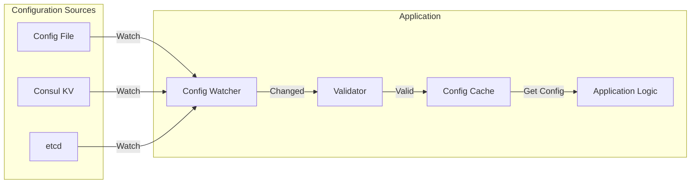

# How to Implement Configuration Hot-Reload

Author: [nawazdhandala](https://www.github.com/nawazdhandala)

Tags: Configuration Management, Hot Reload, DevOps, Microservices, Dynamic Configuration

Description: Learn how to implement configuration hot-reload in your applications, enabling real-time configuration updates without service restarts using file watchers, Consul, and etcd.

---

Configuration hot-reload allows applications to update their behavior without restarts. This is essential for production systems where downtime must be minimized and configuration changes need to take effect immediately. This guide covers multiple approaches including file-based, Consul-based, and etcd-based hot-reload implementations.

## Hot-Reload Architecture

A typical hot-reload system involves watching configuration sources, detecting changes, validating new configuration, and applying updates safely.



## 1. File-Based Hot-Reload

Watch configuration files for changes using inotify (Linux) or fsnotify (cross-platform).

**Python Implementation:**

```python
import os
import json
import yaml
import threading
import hashlib
from watchdog.observers import Observer
from watchdog.events import FileSystemEventHandler
from typing import Any, Callable, Dict, Optional
import logging

logging.basicConfig(level=logging.INFO)
logger = logging.getLogger(__name__)

class ConfigHotReloader:
    def __init__(self, config_path: str, reload_callback: Optional[Callable] = None):
        self.config_path = os.path.abspath(config_path)
        self.config_dir = os.path.dirname(self.config_path)
        self.config_filename = os.path.basename(self.config_path)
        self.reload_callback = reload_callback
        self._config: Dict[str, Any] = {}
        self._config_hash: str = ""
        self._lock = threading.RLock()
        self._observer: Optional[Observer] = None

        # Load initial configuration
        self._load_config()

    def _compute_hash(self, content: str) -> str:
        return hashlib.md5(content.encode()).hexdigest()

    def _load_config(self) -> bool:
        """Load configuration from file."""
        try:
            with open(self.config_path, 'r') as f:
                content = f.read()

            # Check if content actually changed
            new_hash = self._compute_hash(content)
            if new_hash == self._config_hash:
                return False

            # Parse based on file extension
            if self.config_path.endswith('.json'):
                new_config = json.loads(content)
            elif self.config_path.endswith(('.yaml', '.yml')):
                new_config = yaml.safe_load(content)
            else:
                raise ValueError(f"Unsupported config format: {self.config_path}")

            # Validate configuration
            if not self._validate_config(new_config):
                logger.error("Configuration validation failed")
                return False

            # Apply new configuration
            with self._lock:
                self._config = new_config
                self._config_hash = new_hash

            logger.info(f"Configuration reloaded: {self.config_path}")

            # Notify callback
            if self.reload_callback:
                self.reload_callback(new_config)

            return True

        except Exception as e:
            logger.error(f"Failed to load configuration: {e}")
            return False

    def _validate_config(self, config: Dict) -> bool:
        """Override to add custom validation."""
        # Basic validation - check required fields
        required_fields = ['database', 'server']
        for field in required_fields:
            if field not in config:
                logger.error(f"Missing required field: {field}")
                return False
        return True

    def get(self, key: str, default: Any = None) -> Any:
        """Get configuration value by key (supports dot notation)."""
        with self._lock:
            value = self._config
            for part in key.split('.'):
                if isinstance(value, dict):
                    value = value.get(part)
                else:
                    return default
                if value is None:
                    return default
            return value

    def get_all(self) -> Dict:
        """Get entire configuration."""
        with self._lock:
            return self._config.copy()

    def start_watching(self):
        """Start watching for file changes."""
        class ConfigChangeHandler(FileSystemEventHandler):
            def __init__(handler_self, reloader):
                handler_self.reloader = reloader

            def on_modified(handler_self, event):
                if event.src_path == handler_self.reloader.config_path:
                    logger.info("Config file modified, reloading...")
                    handler_self.reloader._load_config()

        self._observer = Observer()
        self._observer.schedule(
            ConfigChangeHandler(self),
            self.config_dir,
            recursive=False
        )
        self._observer.start()
        logger.info(f"Started watching: {self.config_path}")

    def stop_watching(self):
        """Stop watching for changes."""
        if self._observer:
            self._observer.stop()
            self._observer.join()
            logger.info("Stopped watching configuration")

# Usage
def on_config_reload(new_config):
    logger.info("Configuration reloaded!")
    # Update application state based on new config
    update_database_pool(new_config['database'])
    update_feature_flags(new_config.get('features', {}))

config = ConfigHotReloader('/etc/myapp/config.yaml', reload_callback=on_config_reload)
config.start_watching()

# Access configuration
db_host = config.get('database.host', 'localhost')
max_connections = config.get('database.max_connections', 10)
```

**Go Implementation:**

```go
package main

import (
    "crypto/md5"
    "encoding/hex"
    "encoding/json"
    "fmt"
    "io/ioutil"
    "log"
    "os"
    "path/filepath"
    "sync"

    "github.com/fsnotify/fsnotify"
    "gopkg.in/yaml.v3"
)

type Config struct {
    Database struct {
        Host           string `json:"host" yaml:"host"`
        Port           int    `json:"port" yaml:"port"`
        MaxConnections int    `json:"max_connections" yaml:"max_connections"`
    } `json:"database" yaml:"database"`
    Server struct {
        Port    int    `json:"port" yaml:"port"`
        Timeout string `json:"timeout" yaml:"timeout"`
    } `json:"server" yaml:"server"`
    Features map[string]bool `json:"features" yaml:"features"`
}

type ConfigHotReloader struct {
    configPath     string
    config         Config
    configHash     string
    mu             sync.RWMutex
    watcher        *fsnotify.Watcher
    reloadCallback func(Config)
}

func NewConfigHotReloader(configPath string, callback func(Config)) (*ConfigHotReloader, error) {
    r := &ConfigHotReloader{
        configPath:     configPath,
        reloadCallback: callback,
    }

    if err := r.loadConfig(); err != nil {
        return nil, fmt.Errorf("failed to load initial config: %w", err)
    }

    return r, nil
}

func (r *ConfigHotReloader) computeHash(content []byte) string {
    hash := md5.Sum(content)
    return hex.EncodeToString(hash[:])
}

func (r *ConfigHotReloader) loadConfig() error {
    content, err := ioutil.ReadFile(r.configPath)
    if err != nil {
        return err
    }

    newHash := r.computeHash(content)
    if newHash == r.configHash {
        return nil // No change
    }

    var newConfig Config
    ext := filepath.Ext(r.configPath)
    switch ext {
    case ".json":
        err = json.Unmarshal(content, &newConfig)
    case ".yaml", ".yml":
        err = yaml.Unmarshal(content, &newConfig)
    default:
        return fmt.Errorf("unsupported config format: %s", ext)
    }

    if err != nil {
        return fmt.Errorf("failed to parse config: %w", err)
    }

    // Validate configuration
    if err := r.validateConfig(&newConfig); err != nil {
        return fmt.Errorf("config validation failed: %w", err)
    }

    r.mu.Lock()
    r.config = newConfig
    r.configHash = newHash
    r.mu.Unlock()

    log.Printf("Configuration reloaded: %s", r.configPath)

    if r.reloadCallback != nil {
        r.reloadCallback(newConfig)
    }

    return nil
}

func (r *ConfigHotReloader) validateConfig(config *Config) error {
    if config.Database.Host == "" {
        return fmt.Errorf("database.host is required")
    }
    if config.Server.Port == 0 {
        return fmt.Errorf("server.port is required")
    }
    return nil
}

func (r *ConfigHotReloader) Get() Config {
    r.mu.RLock()
    defer r.mu.RUnlock()
    return r.config
}

func (r *ConfigHotReloader) StartWatching() error {
    watcher, err := fsnotify.NewWatcher()
    if err != nil {
        return err
    }
    r.watcher = watcher

    go func() {
        for {
            select {
            case event, ok := <-watcher.Events:
                if !ok {
                    return
                }
                if event.Op&fsnotify.Write == fsnotify.Write {
                    log.Println("Config file modified, reloading...")
                    if err := r.loadConfig(); err != nil {
                        log.Printf("Failed to reload config: %v", err)
                    }
                }
            case err, ok := <-watcher.Errors:
                if !ok {
                    return
                }
                log.Printf("Watcher error: %v", err)
            }
        }
    }()

    return watcher.Add(r.configPath)
}

func (r *ConfigHotReloader) StopWatching() {
    if r.watcher != nil {
        r.watcher.Close()
    }
}

func main() {
    reloader, err := NewConfigHotReloader("config.yaml", func(config Config) {
        log.Printf("Config reloaded! DB Host: %s", config.Database.Host)
    })
    if err != nil {
        log.Fatal(err)
    }

    if err := reloader.StartWatching(); err != nil {
        log.Fatal(err)
    }
    defer reloader.StopWatching()

    // Use configuration
    config := reloader.Get()
    fmt.Printf("Database host: %s\n", config.Database.Host)

    // Keep running
    select {}
}
```

## 2. Consul-Based Hot-Reload

Use Consul watches for distributed configuration hot-reload.

```python
import consul
import json
import threading
from typing import Any, Callable, Dict, Optional
import logging

logger = logging.getLogger(__name__)

class ConsulConfigReloader:
    def __init__(
        self,
        consul_host: str = 'localhost',
        consul_port: int = 8500,
        config_prefix: str = '/config/myapp/',
        reload_callback: Optional[Callable] = None
    ):
        self.consul = consul.Consul(host=consul_host, port=consul_port)
        self.config_prefix = config_prefix
        self.reload_callback = reload_callback
        self._config: Dict[str, Any] = {}
        self._lock = threading.RLock()
        self._stop_event = threading.Event()
        self._watch_thread: Optional[threading.Thread] = None

        # Load initial configuration
        self._load_all_config()

    def _load_all_config(self):
        """Load all configuration keys under the prefix."""
        try:
            index, data = self.consul.kv.get(self.config_prefix, recurse=True)

            new_config = {}
            if data:
                for item in data:
                    key = item['Key'].replace(self.config_prefix, '')
                    value = item['Value']
                    if value:
                        # Try to parse as JSON, fall back to string
                        try:
                            new_config[key] = json.loads(value.decode())
                        except (json.JSONDecodeError, AttributeError):
                            new_config[key] = value.decode() if value else None

            with self._lock:
                self._config = new_config

            logger.info(f"Loaded {len(new_config)} configuration keys")
            return index

        except Exception as e:
            logger.error(f"Failed to load configuration: {e}")
            return None

    def _watch_config(self):
        """Watch for configuration changes using blocking queries."""
        index = None

        while not self._stop_event.is_set():
            try:
                new_index, data = self.consul.kv.get(
                    self.config_prefix,
                    recurse=True,
                    index=index,
                    wait='30s'
                )

                if new_index != index:
                    index = new_index

                    # Process changes
                    new_config = {}
                    if data:
                        for item in data:
                            key = item['Key'].replace(self.config_prefix, '')
                            value = item['Value']
                            if value:
                                try:
                                    new_config[key] = json.loads(value.decode())
                                except (json.JSONDecodeError, AttributeError):
                                    new_config[key] = value.decode() if value else None

                    with self._lock:
                        old_config = self._config.copy()
                        self._config = new_config

                    # Detect what changed
                    changes = self._detect_changes(old_config, new_config)
                    if changes:
                        logger.info(f"Configuration changed: {changes}")
                        if self.reload_callback:
                            self.reload_callback(new_config, changes)

            except Exception as e:
                logger.error(f"Watch error: {e}")
                self._stop_event.wait(5)

    def _detect_changes(self, old: Dict, new: Dict) -> Dict:
        """Detect what changed between old and new config."""
        changes = {
            'added': [],
            'removed': [],
            'modified': []
        }

        for key in new:
            if key not in old:
                changes['added'].append(key)
            elif old[key] != new[key]:
                changes['modified'].append(key)

        for key in old:
            if key not in new:
                changes['removed'].append(key)

        return changes if any(changes.values()) else None

    def get(self, key: str, default: Any = None) -> Any:
        """Get configuration value."""
        with self._lock:
            return self._config.get(key, default)

    def get_all(self) -> Dict:
        """Get all configuration."""
        with self._lock:
            return self._config.copy()

    def set(self, key: str, value: Any) -> bool:
        """Set a configuration value in Consul."""
        try:
            full_key = f"{self.config_prefix}{key}"
            if isinstance(value, (dict, list)):
                value = json.dumps(value)
            return self.consul.kv.put(full_key, str(value))
        except Exception as e:
            logger.error(f"Failed to set config: {e}")
            return False

    def start_watching(self):
        """Start watching for configuration changes."""
        self._stop_event.clear()
        self._watch_thread = threading.Thread(target=self._watch_config, daemon=True)
        self._watch_thread.start()
        logger.info("Started watching Consul configuration")

    def stop_watching(self):
        """Stop watching for changes."""
        self._stop_event.set()
        if self._watch_thread:
            self._watch_thread.join(timeout=5)
        logger.info("Stopped watching Consul configuration")

# Usage
def on_config_change(config, changes):
    logger.info(f"Configuration changed: {changes}")
    if 'database' in changes.get('modified', []):
        # Reconnect to database with new settings
        reconnect_database(config['database'])

config = ConsulConfigReloader(
    config_prefix='/config/myapp/',
    reload_callback=on_config_change
)
config.start_watching()

# Access configuration
db_config = config.get('database', {})
feature_enabled = config.get('features/new_ui', False)
```

## 3. Signal-Based Reload

Trigger reload via Unix signals (SIGHUP).

```python
import signal
import sys
import os

class SignalReloadHandler:
    def __init__(self, config_loader):
        self.config_loader = config_loader
        self._setup_signal_handler()

    def _setup_signal_handler(self):
        """Set up SIGHUP handler for configuration reload."""
        signal.signal(signal.SIGHUP, self._handle_sighup)

    def _handle_sighup(self, signum, frame):
        """Handle SIGHUP signal - reload configuration."""
        print("Received SIGHUP, reloading configuration...")
        try:
            self.config_loader._load_config()
            print("Configuration reloaded successfully")
        except Exception as e:
            print(f"Failed to reload configuration: {e}")

# Usage
config = ConfigHotReloader('/etc/myapp/config.yaml')
signal_handler = SignalReloadHandler(config)

# To trigger reload from another process:
# kill -HUP <pid>
```

## 4. HTTP Endpoint for Reload

Expose an HTTP endpoint to trigger configuration reload.

```python
from flask import Flask, jsonify

app = Flask(__name__)
config_reloader = ConfigHotReloader('/etc/myapp/config.yaml')

@app.route('/admin/reload-config', methods=['POST'])
def reload_config():
    """Endpoint to trigger configuration reload."""
    try:
        success = config_reloader._load_config()
        if success:
            return jsonify({'status': 'ok', 'message': 'Configuration reloaded'})
        else:
            return jsonify({'status': 'ok', 'message': 'No changes detected'})
    except Exception as e:
        return jsonify({'status': 'error', 'message': str(e)}), 500

@app.route('/admin/config', methods=['GET'])
def get_config():
    """Endpoint to view current configuration."""
    return jsonify(config_reloader.get_all())

# Trigger reload via:
# curl -X POST http://localhost:8080/admin/reload-config
```

## Best Practices

1. **Validate before applying** - Always validate new configuration before applying
2. **Use atomic updates** - Ensure configuration updates are atomic
3. **Implement rollback** - Keep previous config for rollback on errors
4. **Log all changes** - Track configuration changes for auditing
5. **Graceful degradation** - Continue with old config if reload fails
6. **Test reload scenarios** - Verify application behavior during reloads

---

Configuration hot-reload enables zero-downtime configuration updates, making your applications more flexible and easier to operate. By combining file watchers, distributed configuration stores, and proper validation, you can safely update application behavior without service restarts.
