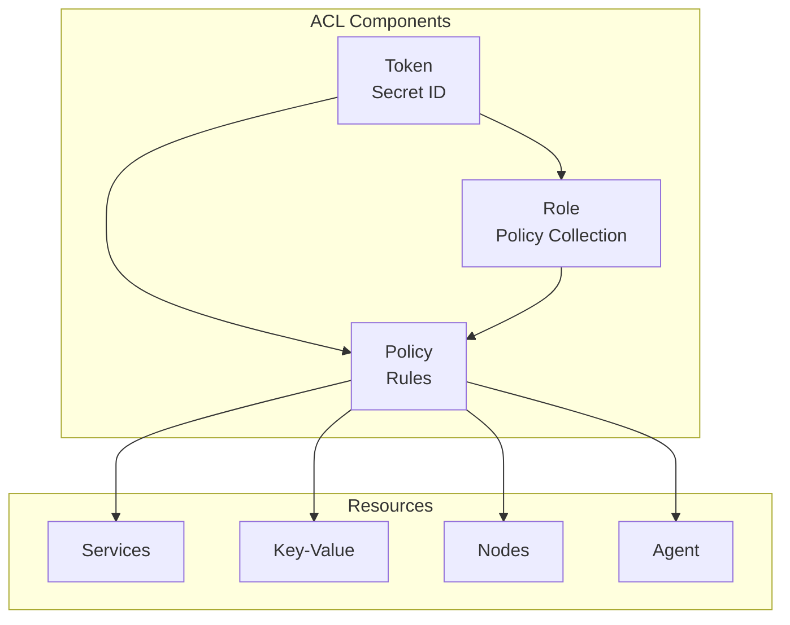

# How to Configure Consul ACL for Security

Author: [nawazdhandala](https://www.github.com/nawazdhandala)

Tags: Consul, ACL, Security, HashiCorp, Access Control

Description: Learn how to configure Consul's Access Control List (ACL) system to secure your service mesh, including token management, policy creation, and role-based access control.

---

Consul's ACL system provides authentication and authorization for securing access to services, keys, and cluster operations. Without ACLs, any client can register services, read configuration, and modify cluster state. Enabling ACLs is essential for production deployments.

## ACL Architecture

Consul ACLs use tokens to authenticate requests and policies to authorize actions. Tokens can be assigned directly to policies or through roles that group multiple policies.



## 1. Enable ACL System

Configure ACL on all Consul servers and clients.

**Server configuration:**

`/etc/consul.d/acl.hcl`

```hcl
acl {
  enabled = true

  # Default policy when no token is provided
  default_policy = "deny"

  # Allow replication of ACL data
  enable_token_persistence = true

  # Token to use for agent operations
  tokens {
    # Will be set after bootstrap
    # agent = "agent-token-uuid"
  }
}
```

**Client configuration:**

`/etc/consul.d/client-acl.hcl`

```hcl
acl {
  enabled = true
  default_policy = "deny"
  enable_token_persistence = true

  tokens {
    # Token for this agent's operations
    # agent = "agent-token-uuid"

    # Default token for requests without explicit token
    # default = "default-token-uuid"
  }
}
```

## 2. Bootstrap the ACL System

Initialize ACL and get the bootstrap token.

```bash
# Bootstrap ACL - do this only once
consul acl bootstrap

# Output:
# AccessorID:       abc123-uuid
# SecretID:         xyz789-secret-uuid (THIS IS YOUR BOOTSTRAP TOKEN)
# Description:      Bootstrap Token (Global Management)
# Local:            false
# Create Time:      2024-01-15 10:00:00
# Policies:
#    00000000-0000-0000-0000-000000000001 - global-management

# Save the SecretID securely - this is the root token
export CONSUL_HTTP_TOKEN="xyz789-secret-uuid"
```

## 3. Create ACL Policies

Define policies that specify permissions for different resources.

**Service read-only policy:**

```hcl
# policy-service-read.hcl
service_prefix "" {
  policy = "read"
}

node_prefix "" {
  policy = "read"
}
```

**Service write policy for specific service:**

```hcl
# policy-api-service.hcl
service "api" {
  policy = "write"
}

service "api-sidecar-proxy" {
  policy = "write"
}

# Allow reading other services for discovery
service_prefix "" {
  policy = "read"
}

node_prefix "" {
  policy = "read"
}
```

**Key-Value policy:**

```hcl
# policy-kv-config.hcl
key_prefix "config/" {
  policy = "read"
}

key_prefix "config/api/" {
  policy = "write"
}

# Deny access to secrets
key_prefix "secrets/" {
  policy = "deny"
}
```

**Agent policy:**

```hcl
# policy-agent.hcl
agent_prefix "" {
  policy = "write"
}

node_prefix "" {
  policy = "write"
}

service_prefix "" {
  policy = "read"
}
```

Create policies using CLI:

```bash
# Create service read policy
consul acl policy create \
  -name "service-read" \
  -description "Read-only access to services" \
  -rules @policy-service-read.hcl

# Create API service policy
consul acl policy create \
  -name "api-service" \
  -description "API service registration and discovery" \
  -rules @policy-api-service.hcl

# Create KV policy
consul acl policy create \
  -name "kv-config" \
  -description "Access to configuration keys" \
  -rules @policy-kv-config.hcl

# Create agent policy
consul acl policy create \
  -name "agent-policy" \
  -description "Agent operations" \
  -rules @policy-agent.hcl
```

## 4. Create ACL Tokens

Create tokens and assign policies.

```bash
# Create token for API service
consul acl token create \
  -description "API Service Token" \
  -policy-name "api-service" \
  -policy-name "kv-config"

# Output:
# AccessorID:       def456-accessor
# SecretID:         ghi789-secret (USE THIS IN YOUR SERVICE)

# Create agent token
consul acl token create \
  -description "Agent Token" \
  -policy-name "agent-policy"

# Create read-only token for monitoring
consul acl token create \
  -description "Monitoring Token" \
  -policy-name "service-read"
```

## 5. Create ACL Roles

Group policies into roles for easier management.

```bash
# Create a role for microservices
consul acl role create \
  -name "microservice-role" \
  -description "Standard microservice permissions" \
  -policy-name "service-read" \
  -policy-name "kv-config"

# Create token with role
consul acl token create \
  -description "Microservice Token" \
  -role-name "microservice-role"

# Create admin role
consul acl role create \
  -name "admin-role" \
  -description "Administrative access" \
  -policy-name "global-management"
```

## 6. Configure Agent Tokens

Set tokens for Consul agents.

```bash
# Set agent token via API
curl --request PUT \
  --header "X-Consul-Token: $CONSUL_HTTP_TOKEN" \
  --data '{"Token": "agent-token-secret"}' \
  http://localhost:8500/v1/agent/token/agent

# Set default token for requests
curl --request PUT \
  --header "X-Consul-Token: $CONSUL_HTTP_TOKEN" \
  --data '{"Token": "default-token-secret"}' \
  http://localhost:8500/v1/agent/token/default
```

Or configure in the config file:

```hcl
acl {
  tokens {
    agent = "agent-token-secret"
    default = "default-token-secret"
  }
}
```

## 7. Use Tokens in Applications

Authenticate API requests with tokens.

**Python Example:**

```python
import consul
import os

class SecureConsulClient:
    def __init__(self):
        self.token = os.getenv('CONSUL_HTTP_TOKEN')
        if not self.token:
            raise ValueError("CONSUL_HTTP_TOKEN not set")

        self.client = consul.Consul(
            host=os.getenv('CONSUL_HTTP_ADDR', 'localhost'),
            port=8500,
            token=self.token
        )

    def register_service(self, name, port, health_endpoint):
        """Register service with ACL token."""
        self.client.agent.service.register(
            name=name,
            service_id=f"{name}-{port}",
            port=port,
            check=consul.Check.http(
                f"http://localhost:{port}{health_endpoint}",
                interval="10s"
            )
        )

    def get_service(self, name):
        """Discover service with ACL token."""
        index, services = self.client.health.service(name, passing=True)
        return services

    def get_config(self, key):
        """Read configuration with ACL token."""
        index, data = self.client.kv.get(key)
        if data:
            return data['Value'].decode('utf-8')
        return None

    def set_config(self, key, value):
        """Write configuration with ACL token."""
        return self.client.kv.put(key, value)

# Usage
client = SecureConsulClient()
client.register_service('api', 8080, '/health')
```

**Go Example:**

```go
package main

import (
    "fmt"
    "os"

    "github.com/hashicorp/consul/api"
)

type SecureConsulClient struct {
    client *api.Client
}

func NewSecureConsulClient() (*SecureConsulClient, error) {
    token := os.Getenv("CONSUL_HTTP_TOKEN")
    if token == "" {
        return nil, fmt.Errorf("CONSUL_HTTP_TOKEN not set")
    }

    config := api.DefaultConfig()
    config.Token = token

    client, err := api.NewClient(config)
    if err != nil {
        return nil, err
    }

    return &SecureConsulClient{client: client}, nil
}

func (c *SecureConsulClient) RegisterService(name string, port int) error {
    registration := &api.AgentServiceRegistration{
        Name: name,
        Port: port,
        Check: &api.AgentServiceCheck{
            HTTP:     fmt.Sprintf("http://localhost:%d/health", port),
            Interval: "10s",
        },
    }
    return c.client.Agent().ServiceRegister(registration)
}

func (c *SecureConsulClient) GetConfig(key string) (string, error) {
    kv := c.client.KV()
    pair, _, err := kv.Get(key, nil)
    if err != nil {
        return "", err
    }
    if pair == nil {
        return "", nil
    }
    return string(pair.Value), nil
}

func main() {
    client, err := NewSecureConsulClient()
    if err != nil {
        panic(err)
    }

    err = client.RegisterService("api", 8080)
    if err != nil {
        panic(err)
    }
}
```

## 8. Service Intentions with ACL

Configure service-to-service authorization.

```bash
# Allow api to connect to database
consul intention create \
  -token="$CONSUL_HTTP_TOKEN" \
  api database

# Deny all access to secrets-service
consul intention create \
  -token="$CONSUL_HTTP_TOKEN" \
  -deny '*' secrets-service

# View intentions
consul intention list
```

## 9. Token Management

Manage tokens throughout their lifecycle.

```bash
# List all tokens
consul acl token list

# Read token details
consul acl token read -id <accessor-id>

# Update token
consul acl token update \
  -id <accessor-id> \
  -description "Updated description" \
  -policy-name "new-policy"

# Delete token
consul acl token delete -id <accessor-id>

# Create token with expiration
consul acl token create \
  -description "Temporary Token" \
  -policy-name "service-read" \
  -expires-ttl "24h"
```

## 10. Audit ACL Operations

Monitor ACL usage and changes.

```bash
# Enable audit logging in config
audit {
  enabled = true
  sink "file" {
    type   = "file"
    format = "json"
    path   = "/var/log/consul/audit.log"
    delivery_guarantee = "best-effort"
    rotate_duration = "24h"
    rotate_max_files = 7
  }
}
```

Check token permissions:

```bash
# Check what a token can do
consul acl token read -self

# Test policy rules
consul acl policy read -name "api-service"
```

## Best Practices

1. **Never use bootstrap token in applications** - Create specific tokens with minimal permissions
2. **Rotate tokens regularly** - Use token expiration and renewal
3. **Use roles** - Group policies for easier management
4. **Deny by default** - Set default_policy to "deny"
5. **Audit access** - Enable audit logging for compliance
6. **Separate environments** - Use different tokens per environment
7. **Secure token storage** - Use secrets management (Vault) for tokens

---

Consul ACLs provide essential security for your service mesh by controlling who can access what. With properly configured policies, roles, and tokens, you can implement least-privilege access while maintaining the flexibility needed for service discovery and configuration management.
