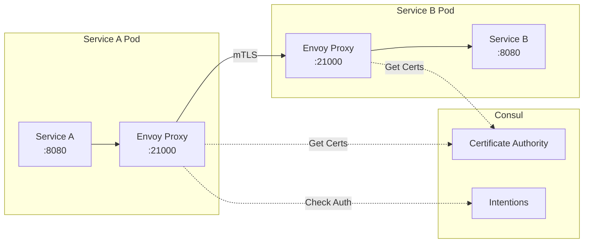

# How to Configure Consul Connect for Service Mesh

Author: [nawazdhandala](https://www.github.com/nawazdhandala)

Tags: Consul, Service Mesh, Consul Connect, mTLS, Microservices, Security

Description: Learn how to implement Consul Connect for secure service-to-service communication with automatic mTLS, traffic management, and zero-trust networking in your microservices architecture.

---

Consul Connect is HashiCorp's service mesh solution that provides secure service-to-service communication through automatic mutual TLS (mTLS) encryption and identity-based authorization. It enables zero-trust networking where services must explicitly authorize connections from other services.

## How Consul Connect Works

Consul Connect uses sidecar proxies (typically Envoy) to handle all service-to-service communication. The proxies automatically encrypt traffic using mTLS certificates managed by Consul.



## 1. Enable Connect in Consul Configuration

First, enable Connect in your Consul server configuration:

`/etc/consul.d/server.hcl`

```hcl
datacenter = "dc1"
data_dir = "/opt/consul/data"
server = true
bootstrap_expect = 3

# Enable Connect service mesh
connect {
  enabled = true
}

# Configure the built-in CA
connect {
  ca_provider = "consul"
  ca_config {
    # Certificate lifetime
    leaf_cert_ttl = "72h"
    # Rotation grace period
    rotation_period = "2160h"
    # CSR max per second
    csr_max_per_second = 50
  }
}

# Enable central service configuration
config_entries {
  bootstrap = [
    {
      kind = "proxy-defaults"
      name = "global"
      config {
        protocol = "http"
      }
    }
  ]
}

# ACL configuration
acl {
  enabled = true
  default_policy = "deny"
  enable_token_persistence = true
}
```

## 2. Register a Service with Connect Sidecar

When registering services, include a Connect sidecar proxy definition:

`/etc/consul.d/services/api-service.hcl`

```hcl
service {
  name = "api"
  port = 8080

  tags = ["v1"]

  # Connect configuration
  connect {
    sidecar_service {
      # Proxy will listen on this port for inbound connections
      port = 21000

      proxy {
        # Upstream services this service needs to connect to
        upstreams = [
          {
            destination_name = "database"
            local_bind_port  = 5432
          },
          {
            destination_name = "cache"
            local_bind_port  = 6379
          }
        ]

        # Proxy configuration
        config {
          protocol = "http"
          # Envoy-specific settings
          envoy_prometheus_bind_addr = "0.0.0.0:9102"
        }
      }
    }
  }

  # Health check for the main service
  check {
    id       = "api-health"
    http     = "http://localhost:8080/health"
    interval = "10s"
  }
}
```

## 3. Start the Sidecar Proxy

Consul can automatically generate Envoy bootstrap configuration and start the proxy:

```bash
# Start Envoy sidecar proxy for the api service
consul connect envoy -sidecar-for api -admin-bind 127.0.0.1:19000

# Or generate bootstrap config for manual start
consul connect envoy -sidecar-for api -bootstrap > envoy-bootstrap.json
envoy -c envoy-bootstrap.json
```

For production, create a systemd service for the sidecar:

`/etc/systemd/system/consul-sidecar-api.service`

```ini
[Unit]
Description=Consul Connect Sidecar for API
After=consul.service
Requires=consul.service

[Service]
Type=simple
ExecStart=/usr/local/bin/consul connect envoy -sidecar-for api
Restart=always
RestartSec=5

[Install]
WantedBy=multi-user.target
```

## 4. Configure Service Intentions

Intentions define which services can communicate with each other. They form the authorization layer of Consul Connect.

```bash
# Allow api service to connect to database
consul intention create api database

# Allow web service to connect to api
consul intention create web api

# Deny all connections to a sensitive service by default
consul intention create -deny '*' secrets-service

# Allow specific service to access secrets
consul intention create admin secrets-service
```

Create intentions via configuration files for version control:

`/etc/consul.d/config-entries/intentions.hcl`

```hcl
Kind = "service-intentions"
Name = "database"
Sources = [
  {
    Name   = "api"
    Action = "allow"
  },
  {
    Name   = "migration-job"
    Action = "allow"
  },
  {
    Name   = "*"
    Action = "deny"
  }
]
```

Apply the configuration:

```bash
consul config write intentions.hcl
```

## 5. Configure Traffic Management

Consul Connect supports advanced traffic management through configuration entries.

**Service Defaults:**

```hcl
Kind = "service-defaults"
Name = "api"
Protocol = "http"

# Configure timeouts
Connect {
  UpstreamDefaults {
    ConnectTimeoutMs = 5000
    MeshGateway {
      Mode = "local"
    }
  }
}

# Expose specific paths without mTLS (for health checks)
Expose {
  Checks = true
  Paths = [
    {
      Path = "/health"
      LocalPathPort = 8080
      ListenerPort = 8081
      Protocol = "http"
    }
  ]
}
```

**Service Router for path-based routing:**

```hcl
Kind = "service-router"
Name = "api"
Routes = [
  {
    Match {
      HTTP {
        PathPrefix = "/v2"
      }
    }
    Destination {
      Service = "api-v2"
    }
  },
  {
    Match {
      HTTP {
        PathPrefix = "/v1"
      }
    }
    Destination {
      Service = "api-v1"
    }
  }
]
```

**Service Splitter for traffic splitting:**

```hcl
Kind = "service-splitter"
Name = "api"
Splits = [
  {
    Weight  = 90
    Service = "api"
    ServiceSubset = "v1"
  },
  {
    Weight  = 10
    Service = "api"
    ServiceSubset = "v2"
  }
]
```

## 6. Implement Service Resolvers

Service resolvers configure how Consul routes traffic to service instances:

```hcl
Kind = "service-resolver"
Name = "api"

# Define subsets based on service metadata
Subsets = {
  v1 = {
    Filter = "Service.Meta.version == v1"
  }
  v2 = {
    Filter = "Service.Meta.version == v2"
  }
}

# Default subset
DefaultSubset = "v1"

# Failover configuration
Failover = {
  "*" = {
    Datacenters = ["dc2", "dc3"]
  }
}

# Load balancing policy
LoadBalancer {
  Policy = "least_request"
  LeastRequestConfig {
    ChoiceCount = 2
  }
}
```

## 7. Application Code Integration

Update your application to connect through the local proxy ports:

**Python Example:**

```python
import os
import requests

class ServiceClient:
    def __init__(self):
        # Connect to upstream services via local proxy ports
        self.database_host = os.getenv('DATABASE_HOST', 'localhost')
        self.database_port = os.getenv('DATABASE_PORT', '5432')
        self.cache_host = os.getenv('CACHE_HOST', 'localhost')
        self.cache_port = os.getenv('CACHE_PORT', '6379')

    def get_database_connection_string(self):
        """
        Connect to database through the sidecar proxy.
        The proxy handles mTLS automatically.
        """
        return f"postgresql://user:pass@{self.database_host}:{self.database_port}/mydb"

    def call_upstream_service(self, service_name, endpoint):
        """
        Call an upstream HTTP service through the proxy.
        """
        # The sidecar proxy binds upstream services to localhost
        port_map = {
            'database': 5432,
            'cache': 6379,
            'auth': 8001,
        }

        port = port_map.get(service_name)
        url = f"http://localhost:{port}{endpoint}"

        response = requests.get(url)
        return response.json()

# Usage - your app connects to localhost, proxy handles the rest
client = ServiceClient()
# This connection goes through Envoy with mTLS
db_conn = client.get_database_connection_string()
```

**Go Example:**

```go
package main

import (
    "database/sql"
    "fmt"
    "net/http"
    "os"

    _ "github.com/lib/pq"
)

type Config struct {
    // Upstream services bound to localhost by the sidecar
    DatabasePort int
    CachePort    int
}

func NewConfig() *Config {
    return &Config{
        DatabasePort: 5432, // Local proxy port for database
        CachePort:    6379, // Local proxy port for cache
    }
}

func (c *Config) GetDatabaseDSN() string {
    // Connect through local sidecar proxy
    return fmt.Sprintf(
        "host=localhost port=%d user=%s password=%s dbname=%s sslmode=disable",
        c.DatabasePort,
        os.Getenv("DB_USER"),
        os.Getenv("DB_PASSWORD"),
        os.Getenv("DB_NAME"),
    )
}

func main() {
    config := NewConfig()

    // Database connection goes through Envoy sidecar
    db, err := sql.Open("postgres", config.GetDatabaseDSN())
    if err != nil {
        panic(err)
    }
    defer db.Close()

    // HTTP calls to other services also go through proxy
    resp, _ := http.Get(fmt.Sprintf("http://localhost:%d/health", config.CachePort))
    defer resp.Body.Close()
}
```

## 8. Enable Observability

Configure Envoy to expose metrics and tracing:

```hcl
Kind = "proxy-defaults"
Name = "global"

Config {
  protocol = "http"

  # Prometheus metrics
  envoy_prometheus_bind_addr = "0.0.0.0:9102"

  # Access logging
  envoy_extra_static_clusters_json = <<EOF
{
  "name": "access_log",
  "type": "STATIC",
  "connect_timeout": "1s",
  "load_assignment": {
    "cluster_name": "access_log",
    "endpoints": [{
      "lb_endpoints": [{
        "endpoint": {
          "address": {
            "socket_address": {
              "address": "127.0.0.1",
              "port_value": 9001
            }
          }
        }
      }]
    }]
  }
}
EOF
}

# Enable transparent proxy mode
TransparentProxy {
  OutboundListenerPort = 15001
}
```

## 9. Verify mTLS Communication

Check that services are communicating securely:

```bash
# View proxy configuration
consul connect proxy -show-config -sidecar-for api

# Check intentions for a service
consul intention check api database

# View active connections
curl localhost:19000/clusters | grep -E "(cx_active|health)"

# Verify certificates
consul connect ca get-config
```

## Best Practices

1. **Use intentions as allow-lists** - Deny all by default, explicitly allow required connections
2. **Monitor proxy metrics** - Track latency, errors, and connection counts
3. **Rotate certificates regularly** - Configure appropriate TTLs for leaf certificates
4. **Test failover scenarios** - Verify traffic routing during outages
5. **Use service resolvers** - Implement proper load balancing and failover policies

---

Consul Connect provides a powerful service mesh that secures service-to-service communication with minimal application changes. By leveraging automatic mTLS and intention-based authorization, you can implement zero-trust networking across your microservices architecture.
