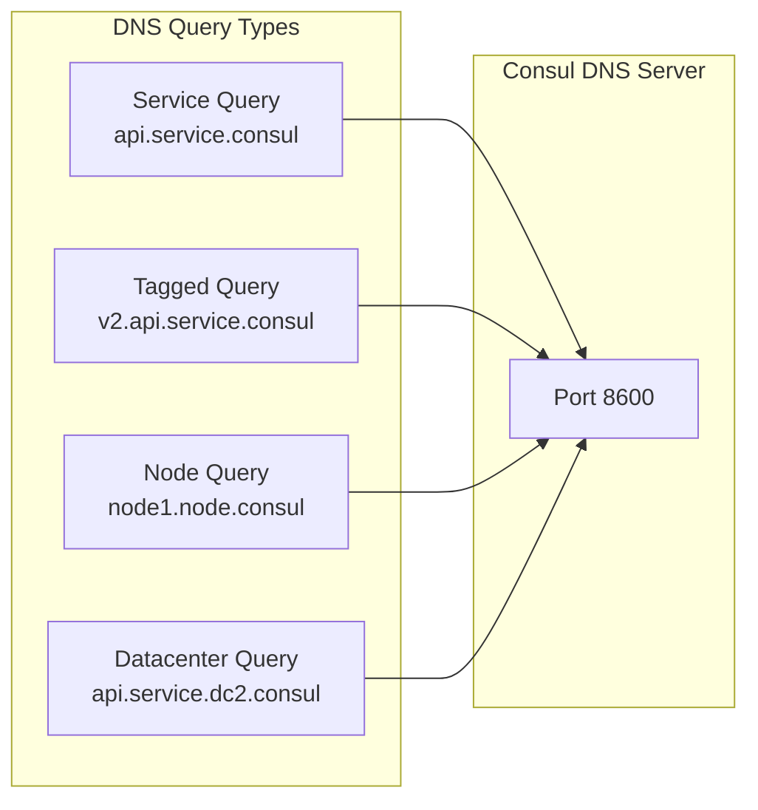

# How to Configure Consul DNS Interface

Author: [nawazdhandala](https://www.github.com/nawazdhandala)

Tags: Consul, DNS, Service Discovery, HashiCorp, Networking

Description: A practical guide to configuring and using Consul's DNS interface for service discovery, including DNS forwarding, query syntax, health filtering, and integration with system resolvers.

---

Consul provides a built-in DNS server that enables service discovery without code changes. Applications can discover services using standard DNS queries, making Consul transparent to existing infrastructure. The DNS interface supports service lookups, node lookups, and even prepared queries for advanced routing.

## DNS Query Format

Consul DNS follows a predictable naming pattern for service and node lookups.



## 1. Basic DNS Configuration

Enable and configure the DNS server in Consul.

`/etc/consul.d/dns.hcl`

```hcl
# DNS server configuration
ports {
  dns = 8600
}

# DNS settings
dns_config {
  # Allow stale reads for better performance
  allow_stale = true

  # Maximum stale age before forcing consistent read
  max_stale = "5s"

  # TTL for service lookups
  service_ttl {
    "*" = "5s"
  }

  # TTL for node lookups
  node_ttl = "10s"

  # Enable DNS compression
  enable_truncate = true

  # Only return healthy services
  only_passing = true

  # Enable recursion for external lookups
  enable_recursion = true

  # Upstream DNS servers for non-consul queries
  recursors = ["8.8.8.8", "8.8.4.4"]

  # UDP response size limit
  udp_answer_limit = 3

  # Enable EDNS for larger UDP responses
  enable_additional_node_meta_txt = true
}
```

## 2. Query Services via DNS

Use standard DNS tools to discover services.

```bash
# Basic service lookup - returns A records for healthy instances
dig @127.0.0.1 -p 8600 api.service.consul

# Get SRV records (includes port information)
dig @127.0.0.1 -p 8600 api.service.consul SRV

# Query specific datacenter
dig @127.0.0.1 -p 8600 api.service.dc2.consul

# Query with tag filter
dig @127.0.0.1 -p 8600 v2.api.service.consul

# Query node directly
dig @127.0.0.1 -p 8600 web-server-1.node.consul

# Query prepared query
dig @127.0.0.1 -p 8600 my-query.query.consul
```

Example output:

```
;; ANSWER SECTION:
api.service.consul.     5       IN      A       10.0.1.10
api.service.consul.     5       IN      A       10.0.1.11
api.service.consul.     5       IN      A       10.0.1.12

;; SRV record output:
api.service.consul.     5       IN      SRV     1 1 8080 web-1.node.dc1.consul.
api.service.consul.     5       IN      SRV     1 1 8080 web-2.node.dc1.consul.
```

## 3. Configure System DNS Forwarding

Forward `.consul` domain queries to Consul while keeping other queries going to regular DNS.

**Using systemd-resolved:**

`/etc/systemd/resolved.conf.d/consul.conf`

```ini
[Resolve]
DNS=127.0.0.1:8600
Domains=~consul
```

Apply changes:

```bash
sudo systemctl restart systemd-resolved
sudo resolvectl status
```

**Using dnsmasq:**

`/etc/dnsmasq.d/10-consul`

```
# Forward consul domain to Consul DNS
server=/consul/127.0.0.1#8600

# Increase cache size
cache-size=1000

# Don't read /etc/resolv.conf
no-resolv

# Use these upstream DNS servers
server=8.8.8.8
server=8.8.4.4
```

Restart dnsmasq:

```bash
sudo systemctl restart dnsmasq
```

**Using unbound:**

`/etc/unbound/unbound.conf.d/consul.conf`

```yaml
server:
  # Forward .consul domain
  local-zone: "consul." nodefault

forward-zone:
  name: "consul."
  forward-addr: 127.0.0.1@8600
```

## 4. Configure iptables for Transparent DNS

Redirect port 53 traffic to Consul DNS for transparent service discovery.

```bash
# Redirect DNS queries to Consul (on the Consul server/agent)
iptables -t nat -A OUTPUT -d localhost -p udp --dport 53 -j REDIRECT --to-ports 8600
iptables -t nat -A OUTPUT -d localhost -p tcp --dport 53 -j REDIRECT --to-ports 8600

# For queries from other hosts
iptables -t nat -A PREROUTING -p udp --dport 53 -j REDIRECT --to-ports 8600
iptables -t nat -A PREROUTING -p tcp --dport 53 -j REDIRECT --to-ports 8600
```

Save rules:

```bash
iptables-save > /etc/iptables/rules.v4
```

## 5. DNS-Based Load Balancing in Applications

Use DNS discovery in your applications with proper caching and retry logic.

**Python Example:**

```python
import dns.resolver
import random
import socket
from functools import lru_cache
from datetime import datetime, timedelta

class ConsulDNSClient:
    def __init__(self, consul_dns='127.0.0.1', consul_port=8600):
        self.resolver = dns.resolver.Resolver()
        self.resolver.nameservers = [consul_dns]
        self.resolver.port = consul_port
        self._cache = {}
        self._cache_ttl = timedelta(seconds=5)

    def get_service_addresses(self, service_name, datacenter=None):
        """Get all healthy service instance addresses."""
        if datacenter:
            fqdn = f"{service_name}.service.{datacenter}.consul"
        else:
            fqdn = f"{service_name}.service.consul"

        # Check cache
        cache_key = fqdn
        if cache_key in self._cache:
            cached_time, addresses = self._cache[cache_key]
            if datetime.now() - cached_time < self._cache_ttl:
                return addresses

        try:
            answers = self.resolver.resolve(fqdn, 'A')
            addresses = [str(rdata) for rdata in answers]
            self._cache[cache_key] = (datetime.now(), addresses)
            return addresses
        except dns.resolver.NXDOMAIN:
            return []
        except dns.resolver.NoAnswer:
            return []

    def get_service_with_port(self, service_name):
        """Get service instances with port information using SRV records."""
        fqdn = f"{service_name}.service.consul"

        try:
            answers = self.resolver.resolve(fqdn, 'SRV')
            instances = []
            for rdata in answers:
                # SRV record: priority weight port target
                instances.append({
                    'priority': rdata.priority,
                    'weight': rdata.weight,
                    'port': rdata.port,
                    'host': str(rdata.target).rstrip('.')
                })
            return instances
        except (dns.resolver.NXDOMAIN, dns.resolver.NoAnswer):
            return []

    def get_tagged_service(self, tag, service_name):
        """Get service instances with specific tag."""
        fqdn = f"{tag}.{service_name}.service.consul"
        return self.get_service_addresses_from_fqdn(fqdn)

    def resolve_service_url(self, service_name, path='', scheme='http'):
        """Get a full URL for a service, load balanced."""
        instances = self.get_service_with_port(service_name)
        if not instances:
            raise Exception(f"No instances found for {service_name}")

        # Simple random load balancing
        instance = random.choice(instances)

        # Resolve hostname to IP
        try:
            ip = socket.gethostbyname(instance['host'])
        except socket.gaierror:
            ip = instance['host']

        return f"{scheme}://{ip}:{instance['port']}{path}"

# Usage
client = ConsulDNSClient()

# Get all API service addresses
api_addresses = client.get_service_addresses('api')
print(f"API instances: {api_addresses}")

# Get service with port
instances = client.get_service_with_port('api')
for inst in instances:
    print(f"  {inst['host']}:{inst['port']}")

# Get tagged service (v2 instances only)
v2_addresses = client.get_tagged_service('v2', 'api')

# Get URL for HTTP request
url = client.resolve_service_url('api', '/health')
print(f"Calling: {url}")
```

**Go Example:**

```go
package main

import (
    "context"
    "fmt"
    "math/rand"
    "net"
    "sync"
    "time"
)

type ConsulDNS struct {
    resolver *net.Resolver
    cache    map[string]cacheEntry
    cacheMu  sync.RWMutex
    cacheTTL time.Duration
}

type cacheEntry struct {
    addrs     []string
    timestamp time.Time
}

func NewConsulDNS(server string, port int) *ConsulDNS {
    return &ConsulDNS{
        resolver: &net.Resolver{
            PreferGo: true,
            Dial: func(ctx context.Context, network, address string) (net.Conn, error) {
                d := net.Dialer{Timeout: 5 * time.Second}
                return d.DialContext(ctx, "udp", fmt.Sprintf("%s:%d", server, port))
            },
        },
        cache:    make(map[string]cacheEntry),
        cacheTTL: 5 * time.Second,
    }
}

func (c *ConsulDNS) GetServiceAddresses(serviceName string) ([]string, error) {
    fqdn := fmt.Sprintf("%s.service.consul", serviceName)

    // Check cache
    c.cacheMu.RLock()
    if entry, ok := c.cache[fqdn]; ok {
        if time.Since(entry.timestamp) < c.cacheTTL {
            c.cacheMu.RUnlock()
            return entry.addrs, nil
        }
    }
    c.cacheMu.RUnlock()

    // Resolve
    ctx, cancel := context.WithTimeout(context.Background(), 5*time.Second)
    defer cancel()

    addrs, err := c.resolver.LookupHost(ctx, fqdn)
    if err != nil {
        return nil, err
    }

    // Update cache
    c.cacheMu.Lock()
    c.cache[fqdn] = cacheEntry{addrs: addrs, timestamp: time.Now()}
    c.cacheMu.Unlock()

    return addrs, nil
}

func (c *ConsulDNS) GetRandomAddress(serviceName string) (string, error) {
    addrs, err := c.GetServiceAddresses(serviceName)
    if err != nil {
        return "", err
    }
    if len(addrs) == 0 {
        return "", fmt.Errorf("no addresses for service %s", serviceName)
    }
    return addrs[rand.Intn(len(addrs))], nil
}

func (c *ConsulDNS) GetServiceWithPort(serviceName string) ([]ServiceInstance, error) {
    fqdn := fmt.Sprintf("%s.service.consul", serviceName)

    ctx, cancel := context.WithTimeout(context.Background(), 5*time.Second)
    defer cancel()

    _, srvs, err := c.resolver.LookupSRV(ctx, "", "", fqdn)
    if err != nil {
        return nil, err
    }

    instances := make([]ServiceInstance, len(srvs))
    for i, srv := range srvs {
        instances[i] = ServiceInstance{
            Host:     srv.Target,
            Port:     int(srv.Port),
            Priority: int(srv.Priority),
            Weight:   int(srv.Weight),
        }
    }
    return instances, nil
}

type ServiceInstance struct {
    Host     string
    Port     int
    Priority int
    Weight   int
}

func main() {
    client := NewConsulDNS("127.0.0.1", 8600)

    // Get service addresses
    addrs, err := client.GetServiceAddresses("api")
    if err != nil {
        panic(err)
    }
    fmt.Println("API addresses:", addrs)

    // Get random address for load balancing
    addr, _ := client.GetRandomAddress("api")
    fmt.Println("Selected:", addr)
}
```

## 6. Configure DNS Caching

Optimize DNS performance with appropriate caching.

```hcl
dns_config {
  # Cache settings per service
  service_ttl {
    "*" = "5s"        # Default TTL
    "database" = "30s" # Stable services get longer TTL
    "cache" = "10s"
  }

  # Node TTL
  node_ttl = "10s"

  # Enable negative caching
  soa {
    min_ttl = 0
    refresh = 3600
    retry = 600
    expire = 86400
  }
}
```

## 7. Health-Aware DNS

Configure DNS to only return healthy instances.

```hcl
dns_config {
  # Only return services with passing health checks
  only_passing = true
}
```

Query with health awareness:

```bash
# Default query - only passing
dig @127.0.0.1 -p 8600 api.service.consul

# Include services with any health status
dig @127.0.0.1 -p 8600 api.service.consul +all

# Query specific health status
curl http://localhost:8500/v1/health/service/api?passing
```

## 8. Debug DNS Issues

Troubleshoot Consul DNS problems:

```bash
# Check Consul DNS is responding
dig @127.0.0.1 -p 8600 consul.service.consul

# Verbose query
dig @127.0.0.1 -p 8600 api.service.consul +trace

# Check registered services
consul catalog services

# Check service health
consul catalog nodes -service=api

# Test with different record types
dig @127.0.0.1 -p 8600 api.service.consul A
dig @127.0.0.1 -p 8600 api.service.consul SRV
dig @127.0.0.1 -p 8600 api.service.consul TXT

# Check Consul logs
journalctl -u consul | grep -i dns
```

## Best Practices

1. **Use short TTLs** - Balance freshness vs DNS load (5-10 seconds typical)
2. **Enable only_passing** - Prevent routing to unhealthy instances
3. **Implement client-side caching** - Reduce DNS query load
4. **Use SRV records** - Get port information along with addresses
5. **Configure recursors** - Allow non-consul queries to resolve
6. **Monitor DNS latency** - Track DNS response times

---

Consul's DNS interface provides seamless service discovery without application changes. By properly configuring DNS forwarding and client-side caching, your applications can discover services using standard DNS while benefiting from Consul's health checking and service registry.
