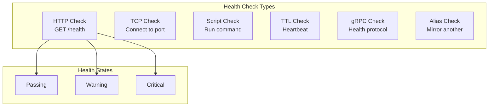

# How to Implement Consul Health Checks

Author: [nawazdhandala](https://www.github.com/nawazdhandala)

Tags: Consul, Health Checks, Service Discovery, Monitoring, HashiCorp

Description: Learn how to implement various types of Consul health checks including HTTP, TCP, script, gRPC, and TTL checks to ensure only healthy service instances receive traffic.

---

Health checks are fundamental to Consul's service discovery. They determine which service instances are healthy and should receive traffic. Consul supports multiple health check types, from simple TCP connectivity tests to complex script-based validations.

## Health Check Types

Consul provides several health check mechanisms to accommodate different service types and requirements.



## 1. HTTP Health Checks

HTTP checks make GET requests to an endpoint and evaluate the response status code.

```hcl
service {
  name = "api"
  port = 8080

  check {
    id       = "api-http-health"
    name     = "API HTTP Health Check"
    http     = "http://localhost:8080/health"
    method   = "GET"
    interval = "10s"
    timeout  = "5s"

    # Optional: Consider 2xx and 429 as passing
    success_before_passing   = 2
    failures_before_critical = 3

    # Custom headers
    header {
      Authorization = ["Bearer health-check-token"]
    }
  }

  # Additional check for specific endpoint
  check {
    id       = "api-ready"
    name     = "API Readiness Check"
    http     = "http://localhost:8080/ready"
    interval = "5s"
    timeout  = "3s"
  }
}
```

**Implement the health endpoint in your application:**

```python
from flask import Flask, jsonify
import psycopg2
import redis

app = Flask(__name__)

@app.route('/health')
def health_check():
    """
    Liveness check - is the process running?
    Returns 200 if the application is alive.
    """
    return jsonify({
        'status': 'healthy',
        'service': 'api',
        'version': '1.0.0'
    }), 200

@app.route('/ready')
def readiness_check():
    """
    Readiness check - can the service handle requests?
    Checks dependencies before returning healthy.
    """
    checks = {
        'database': check_database(),
        'cache': check_cache()
    }

    all_healthy = all(c['status'] == 'healthy' for c in checks.values())

    status_code = 200 if all_healthy else 503
    return jsonify({
        'status': 'ready' if all_healthy else 'not_ready',
        'checks': checks
    }), status_code

def check_database():
    try:
        conn = psycopg2.connect(
            host='localhost',
            port=5432,
            database='mydb',
            connect_timeout=3
        )
        conn.execute('SELECT 1')
        conn.close()
        return {'status': 'healthy'}
    except Exception as e:
        return {'status': 'unhealthy', 'error': str(e)}

def check_cache():
    try:
        r = redis.Redis(host='localhost', port=6379, socket_timeout=3)
        r.ping()
        return {'status': 'healthy'}
    except Exception as e:
        return {'status': 'unhealthy', 'error': str(e)}
```

## 2. TCP Health Checks

TCP checks verify that a port is accepting connections.

```hcl
service {
  name = "database"
  port = 5432

  check {
    id       = "db-tcp-check"
    name     = "PostgreSQL TCP Check"
    tcp      = "localhost:5432"
    interval = "10s"
    timeout  = "3s"
  }
}

service {
  name = "redis"
  port = 6379

  check {
    id       = "redis-tcp"
    name     = "Redis TCP Check"
    tcp      = "localhost:6379"
    interval = "5s"
    timeout  = "2s"
  }
}
```

## 3. Script Health Checks

Script checks run custom commands and use exit codes to determine health.

```hcl
service {
  name = "worker"
  port = 8080

  check {
    id       = "worker-script"
    name     = "Worker Process Check"
    args     = ["/opt/scripts/check-worker.sh"]
    interval = "30s"
    timeout  = "10s"
  }
}
```

**check-worker.sh:**

```bash
#!/bin/bash

# Exit codes:
# 0 = passing
# 1 = warning
# 2+ = critical

# Check if worker process is running
if ! pgrep -x "worker" > /dev/null; then
    echo "Worker process not running"
    exit 2
fi

# Check queue depth
QUEUE_DEPTH=$(redis-cli llen worker:queue 2>/dev/null)
if [ $? -ne 0 ]; then
    echo "Cannot connect to Redis"
    exit 2
fi

if [ "$QUEUE_DEPTH" -gt 10000 ]; then
    echo "Queue depth critical: $QUEUE_DEPTH"
    exit 2
elif [ "$QUEUE_DEPTH" -gt 5000 ]; then
    echo "Queue depth warning: $QUEUE_DEPTH"
    exit 1
fi

echo "Worker healthy, queue depth: $QUEUE_DEPTH"
exit 0
```

Enable script checks in Consul configuration:

```hcl
# Enable local script checks (security consideration)
enable_local_script_checks = true

# Or for remote script checks (less secure)
# enable_script_checks = true
```

## 4. TTL Health Checks

TTL checks require services to periodically update their status. If the TTL expires without an update, the check fails.

```hcl
service {
  name = "batch-processor"
  port = 8080

  check {
    id   = "batch-ttl"
    name = "Batch Processor TTL"
    ttl  = "30s"

    # Initial status
    status = "passing"
  }
}
```

**Update TTL from your application:**

```python
import requests
import threading
import time

class ConsulTTLHealth:
    def __init__(self, consul_addr='http://localhost:8500', check_id='batch-ttl'):
        self.consul_addr = consul_addr
        self.check_id = check_id
        self._stop = False

    def pass_check(self, note=''):
        """Mark check as passing."""
        url = f"{self.consul_addr}/v1/agent/check/pass/{self.check_id}"
        requests.put(url, params={'note': note})

    def warn_check(self, note=''):
        """Mark check as warning."""
        url = f"{self.consul_addr}/v1/agent/check/warn/{self.check_id}"
        requests.put(url, params={'note': note})

    def fail_check(self, note=''):
        """Mark check as critical."""
        url = f"{self.consul_addr}/v1/agent/check/fail/{self.check_id}"
        requests.put(url, params={'note': note})

    def start_heartbeat(self, interval=10):
        """Start background heartbeat thread."""
        def heartbeat():
            while not self._stop:
                try:
                    self.pass_check(f'Heartbeat at {time.time()}')
                except Exception as e:
                    print(f"Heartbeat failed: {e}")
                time.sleep(interval)

        thread = threading.Thread(target=heartbeat, daemon=True)
        thread.start()

    def stop(self):
        self._stop = True

# Usage
health = ConsulTTLHealth(check_id='batch-ttl')
health.start_heartbeat(interval=10)

# During processing
try:
    process_batch()
    health.pass_check('Batch completed successfully')
except Exception as e:
    health.fail_check(f'Batch failed: {e}')
```

**Go Implementation:**

```go
package main

import (
    "fmt"
    "net/http"
    "time"
)

type TTLHealth struct {
    consulAddr string
    checkID    string
    client     *http.Client
    stop       chan struct{}
}

func NewTTLHealth(consulAddr, checkID string) *TTLHealth {
    return &TTLHealth{
        consulAddr: consulAddr,
        checkID:    checkID,
        client:     &http.Client{Timeout: 5 * time.Second},
        stop:       make(chan struct{}),
    }
}

func (h *TTLHealth) updateCheck(status, note string) error {
    url := fmt.Sprintf("%s/v1/agent/check/%s/%s?note=%s",
        h.consulAddr, status, h.checkID, note)

    req, _ := http.NewRequest("PUT", url, nil)
    resp, err := h.client.Do(req)
    if err != nil {
        return err
    }
    resp.Body.Close()
    return nil
}

func (h *TTLHealth) Pass(note string) error {
    return h.updateCheck("pass", note)
}

func (h *TTLHealth) Warn(note string) error {
    return h.updateCheck("warn", note)
}

func (h *TTLHealth) Fail(note string) error {
    return h.updateCheck("fail", note)
}

func (h *TTLHealth) StartHeartbeat(interval time.Duration) {
    go func() {
        ticker := time.NewTicker(interval)
        defer ticker.Stop()

        for {
            select {
            case <-ticker.C:
                h.Pass(fmt.Sprintf("heartbeat-%d", time.Now().Unix()))
            case <-h.stop:
                return
            }
        }
    }()
}

func (h *TTLHealth) Stop() {
    close(h.stop)
}

func main() {
    health := NewTTLHealth("http://localhost:8500", "batch-ttl")
    health.StartHeartbeat(10 * time.Second)

    // Your application logic here
    select {}
}
```

## 5. gRPC Health Checks

For gRPC services, use the standard gRPC health checking protocol.

```hcl
service {
  name = "grpc-api"
  port = 50051

  check {
    id       = "grpc-health"
    name     = "gRPC Health Check"
    grpc     = "localhost:50051"
    interval = "10s"
    timeout  = "5s"

    # Optional: check specific service
    # grpc = "localhost:50051/my.service.Name"

    # Use TLS
    grpc_use_tls = false
  }
}
```

**Implement gRPC health server:**

```go
package main

import (
    "context"
    "net"

    "google.golang.org/grpc"
    "google.golang.org/grpc/health"
    "google.golang.org/grpc/health/grpc_health_v1"
)

func main() {
    lis, _ := net.Listen("tcp", ":50051")

    server := grpc.NewServer()

    // Register health server
    healthServer := health.NewServer()
    grpc_health_v1.RegisterHealthServer(server, healthServer)

    // Set service status
    healthServer.SetServingStatus("my.service.Name", grpc_health_v1.HealthCheckResponse_SERVING)

    // Register your services
    // pb.RegisterMyServiceServer(server, &myService{})

    server.Serve(lis)
}
```

## 6. Alias Health Checks

Alias checks mirror the health of another service or node.

```hcl
service {
  name = "api-proxy"
  port = 8080

  # Mirror the health of the upstream api service
  check {
    id         = "alias-api"
    name       = "Upstream API Health"
    alias_service = "api"
  }
}

# Alias to a specific node check
check {
  id         = "alias-node"
  name       = "Node Health Mirror"
  alias_node = "web-server-1"
}
```

## 7. Multiple Health Checks

Combine multiple checks for comprehensive health monitoring.

```hcl
service {
  name = "web-app"
  port = 8080

  # HTTP liveness
  check {
    id       = "http-live"
    name     = "HTTP Liveness"
    http     = "http://localhost:8080/health/live"
    interval = "5s"
    timeout  = "2s"
  }

  # HTTP readiness
  check {
    id       = "http-ready"
    name     = "HTTP Readiness"
    http     = "http://localhost:8080/health/ready"
    interval = "10s"
    timeout  = "5s"
  }

  # Memory check
  check {
    id       = "memory"
    name     = "Memory Usage"
    args     = ["/opt/scripts/check-memory.sh", "80"]
    interval = "30s"
    timeout  = "5s"
  }

  # Disk check
  check {
    id       = "disk"
    name     = "Disk Usage"
    args     = ["/opt/scripts/check-disk.sh", "/data", "90"]
    interval = "60s"
    timeout  = "5s"
  }
}
```

## 8. Monitor Health Check Status

Query and monitor health check status.

```bash
# List all checks on local agent
curl http://localhost:8500/v1/agent/checks

# Get health for specific service
curl http://localhost:8500/v1/health/service/api

# Get only passing instances
curl http://localhost:8500/v1/health/service/api?passing

# Watch for health changes
curl http://localhost:8500/v1/health/service/api?index=0&wait=5m
```

## Best Practices

1. **Use appropriate intervals** - Balance freshness vs load (5-30 seconds typical)
2. **Set reasonable timeouts** - Shorter than the interval to prevent overlap
3. **Implement both liveness and readiness** - Different purposes, different endpoints
4. **Use deregistration for ephemeral services** - Clean up dead services automatically
5. **Monitor check flapping** - Alert on services that oscillate between states
6. **Test health checks** - Verify they fail when services are actually unhealthy

```hcl
# Auto-deregister unhealthy services
check {
  id       = "api-health"
  http     = "http://localhost:8080/health"
  interval = "10s"

  # Deregister after 1 minute of being critical
  deregister_critical_service_after = "1m"
}
```

---

Consul health checks ensure that only healthy service instances receive traffic. By implementing appropriate checks for each service type and combining multiple checks for comprehensive monitoring, you can build resilient service discovery that automatically routes around failures.
