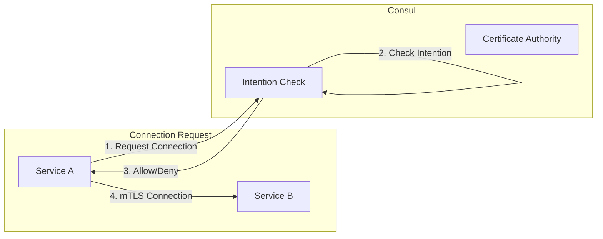

# How to Configure Consul Intentions

Author: [nawazdhandala](https://www.github.com/nawazdhandala)

Tags: Consul, Intentions, Service Mesh, Security, Zero Trust

Description: Learn how to configure Consul intentions for service-to-service authorization, implementing zero-trust networking with allow and deny rules for your service mesh.

---

Consul intentions define access control rules that specify which services can establish connections to other services. They form the authorization layer in Consul Connect's service mesh, enabling zero-trust security where connections are denied by default and explicitly allowed based on service identity.

## How Intentions Work

Intentions use service identity (not network identity) to authorize connections. When Service A attempts to connect to Service B, Consul checks if there's an intention allowing this connection before permitting traffic.



## 1. Create Basic Intentions

Create intentions using the CLI or API.

```bash
# Allow web to connect to api
consul intention create web api

# Deny all connections to secrets-service
consul intention create -deny '*' secrets-service

# Allow api to connect to database
consul intention create api database

# Allow admin to connect to secrets-service (overrides the deny)
consul intention create admin secrets-service
```

Using the HTTP API:

```bash
# Create allow intention
curl --request PUT \
  --data '{
    "SourceName": "web",
    "DestinationName": "api",
    "Action": "allow"
  }' \
  http://localhost:8500/v1/connect/intentions

# Create deny intention
curl --request PUT \
  --data '{
    "SourceName": "*",
    "DestinationName": "secrets-service",
    "Action": "deny"
  }' \
  http://localhost:8500/v1/connect/intentions
```

## 2. L7 Intentions (Application-Aware)

Configure intentions based on HTTP path, headers, or methods.

```hcl
Kind = "service-intentions"
Name = "api"
Sources = [
  {
    Name = "web"
    Permissions = [
      {
        Action = "allow"
        HTTP {
          PathPrefix = "/public"
          Methods = ["GET"]
        }
      },
      {
        Action = "allow"
        HTTP {
          PathExact = "/health"
        }
      },
      {
        Action = "deny"
        HTTP {
          PathPrefix = "/admin"
        }
      }
    ]
  },
  {
    Name = "admin-dashboard"
    Permissions = [
      {
        Action = "allow"
        HTTP {
          PathPrefix = "/admin"
          Methods = ["GET", "POST", "PUT", "DELETE"]
        }
      }
    ]
  }
]
```

Apply the configuration:

```bash
consul config write api-intentions.hcl
```

## 3. Intentions with Namespaces (Enterprise)

Configure intentions across Consul namespaces.

```hcl
Kind = "service-intentions"
Name = "database"
Namespace = "production"
Sources = [
  {
    Name = "api"
    Namespace = "production"
    Action = "allow"
  },
  {
    Name = "migration-job"
    Namespace = "jobs"
    Action = "allow"
  },
  {
    Name = "*"
    Namespace = "development"
    Action = "deny"
  }
]
```

## 4. Manage Intentions Programmatically

**Python Client:**

```python
import consul
from typing import List, Dict, Optional

class IntentionManager:
    def __init__(self, consul_host='localhost', consul_port=8500, token=None):
        self.consul = consul.Consul(
            host=consul_host,
            port=consul_port,
            token=token
        )

    def create_intention(
        self,
        source: str,
        destination: str,
        action: str = 'allow',
        description: str = None
    ) -> str:
        """Create a new intention."""
        intention = {
            'SourceName': source,
            'DestinationName': destination,
            'Action': action
        }
        if description:
            intention['Description'] = description

        # Use the intentions API
        result = self.consul.connect.intentions.create(**intention)
        return result

    def delete_intention(self, source: str, destination: str) -> bool:
        """Delete an intention."""
        # Get intention ID first
        intention = self.get_intention(source, destination)
        if intention:
            return self.consul.connect.intentions.delete(intention['ID'])
        return False

    def get_intention(self, source: str, destination: str) -> Optional[Dict]:
        """Get a specific intention."""
        try:
            result = self.consul.connect.intentions.get_exact(
                source=source,
                destination=destination
            )
            return result
        except Exception:
            return None

    def list_intentions(self) -> List[Dict]:
        """List all intentions."""
        return self.consul.connect.intentions.list()

    def check_intention(self, source: str, destination: str) -> bool:
        """Check if a connection would be allowed."""
        result = self.consul.connect.intentions.check(
            source=source,
            destination=destination
        )
        return result.get('Allowed', False)

    def create_default_deny(self, services: List[str]):
        """Create default deny rules for sensitive services."""
        for service in services:
            self.create_intention(
                source='*',
                destination=service,
                action='deny',
                description=f'Default deny for {service}'
            )

    def allow_service_communication(self, rules: List[Dict]):
        """
        Create multiple allow rules from a list of definitions.
        Each rule: {'source': 'svc-a', 'destination': 'svc-b'}
        """
        for rule in rules:
            self.create_intention(
                source=rule['source'],
                destination=rule['destination'],
                action=rule.get('action', 'allow'),
                description=rule.get('description')
            )

# Usage
manager = IntentionManager(token='your-acl-token')

# Create default deny for sensitive services
manager.create_default_deny(['database', 'secrets', 'admin-api'])

# Allow specific communication paths
manager.allow_service_communication([
    {'source': 'api', 'destination': 'database'},
    {'source': 'web', 'destination': 'api'},
    {'source': 'worker', 'destination': 'database'},
    {'source': 'admin-dashboard', 'destination': 'admin-api'},
])

# Check if communication is allowed
if manager.check_intention('web', 'database'):
    print("web -> database: ALLOWED")
else:
    print("web -> database: DENIED")
```

**Go Client:**

```go
package main

import (
    "fmt"
    "log"

    "github.com/hashicorp/consul/api"
)

type IntentionManager struct {
    client *api.Client
}

func NewIntentionManager(address, token string) (*IntentionManager, error) {
    config := api.DefaultConfig()
    config.Address = address
    config.Token = token

    client, err := api.NewClient(config)
    if err != nil {
        return nil, err
    }

    return &IntentionManager{client: client}, nil
}

func (m *IntentionManager) CreateIntention(source, destination, action string) error {
    intention := &api.Intention{
        SourceName:      source,
        DestinationName: destination,
        Action:          api.IntentionAction(action),
    }

    _, err := m.client.Connect().IntentionUpsert(intention, nil)
    return err
}

func (m *IntentionManager) DeleteIntention(source, destination string) error {
    _, err := m.client.Connect().IntentionDeleteExact(source, destination, nil)
    return err
}

func (m *IntentionManager) CheckIntention(source, destination string) (bool, error) {
    allowed, _, err := m.client.Connect().IntentionCheck(&api.IntentionCheck{
        Source:      source,
        Destination: destination,
    }, nil)
    if err != nil {
        return false, err
    }
    return allowed, nil
}

func (m *IntentionManager) ListIntentions() ([]*api.Intention, error) {
    intentions, _, err := m.client.Connect().Intentions(nil)
    return intentions, err
}

func (m *IntentionManager) CreateL7Intention(destination string, permissions []api.IntentionPermission) error {
    intention := &api.Intention{
        SourceName:      "*",
        DestinationName: destination,
        Permissions:     permissions,
    }

    _, err := m.client.Connect().IntentionUpsert(intention, nil)
    return err
}

func main() {
    manager, err := NewIntentionManager("localhost:8500", "your-token")
    if err != nil {
        log.Fatal(err)
    }

    // Create basic intentions
    manager.CreateIntention("web", "api", "allow")
    manager.CreateIntention("*", "database", "deny")
    manager.CreateIntention("api", "database", "allow")

    // Check if allowed
    allowed, _ := manager.CheckIntention("web", "api")
    fmt.Printf("web -> api: %v\n", allowed)

    allowed, _ = manager.CheckIntention("web", "database")
    fmt.Printf("web -> database: %v\n", allowed)

    // List all intentions
    intentions, _ := manager.ListIntentions()
    for _, i := range intentions {
        fmt.Printf("%s -> %s: %s\n", i.SourceName, i.DestinationName, i.Action)
    }
}
```

## 5. Intention Precedence

Intentions are evaluated in a specific order based on specificity.

```
1. Exact source and destination match (highest priority)
2. Wildcard source with exact destination
3. Exact source with wildcard destination
4. Wildcard source and destination (lowest priority)
```

Example:

```bash
# These intentions are evaluated in precedence order:
# 1. api -> database (most specific)
consul intention create api database

# 2. * -> database (deny all except specific allows)
consul intention create -deny '*' database

# 3. api -> * (allow api to connect to anything)
consul intention create api '*'

# 4. * -> * (global default)
consul intention create -deny '*' '*'
```

## 6. Intentions as Configuration Entries

Define intentions declaratively for GitOps workflows.

`intentions.hcl`:

```hcl
# API service intentions
Kind = "service-intentions"
Name = "api"
Sources = [
  {
    Name   = "web"
    Action = "allow"
  },
  {
    Name   = "mobile-gateway"
    Action = "allow"
  },
  {
    Name        = "*"
    Action      = "deny"
    Description = "Deny all other sources"
  }
]

---

# Database service intentions
Kind = "service-intentions"
Name = "database"
Sources = [
  {
    Name   = "api"
    Action = "allow"
  },
  {
    Name   = "migration-service"
    Action = "allow"
  },
  {
    Name   = "backup-service"
    Action = "allow"
    Permissions = [
      {
        Action = "allow"
        HTTP {
          Methods = ["GET"]
        }
      }
    ]
  },
  {
    Name   = "*"
    Action = "deny"
  }
]
```

Apply with:

```bash
consul config write intentions.hcl
```

## 7. Monitor and Debug Intentions

Check intention status and troubleshoot issues.

```bash
# List all intentions
consul intention list

# Check specific intention
consul intention check web api

# Get intention details
consul intention get web api

# Match intentions for a source
consul intention match -source web

# Match intentions for a destination
consul intention match -destination api

# View in UI
open http://localhost:8500/ui/dc1/intentions
```

**Debug connection issues:**

```bash
# Check if envoy proxy is enforcing intentions
curl localhost:19000/config_dump | jq '.configs[] | select(.["@type"] | contains("RoutesConfigDump"))'

# Check proxy logs for denied connections
kubectl logs <envoy-sidecar-pod> -c envoy-sidecar | grep "denied"
```

## 8. Terraform Integration

Manage intentions with Terraform.

```hcl
provider "consul" {
  address    = "localhost:8500"
  token      = var.consul_token
}

# Allow web to api
resource "consul_intention" "web_to_api" {
  source_name      = "web"
  destination_name = "api"
  action           = "allow"
  description      = "Allow web frontend to call API"
}

# Deny all to database
resource "consul_intention" "deny_all_database" {
  source_name      = "*"
  destination_name = "database"
  action           = "deny"
  description      = "Default deny for database"
}

# Allow api to database
resource "consul_intention" "api_to_database" {
  source_name      = "api"
  destination_name = "database"
  action           = "allow"
  description      = "Allow API to access database"

  # This has higher precedence than the deny all
  depends_on = [consul_intention.deny_all_database]
}

# L7 intention using config entry
resource "consul_config_entry" "api_intentions" {
  kind = "service-intentions"
  name = "api"

  config_json = jsonencode({
    Sources = [
      {
        Name = "web"
        Permissions = [
          {
            Action = "allow"
            HTTP = {
              PathPrefix = "/public"
              Methods    = ["GET"]
            }
          }
        ]
      }
    ]
  })
}
```

## Best Practices

1. **Default deny** - Start with deny-all and explicitly allow needed connections
2. **Use L7 intentions** - Add path and method restrictions when possible
3. **Document intentions** - Add descriptions explaining why each rule exists
4. **Version control** - Store intention configs in Git
5. **Audit regularly** - Review intentions periodically for unused rules
6. **Test in staging** - Verify intentions work before applying to production

---

Consul intentions provide fine-grained control over service-to-service communication, enabling zero-trust security in your service mesh. By combining identity-based authorization with L7 inspection, you can enforce least-privilege access between all services in your infrastructure.
