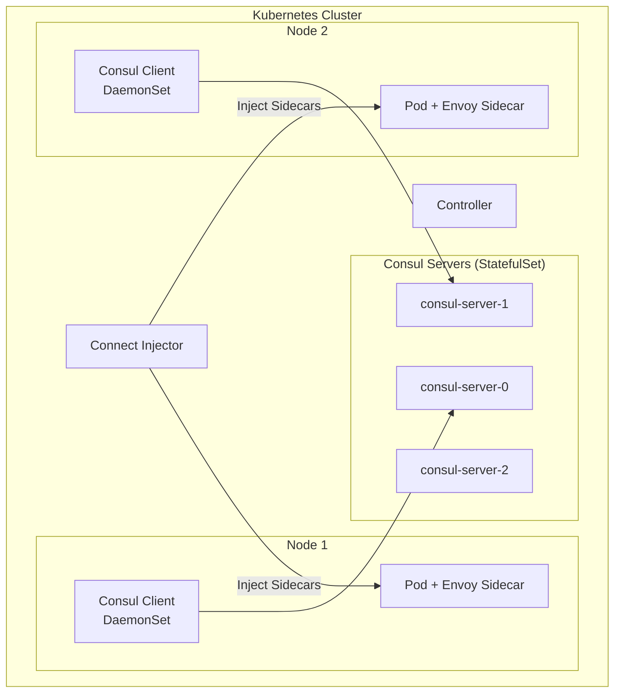

# How to Configure Consul for Kubernetes

Author: [nawazdhandala](https://www.github.com/nawazdhandala)

Tags: Consul, Kubernetes, Service Mesh, HashiCorp, Cloud Native

Description: Learn how to deploy and configure Consul on Kubernetes using the official Helm chart, including service sync, Connect service mesh, and integration with Kubernetes-native services.

---

Running Consul on Kubernetes combines Consul's powerful service discovery and mesh capabilities with Kubernetes' orchestration. The official Consul Helm chart simplifies deployment and provides features like automatic service sync, Connect sidecar injection, and integration with Kubernetes services.

## Architecture Overview

Consul on Kubernetes can run as servers within the cluster or connect to external servers. Client agents run as a DaemonSet, and Connect sidecars are automatically injected into pods.



## 1. Install Consul with Helm

Add the HashiCorp Helm repository and install Consul.

```bash
# Add HashiCorp Helm repo
helm repo add hashicorp https://helm.releases.hashicorp.com
helm repo update

# Create namespace
kubectl create namespace consul

# Install with default configuration
helm install consul hashicorp/consul \
  --namespace consul \
  --set global.name=consul
```

## 2. Configure Consul Helm Values

Create a comprehensive values file for production deployment.

`consul-values.yaml`:

```yaml
global:
  name: consul
  datacenter: dc1

  # Enable TLS for all Consul communication
  tls:
    enabled: true
    enableAutoEncrypt: true
    verify: true

  # Enable ACLs
  acls:
    manageSystemACLs: true

  # Gossip encryption
  gossipEncryption:
    autoGenerate: true

  # Metrics for Prometheus
  metrics:
    enabled: true
    enableAgentMetrics: true
    agentMetricsRetentionTime: "1m"

# Consul Server configuration
server:
  replicas: 3

  # Resource limits
  resources:
    requests:
      memory: "256Mi"
      cpu: "250m"
    limits:
      memory: "512Mi"
      cpu: "500m"

  # Storage
  storage: 10Gi
  storageClass: standard

  # Anti-affinity for HA
  affinity: |
    podAntiAffinity:
      requiredDuringSchedulingIgnoredDuringExecution:
        - labelSelector:
            matchLabels:
              app: {{ template "consul.name" . }}
              release: "{{ .Release.Name }}"
              component: server
          topologyKey: kubernetes.io/hostname

# Consul Client configuration
client:
  enabled: true
  grpc: true

  resources:
    requests:
      memory: "64Mi"
      cpu: "50m"
    limits:
      memory: "128Mi"
      cpu: "100m"

# Connect (Service Mesh)
connectInject:
  enabled: true
  default: false  # Require explicit annotation

  # Transparent proxy
  transparentProxy:
    defaultEnabled: true

  # Consul DNS
  consulDNS:
    enabled: true

  # Metrics
  metrics:
    defaultEnabled: true
    defaultEnableMerging: true

  # Resource limits for sidecars
  sidecarProxy:
    resources:
      requests:
        memory: "64Mi"
        cpu: "50m"
      limits:
        memory: "128Mi"
        cpu: "100m"

# Sync Kubernetes services to Consul
syncCatalog:
  enabled: true
  toConsul: true
  toK8S: false
  k8sPrefix: ""
  k8sDenyNamespaces: ["kube-system", "kube-public"]
  addK8SNamespaceSuffix: true

# Consul UI
ui:
  enabled: true
  service:
    type: ClusterIP

# Controller for CRDs
controller:
  enabled: true

# DNS configuration
dns:
  enabled: true
  type: ClusterIP

# Ingress Gateway
ingressGateways:
  enabled: true
  defaults:
    replicas: 2
  gateways:
    - name: ingress-gateway
      service:
        type: LoadBalancer

# Terminating Gateway (for external services)
terminatingGateways:
  enabled: true
  gateways:
    - name: terminating-gateway
      replicas: 1
```

Install with the values file:

```bash
helm install consul hashicorp/consul \
  --namespace consul \
  --values consul-values.yaml
```

## 3. Enable Service Mesh for Applications

Annotate pods to inject Connect sidecars.

```yaml
apiVersion: apps/v1
kind: Deployment
metadata:
  name: api
  namespace: default
spec:
  replicas: 3
  selector:
    matchLabels:
      app: api
  template:
    metadata:
      labels:
        app: api
      annotations:
        # Enable Connect sidecar injection
        consul.hashicorp.com/connect-inject: "true"
        # Service name (defaults to pod name)
        consul.hashicorp.com/connect-service: "api"
        # Port for the service
        consul.hashicorp.com/connect-service-port: "8080"
        # Define upstreams (services this pod connects to)
        consul.hashicorp.com/connect-service-upstreams: "database:5432,cache:6379"
        # Enable transparent proxy
        consul.hashicorp.com/transparent-proxy: "true"
        # Prometheus metrics
        consul.hashicorp.com/enable-metrics: "true"
        consul.hashicorp.com/enable-metrics-merging: "true"
    spec:
      containers:
        - name: api
          image: myregistry/api:1.0.0
          ports:
            - containerPort: 8080
          env:
            # Connect to upstreams via localhost
            - name: DATABASE_HOST
              value: "localhost"
            - name: DATABASE_PORT
              value: "5432"
            - name: CACHE_HOST
              value: "localhost"
            - name: CACHE_PORT
              value: "6379"
```

## 4. Configure Service Defaults

Define default settings for services.

```yaml
apiVersion: consul.hashicorp.com/v1alpha1
kind: ServiceDefaults
metadata:
  name: api
  namespace: default
spec:
  protocol: http
  meshGateway:
    mode: local
  transparentProxy:
    outboundListenerPort: 15001
    dialedDirectly: false
```

## 5. Configure Intentions

Define service-to-service authorization rules.

```yaml
apiVersion: consul.hashicorp.com/v1alpha1
kind: ServiceIntentions
metadata:
  name: database
  namespace: default
spec:
  destination:
    name: database
  sources:
    - name: api
      action: allow
    - name: migration-job
      action: allow
    - name: "*"
      action: deny
---
apiVersion: consul.hashicorp.com/v1alpha1
kind: ServiceIntentions
metadata:
  name: api
  namespace: default
spec:
  destination:
    name: api
  sources:
    - name: web
      action: allow
      permissions:
        - http:
            pathPrefix: /public
            methods: ["GET"]
          action: allow
        - http:
            pathPrefix: /admin
          action: deny
    - name: "*"
      action: deny
```

## 6. Service Sync Configuration

Sync Kubernetes services to Consul.

```yaml
# Service with Consul annotations
apiVersion: v1
kind: Service
metadata:
  name: external-api
  namespace: default
  annotations:
    # Sync to Consul
    consul.hashicorp.com/service-sync: "true"
    # Custom service name in Consul
    consul.hashicorp.com/service-name: "external-api"
    # Service tags
    consul.hashicorp.com/service-tags: "external,production"
    # Service metadata
    consul.hashicorp.com/service-meta-version: "v2"
spec:
  selector:
    app: external-api
  ports:
    - port: 80
      targetPort: 8080
```

## 7. Ingress Gateway Configuration

Expose services externally through an ingress gateway.

```yaml
apiVersion: consul.hashicorp.com/v1alpha1
kind: IngressGateway
metadata:
  name: ingress-gateway
  namespace: consul
spec:
  listeners:
    - port: 8080
      protocol: http
      services:
        - name: api
          hosts:
            - api.example.com
        - name: web
          hosts:
            - www.example.com
    - port: 8443
      protocol: http
      services:
        - name: api
          hosts:
            - api.example.com
      tls:
        enabled: true
        tlsMinVersion: TLSv1_2
```

## 8. External Services via Terminating Gateway

Connect to services outside Kubernetes.

```yaml
# Register external service
apiVersion: consul.hashicorp.com/v1alpha1
kind: ServiceDefaults
metadata:
  name: external-database
spec:
  protocol: tcp
---
apiVersion: v1
kind: Service
metadata:
  name: external-database
  annotations:
    consul.hashicorp.com/service-sync: "false"
spec:
  type: ExternalName
  externalName: database.external.example.com
---
apiVersion: consul.hashicorp.com/v1alpha1
kind: TerminatingGateway
metadata:
  name: terminating-gateway
  namespace: consul
spec:
  services:
    - name: external-database
      caFile: /etc/consul/tls/ca.crt
```

## 9. Consul DNS in Kubernetes

Configure pods to use Consul DNS.

```yaml
apiVersion: apps/v1
kind: Deployment
metadata:
  name: app-with-consul-dns
spec:
  template:
    metadata:
      annotations:
        consul.hashicorp.com/connect-inject: "true"
        consul.hashicorp.com/consul-dns: "true"
    spec:
      containers:
        - name: app
          image: myapp:1.0
          env:
            # Can now use Consul DNS names
            - name: API_HOST
              value: "api.service.consul"
```

Or configure cluster-wide DNS forwarding:

```yaml
apiVersion: v1
kind: ConfigMap
metadata:
  name: coredns-custom
  namespace: kube-system
data:
  consul.server: |
    consul {
      forward . $(CONSUL_DNS_SERVICE_IP)
    }
```

## 10. Monitoring and Observability

Access Consul metrics and UI.

```bash
# Port-forward to Consul UI
kubectl port-forward svc/consul-ui -n consul 8500:80

# Access UI
open http://localhost:8500

# Get metrics
kubectl port-forward svc/consul-server -n consul 8500:8500
curl http://localhost:8500/v1/agent/metrics
```

**Prometheus ServiceMonitor:**

```yaml
apiVersion: monitoring.coreos.com/v1
kind: ServiceMonitor
metadata:
  name: consul
  namespace: consul
spec:
  selector:
    matchLabels:
      app: consul
  endpoints:
    - port: http
      path: /v1/agent/metrics
      params:
        format: ["prometheus"]
```

## 11. Upgrade and Maintenance

Upgrade Consul safely.

```bash
# Check current version
helm list -n consul

# Update repo
helm repo update

# Dry-run upgrade
helm upgrade consul hashicorp/consul \
  --namespace consul \
  --values consul-values.yaml \
  --dry-run

# Perform upgrade
helm upgrade consul hashicorp/consul \
  --namespace consul \
  --values consul-values.yaml

# Verify
kubectl get pods -n consul
consul members
```

## Best Practices

1. **Enable TLS and ACLs** - Always secure production deployments
2. **Use anti-affinity** - Spread server pods across nodes
3. **Resource limits** - Set appropriate resource requests and limits
4. **Backup regularly** - Snapshot Consul data
5. **Monitor health** - Track Consul metrics and alerts
6. **Use namespaces** - Organize services by namespace
7. **Test upgrades** - Always test in staging first

---

Consul on Kubernetes provides a powerful service mesh with advanced features like traffic management, security policies, and multi-datacenter support. With proper configuration using the Helm chart and Kubernetes CRDs, you can leverage Consul's capabilities while maintaining cloud-native deployment practices.
