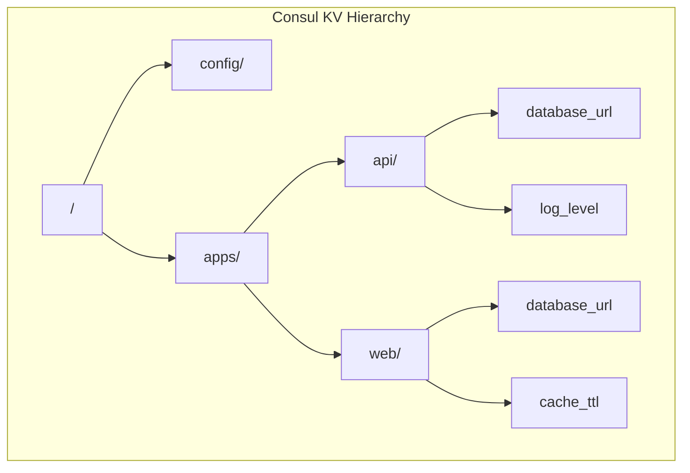

# How to Implement Consul KV for Configuration

Author: [nawazdhandala](https://www.github.com/nawazdhandala)

Tags: Consul, Key-Value Store, Configuration Management, Distributed Systems, DevOps

Description: Learn how to use Consul's Key-Value store for centralized configuration management, including storing, retrieving, watching for changes, and implementing configuration hierarchies.

---

Consul's Key-Value (KV) store provides a simple yet powerful way to store and retrieve configuration data across distributed systems. Unlike static configuration files, Consul KV enables dynamic configuration updates without service restarts and provides consistency across all nodes in your cluster.

## Understanding Consul KV

The KV store is a hierarchical namespace where keys are organized like filesystem paths. This structure enables logical grouping of configuration and supports prefix-based queries.



## 1. Basic KV Operations

Use the Consul CLI or HTTP API to manage key-value pairs:

```bash
# Set a key
consul kv put config/api/database_url "postgresql://localhost:5432/mydb"

# Get a key
consul kv get config/api/database_url

# Get with metadata (shows ModifyIndex for watches)
consul kv get -detailed config/api/database_url

# List all keys with a prefix
consul kv get -recurse config/api/

# Delete a key
consul kv delete config/api/old_setting

# Delete all keys with a prefix
consul kv delete -recurse config/api/deprecated/
```

Using the HTTP API:

```bash
# Set a key (value must be base64 encoded for binary data)
curl -X PUT -d 'production' http://localhost:8500/v1/kv/config/api/environment

# Get a key
curl http://localhost:8500/v1/kv/config/api/environment

# Get decoded value
curl -s http://localhost:8500/v1/kv/config/api/environment | jq -r '.[0].Value' | base64 -d

# List keys with prefix
curl http://localhost:8500/v1/kv/config/api/?keys

# Get all values with prefix
curl http://localhost:8500/v1/kv/config/api/?recurse
```

## 2. Organize Configuration Hierarchy

Structure your KV store with a clear hierarchy that separates environments, applications, and configuration types:

```bash
# Environment-specific configuration
consul kv put config/production/api/database_url "postgresql://prod-db:5432/api"
consul kv put config/staging/api/database_url "postgresql://stage-db:5432/api"
consul kv put config/development/api/database_url "postgresql://localhost:5432/api"

# Shared configuration
consul kv put config/shared/feature_flags/new_checkout "true"
consul kv put config/shared/feature_flags/dark_mode "false"

# Service-specific secrets (better to use Vault, but for demonstration)
consul kv put secrets/api/jwt_secret "your-jwt-secret-key"

# Application configuration as JSON
consul kv put config/production/api/settings '{
  "max_connections": 100,
  "timeout_seconds": 30,
  "retry_attempts": 3,
  "cache_ttl": 300
}'
```

## 3. Implement Atomic Transactions

Consul supports Check-And-Set (CAS) operations for atomic updates:

```bash
# Get current value and its ModifyIndex
consul kv get -detailed config/api/counter
# Note the ModifyIndex value

# Update only if ModifyIndex matches (optimistic locking)
consul kv put -cas -modify-index=123 config/api/counter "5"
```

Using the transaction API for multiple operations:

```bash
curl -X PUT http://localhost:8500/v1/txn -d '[
  {
    "KV": {
      "Verb": "set",
      "Key": "config/api/setting1",
      "Value": "'$(echo -n "value1" | base64)'"
    }
  },
  {
    "KV": {
      "Verb": "set",
      "Key": "config/api/setting2",
      "Value": "'$(echo -n "value2" | base64)'"
    }
  },
  {
    "KV": {
      "Verb": "check-index",
      "Key": "config/api/version",
      "Index": 100
    }
  }
]'
```

## 4. Watch for Configuration Changes

Implement blocking queries to watch for changes in real-time:

```bash
# Block until the key changes (or timeout after 5 minutes)
# The index parameter is the ModifyIndex from the previous query
curl "http://localhost:8500/v1/kv/config/api/settings?index=123&wait=5m"
```

**Python Watch Implementation:**

```python
import consul
import json
import threading
import time

class ConfigWatcher:
    def __init__(self, consul_host='localhost', consul_port=8500):
        self.consul = consul.Consul(host=consul_host, port=consul_port)
        self.config_cache = {}
        self.callbacks = []
        self._stop_event = threading.Event()

    def get(self, key, default=None):
        """Get a configuration value."""
        if key in self.config_cache:
            return self.config_cache[key]

        index, data = self.consul.kv.get(key)
        if data is None:
            return default

        value = data['Value'].decode('utf-8')
        self.config_cache[key] = value
        return value

    def get_json(self, key, default=None):
        """Get a JSON configuration value."""
        value = self.get(key)
        if value is None:
            return default
        return json.loads(value)

    def on_change(self, callback):
        """Register a callback for configuration changes."""
        self.callbacks.append(callback)

    def watch(self, prefix):
        """Watch a prefix for changes."""
        index = None

        while not self._stop_event.is_set():
            try:
                # Blocking query - waits until data changes
                index, data = self.consul.kv.get(
                    prefix,
                    recurse=True,
                    index=index,
                    wait='30s'
                )

                if data:
                    # Update cache and notify callbacks
                    for item in data:
                        key = item['Key']
                        value = item['Value'].decode('utf-8') if item['Value'] else None

                        if self.config_cache.get(key) != value:
                            old_value = self.config_cache.get(key)
                            self.config_cache[key] = value

                            for callback in self.callbacks:
                                callback(key, old_value, value)

            except Exception as e:
                print(f"Watch error: {e}")
                time.sleep(5)

    def start_watching(self, prefix):
        """Start watching in a background thread."""
        thread = threading.Thread(target=self.watch, args=(prefix,))
        thread.daemon = True
        thread.start()
        return thread

    def stop(self):
        """Stop watching."""
        self._stop_event.set()

# Usage
def on_config_change(key, old_value, new_value):
    print(f"Config changed: {key}")
    print(f"  Old: {old_value}")
    print(f"  New: {new_value}")
    # Reload application settings, update feature flags, etc.

watcher = ConfigWatcher()
watcher.on_change(on_config_change)
watcher.start_watching('config/production/api/')

# Get configuration values
db_url = watcher.get('config/production/api/database_url')
settings = watcher.get_json('config/production/api/settings')
```

**Go Watch Implementation:**

```go
package main

import (
    "encoding/json"
    "fmt"
    "log"
    "sync"
    "time"

    "github.com/hashicorp/consul/api"
)

type ConfigWatcher struct {
    client    *api.Client
    cache     map[string]string
    cacheLock sync.RWMutex
    callbacks []func(key, oldVal, newVal string)
    stopCh    chan struct{}
}

func NewConfigWatcher() (*ConfigWatcher, error) {
    client, err := api.NewClient(api.DefaultConfig())
    if err != nil {
        return nil, err
    }

    return &ConfigWatcher{
        client: client,
        cache:  make(map[string]string),
        stopCh: make(chan struct{}),
    }, nil
}

func (w *ConfigWatcher) Get(key string) (string, error) {
    w.cacheLock.RLock()
    if val, ok := w.cache[key]; ok {
        w.cacheLock.RUnlock()
        return val, nil
    }
    w.cacheLock.RUnlock()

    kv := w.client.KV()
    pair, _, err := kv.Get(key, nil)
    if err != nil {
        return "", err
    }
    if pair == nil {
        return "", nil
    }

    value := string(pair.Value)
    w.cacheLock.Lock()
    w.cache[key] = value
    w.cacheLock.Unlock()

    return value, nil
}

func (w *ConfigWatcher) GetJSON(key string, target interface{}) error {
    value, err := w.Get(key)
    if err != nil {
        return err
    }
    return json.Unmarshal([]byte(value), target)
}

func (w *ConfigWatcher) OnChange(callback func(key, oldVal, newVal string)) {
    w.callbacks = append(w.callbacks, callback)
}

func (w *ConfigWatcher) Watch(prefix string) {
    kv := w.client.KV()
    var lastIndex uint64

    for {
        select {
        case <-w.stopCh:
            return
        default:
        }

        pairs, meta, err := kv.List(prefix, &api.QueryOptions{
            WaitIndex: lastIndex,
            WaitTime:  30 * time.Second,
        })
        if err != nil {
            log.Printf("Watch error: %v", err)
            time.Sleep(5 * time.Second)
            continue
        }

        lastIndex = meta.LastIndex

        for _, pair := range pairs {
            key := pair.Key
            newValue := string(pair.Value)

            w.cacheLock.RLock()
            oldValue := w.cache[key]
            w.cacheLock.RUnlock()

            if oldValue != newValue {
                w.cacheLock.Lock()
                w.cache[key] = newValue
                w.cacheLock.Unlock()

                for _, cb := range w.callbacks {
                    cb(key, oldValue, newValue)
                }
            }
        }
    }
}

func main() {
    watcher, err := NewConfigWatcher()
    if err != nil {
        log.Fatal(err)
    }

    watcher.OnChange(func(key, oldVal, newVal string) {
        fmt.Printf("Config changed: %s\n", key)
        fmt.Printf("  Old: %s\n", oldVal)
        fmt.Printf("  New: %s\n", newVal)
    })

    go watcher.Watch("config/production/api/")

    // Application continues running
    select {}
}
```

## 5. Use consul-template for File-Based Configuration

consul-template renders configuration files from Consul data and restarts services when configuration changes:

```bash
# Install consul-template
curl -fsSL https://releases.hashicorp.com/consul-template/0.35.0/consul-template_0.35.0_linux_amd64.zip -o consul-template.zip
unzip consul-template.zip
sudo mv consul-template /usr/local/bin/
```

Create a template file:

`/etc/consul-template/api-config.ctmpl`

```hcl
{{- with secret "config/production/api/settings" }}
# Auto-generated configuration - do not edit manually
# Last updated: {{ timestamp }}

database:
  url: {{ key "config/production/api/database_url" }}
  max_connections: {{ .Data.max_connections }}
  timeout: {{ .Data.timeout_seconds }}s

logging:
  level: {{ key "config/production/api/log_level" }}

features:
{{- range ls "config/shared/feature_flags" }}
  {{ .Key }}: {{ .Value }}
{{- end }}
{{- end }}
```

Configure and run consul-template:

`/etc/consul-template/config.hcl`

```hcl
consul {
  address = "127.0.0.1:8500"
}

template {
  source      = "/etc/consul-template/api-config.ctmpl"
  destination = "/etc/api/config.yaml"
  perms       = 0644

  # Command to run after rendering
  command     = "systemctl reload api-service"

  # Wait for changes to settle before rendering
  wait {
    min = "2s"
    max = "10s"
  }
}

# Optional: run as a daemon
reload_signal = "SIGHUP"
kill_signal   = "SIGINT"
```

Run consul-template:

```bash
consul-template -config=/etc/consul-template/config.hcl
```

## 6. Implement Configuration Versioning

Track configuration versions for rollback capabilities:

```bash
# Store configuration with version
VERSION="v1.2.3"
consul kv put "config/api/versions/${VERSION}" '{
  "database_url": "postgresql://localhost:5432/api",
  "log_level": "info",
  "max_connections": 100
}'

# Point current to the active version
consul kv put config/api/current "${VERSION}"

# Rollback by changing the current pointer
consul kv put config/api/current "v1.2.2"
```

## Best Practices

1. **Use hierarchical keys** - Organize by environment, application, and setting type
2. **Keep values small** - KV store is not designed for large blobs (max 512KB)
3. **Use watches sparingly** - Too many watchers can impact Consul performance
4. **Implement caching** - Cache values locally and update on change notifications
5. **Version your configuration** - Enable rollbacks by storing versioned configurations
6. **Secure sensitive data** - Use Consul ACLs or preferably HashiCorp Vault for secrets

---

Consul KV provides a reliable foundation for centralized configuration management in distributed systems. Combined with watches and consul-template, it enables dynamic configuration updates that keep your services in sync across the entire infrastructure.
