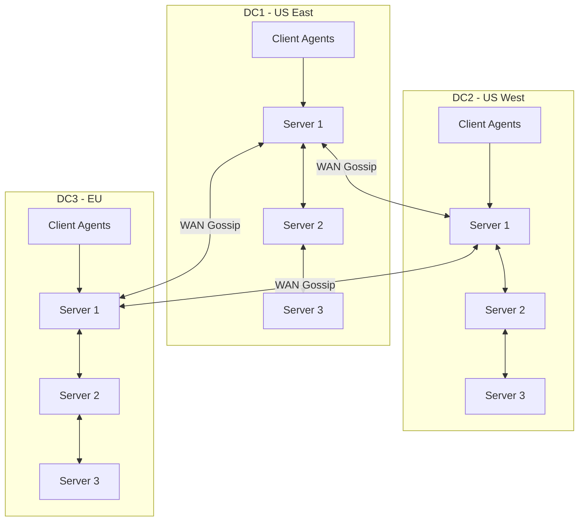

# How to Configure Consul for Multi-Datacenter

Author: [nawazdhandala](https://www.github.com/nawazdhandala)

Tags: Consul, Multi-Datacenter, Service Discovery, HashiCorp, High Availability

Description: Learn how to configure Consul for multi-datacenter deployments, including WAN federation, cross-datacenter service discovery, and failover strategies.

---

Multi-datacenter Consul deployments enable service discovery, configuration, and health checking across geographically distributed infrastructure. This setup provides disaster recovery capabilities, allows services in one datacenter to discover services in another, and enables sophisticated failover strategies.

## Multi-Datacenter Architecture

Each datacenter has its own Consul cluster with servers and clients. Servers communicate across datacenters via WAN gossip, while clients only communicate within their local datacenter.



## 1. Configure Primary Datacenter

Set up the first datacenter that will be the primary for ACL replication.

`/etc/consul.d/server-dc1.hcl`

```hcl
datacenter = "dc1"
data_dir = "/opt/consul/data"
server = true
bootstrap_expect = 3

# Network configuration
bind_addr = "10.1.0.10"
client_addr = "0.0.0.0"

# Advertise addresses
advertise_addr = "10.1.0.10"
advertise_addr_wan = "203.0.113.10"  # Public IP for WAN

# Gossip encryption
encrypt = "your-gossip-key"

# TLS configuration
tls {
  defaults {
    ca_file = "/etc/consul.d/pki/ca.crt"
    cert_file = "/etc/consul.d/pki/server.crt"
    key_file = "/etc/consul.d/pki/server.key"
    verify_incoming = true
    verify_outgoing = true
  }
}

# UI
ui_config {
  enabled = true
}

# Join local servers
retry_join = ["10.1.0.10", "10.1.0.11", "10.1.0.12"]

# WAN join for other datacenters (will be configured later)
retry_join_wan = []

# ACL configuration
acl {
  enabled = true
  default_policy = "deny"
  enable_token_persistence = true
}

# This is the primary datacenter for ACLs
primary_datacenter = "dc1"

# Connect (service mesh)
connect {
  enabled = true
}

# Performance tuning
performance {
  raft_multiplier = 1
}

# Ports
ports {
  server = 8300
  serf_lan = 8301
  serf_wan = 8302  # WAN gossip
  http = 8500
  https = 8501
  grpc = 8502
}
```

## 2. Configure Secondary Datacenter

Set up additional datacenters that federate with the primary.

`/etc/consul.d/server-dc2.hcl`

```hcl
datacenter = "dc2"
data_dir = "/opt/consul/data"
server = true
bootstrap_expect = 3

bind_addr = "10.2.0.10"
client_addr = "0.0.0.0"

advertise_addr = "10.2.0.10"
advertise_addr_wan = "203.0.114.10"  # Public IP for WAN

encrypt = "your-gossip-key"  # Same key as DC1

tls {
  defaults {
    ca_file = "/etc/consul.d/pki/ca.crt"
    cert_file = "/etc/consul.d/pki/server.crt"
    key_file = "/etc/consul.d/pki/server.key"
    verify_incoming = true
    verify_outgoing = true
  }
}

ui_config {
  enabled = true
}

# Join local servers in DC2
retry_join = ["10.2.0.10", "10.2.0.11", "10.2.0.12"]

# WAN join to DC1 servers
retry_join_wan = ["203.0.113.10", "203.0.113.11", "203.0.113.12"]

acl {
  enabled = true
  default_policy = "deny"
  enable_token_persistence = true

  # Replicate ACLs from primary datacenter
  enable_token_replication = true
}

# Primary datacenter for ACL resolution
primary_datacenter = "dc1"

connect {
  enabled = true
}

ports {
  server = 8300
  serf_lan = 8301
  serf_wan = 8302
  http = 8500
  https = 8501
  grpc = 8502
}
```

## 3. Configure Mesh Gateways

Mesh gateways enable service mesh traffic between datacenters without requiring direct connectivity between all services.

`/etc/consul.d/mesh-gateway.hcl`

```hcl
service {
  kind = "mesh-gateway"
  name = "mesh-gateway"
  port = 8443

  proxy {
    # No upstreams needed - gateways route dynamically
  }

  checks = [
    {
      name = "Mesh Gateway Listening"
      tcp = "localhost:8443"
      interval = "10s"
    }
  ]
}
```

Start the mesh gateway:

```bash
# Start Envoy as mesh gateway
consul connect envoy -gateway=mesh -register \
  -address '{{ GetPrivateIP }}:8443' \
  -wan-address '{{ GetPublicIP }}:8443'
```

Configure services to use mesh gateways:

```hcl
Kind = "proxy-defaults"
Name = "global"
MeshGateway {
  Mode = "local"  # Use local gateway for cross-DC traffic
}
```

## 4. Cross-Datacenter Service Discovery

Query services in other datacenters.

```bash
# Query service in specific datacenter
dig @127.0.0.1 -p 8600 api.service.dc2.consul

# HTTP API query
curl http://localhost:8500/v1/health/service/api?dc=dc2

# List all services in another datacenter
curl http://localhost:8500/v1/catalog/services?dc=dc2

# Get nodes in another datacenter
curl http://localhost:8500/v1/catalog/nodes?dc=dc2
```

**Python client for multi-datacenter discovery:**

```python
import consul
from typing import List, Dict, Optional

class MultiDCServiceDiscovery:
    def __init__(self, consul_host='localhost', consul_port=8500):
        self.consul = consul.Consul(host=consul_host, port=consul_port)

    def get_datacenters(self) -> List[str]:
        """Get list of all known datacenters."""
        return self.consul.catalog.datacenters()

    def get_service(
        self,
        service_name: str,
        datacenter: Optional[str] = None,
        passing_only: bool = True
    ) -> List[Dict]:
        """Get service instances, optionally from specific datacenter."""
        kwargs = {'passing': passing_only}
        if datacenter:
            kwargs['dc'] = datacenter

        index, services = self.consul.health.service(service_name, **kwargs)

        return [{
            'id': svc['Service']['ID'],
            'address': svc['Service']['Address'] or svc['Node']['Address'],
            'port': svc['Service']['Port'],
            'datacenter': datacenter or 'local',
            'tags': svc['Service'].get('Tags', [])
        } for svc in services]

    def get_service_all_dcs(self, service_name: str) -> Dict[str, List[Dict]]:
        """Get service instances from all datacenters."""
        result = {}
        for dc in self.get_datacenters():
            instances = self.get_service(service_name, datacenter=dc)
            if instances:
                result[dc] = instances
        return result

    def get_nearest_instance(
        self,
        service_name: str,
        preferred_dc: str = None,
        fallback_dcs: List[str] = None
    ) -> Optional[Dict]:
        """Get nearest healthy service instance with failover."""
        # Try preferred datacenter first
        if preferred_dc:
            instances = self.get_service(service_name, datacenter=preferred_dc)
            if instances:
                return instances[0]

        # Try fallback datacenters in order
        if fallback_dcs:
            for dc in fallback_dcs:
                instances = self.get_service(service_name, datacenter=dc)
                if instances:
                    return instances[0]

        # Try all datacenters
        for dc in self.get_datacenters():
            instances = self.get_service(service_name, datacenter=dc)
            if instances:
                return instances[0]

        return None

# Usage
discovery = MultiDCServiceDiscovery()

# List all datacenters
dcs = discovery.get_datacenters()
print(f"Datacenters: {dcs}")

# Get service from specific DC
dc2_instances = discovery.get_service('api', datacenter='dc2')

# Get service from all DCs
all_instances = discovery.get_service_all_dcs('api')
for dc, instances in all_instances.items():
    print(f"{dc}: {len(instances)} instances")

# Get nearest instance with failover
instance = discovery.get_nearest_instance(
    'api',
    preferred_dc='dc1',
    fallback_dcs=['dc2', 'dc3']
)
```

## 5. Configure Prepared Queries for Failover

Set up automatic failover to other datacenters.

```bash
curl --request POST \
  --data '{
    "Name": "api-geo",
    "Service": {
      "Service": "api",
      "OnlyPassing": true,
      "Near": "_agent",
      "Failover": {
        "NearestN": 2,
        "Datacenters": ["dc2", "dc3"]
      }
    },
    "DNS": {
      "TTL": "10s"
    }
  }' \
  http://localhost:8500/v1/query
```

Query via DNS for automatic failover:

```bash
dig @127.0.0.1 -p 8600 api-geo.query.consul
```

## 6. ACL Replication

Configure ACL token replication across datacenters.

On secondary datacenter, create replication token:

```bash
# On primary DC, create replication token
consul acl token create \
  -description "ACL Replication Token for DC2" \
  -policy-name "global-management"

# On secondary DC, set replication token
consul acl set-agent-token replication "<replication-token>"
```

Verify replication:

```bash
# Check replication status
curl http://localhost:8500/v1/acl/replication
```

## 7. Configure Network Segments (Enterprise)

For complex network topologies, use network segments.

```hcl
# Server configuration with segments
segments = [
  {
    name = "alpha"
    bind = "10.1.0.10"
    port = 8303
    advertise = "10.1.0.10"
  },
  {
    name = "beta"
    bind = "10.1.0.10"
    port = 8304
    advertise = "10.1.0.10"
  }
]
```

## 8. Monitor Multi-Datacenter Health

Check federation status and health.

```bash
# List all members including WAN
consul members -wan

# Check datacenter connectivity
consul operator raft list-peers

# Check WAN coordinates (latency estimation)
curl http://localhost:8500/v1/coordinate/datacenters

# Verify cross-DC service discovery
curl "http://localhost:8500/v1/health/service/consul?dc=dc2"
```

**Monitoring script:**

```python
import consul
import time

def monitor_federation():
    c = consul.Consul()

    while True:
        # Get all datacenters
        dcs = c.catalog.datacenters()
        print(f"Known datacenters: {dcs}")

        # Check each datacenter
        for dc in dcs:
            try:
                # Get nodes in datacenter
                index, nodes = c.catalog.nodes(dc=dc)
                healthy = sum(1 for n in nodes if n.get('Status') != 'critical')
                print(f"  {dc}: {healthy}/{len(nodes)} healthy nodes")

                # Get services
                index, services = c.catalog.services(dc=dc)
                print(f"  {dc}: {len(services)} services registered")

            except Exception as e:
                print(f"  {dc}: ERROR - {e}")

        print("-" * 40)
        time.sleep(30)

monitor_federation()
```

## Best Practices

1. **Use consistent encryption** - Same gossip key across all datacenters
2. **Designate primary datacenter** - For ACL and configuration authority
3. **Configure failover queries** - Automatic cross-DC failover for critical services
4. **Use mesh gateways** - Simplify cross-DC service mesh connectivity
5. **Monitor WAN latency** - Track cross-datacenter communication health
6. **Test failover scenarios** - Regularly verify cross-DC failover works

---

Multi-datacenter Consul provides the foundation for globally distributed service discovery and mesh networking. With proper configuration of WAN gossip, ACL replication, and failover queries, your services can seamlessly discover and communicate with each other across geographic regions.
