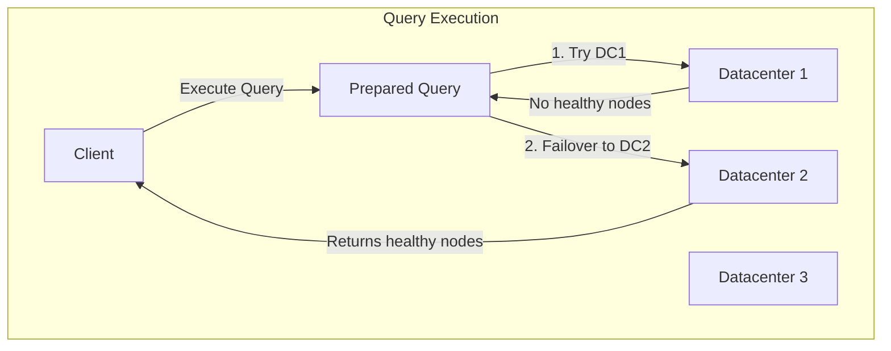

# How to Configure Consul Prepared Queries

Author: [nawazdhandala](https://www.github.com/nawazdhandala)

Tags: Consul, Prepared Queries, Service Discovery, Load Balancing, HashiCorp

Description: Learn how to use Consul prepared queries for advanced service discovery including failover, geo-routing, service templating, and sophisticated load balancing strategies.

---

Consul prepared queries provide a powerful mechanism for advanced service discovery beyond simple service lookups. They enable failover to other datacenters, sophisticated load balancing, service templating, and caching - all accessed through a single, consistent API endpoint.

## How Prepared Queries Work

Prepared queries are stored query definitions that can be executed by name or ID. They support failover across datacenters, node filtering, and various result ordering strategies.



## 1. Create a Basic Prepared Query

Create queries using the HTTP API or CLI.

```bash
# Create a prepared query via API
curl --request POST \
  --data '{
    "Name": "api-query",
    "Service": {
      "Service": "api",
      "OnlyPassing": true,
      "Near": "_agent"
    }
  }' \
  http://localhost:8500/v1/query

# Response includes the query ID
# {"ID":"8f246b77-f3e1-ff88-5b48-8ec93abf3e05"}
```

Or use HCL configuration:

```hcl
# prepared-queries.hcl
query {
  name = "api-query"
  service {
    service = "api"
    only_passing = true
    near = "_agent"
  }
}
```

## 2. Configure Datacenter Failover

Set up automatic failover to other datacenters when local instances are unhealthy.

```bash
curl --request POST \
  --data '{
    "Name": "api-failover",
    "Service": {
      "Service": "api",
      "OnlyPassing": true,
      "Tags": ["production"],
      "Failover": {
        "NearestN": 3,
        "Datacenters": ["dc2", "dc3", "dc4"]
      }
    }
  }' \
  http://localhost:8500/v1/query
```

This query:
1. First tries the local datacenter
2. If no healthy instances, tries the 3 nearest datacenters
3. Falls back to explicitly listed datacenters in order

## 3. Template Queries

Create dynamic queries that match multiple services using templates.

```bash
# Create a template query
curl --request POST \
  --data '{
    "Name": "",
    "Template": {
      "Type": "name_prefix_match",
      "Regexp": "^geo-(.+)$"
    },
    "Service": {
      "Service": "${match(1)}",
      "OnlyPassing": true,
      "Failover": {
        "NearestN": 2
      }
    }
  }' \
  http://localhost:8500/v1/query
```

Now queries like `geo-api`, `geo-database`, `geo-cache` automatically resolve to the respective services with failover.

**Using template queries:**

```bash
# Query via DNS - matches the template
dig @127.0.0.1 -p 8600 geo-api.query.consul

# Query via HTTP
curl http://localhost:8500/v1/query/geo-api/execute
```

## 4. Node and Tag Filtering

Filter results by tags, node metadata, or service metadata.

```bash
# Filter by multiple tags
curl --request POST \
  --data '{
    "Name": "api-v2-production",
    "Service": {
      "Service": "api",
      "Tags": ["v2", "production"],
      "OnlyPassing": true,
      "NodeMeta": {
        "zone": "us-east-1a"
      }
    }
  }' \
  http://localhost:8500/v1/query
```

## 5. Load Balancing Strategies

Configure different result ordering for load balancing.

**Shuffle (Random):**

```bash
curl --request POST \
  --data '{
    "Name": "api-random",
    "Service": {
      "Service": "api",
      "OnlyPassing": true
    },
    "DNS": {
      "TTL": "10s"
    }
  }' \
  http://localhost:8500/v1/query
```

**Nearest to Agent:**

```bash
curl --request POST \
  --data '{
    "Name": "api-nearest",
    "Service": {
      "Service": "api",
      "OnlyPassing": true,
      "Near": "_agent"
    }
  }' \
  http://localhost:8500/v1/query
```

**Nearest to Specific Node:**

```bash
curl --request POST \
  --data '{
    "Name": "api-near-web",
    "Service": {
      "Service": "api",
      "OnlyPassing": true,
      "Near": "web-server-1"
    }
  }' \
  http://localhost:8500/v1/query
```

## 6. Execute Prepared Queries

Execute queries via HTTP API or DNS.

**HTTP API:**

```bash
# Execute by name
curl http://localhost:8500/v1/query/api-query/execute

# Execute by ID
curl http://localhost:8500/v1/query/8f246b77-f3e1-ff88-5b48-8ec93abf3e05/execute

# With query parameters
curl "http://localhost:8500/v1/query/api-query/execute?near=web-1&limit=5"
```

**DNS Interface:**

```bash
# Query by name
dig @127.0.0.1 -p 8600 api-query.query.consul

# Get SRV records
dig @127.0.0.1 -p 8600 api-query.query.consul SRV
```

## 7. Python Client for Prepared Queries

```python
import consul
import random
from typing import List, Dict, Optional

class PreparedQueryClient:
    def __init__(self, consul_host='localhost', consul_port=8500):
        self.consul = consul.Consul(host=consul_host, port=consul_port)

    def create_query(
        self,
        name: str,
        service: str,
        tags: List[str] = None,
        failover_dcs: List[str] = None,
        nearest_n: int = 0,
        only_passing: bool = True,
        near: str = '_agent'
    ) -> str:
        """Create a prepared query and return its ID."""
        query_def = {
            'Name': name,
            'Service': {
                'Service': service,
                'OnlyPassing': only_passing,
                'Near': near
            }
        }

        if tags:
            query_def['Service']['Tags'] = tags

        if failover_dcs or nearest_n > 0:
            query_def['Service']['Failover'] = {}
            if nearest_n > 0:
                query_def['Service']['Failover']['NearestN'] = nearest_n
            if failover_dcs:
                query_def['Service']['Failover']['Datacenters'] = failover_dcs

        result = self.consul.query.create(query_def)
        return result['ID']

    def execute_query(
        self,
        name_or_id: str,
        near: str = None,
        limit: int = None
    ) -> List[Dict]:
        """Execute a prepared query and return service instances."""
        params = {}
        if near:
            params['near'] = near
        if limit:
            params['limit'] = limit

        index, result = self.consul.query.execute(name_or_id, **params)

        instances = []
        for node in result.get('Nodes', []):
            service = node['Service']
            instances.append({
                'id': service['ID'],
                'address': service['Address'] or node['Node']['Address'],
                'port': service['Port'],
                'tags': service.get('Tags', []),
                'datacenter': result.get('Datacenter', 'unknown')
            })

        return instances

    def get_service_url(self, query_name: str, path: str = '') -> str:
        """Get a URL for a service instance from prepared query."""
        instances = self.execute_query(query_name, limit=10)
        if not instances:
            raise Exception(f"No instances found for query: {query_name}")

        # Random selection for load balancing
        instance = random.choice(instances)
        return f"http://{instance['address']}:{instance['port']}{path}"

    def list_queries(self) -> List[Dict]:
        """List all prepared queries."""
        queries = self.consul.query.list()
        return queries

    def delete_query(self, query_id: str) -> bool:
        """Delete a prepared query."""
        return self.consul.query.delete(query_id)

# Usage
client = PreparedQueryClient()

# Create a query with failover
query_id = client.create_query(
    name='api-ha',
    service='api',
    tags=['production'],
    failover_dcs=['dc2', 'dc3'],
    nearest_n=2,
    only_passing=True
)
print(f"Created query: {query_id}")

# Execute the query
instances = client.execute_query('api-ha')
for inst in instances:
    print(f"  {inst['address']}:{inst['port']} (dc: {inst['datacenter']})")

# Get a URL for making requests
url = client.get_service_url('api-ha', '/health')
print(f"Service URL: {url}")
```

## 8. Go Client for Prepared Queries

```go
package main

import (
    "fmt"
    "log"
    "math/rand"

    "github.com/hashicorp/consul/api"
)

type PreparedQueryClient struct {
    client *api.Client
}

func NewPreparedQueryClient() (*PreparedQueryClient, error) {
    client, err := api.NewClient(api.DefaultConfig())
    if err != nil {
        return nil, err
    }
    return &PreparedQueryClient{client: client}, nil
}

func (c *PreparedQueryClient) CreateQuery(
    name, service string,
    tags []string,
    failoverDCs []string,
    nearestN int,
) (string, error) {
    query := &api.PreparedQueryDefinition{
        Name: name,
        Service: api.ServiceQuery{
            Service:     service,
            OnlyPassing: true,
            Near:        "_agent",
        },
    }

    if len(tags) > 0 {
        query.Service.Tags = tags
    }

    if len(failoverDCs) > 0 || nearestN > 0 {
        query.Service.Failover = api.QueryDatacenterOptions{
            NearestN:    nearestN,
            Datacenters: failoverDCs,
        }
    }

    id, _, err := c.client.PreparedQuery().Create(query, nil)
    return id, err
}

func (c *PreparedQueryClient) ExecuteQuery(nameOrID string) ([]*api.ServiceEntry, error) {
    result, _, err := c.client.PreparedQuery().Execute(nameOrID, nil)
    if err != nil {
        return nil, err
    }
    return result.Nodes, nil
}

func (c *PreparedQueryClient) GetServiceAddress(queryName string) (string, int, error) {
    nodes, err := c.ExecuteQuery(queryName)
    if err != nil {
        return "", 0, err
    }
    if len(nodes) == 0 {
        return "", 0, fmt.Errorf("no instances found")
    }

    // Random load balancing
    node := nodes[rand.Intn(len(nodes))]
    address := node.Service.Address
    if address == "" {
        address = node.Node.Address
    }

    return address, node.Service.Port, nil
}

func main() {
    client, err := NewPreparedQueryClient()
    if err != nil {
        log.Fatal(err)
    }

    // Create query
    id, err := client.CreateQuery(
        "api-ha",
        "api",
        []string{"production"},
        []string{"dc2", "dc3"},
        2,
    )
    if err != nil {
        log.Fatal(err)
    }
    fmt.Printf("Created query: %s\n", id)

    // Execute query
    nodes, _ := client.ExecuteQuery("api-ha")
    for _, node := range nodes {
        fmt.Printf("  %s:%d\n", node.Service.Address, node.Service.Port)
    }

    // Get single address
    addr, port, _ := client.GetServiceAddress("api-ha")
    fmt.Printf("Selected: %s:%d\n", addr, port)
}
```

## 9. Manage Query Lifecycle

Update and manage existing queries.

```bash
# List all queries
curl http://localhost:8500/v1/query

# Get specific query
curl http://localhost:8500/v1/query/8f246b77-f3e1-ff88-5b48-8ec93abf3e05

# Update query
curl --request PUT \
  --data '{
    "Name": "api-query",
    "Service": {
      "Service": "api",
      "OnlyPassing": true,
      "Tags": ["v2"],
      "Failover": {
        "NearestN": 5
      }
    }
  }' \
  http://localhost:8500/v1/query/8f246b77-f3e1-ff88-5b48-8ec93abf3e05

# Delete query
curl --request DELETE \
  http://localhost:8500/v1/query/8f246b77-f3e1-ff88-5b48-8ec93abf3e05
```

## Best Practices

1. **Use meaningful names** - Query names appear in DNS and logs
2. **Configure failover** - Always set up cross-datacenter failover for critical services
3. **Set appropriate TTLs** - Balance freshness vs DNS load
4. **Use templates** - Reduce query proliferation with templated queries
5. **Monitor query execution** - Track failover events and latency
6. **Test failover scenarios** - Verify queries behave correctly during outages

---

Consul prepared queries provide sophisticated service discovery capabilities that go beyond simple lookups. By combining failover, filtering, and load balancing, you can build resilient service discovery that automatically routes around failures and optimizes for locality.
