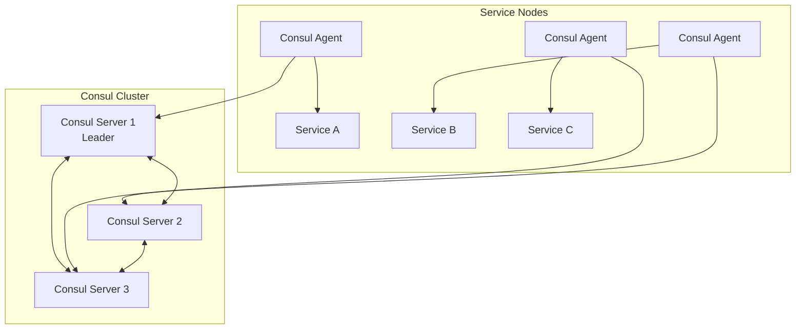

# How to Set Up Consul for Service Discovery

Author: [nawazdhandala](https://www.github.com/nawazdhandala)

Tags: Consul, Service Discovery, HashiCorp, Microservices, DevOps

Description: A comprehensive guide to setting up HashiCorp Consul for service discovery, including installation, configuration, service registration, and querying services in distributed systems.

---

Service discovery is a fundamental requirement in modern microservices architectures. As services scale dynamically and IP addresses change frequently, hardcoding service locations becomes impractical. HashiCorp Consul provides a robust solution for service discovery, health checking, and distributed configuration.

## What is Consul?

Consul is a distributed, highly available system that provides service discovery, configuration, and segmentation functionality. It enables services to discover each other, provides health checking, and offers a distributed key-value store for dynamic configuration.



## 1. Install Consul

Download and install Consul on your servers. The installation is straightforward as Consul ships as a single binary.

```bash
# Download Consul (Linux)
curl -fsSL https://releases.hashicorp.com/consul/1.17.0/consul_1.17.0_linux_amd64.zip -o consul.zip

# Extract and install
unzip consul.zip
sudo mv consul /usr/local/bin/
chmod +x /usr/local/bin/consul

# Verify installation
consul version
```

For production environments, create a dedicated user and directories:

```bash
# Create consul user and group
sudo useradd --system --home /etc/consul.d --shell /bin/false consul

# Create directories
sudo mkdir -p /opt/consul/data
sudo mkdir -p /etc/consul.d
sudo chown -R consul:consul /opt/consul /etc/consul.d
```

## 2. Configure Consul Server

Create a server configuration file that defines the cluster settings, datacenter, and bootstrap expectations.

`/etc/consul.d/server.hcl`

```hcl
# Datacenter name - all nodes in the same DC should use the same name
datacenter = "dc1"

# Data directory for persisting state
data_dir = "/opt/consul/data"

# Enable server mode
server = true

# Number of servers expected in the cluster (for bootstrapping)
bootstrap_expect = 3

# Bind address - use the private IP of this node
bind_addr = "10.0.1.10"

# Client address - allow connections from any interface
client_addr = "0.0.0.0"

# Encrypt gossip traffic with a shared key
encrypt = "your-gossip-encryption-key"

# Enable the UI
ui_config {
  enabled = true
}

# Retry joining other servers
retry_join = ["10.0.1.10", "10.0.1.11", "10.0.1.12"]

# Performance tuning for production
performance {
  raft_multiplier = 1
}

# Enable ACL for security (recommended for production)
acl {
  enabled = true
  default_policy = "deny"
  enable_token_persistence = true
}
```

Generate the gossip encryption key:

```bash
# Generate a new encryption key
consul keygen
# Output: pUqJrVyVRj5jsiYEkM/tFQYfWyJIv4s3XkvDwy7Cu5s=
```

## 3. Configure Consul Client Agent

Client agents run on every node where services are deployed. They communicate with servers and manage local service registration.

`/etc/consul.d/client.hcl`

```hcl
datacenter = "dc1"
data_dir = "/opt/consul/data"

# Client mode (not a server)
server = false

# Bind to the node's private IP
bind_addr = "10.0.2.10"

# Allow local connections
client_addr = "127.0.0.1"

# Match the server encryption key
encrypt = "your-gossip-encryption-key"

# Join the Consul servers
retry_join = ["10.0.1.10", "10.0.1.11", "10.0.1.12"]

# Enable local script checks
enable_local_script_checks = true
```

## 4. Create Systemd Service

Create a systemd unit file to manage the Consul service lifecycle.

`/etc/systemd/system/consul.service`

```ini
[Unit]
Description=HashiCorp Consul
Documentation=https://www.consul.io/docs
Requires=network-online.target
After=network-online.target

[Service]
Type=notify
User=consul
Group=consul
ExecStart=/usr/local/bin/consul agent -config-dir=/etc/consul.d/
ExecReload=/bin/kill -HUP $MAINPID
KillMode=process
KillSignal=SIGTERM
Restart=on-failure
RestartSec=5
LimitNOFILE=65536

[Install]
WantedBy=multi-user.target
```

Start and enable Consul:

```bash
sudo systemctl daemon-reload
sudo systemctl enable consul
sudo systemctl start consul

# Check status
consul members
```

## 5. Register Services

Services can be registered either through configuration files or the HTTP API. Configuration files provide declarative service definitions.

`/etc/consul.d/services/api-service.hcl`

```hcl
service {
  name = "api"
  id   = "api-1"
  port = 8080

  tags = ["v1", "primary"]

  meta {
    version = "1.2.0"
    environment = "production"
  }

  # Health check configuration
  check {
    id       = "api-health"
    name     = "API Health Check"
    http     = "http://localhost:8080/health"
    interval = "10s"
    timeout  = "3s"
  }
}
```

Register via HTTP API for dynamic registration:

```bash
# Register a service via API
curl --request PUT \
  --data '{
    "ID": "web-1",
    "Name": "web",
    "Port": 3000,
    "Tags": ["frontend", "v2"],
    "Check": {
      "HTTP": "http://localhost:3000/health",
      "Interval": "10s"
    }
  }' \
  http://localhost:8500/v1/agent/service/register
```

## 6. Query Services

Consul provides multiple ways to discover services - DNS interface, HTTP API, and the catalog.

```bash
# Query via DNS (built-in DNS server on port 8600)
dig @127.0.0.1 -p 8600 api.service.consul

# Query via HTTP API - get all healthy instances
curl http://localhost:8500/v1/health/service/api?passing

# Query catalog for all services
curl http://localhost:8500/v1/catalog/services

# Get specific service details
curl http://localhost:8500/v1/catalog/service/api
```

## 7. Service Discovery in Applications

Integrate Consul service discovery in your applications using the HTTP API or DNS.

**Python Example:**

```python
import consul
import random

class ServiceDiscovery:
    def __init__(self, consul_host='localhost', consul_port=8500):
        self.consul = consul.Consul(host=consul_host, port=consul_port)

    def get_service_address(self, service_name):
        """Get a healthy service instance address."""
        index, services = self.consul.health.service(
            service_name,
            passing=True  # Only return healthy instances
        )

        if not services:
            raise Exception(f"No healthy instances of {service_name}")

        # Simple round-robin load balancing
        service = random.choice(services)
        address = service['Service']['Address'] or service['Node']['Address']
        port = service['Service']['Port']

        return f"{address}:{port}"

    def register_service(self, name, port, health_endpoint):
        """Register this service with Consul."""
        self.consul.agent.service.register(
            name=name,
            service_id=f"{name}-{port}",
            port=port,
            check=consul.Check.http(
                f"http://localhost:{port}{health_endpoint}",
                interval="10s",
                timeout="5s"
            )
        )

# Usage
discovery = ServiceDiscovery()
api_address = discovery.get_service_address('api')
print(f"Connecting to API at: {api_address}")
```

**Go Example:**

```go
package main

import (
    "fmt"
    "log"
    "math/rand"

    "github.com/hashicorp/consul/api"
)

func getServiceAddress(serviceName string) (string, error) {
    config := api.DefaultConfig()
    client, err := api.NewClient(config)
    if err != nil {
        return "", err
    }

    // Query healthy services
    services, _, err := client.Health().Service(serviceName, "", true, nil)
    if err != nil {
        return "", err
    }

    if len(services) == 0 {
        return "", fmt.Errorf("no healthy instances of %s", serviceName)
    }

    // Random selection for load balancing
    service := services[rand.Intn(len(services))]
    address := service.Service.Address
    if address == "" {
        address = service.Node.Address
    }

    return fmt.Sprintf("%s:%d", address, service.Service.Port), nil
}

func main() {
    addr, err := getServiceAddress("api")
    if err != nil {
        log.Fatal(err)
    }
    fmt.Printf("API address: %s\n", addr)
}
```

## 8. Configure DNS Forwarding

To use Consul's DNS interface seamlessly, configure your system's DNS to forward `.consul` domain queries to Consul.

For systemd-resolved:

```bash
# /etc/systemd/resolved.conf.d/consul.conf
[Resolve]
DNS=127.0.0.1:8600
Domains=~consul
```

For dnsmasq:

```bash
# /etc/dnsmasq.d/consul
server=/consul/127.0.0.1#8600
```

## 9. Monitor Cluster Health

Verify your Consul cluster is operating correctly:

```bash
# Check cluster members
consul members

# View server status and leader
consul operator raft list-peers

# Check service health
consul catalog services

# View detailed node info
consul info
```

## Best Practices

1. **Use odd numbers of servers** - Deploy 3 or 5 Consul servers for proper quorum
2. **Enable encryption** - Always use gossip encryption and TLS for production
3. **Implement health checks** - Define appropriate health checks for all services
4. **Use ACLs** - Enable ACLs to control access to the Consul API
5. **Monitor Consul** - Set up alerting for Consul cluster health

---

Consul provides a solid foundation for service discovery in distributed systems. With proper configuration of servers, clients, and service registrations, your microservices can dynamically discover and communicate with each other reliably.
