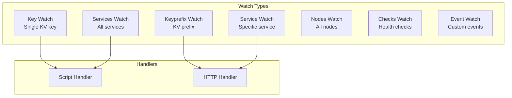

# How to Configure Consul Watches

Author: [nawazdhandala](https://www.github.com/nawazdhandala)

Tags: Consul, Watches, Service Discovery, Events, HashiCorp

Description: Learn how to use Consul watches to react to changes in services, keys, nodes, and other Consul data, with practical examples for automation and integration.

---

Consul watches provide a way to monitor for changes in Consul data and trigger handlers when changes occur. They enable reactive architectures where configuration changes, service health updates, or key-value modifications automatically trigger downstream actions like reloading services or updating load balancers.

## Watch Types

Consul supports various watch types for different data sources.



## 1. Configure Watches in Consul

Add watch configurations to your Consul agent.

`/etc/consul.d/watches.hcl`

```hcl
# Watch for service health changes
watches = [
  {
    type = "service"
    service = "api"
    args = ["/opt/scripts/on-api-change.sh"]
  },
  {
    type = "key"
    key = "config/api/settings"
    args = ["/opt/scripts/on-config-change.sh"]
  },
  {
    type = "keyprefix"
    prefix = "config/shared/"
    args = ["/opt/scripts/on-shared-config-change.sh"]
  },
  {
    type = "services"
    args = ["/opt/scripts/on-services-change.sh"]
  },
  {
    type = "checks"
    state = "critical"
    args = ["/opt/scripts/on-critical-check.sh"]
  },
  {
    type = "nodes"
    args = ["/opt/scripts/on-nodes-change.sh"]
  },
  {
    type = "event"
    name = "deploy"
    args = ["/opt/scripts/on-deploy-event.sh"]
  }
]
```

## 2. Service Watch Handler

React to service instance changes - useful for updating load balancer configurations.

**on-api-change.sh:**

```bash
#!/bin/bash

# Input is JSON array of service instances piped to stdin
# Read the JSON input
INPUT=$(cat)

# Log the change
echo "$(date): API service changed" >> /var/log/consul-watch.log
echo "$INPUT" | jq '.' >> /var/log/consul-watch.log

# Parse healthy instances
HEALTHY_INSTANCES=$(echo "$INPUT" | jq -r '[.[] | select(.Checks | all(.Status == "passing"))] | length')
echo "Healthy instances: $HEALTHY_INSTANCES"

# Update nginx upstream configuration
UPSTREAM_FILE="/etc/nginx/conf.d/api-upstream.conf"

echo "upstream api {" > "$UPSTREAM_FILE"

echo "$INPUT" | jq -r '.[] | select(.Checks | all(.Status == "passing")) | "\(.Service.Address):\(.Service.Port)"' | while read addr; do
    echo "    server $addr;" >> "$UPSTREAM_FILE"
done

echo "}" >> "$UPSTREAM_FILE"

# Reload nginx
nginx -t && systemctl reload nginx

# Alert if no healthy instances
if [ "$HEALTHY_INSTANCES" -eq 0 ]; then
    curl -X POST "https://hooks.slack.com/services/xxx/yyy/zzz" \
        -H 'Content-Type: application/json' \
        -d '{"text":"WARNING: No healthy API instances!"}'
fi
```

## 3. Key Watch Handler

React to configuration key changes.

**on-config-change.sh:**

```bash
#!/bin/bash

# Input is the key-value data in JSON format
INPUT=$(cat)

# Extract value (base64 decoded)
VALUE=$(echo "$INPUT" | jq -r '.Value' | base64 -d)
KEY=$(echo "$INPUT" | jq -r '.Key')

echo "$(date): Key $KEY changed" >> /var/log/consul-watch.log

# Write config to file
echo "$VALUE" > /etc/api/settings.json

# Reload the API service
systemctl reload api-service

# Notify
echo "Configuration updated: $KEY" | logger -t consul-watch
```

## 4. HTTP Handler

Send watch data to an HTTP endpoint instead of running scripts.

```hcl
watches = [
  {
    type = "service"
    service = "api"
    handler_type = "http"
    http_handler_config {
      path = "http://localhost:8080/webhook/service-change"
      method = "POST"
      header {
        Authorization = ["Bearer webhook-token"]
      }
      timeout = "10s"
      tls_skip_verify = false
    }
  }
]
```

**Webhook handler in Python:**

```python
from flask import Flask, request, jsonify
import json
import subprocess

app = Flask(__name__)

@app.route('/webhook/service-change', methods=['POST'])
def handle_service_change():
    """Handle service change webhook from Consul watch."""
    auth = request.headers.get('Authorization')
    if auth != 'Bearer webhook-token':
        return jsonify({'error': 'Unauthorized'}), 401

    services = request.json

    # Count healthy instances
    healthy = [s for s in services
               if all(c['Status'] == 'passing' for c in s.get('Checks', []))]

    print(f"Service update: {len(healthy)}/{len(services)} healthy instances")

    # Update configuration based on healthy instances
    update_load_balancer(healthy)

    return jsonify({'status': 'ok', 'healthy_count': len(healthy)})

def update_load_balancer(instances):
    """Update load balancer with healthy instances."""
    addresses = [f"{i['Service']['Address']}:{i['Service']['Port']}"
                 for i in instances]

    # Example: Update HAProxy via socket
    for addr in addresses:
        # Add server to backend
        pass

if __name__ == '__main__':
    app.run(host='0.0.0.0', port=8080)
```

## 5. Run Watches via CLI

Run watches independently of the Consul agent.

```bash
# Watch a service
consul watch -type=service -service=api /opt/scripts/handler.sh

# Watch a key
consul watch -type=key -key=config/api/settings /opt/scripts/handler.sh

# Watch key prefix
consul watch -type=keyprefix -prefix=config/ /opt/scripts/handler.sh

# Watch all services
consul watch -type=services /opt/scripts/handler.sh

# Watch critical checks
consul watch -type=checks -state=critical /opt/scripts/handler.sh

# Watch with token
consul watch -type=service -service=api -token="my-acl-token" /opt/scripts/handler.sh
```

## 6. Programmatic Watches

Implement watches in your application code for more control.

**Python Implementation:**

```python
import consul
import json
import threading
import time
from typing import Callable, Any

class ConsulWatcher:
    def __init__(self, consul_host='localhost', consul_port=8500):
        self.consul = consul.Consul(host=consul_host, port=consul_port)
        self._watches = []
        self._stop = False

    def watch_service(self, service_name: str, callback: Callable, passing_only: bool = True):
        """Watch a service for changes."""
        def watcher():
            index = None
            while not self._stop:
                try:
                    index, services = self.consul.health.service(
                        service_name,
                        passing=passing_only,
                        index=index,
                        wait='30s'
                    )
                    callback(service_name, services)
                except Exception as e:
                    print(f"Watch error: {e}")
                    time.sleep(5)

        thread = threading.Thread(target=watcher, daemon=True)
        thread.start()
        self._watches.append(thread)

    def watch_key(self, key: str, callback: Callable):
        """Watch a key for changes."""
        def watcher():
            index = None
            while not self._stop:
                try:
                    index, data = self.consul.kv.get(key, index=index, wait='30s')
                    if data:
                        value = data['Value'].decode('utf-8') if data['Value'] else None
                        callback(key, value, data)
                except Exception as e:
                    print(f"Watch error: {e}")
                    time.sleep(5)

        thread = threading.Thread(target=watcher, daemon=True)
        thread.start()
        self._watches.append(thread)

    def watch_prefix(self, prefix: str, callback: Callable):
        """Watch a key prefix for changes."""
        def watcher():
            index = None
            while not self._stop:
                try:
                    index, data = self.consul.kv.get(
                        prefix,
                        recurse=True,
                        index=index,
                        wait='30s'
                    )
                    if data:
                        callback(prefix, data)
                except Exception as e:
                    print(f"Watch error: {e}")
                    time.sleep(5)

        thread = threading.Thread(target=watcher, daemon=True)
        thread.start()
        self._watches.append(thread)

    def watch_checks(self, state: str, callback: Callable):
        """Watch health checks by state."""
        def watcher():
            index = None
            while not self._stop:
                try:
                    index, checks = self.consul.health.state(
                        state,
                        index=index,
                        wait='30s'
                    )
                    callback(state, checks)
                except Exception as e:
                    print(f"Watch error: {e}")
                    time.sleep(5)

        thread = threading.Thread(target=watcher, daemon=True)
        thread.start()
        self._watches.append(thread)

    def stop(self):
        """Stop all watches."""
        self._stop = True
        for thread in self._watches:
            thread.join(timeout=5)

# Usage
def on_service_change(service_name, instances):
    healthy = [i for i in instances]
    print(f"Service {service_name}: {len(healthy)} healthy instances")
    for inst in healthy:
        addr = inst['Service']['Address']
        port = inst['Service']['Port']
        print(f"  - {addr}:{port}")

def on_config_change(key, value, metadata):
    print(f"Config changed: {key} = {value}")

def on_critical_check(state, checks):
    if checks:
        print(f"ALERT: {len(checks)} critical checks!")
        for check in checks:
            print(f"  - {check['ServiceName']}: {check['Output']}")

watcher = ConsulWatcher()
watcher.watch_service('api', on_service_change)
watcher.watch_key('config/api/settings', on_config_change)
watcher.watch_checks('critical', on_critical_check)

# Keep running
try:
    while True:
        time.sleep(1)
except KeyboardInterrupt:
    watcher.stop()
```

**Go Implementation:**

```go
package main

import (
    "encoding/json"
    "fmt"
    "log"
    "time"

    "github.com/hashicorp/consul/api"
)

type ConsulWatcher struct {
    client *api.Client
    stopCh chan struct{}
}

func NewConsulWatcher() (*ConsulWatcher, error) {
    client, err := api.NewClient(api.DefaultConfig())
    if err != nil {
        return nil, err
    }
    return &ConsulWatcher{
        client: client,
        stopCh: make(chan struct{}),
    }, nil
}

func (w *ConsulWatcher) WatchService(serviceName string, callback func([]*api.ServiceEntry)) {
    go func() {
        var lastIndex uint64
        for {
            select {
            case <-w.stopCh:
                return
            default:
            }

            services, meta, err := w.client.Health().Service(
                serviceName, "", true,
                &api.QueryOptions{
                    WaitIndex: lastIndex,
                    WaitTime:  30 * time.Second,
                },
            )
            if err != nil {
                log.Printf("Watch error: %v", err)
                time.Sleep(5 * time.Second)
                continue
            }

            if meta.LastIndex != lastIndex {
                lastIndex = meta.LastIndex
                callback(services)
            }
        }
    }()
}

func (w *ConsulWatcher) WatchKey(key string, callback func(string, []byte)) {
    go func() {
        var lastIndex uint64
        for {
            select {
            case <-w.stopCh:
                return
            default:
            }

            pair, meta, err := w.client.KV().Get(key, &api.QueryOptions{
                WaitIndex: lastIndex,
                WaitTime:  30 * time.Second,
            })
            if err != nil {
                log.Printf("Watch error: %v", err)
                time.Sleep(5 * time.Second)
                continue
            }

            if meta.LastIndex != lastIndex {
                lastIndex = meta.LastIndex
                if pair != nil {
                    callback(key, pair.Value)
                }
            }
        }
    }()
}

func (w *ConsulWatcher) Stop() {
    close(w.stopCh)
}

func main() {
    watcher, err := NewConsulWatcher()
    if err != nil {
        log.Fatal(err)
    }

    watcher.WatchService("api", func(services []*api.ServiceEntry) {
        fmt.Printf("API service updated: %d instances\n", len(services))
        for _, svc := range services {
            fmt.Printf("  - %s:%d\n", svc.Service.Address, svc.Service.Port)
        }
    })

    watcher.WatchKey("config/api/settings", func(key string, value []byte) {
        fmt.Printf("Config changed: %s = %s\n", key, string(value))
    })

    select {}
}
```

## 7. Event-Based Watches

Fire custom events and watch for them.

```bash
# Fire a custom event
consul event -name=deploy -payload='{"version": "1.2.0", "env": "production"}'

# Watch for deploy events
consul watch -type=event -name=deploy /opt/scripts/on-deploy.sh
```

**on-deploy.sh:**

```bash
#!/bin/bash

INPUT=$(cat)

# Parse event data
PAYLOAD=$(echo "$INPUT" | jq -r '.[0].Payload' | base64 -d)
VERSION=$(echo "$PAYLOAD" | jq -r '.version')
ENV=$(echo "$PAYLOAD" | jq -r '.env')

echo "Deploying version $VERSION to $ENV"

# Run deployment script
/opt/scripts/deploy.sh "$VERSION" "$ENV"
```

## Best Practices

1. **Use blocking queries** - Efficient long-polling instead of frequent polling
2. **Handle errors gracefully** - Retry on failures with backoff
3. **Keep handlers fast** - Avoid long-running operations in watch handlers
4. **Log watch activity** - Track changes for debugging and auditing
5. **Use ACL tokens** - Secure watch access to sensitive data
6. **Test handler scripts** - Ensure scripts handle all edge cases

---

Consul watches enable reactive infrastructure that responds automatically to changes in your service mesh. By combining watches with appropriate handlers, you can build self-healing systems that adapt to service health changes, configuration updates, and custom events.
