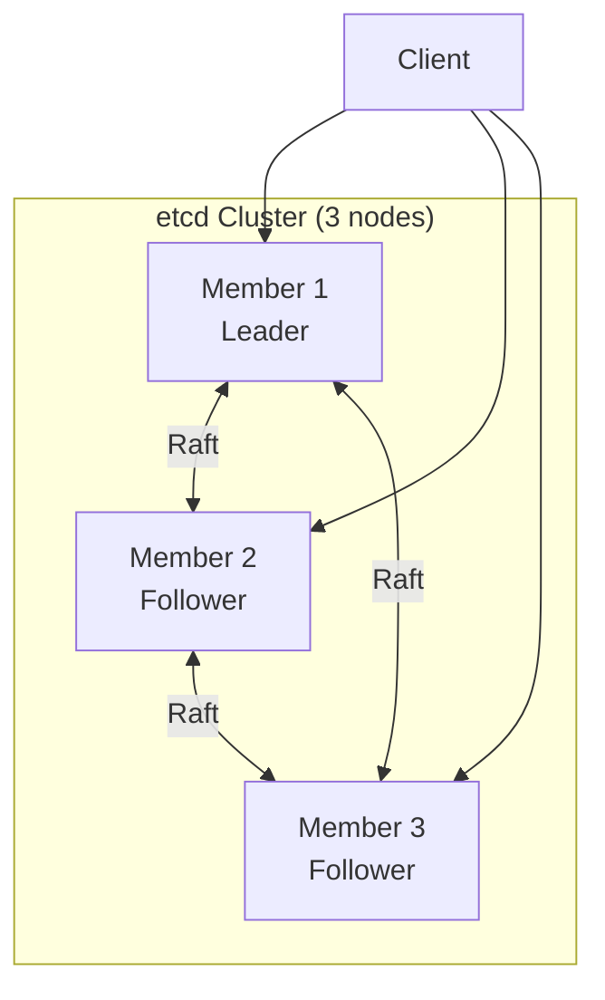

# How to Implement etcd Cluster Management

Author: [nawazdhandala](https://www.github.com/nawazdhandala)

Tags: etcd, Cluster Management, Distributed Systems, Kubernetes, High Availability

Description: Learn how to manage etcd clusters including member operations, backup and restore, monitoring, maintenance tasks, and disaster recovery procedures.

---

etcd is the critical data store for Kubernetes and many distributed systems. Proper cluster management ensures data durability, high availability, and optimal performance. This guide covers essential etcd cluster operations from member management to disaster recovery.

## Cluster Architecture

An etcd cluster requires a majority (quorum) of nodes to be operational. For a 3-node cluster, 2 nodes must be healthy; for a 5-node cluster, 3 nodes.



## 1. Basic Cluster Operations

Set up environment variables for common operations:

```bash
# Set etcdctl environment
export ETCDCTL_API=3
export ETCDCTL_ENDPOINTS=https://10.0.1.10:2379,https://10.0.1.11:2379,https://10.0.1.12:2379
export ETCDCTL_CACERT=/etc/etcd/pki/ca.crt
export ETCDCTL_CERT=/etc/etcd/pki/client.crt
export ETCDCTL_KEY=/etc/etcd/pki/client.key
```

Check cluster health:

```bash
# Check endpoint health
etcdctl endpoint health

# Check endpoint status
etcdctl endpoint status --write-out=table

# List members
etcdctl member list --write-out=table
```

## 2. Add a New Member

Adding a new member to an existing cluster.

```bash
# Step 1: Add member to cluster (run on existing member)
etcdctl member add etcd4 --peer-urls=https://10.0.1.13:2380

# Output shows environment variables for new member:
# ETCD_NAME="etcd4"
# ETCD_INITIAL_CLUSTER="etcd1=https://10.0.1.10:2380,etcd2=https://10.0.1.11:2380,etcd3=https://10.0.1.12:2380,etcd4=https://10.0.1.13:2380"
# ETCD_INITIAL_CLUSTER_STATE="existing"
```

Configure the new member:

`/etc/etcd/etcd.conf.yaml` (on new node):

```yaml
name: etcd4
data-dir: /var/lib/etcd

listen-client-urls: https://10.0.1.13:2379,https://127.0.0.1:2379
advertise-client-urls: https://10.0.1.13:2379

listen-peer-urls: https://10.0.1.13:2380
initial-advertise-peer-urls: https://10.0.1.13:2380

# CRITICAL: Set to "existing" for joining existing cluster
initial-cluster-state: existing

initial-cluster: etcd1=https://10.0.1.10:2380,etcd2=https://10.0.1.11:2380,etcd3=https://10.0.1.12:2380,etcd4=https://10.0.1.13:2380

client-transport-security:
  cert-file: /etc/etcd/pki/server.crt
  key-file: /etc/etcd/pki/server.key
  client-cert-auth: true
  trusted-ca-file: /etc/etcd/pki/ca.crt

peer-transport-security:
  cert-file: /etc/etcd/pki/peer.crt
  key-file: /etc/etcd/pki/peer.key
  client-cert-auth: true
  trusted-ca-file: /etc/etcd/pki/ca.crt
```

Start the new member:

```bash
systemctl start etcd
etcdctl member list --write-out=table
```

## 3. Remove a Member

Remove a failed or decommissioned member.

```bash
# Get member ID
etcdctl member list

# Remove member
etcdctl member remove <member-id>

# Example
etcdctl member remove 8e9e05c52164694d

# Verify
etcdctl member list
```

## 4. Backup and Restore

Create regular backups of etcd data.

**Create Snapshot:**

```bash
# Create snapshot
etcdctl snapshot save /backup/etcd-$(date +%Y%m%d-%H%M%S).db

# Verify snapshot
etcdctl snapshot status /backup/etcd-20240115-100000.db --write-out=table
```

**Automated Backup Script:**

```bash
#!/bin/bash
# etcd-backup.sh

BACKUP_DIR="/backup/etcd"
RETENTION_DAYS=7
TIMESTAMP=$(date +%Y%m%d-%H%M%S)
BACKUP_FILE="${BACKUP_DIR}/etcd-snapshot-${TIMESTAMP}.db"

# Create backup directory
mkdir -p "$BACKUP_DIR"

# Create snapshot
etcdctl snapshot save "$BACKUP_FILE"

# Verify snapshot
if etcdctl snapshot status "$BACKUP_FILE" > /dev/null 2>&1; then
    echo "Backup successful: $BACKUP_FILE"

    # Compress backup
    gzip "$BACKUP_FILE"

    # Remove old backups
    find "$BACKUP_DIR" -name "etcd-snapshot-*.db.gz" -mtime +$RETENTION_DAYS -delete
else
    echo "Backup failed!"
    rm -f "$BACKUP_FILE"
    exit 1
fi
```

**Restore from Snapshot:**

```bash
# Stop etcd on all members
systemctl stop etcd

# Restore on each member with unique data directories
# Member 1
etcdctl snapshot restore /backup/etcd-snapshot.db \
  --name etcd1 \
  --initial-cluster etcd1=https://10.0.1.10:2380,etcd2=https://10.0.1.11:2380,etcd3=https://10.0.1.12:2380 \
  --initial-cluster-token etcd-cluster-restored \
  --initial-advertise-peer-urls https://10.0.1.10:2380 \
  --data-dir /var/lib/etcd-restored

# Member 2
etcdctl snapshot restore /backup/etcd-snapshot.db \
  --name etcd2 \
  --initial-cluster etcd1=https://10.0.1.10:2380,etcd2=https://10.0.1.11:2380,etcd3=https://10.0.1.12:2380 \
  --initial-cluster-token etcd-cluster-restored \
  --initial-advertise-peer-urls https://10.0.1.11:2380 \
  --data-dir /var/lib/etcd-restored

# Member 3
etcdctl snapshot restore /backup/etcd-snapshot.db \
  --name etcd3 \
  --initial-cluster etcd1=https://10.0.1.10:2380,etcd2=https://10.0.1.11:2380,etcd3=https://10.0.1.12:2380 \
  --initial-cluster-token etcd-cluster-restored \
  --initial-advertise-peer-urls https://10.0.1.12:2380 \
  --data-dir /var/lib/etcd-restored

# Update data-dir in etcd config and start
mv /var/lib/etcd /var/lib/etcd-old
mv /var/lib/etcd-restored /var/lib/etcd
systemctl start etcd
```

## 5. Defragmentation

Reclaim disk space from deleted keys.

```bash
# Check current database size
etcdctl endpoint status --write-out=table

# Defragment single endpoint
etcdctl defrag --endpoints=https://10.0.1.10:2379

# Defragment entire cluster
etcdctl defrag --cluster

# Verify space reclaimed
etcdctl endpoint status --write-out=table
```

**Automated Defragmentation Script:**

```bash
#!/bin/bash
# etcd-defrag.sh

# Defrag each member one at a time to avoid quorum issues
ENDPOINTS=("https://10.0.1.10:2379" "https://10.0.1.11:2379" "https://10.0.1.12:2379")

for endpoint in "${ENDPOINTS[@]}"; do
    echo "Defragmenting $endpoint..."
    etcdctl defrag --endpoints="$endpoint"

    # Wait for member to recover
    sleep 10

    # Verify health
    if ! etcdctl endpoint health --endpoints="$endpoint"; then
        echo "Warning: $endpoint unhealthy after defrag"
        exit 1
    fi
done

echo "Defragmentation complete"
```

## 6. Compaction

Remove old revisions to control database size.

```bash
# Get current revision
REVISION=$(etcdctl endpoint status --write-out=json | jq -r '.[0].Status.header.revision')

# Compact up to current revision
etcdctl compact $REVISION

# Enable auto compaction in etcd config
# --auto-compaction-retention=1h
# or
# --auto-compaction-mode=revision --auto-compaction-retention=1000
```

## 7. Monitoring etcd

Set up comprehensive monitoring.

**Prometheus Metrics:**

```yaml
# prometheus.yml
scrape_configs:
  - job_name: 'etcd'
    scheme: https
    tls_config:
      ca_file: /etc/prometheus/etcd-ca.crt
      cert_file: /etc/prometheus/etcd-client.crt
      key_file: /etc/prometheus/etcd-client.key
    static_configs:
      - targets:
        - 10.0.1.10:2379
        - 10.0.1.11:2379
        - 10.0.1.12:2379
```

**Key Metrics to Monitor:**

```python
# Python monitoring script
import requests
import json

class EtcdMonitor:
    def __init__(self, endpoints, cert=None, key=None, ca=None):
        self.endpoints = endpoints
        self.cert = (cert, key) if cert and key else None
        self.verify = ca if ca else True

    def get_metrics(self, endpoint):
        """Fetch Prometheus metrics from etcd."""
        url = f"{endpoint}/metrics"
        resp = requests.get(url, cert=self.cert, verify=self.verify)
        return resp.text

    def check_health(self, endpoint):
        """Check endpoint health."""
        url = f"{endpoint}/health"
        try:
            resp = requests.get(url, cert=self.cert, verify=self.verify, timeout=5)
            return resp.json().get('health') == 'true'
        except Exception:
            return False

    def get_leader(self):
        """Find the current leader."""
        for endpoint in self.endpoints:
            try:
                url = f"{endpoint}/v3/maintenance/status"
                resp = requests.post(url, cert=self.cert, verify=self.verify)
                data = resp.json()
                if data.get('leader') == data.get('header', {}).get('member_id'):
                    return endpoint
            except Exception:
                continue
        return None

    def get_cluster_status(self):
        """Get overall cluster status."""
        status = {
            'healthy_members': 0,
            'total_members': len(self.endpoints),
            'leader': None,
            'db_size_bytes': 0
        }

        for endpoint in self.endpoints:
            if self.check_health(endpoint):
                status['healthy_members'] += 1

        status['leader'] = self.get_leader()
        return status

# Usage
monitor = EtcdMonitor(
    endpoints=['https://10.0.1.10:2379', 'https://10.0.1.11:2379', 'https://10.0.1.12:2379'],
    cert='/etc/etcd/pki/client.crt',
    key='/etc/etcd/pki/client.key',
    ca='/etc/etcd/pki/ca.crt'
)

status = monitor.get_cluster_status()
print(f"Healthy: {status['healthy_members']}/{status['total_members']}")
print(f"Leader: {status['leader']}")
```

**Alerting Rules:**

```yaml
# etcd-alerts.yml
groups:
  - name: etcd
    rules:
      - alert: EtcdMemberDown
        expr: up{job="etcd"} == 0
        for: 5m
        labels:
          severity: critical
        annotations:
          summary: "etcd member {{ $labels.instance }} is down"

      - alert: EtcdNoLeader
        expr: etcd_server_has_leader == 0
        for: 1m
        labels:
          severity: critical
        annotations:
          summary: "etcd cluster has no leader"

      - alert: EtcdHighDiskUsage
        expr: etcd_mvcc_db_total_size_in_bytes > 8000000000
        for: 10m
        labels:
          severity: warning
        annotations:
          summary: "etcd database size is high ({{ $value | humanize }})"

      - alert: EtcdHighFsyncDuration
        expr: histogram_quantile(0.99, rate(etcd_disk_wal_fsync_duration_seconds_bucket[5m])) > 0.5
        for: 5m
        labels:
          severity: warning
        annotations:
          summary: "etcd fsync latency is high"

      - alert: EtcdHighCommitDuration
        expr: histogram_quantile(0.99, rate(etcd_disk_backend_commit_duration_seconds_bucket[5m])) > 0.25
        for: 5m
        labels:
          severity: warning
        annotations:
          summary: "etcd commit latency is high"
```

## 8. Disaster Recovery

Handle catastrophic failures.

**Single Member Failure:**

```bash
# Remove failed member
etcdctl member remove <failed-member-id>

# Add replacement member
etcdctl member add etcd-new --peer-urls=https://10.0.1.14:2380

# Start new member with existing cluster state
```

**Quorum Loss Recovery:**

```bash
# If you lose quorum (e.g., 2 of 3 members), you need to restore from backup

# On surviving member, if any - take snapshot first
etcdctl snapshot save /backup/emergency-snapshot.db

# Restore cluster from snapshot on new/rebuilt nodes
# See backup/restore section above
```

**Force New Cluster from Single Member:**

```bash
# DANGER: Only use when all other members are permanently lost

# Stop etcd
systemctl stop etcd

# Edit config to force new cluster
# Add: --force-new-cluster

# Start etcd
systemctl start etcd

# Verify
etcdctl member list

# Remove the flag and restart
# Remove: --force-new-cluster
systemctl restart etcd
```

## Best Practices

1. **Use odd number of members** - 3 or 5 members for proper quorum
2. **Regular backups** - Automated daily backups with verification
3. **Monitor disk latency** - etcd is sensitive to slow disks
4. **Separate disks** - Use dedicated SSD for etcd data
5. **Regular compaction** - Prevent unbounded database growth
6. **Test recovery** - Regularly practice restore procedures
7. **Version control configs** - Track all configuration changes

---

Proper etcd cluster management is essential for the reliability of systems that depend on it, especially Kubernetes. Regular maintenance tasks like backup, compaction, and defragmentation combined with comprehensive monitoring ensure your etcd cluster remains healthy and recoverable.
