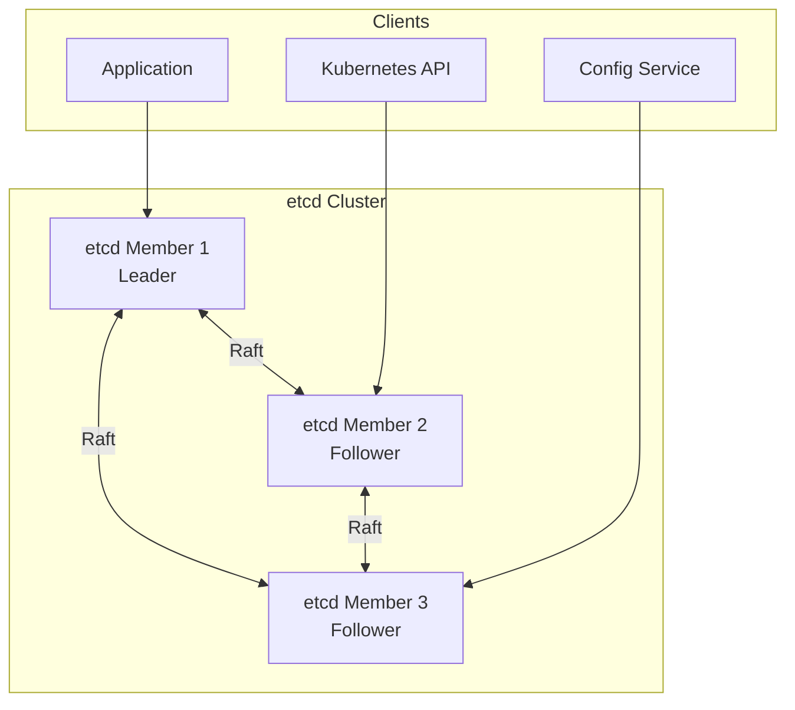

# How to Implement etcd for Distributed Configuration

Author: [nawazdhandala](https://www.github.com/nawazdhandala)

Tags: etcd, Distributed Systems, Configuration Management, Kubernetes, DevOps

Description: A comprehensive guide to using etcd for distributed configuration management, including cluster setup, key-value operations, watches, and integration patterns for microservices.

---

etcd is a distributed, reliable key-value store designed for shared configuration and service discovery. It powers Kubernetes and many other distributed systems, providing strong consistency guarantees through the Raft consensus algorithm.

## etcd Architecture

etcd clusters consist of multiple members that elect a leader and replicate data through Raft consensus. Clients can connect to any member for reads, while writes are forwarded to the leader.



## 1. Install etcd

Download and install etcd on your servers:

```bash
# Download etcd
ETCD_VER=v3.5.11
curl -L https://github.com/etcd-io/etcd/releases/download/${ETCD_VER}/etcd-${ETCD_VER}-linux-amd64.tar.gz -o etcd.tar.gz

# Extract and install
tar xzf etcd.tar.gz
sudo mv etcd-${ETCD_VER}-linux-amd64/etcd* /usr/local/bin/

# Verify installation
etcd --version
etcdctl version
```

Create directories and user:

```bash
sudo useradd --system --home /var/lib/etcd --shell /bin/false etcd
sudo mkdir -p /var/lib/etcd
sudo mkdir -p /etc/etcd
sudo chown -R etcd:etcd /var/lib/etcd /etc/etcd
```

## 2. Configure etcd Cluster

Create configuration for a 3-node cluster:

`/etc/etcd/etcd.conf.yaml` (on node 1)

```yaml
name: etcd1
data-dir: /var/lib/etcd

# Client communication
listen-client-urls: https://10.0.1.10:2379,https://127.0.0.1:2379
advertise-client-urls: https://10.0.1.10:2379

# Peer communication
listen-peer-urls: https://10.0.1.10:2380
initial-advertise-peer-urls: https://10.0.1.10:2380

# Cluster configuration
initial-cluster: etcd1=https://10.0.1.10:2380,etcd2=https://10.0.1.11:2380,etcd3=https://10.0.1.12:2380
initial-cluster-token: etcd-cluster-1
initial-cluster-state: new

# TLS certificates
client-transport-security:
  cert-file: /etc/etcd/pki/server.crt
  key-file: /etc/etcd/pki/server.key
  client-cert-auth: true
  trusted-ca-file: /etc/etcd/pki/ca.crt

peer-transport-security:
  cert-file: /etc/etcd/pki/peer.crt
  key-file: /etc/etcd/pki/peer.key
  client-cert-auth: true
  trusted-ca-file: /etc/etcd/pki/ca.crt

# Performance tuning
heartbeat-interval: 100
election-timeout: 1000

# Logging
log-level: info
```

## 3. Generate TLS Certificates

Create certificates for secure communication:

```bash
# Generate CA
openssl genrsa -out ca.key 4096
openssl req -x509 -new -nodes -key ca.key -sha256 -days 3650 \
    -out ca.crt -subj "/CN=etcd-ca"

# Generate server certificate
openssl genrsa -out server.key 2048
cat > server-csr.conf << EOF
[req]
default_bits = 2048
prompt = no
default_md = sha256
distinguished_name = dn
req_extensions = req_ext

[dn]
CN = etcd1

[req_ext]
subjectAltName = @alt_names

[alt_names]
DNS.1 = etcd1
DNS.2 = etcd1.example.com
DNS.3 = localhost
IP.1 = 10.0.1.10
IP.2 = 127.0.0.1
EOF

openssl req -new -key server.key -out server.csr -config server-csr.conf
openssl x509 -req -in server.csr -CA ca.crt -CAkey ca.key \
    -CAcreateserial -out server.crt -days 365 -extensions req_ext \
    -extfile server-csr.conf

# Copy certificates to etcd directory
sudo cp ca.crt server.crt server.key /etc/etcd/pki/
sudo chown -R etcd:etcd /etc/etcd/pki
```

## 4. Create Systemd Service

`/etc/systemd/system/etcd.service`

```ini
[Unit]
Description=etcd distributed key-value store
Documentation=https://etcd.io/docs/
After=network-online.target
Wants=network-online.target

[Service]
Type=notify
User=etcd
Group=etcd
ExecStart=/usr/local/bin/etcd --config-file=/etc/etcd/etcd.conf.yaml
Restart=always
RestartSec=5
LimitNOFILE=65536
TimeoutStartSec=0

[Install]
WantedBy=multi-user.target
```

Start etcd:

```bash
sudo systemctl daemon-reload
sudo systemctl enable etcd
sudo systemctl start etcd

# Check cluster health
etcdctl --endpoints=https://127.0.0.1:2379 \
    --cacert=/etc/etcd/pki/ca.crt \
    --cert=/etc/etcd/pki/server.crt \
    --key=/etc/etcd/pki/server.key \
    endpoint health
```

## 5. Basic Key-Value Operations

Use etcdctl for key-value management:

```bash
# Set environment variables for authentication
export ETCDCTL_ENDPOINTS=https://127.0.0.1:2379
export ETCDCTL_CACERT=/etc/etcd/pki/ca.crt
export ETCDCTL_CERT=/etc/etcd/pki/server.crt
export ETCDCTL_KEY=/etc/etcd/pki/server.key

# Put a key
etcdctl put /config/api/database_url "postgresql://localhost:5432/api"

# Get a key
etcdctl get /config/api/database_url

# Get with prefix (all keys starting with...)
etcdctl get /config/api/ --prefix

# Get only values
etcdctl get /config/api/ --prefix --print-value-only

# Delete a key
etcdctl del /config/api/old_setting

# Delete with prefix
etcdctl del /config/api/deprecated/ --prefix

# List all keys
etcdctl get "" --prefix --keys-only

# Get key with revision history
etcdctl get /config/api/database_url --rev=5
```

## 6. Implement Watches

Watch for configuration changes in real-time:

```bash
# Watch a single key
etcdctl watch /config/api/database_url

# Watch all keys with prefix
etcdctl watch /config/api/ --prefix

# Watch with previous value
etcdctl watch /config/api/ --prefix --prev-kv
```

**Go Implementation:**

```go
package main

import (
    "context"
    "encoding/json"
    "fmt"
    "log"
    "sync"
    "time"

    clientv3 "go.etcd.io/etcd/client/v3"
)

type ConfigStore struct {
    client    *clientv3.Client
    cache     map[string]string
    cacheLock sync.RWMutex
    prefix    string
}

func NewConfigStore(endpoints []string, prefix string) (*ConfigStore, error) {
    client, err := clientv3.New(clientv3.Config{
        Endpoints:   endpoints,
        DialTimeout: 5 * time.Second,
        TLS:         nil, // Configure TLS for production
    })
    if err != nil {
        return nil, err
    }

    return &ConfigStore{
        client: client,
        cache:  make(map[string]string),
        prefix: prefix,
    }, nil
}

func (s *ConfigStore) Put(key, value string) error {
    ctx, cancel := context.WithTimeout(context.Background(), 5*time.Second)
    defer cancel()

    fullKey := s.prefix + key
    _, err := s.client.Put(ctx, fullKey, value)
    if err != nil {
        return err
    }

    s.cacheLock.Lock()
    s.cache[key] = value
    s.cacheLock.Unlock()

    return nil
}

func (s *ConfigStore) Get(key string) (string, error) {
    s.cacheLock.RLock()
    if val, ok := s.cache[key]; ok {
        s.cacheLock.RUnlock()
        return val, nil
    }
    s.cacheLock.RUnlock()

    ctx, cancel := context.WithTimeout(context.Background(), 5*time.Second)
    defer cancel()

    fullKey := s.prefix + key
    resp, err := s.client.Get(ctx, fullKey)
    if err != nil {
        return "", err
    }

    if len(resp.Kvs) == 0 {
        return "", nil
    }

    value := string(resp.Kvs[0].Value)
    s.cacheLock.Lock()
    s.cache[key] = value
    s.cacheLock.Unlock()

    return value, nil
}

func (s *ConfigStore) GetJSON(key string, target interface{}) error {
    value, err := s.Get(key)
    if err != nil {
        return err
    }
    return json.Unmarshal([]byte(value), target)
}

func (s *ConfigStore) Watch(ctx context.Context, callback func(key, value string)) {
    watchChan := s.client.Watch(ctx, s.prefix, clientv3.WithPrefix())

    for watchResp := range watchChan {
        for _, event := range watchResp.Events {
            key := string(event.Kv.Key)[len(s.prefix):]
            value := string(event.Kv.Value)

            s.cacheLock.Lock()
            if event.Type == clientv3.EventTypeDelete {
                delete(s.cache, key)
            } else {
                s.cache[key] = value
            }
            s.cacheLock.Unlock()

            callback(key, value)
        }
    }
}

func (s *ConfigStore) GetAll() (map[string]string, error) {
    ctx, cancel := context.WithTimeout(context.Background(), 10*time.Second)
    defer cancel()

    resp, err := s.client.Get(ctx, s.prefix, clientv3.WithPrefix())
    if err != nil {
        return nil, err
    }

    result := make(map[string]string)
    for _, kv := range resp.Kvs {
        key := string(kv.Key)[len(s.prefix):]
        result[key] = string(kv.Value)
    }

    return result, nil
}

func (s *ConfigStore) Close() {
    s.client.Close()
}

func main() {
    store, err := NewConfigStore([]string{"localhost:2379"}, "/config/api/")
    if err != nil {
        log.Fatal(err)
    }
    defer store.Close()

    // Store configuration
    store.Put("database_url", "postgresql://localhost:5432/api")
    store.Put("settings", `{"max_connections": 100, "timeout": 30}`)

    // Get configuration
    dbURL, _ := store.Get("database_url")
    fmt.Println("Database URL:", dbURL)

    var settings map[string]interface{}
    store.GetJSON("settings", &settings)
    fmt.Println("Settings:", settings)

    // Watch for changes
    ctx, cancel := context.WithCancel(context.Background())
    defer cancel()

    go store.Watch(ctx, func(key, value string) {
        fmt.Printf("Config changed: %s = %s\n", key, value)
    })

    select {}
}
```

**Python Implementation:**

```python
import etcd3
import json
import threading
from typing import Callable, Dict, Optional

class EtcdConfigStore:
    def __init__(self, host='localhost', port=2379, prefix='/config/'):
        self.client = etcd3.client(host=host, port=port)
        self.prefix = prefix
        self.cache: Dict[str, str] = {}
        self.watchers: list = []

    def put(self, key: str, value: str) -> None:
        """Store a configuration value."""
        full_key = self.prefix + key
        self.client.put(full_key, value)
        self.cache[key] = value

    def put_json(self, key: str, data: dict) -> None:
        """Store a JSON configuration value."""
        self.put(key, json.dumps(data))

    def get(self, key: str, default: Optional[str] = None) -> Optional[str]:
        """Get a configuration value."""
        if key in self.cache:
            return self.cache[key]

        full_key = self.prefix + key
        value, _ = self.client.get(full_key)

        if value is None:
            return default

        decoded = value.decode('utf-8')
        self.cache[key] = decoded
        return decoded

    def get_json(self, key: str, default: Optional[dict] = None) -> Optional[dict]:
        """Get a JSON configuration value."""
        value = self.get(key)
        if value is None:
            return default
        return json.loads(value)

    def get_all(self) -> Dict[str, str]:
        """Get all configuration values with prefix."""
        result = {}
        for value, metadata in self.client.get_prefix(self.prefix):
            key = metadata.key.decode('utf-8')[len(self.prefix):]
            result[key] = value.decode('utf-8')
        return result

    def delete(self, key: str) -> bool:
        """Delete a configuration key."""
        full_key = self.prefix + key
        deleted = self.client.delete(full_key)
        if key in self.cache:
            del self.cache[key]
        return deleted

    def watch(self, callback: Callable[[str, str], None]) -> None:
        """Watch for configuration changes."""
        def watch_callback(event):
            for ev in event.events:
                key = ev.key.decode('utf-8')[len(self.prefix):]
                value = ev.value.decode('utf-8') if ev.value else None

                if value:
                    self.cache[key] = value
                elif key in self.cache:
                    del self.cache[key]

                callback(key, value)

        watch_id = self.client.add_watch_prefix_callback(
            self.prefix,
            watch_callback
        )
        self.watchers.append(watch_id)

    def close(self):
        """Close the connection."""
        for watch_id in self.watchers:
            self.client.cancel_watch(watch_id)
        self.client.close()

# Usage
def on_change(key, value):
    print(f"Config changed: {key} = {value}")

store = EtcdConfigStore(prefix='/config/api/')

# Store configuration
store.put('database_url', 'postgresql://localhost:5432/api')
store.put_json('settings', {'max_connections': 100, 'timeout': 30})

# Get configuration
db_url = store.get('database_url')
settings = store.get_json('settings')

# Watch for changes
store.watch(on_change)

# List all configs
all_config = store.get_all()
print("All configuration:", all_config)
```

## 7. Implement Transactions

Use transactions for atomic operations:

```bash
# Conditional put - only if key doesn't exist
etcdctl txn <<EOF
compares:
version("/config/api/lock") = 0

success requests:
put /config/api/lock "acquired"

failure requests:
get /config/api/lock
EOF
```

**Go Transaction Example:**

```go
func (s *ConfigStore) PutIfNotExists(key, value string) (bool, error) {
    ctx, cancel := context.WithTimeout(context.Background(), 5*time.Second)
    defer cancel()

    fullKey := s.prefix + key

    resp, err := s.client.Txn(ctx).
        If(clientv3.Compare(clientv3.Version(fullKey), "=", 0)).
        Then(clientv3.OpPut(fullKey, value)).
        Commit()

    if err != nil {
        return false, err
    }

    return resp.Succeeded, nil
}
```

## 8. Monitor etcd Cluster

Check cluster health and performance:

```bash
# Cluster health
etcdctl endpoint health --cluster

# Cluster status
etcdctl endpoint status --cluster -w table

# Member list
etcdctl member list -w table

# Defragment database
etcdctl defrag --cluster

# Compact revisions (cleanup old data)
etcdctl compact $(etcdctl endpoint status -w json | jq -r '.[0].Status.header.revision')
```

## Best Practices

1. **Use TLS** - Always encrypt client and peer communication
2. **Deploy odd numbers** - Use 3, 5, or 7 members for proper quorum
3. **Separate disks** - Use fast SSDs for etcd data directory
4. **Monitor disk latency** - etcd is sensitive to slow disk I/O
5. **Compact regularly** - Prevent unbounded growth of history
6. **Keep values small** - Default max value size is 1.5MB

---

etcd provides a reliable foundation for distributed configuration management with strong consistency guarantees. Its watch mechanism enables real-time configuration updates, making it ideal for dynamic microservices environments.
