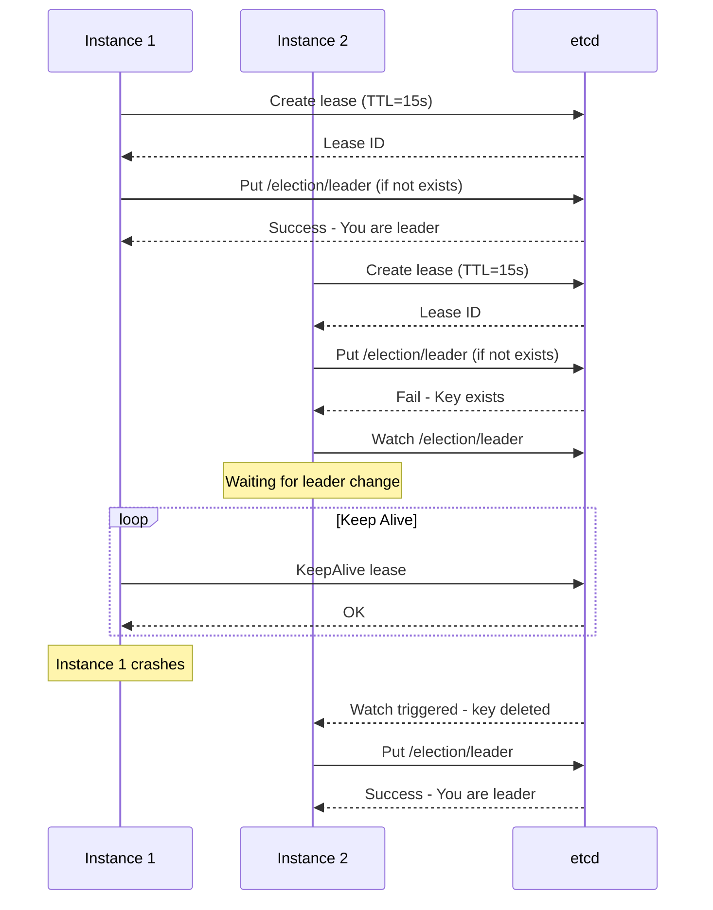

# How to Implement Leader Election with etcd

Author: [nawazdhandala](https://www.github.com/nawazdhandala)

Tags: etcd, Leader Election, Distributed Systems, Coordination, High Availability

Description: Learn how to implement leader election using etcd for distributed coordination, ensuring only one instance performs critical operations in your cluster.

---

Leader election is a critical pattern in distributed systems where multiple instances need to coordinate, but only one should perform certain operations at a time. etcd provides primitives like leases, transactions, and watches that make implementing robust leader election straightforward.

## How Leader Election Works

In etcd-based leader election, candidates compete to create a key with their identity. The winner becomes the leader and maintains leadership by keeping a lease alive. If the leader fails, the lease expires and a new election occurs.



## 1. Basic Leader Election with etcd

Implement leader election using etcd's transaction support.

**Go Implementation:**

```go
package main

import (
    "context"
    "fmt"
    "log"
    "os"
    "os/signal"
    "syscall"
    "time"

    clientv3 "go.etcd.io/etcd/client/v3"
    "go.etcd.io/etcd/client/v3/concurrency"
)

type LeaderElection struct {
    client     *clientv3.Client
    session    *concurrency.Session
    election   *concurrency.Election
    leaderKey  string
    instanceID string
    isLeader   bool
}

func NewLeaderElection(endpoints []string, prefix, instanceID string) (*LeaderElection, error) {
    client, err := clientv3.New(clientv3.Config{
        Endpoints:   endpoints,
        DialTimeout: 5 * time.Second,
    })
    if err != nil {
        return nil, fmt.Errorf("failed to create etcd client: %w", err)
    }

    // Create session with TTL - leader loses leadership if session expires
    session, err := concurrency.NewSession(client, concurrency.WithTTL(15))
    if err != nil {
        return nil, fmt.Errorf("failed to create session: %w", err)
    }

    election := concurrency.NewElection(session, prefix)

    return &LeaderElection{
        client:     client,
        session:    session,
        election:   election,
        leaderKey:  prefix,
        instanceID: instanceID,
    }, nil
}

func (le *LeaderElection) Campaign(ctx context.Context) error {
    log.Printf("[%s] Campaigning for leadership...", le.instanceID)

    // Campaign blocks until this instance becomes leader
    if err := le.election.Campaign(ctx, le.instanceID); err != nil {
        return fmt.Errorf("campaign failed: %w", err)
    }

    le.isLeader = true
    log.Printf("[%s] Elected as leader!", le.instanceID)
    return nil
}

func (le *LeaderElection) Resign(ctx context.Context) error {
    if !le.isLeader {
        return nil
    }

    log.Printf("[%s] Resigning leadership...", le.instanceID)
    if err := le.election.Resign(ctx); err != nil {
        return fmt.Errorf("resign failed: %w", err)
    }

    le.isLeader = false
    return nil
}

func (le *LeaderElection) GetLeader(ctx context.Context) (string, error) {
    resp, err := le.election.Leader(ctx)
    if err != nil {
        return "", err
    }
    return string(resp.Kvs[0].Value), nil
}

func (le *LeaderElection) IsLeader() bool {
    return le.isLeader
}

func (le *LeaderElection) Close() {
    le.session.Close()
    le.client.Close()
}

func (le *LeaderElection) WatchLeader(ctx context.Context, callback func(leaderID string)) {
    ch := le.election.Observe(ctx)
    for resp := range ch {
        if len(resp.Kvs) > 0 {
            leaderID := string(resp.Kvs[0].Value)
            callback(leaderID)
        }
    }
}

func main() {
    instanceID := os.Getenv("INSTANCE_ID")
    if instanceID == "" {
        instanceID = fmt.Sprintf("instance-%d", os.Getpid())
    }

    election, err := NewLeaderElection(
        []string{"localhost:2379"},
        "/election/scheduler",
        instanceID,
    )
    if err != nil {
        log.Fatal(err)
    }
    defer election.Close()

    ctx, cancel := context.WithCancel(context.Background())
    defer cancel()

    // Handle shutdown gracefully
    sigCh := make(chan os.Signal, 1)
    signal.Notify(sigCh, syscall.SIGINT, syscall.SIGTERM)

    go func() {
        <-sigCh
        log.Println("Shutting down...")
        election.Resign(context.Background())
        cancel()
    }()

    // Watch for leader changes
    go election.WatchLeader(ctx, func(leaderID string) {
        log.Printf("Current leader: %s", leaderID)
    })

    // Campaign for leadership
    if err := election.Campaign(ctx); err != nil {
        log.Printf("Campaign error: %v", err)
        return
    }

    // Do leader work
    for election.IsLeader() {
        select {
        case <-ctx.Done():
            return
        case <-time.After(5 * time.Second):
            log.Printf("[%s] Performing leader tasks...", instanceID)
            // Perform leader-only operations
        }
    }
}
```

## 2. Manual Leader Election Implementation

For more control, implement leader election using raw etcd primitives.

```go
package main

import (
    "context"
    "fmt"
    "log"
    "time"

    clientv3 "go.etcd.io/etcd/client/v3"
)

type ManualLeaderElection struct {
    client     *clientv3.Client
    leaseID    clientv3.LeaseID
    key        string
    value      string
    ttl        int64
    isLeader   bool
    stopCh     chan struct{}
}

func NewManualLeaderElection(endpoints []string, key, value string, ttl int64) (*ManualLeaderElection, error) {
    client, err := clientv3.New(clientv3.Config{
        Endpoints:   endpoints,
        DialTimeout: 5 * time.Second,
    })
    if err != nil {
        return nil, err
    }

    return &ManualLeaderElection{
        client: client,
        key:    key,
        value:  value,
        ttl:    ttl,
        stopCh: make(chan struct{}),
    }, nil
}

func (le *ManualLeaderElection) TryBecomeLeader(ctx context.Context) (bool, error) {
    // Create a lease
    leaseResp, err := le.client.Grant(ctx, le.ttl)
    if err != nil {
        return false, fmt.Errorf("failed to create lease: %w", err)
    }
    le.leaseID = leaseResp.ID

    // Try to create the leader key with our lease
    // This uses a transaction to ensure atomicity
    txnResp, err := le.client.Txn(ctx).
        If(clientv3.Compare(clientv3.CreateRevision(le.key), "=", 0)).
        Then(clientv3.OpPut(le.key, le.value, clientv3.WithLease(le.leaseID))).
        Commit()

    if err != nil {
        le.client.Revoke(ctx, le.leaseID)
        return false, fmt.Errorf("transaction failed: %w", err)
    }

    if !txnResp.Succeeded {
        // Key already exists - someone else is leader
        le.client.Revoke(ctx, le.leaseID)
        return false, nil
    }

    le.isLeader = true

    // Start keep-alive
    go le.keepAlive(ctx)

    return true, nil
}

func (le *ManualLeaderElection) keepAlive(ctx context.Context) {
    ch, err := le.client.KeepAlive(ctx, le.leaseID)
    if err != nil {
        log.Printf("KeepAlive error: %v", err)
        le.isLeader = false
        return
    }

    for {
        select {
        case <-le.stopCh:
            return
        case resp, ok := <-ch:
            if !ok {
                log.Println("KeepAlive channel closed")
                le.isLeader = false
                return
            }
            if resp == nil {
                log.Println("KeepAlive response is nil")
                le.isLeader = false
                return
            }
        }
    }
}

func (le *ManualLeaderElection) WaitForLeadership(ctx context.Context) error {
    for {
        became, err := le.TryBecomeLeader(ctx)
        if err != nil {
            return err
        }
        if became {
            return nil
        }

        // Watch for leader key deletion
        log.Println("Waiting for leadership...")
        watchCh := le.client.Watch(ctx, le.key)

        for watchResp := range watchCh {
            for _, event := range watchResp.Events {
                if event.Type == clientv3.EventTypeDelete {
                    // Leader resigned or failed, try to become leader
                    break
                }
            }
            break
        }
    }
}

func (le *ManualLeaderElection) Resign(ctx context.Context) error {
    close(le.stopCh)
    if le.leaseID != 0 {
        _, err := le.client.Revoke(ctx, le.leaseID)
        if err != nil {
            return err
        }
    }
    le.isLeader = false
    return nil
}

func (le *ManualLeaderElection) GetLeader(ctx context.Context) (string, error) {
    resp, err := le.client.Get(ctx, le.key)
    if err != nil {
        return "", err
    }
    if len(resp.Kvs) == 0 {
        return "", fmt.Errorf("no leader")
    }
    return string(resp.Kvs[0].Value), nil
}

func (le *ManualLeaderElection) Close() {
    le.client.Close()
}
```

## 3. Python Implementation

Implement leader election in Python using the etcd3 library.

```python
import etcd3
import threading
import time
import uuid
import logging
from typing import Callable, Optional

logging.basicConfig(level=logging.INFO)
logger = logging.getLogger(__name__)

class LeaderElection:
    def __init__(
        self,
        etcd_host: str = 'localhost',
        etcd_port: int = 2379,
        election_key: str = '/election/leader',
        ttl: int = 15,
        instance_id: Optional[str] = None
    ):
        self.client = etcd3.client(host=etcd_host, port=etcd_port)
        self.election_key = election_key
        self.ttl = ttl
        self.instance_id = instance_id or str(uuid.uuid4())[:8]
        self.lease = None
        self.is_leader = False
        self._stop_event = threading.Event()
        self._keep_alive_thread = None

    def _keep_alive(self):
        """Keep the lease alive while we are leader."""
        while not self._stop_event.is_set():
            try:
                if self.lease:
                    self.lease.refresh()
            except Exception as e:
                logger.error(f"Keep-alive failed: {e}")
                self.is_leader = False
                break
            time.sleep(self.ttl / 3)

    def try_become_leader(self) -> bool:
        """Attempt to become the leader."""
        try:
            # Create a lease
            self.lease = self.client.lease(self.ttl)

            # Try to create the leader key using a transaction
            success, _ = self.client.transaction(
                compare=[
                    self.client.transactions.create(self.election_key) == 0
                ],
                success=[
                    self.client.transactions.put(
                        self.election_key,
                        self.instance_id,
                        lease=self.lease
                    )
                ],
                failure=[]
            )

            if success:
                self.is_leader = True
                logger.info(f"[{self.instance_id}] Became leader!")

                # Start keep-alive thread
                self._stop_event.clear()
                self._keep_alive_thread = threading.Thread(
                    target=self._keep_alive,
                    daemon=True
                )
                self._keep_alive_thread.start()
                return True
            else:
                # Someone else is leader
                self.lease.revoke()
                self.lease = None
                return False

        except Exception as e:
            logger.error(f"Error trying to become leader: {e}")
            if self.lease:
                self.lease.revoke()
                self.lease = None
            return False

    def wait_for_leadership(self, callback: Optional[Callable] = None):
        """Wait until we become leader."""
        while not self._stop_event.is_set():
            if self.try_become_leader():
                if callback:
                    callback()
                return

            logger.info(f"[{self.instance_id}] Waiting for leadership...")

            # Watch for leader key deletion
            events_iterator, cancel = self.client.watch(self.election_key)
            try:
                for event in events_iterator:
                    if isinstance(event, etcd3.events.DeleteEvent):
                        logger.info("Leader key deleted, attempting to become leader")
                        cancel()
                        break
            except Exception as e:
                logger.error(f"Watch error: {e}")
                time.sleep(1)

    def resign(self):
        """Resign from leadership."""
        self._stop_event.set()
        if self.lease:
            try:
                self.lease.revoke()
            except Exception as e:
                logger.error(f"Error revoking lease: {e}")
            self.lease = None
        self.is_leader = False
        logger.info(f"[{self.instance_id}] Resigned leadership")

    def get_leader(self) -> Optional[str]:
        """Get the current leader ID."""
        try:
            value, _ = self.client.get(self.election_key)
            if value:
                return value.decode('utf-8')
            return None
        except Exception as e:
            logger.error(f"Error getting leader: {e}")
            return None

    def close(self):
        """Close the connection."""
        self.resign()
        self.client.close()

# Usage example
def leader_work():
    """Work to do when elected as leader."""
    while election.is_leader:
        logger.info(f"[{election.instance_id}] Performing leader tasks...")
        time.sleep(5)

if __name__ == '__main__':
    import sys
    import signal

    instance_id = sys.argv[1] if len(sys.argv) > 1 else None

    election = LeaderElection(
        election_key='/election/scheduler',
        ttl=15,
        instance_id=instance_id
    )

    def shutdown(signum, frame):
        logger.info("Shutting down...")
        election.close()
        sys.exit(0)

    signal.signal(signal.SIGINT, shutdown)
    signal.signal(signal.SIGTERM, shutdown)

    # Start leader election
    election.wait_for_leadership(callback=leader_work)
```

## 4. Leader Election for Kubernetes Operators

When building Kubernetes operators, use leader election for high availability.

```go
package main

import (
    "context"
    "flag"
    "os"
    "time"

    "k8s.io/client-go/kubernetes"
    "k8s.io/client-go/tools/clientcmd"
    "k8s.io/client-go/tools/leaderelection"
    "k8s.io/client-go/tools/leaderelection/resourcelock"
    "k8s.io/klog/v2"
)

func main() {
    var kubeconfig string
    var leaseLockName string
    var leaseLockNamespace string
    var id string

    flag.StringVar(&kubeconfig, "kubeconfig", "", "absolute path to the kubeconfig file")
    flag.StringVar(&leaseLockName, "lease-lock-name", "my-operator-lock", "the lease lock resource name")
    flag.StringVar(&leaseLockNamespace, "lease-lock-namespace", "default", "the lease lock resource namespace")
    flag.StringVar(&id, "id", "", "the holder identity name")
    flag.Parse()

    if id == "" {
        id, _ = os.Hostname()
    }

    config, err := clientcmd.BuildConfigFromFlags("", kubeconfig)
    if err != nil {
        klog.Fatal(err)
    }

    client, err := kubernetes.NewForConfig(config)
    if err != nil {
        klog.Fatal(err)
    }

    ctx, cancel := context.WithCancel(context.Background())
    defer cancel()

    // Create the lock
    lock := &resourcelock.LeaseLock{
        LeaseMeta: metav1.ObjectMeta{
            Name:      leaseLockName,
            Namespace: leaseLockNamespace,
        },
        Client: client.CoordinationV1(),
        LockConfig: resourcelock.ResourceLockConfig{
            Identity: id,
        },
    }

    // Start the leader election
    leaderelection.RunOrDie(ctx, leaderelection.LeaderElectionConfig{
        Lock:            lock,
        ReleaseOnCancel: true,
        LeaseDuration:   15 * time.Second,
        RenewDeadline:   10 * time.Second,
        RetryPeriod:     2 * time.Second,
        Callbacks: leaderelection.LeaderCallbacks{
            OnStartedLeading: func(ctx context.Context) {
                klog.Info("Started leading")
                // Start your operator logic here
                runOperator(ctx)
            },
            OnStoppedLeading: func() {
                klog.Info("Stopped leading")
            },
            OnNewLeader: func(identity string) {
                if identity == id {
                    return
                }
                klog.Infof("New leader elected: %s", identity)
            },
        },
    })
}

func runOperator(ctx context.Context) {
    // Your operator logic here
    for {
        select {
        case <-ctx.Done():
            return
        case <-time.After(10 * time.Second):
            klog.Info("Processing operator tasks...")
        }
    }
}
```

## 5. Testing Leader Election

Test leader election behavior with multiple instances.

```bash
# Terminal 1
INSTANCE_ID=instance-1 go run main.go

# Terminal 2
INSTANCE_ID=instance-2 go run main.go

# Terminal 3
INSTANCE_ID=instance-3 go run main.go

# Check current leader
etcdctl get /election/scheduler

# Simulate leader failure (kill Terminal 1)
# Watch other instances compete for leadership
```

## Best Practices

1. **Use appropriate TTLs** - Balance between failure detection speed and lease renewal overhead
2. **Handle leader transitions gracefully** - Clean up resources before resigning
3. **Implement idempotent operations** - Leader work may be interrupted mid-operation
4. **Monitor leadership changes** - Alert on frequent leader changes
5. **Test failure scenarios** - Ensure smooth failover during network partitions
6. **Use fencing tokens** - Prevent split-brain with monotonic tokens

---

Leader election with etcd provides a reliable way to coordinate distributed processes. By leveraging leases and transactions, you can ensure exactly one leader is active at any time, enabling safe execution of singleton operations in your distributed system.
