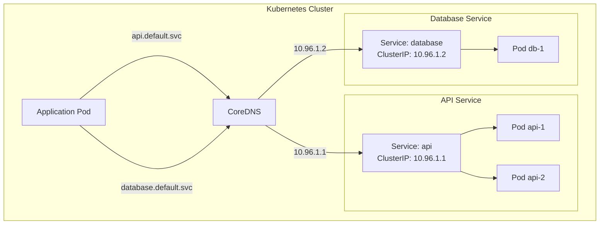

# How to Implement Service Discovery in Kubernetes

Author: [nawazdhandala](https://www.github.com/nawazdhandala)

Tags: Kubernetes, Service Discovery, DNS, CoreDNS, Microservices

Description: Learn how to implement service discovery in Kubernetes using built-in DNS, Services, and Endpoints, with practical examples for inter-service communication.

---

Kubernetes provides built-in service discovery through its Service abstraction and DNS system. Services provide stable network endpoints for Pods, while CoreDNS automatically creates DNS records for service discovery. This eliminates the need for external service registries in most Kubernetes deployments.

## How Kubernetes Service Discovery Works

When you create a Service, Kubernetes assigns it a stable ClusterIP and creates DNS records. Pods can discover services using DNS names or environment variables, and traffic is automatically load-balanced across healthy Pod endpoints.



## 1. Create a Service for Discovery

Define a Service that selects Pods and provides a stable endpoint.

**api-deployment.yaml:**

```yaml
apiVersion: apps/v1
kind: Deployment
metadata:
  name: api
  namespace: default
spec:
  replicas: 3
  selector:
    matchLabels:
      app: api
  template:
    metadata:
      labels:
        app: api
        version: v1
    spec:
      containers:
        - name: api
          image: myregistry/api:1.0.0
          ports:
            - containerPort: 8080
              name: http
          readinessProbe:
            httpGet:
              path: /health
              port: 8080
            initialDelaySeconds: 5
            periodSeconds: 10
          livenessProbe:
            httpGet:
              path: /health
              port: 8080
            initialDelaySeconds: 15
            periodSeconds: 20
---
apiVersion: v1
kind: Service
metadata:
  name: api
  namespace: default
spec:
  selector:
    app: api
  ports:
    - name: http
      port: 80
      targetPort: 8080
  type: ClusterIP
```

Apply and verify:

```bash
kubectl apply -f api-deployment.yaml

# Check service
kubectl get svc api

# View endpoints (Pod IPs)
kubectl get endpoints api

# Test DNS resolution from a debug pod
kubectl run debug --rm -it --image=busybox -- nslookup api.default.svc.cluster.local
```

## 2. DNS-Based Discovery

Kubernetes creates DNS records for Services in the format: `<service>.<namespace>.svc.cluster.local`

**Application code using DNS:**

```python
import os
import requests
from urllib.parse import urljoin

class KubernetesServiceClient:
    def __init__(self):
        # Get namespace from mounted service account
        self.namespace = self._get_namespace()

    def _get_namespace(self):
        """Get current namespace from Kubernetes."""
        try:
            with open('/var/run/secrets/kubernetes.io/serviceaccount/namespace') as f:
                return f.read().strip()
        except FileNotFoundError:
            return os.getenv('NAMESPACE', 'default')

    def get_service_url(self, service_name, port=80):
        """
        Construct service URL using Kubernetes DNS.
        Short name works within same namespace.
        Full FQDN works across namespaces.
        """
        # Same namespace - short name
        if '.' not in service_name:
            return f"http://{service_name}:{port}"

        # Different namespace - use FQDN
        return f"http://{service_name}.svc.cluster.local:{port}"

    def call_service(self, service_name, endpoint, port=80):
        """Call another service in the cluster."""
        base_url = self.get_service_url(service_name, port)
        url = urljoin(base_url, endpoint)

        response = requests.get(url, timeout=10)
        response.raise_for_status()
        return response.json()

# Usage
client = KubernetesServiceClient()

# Call service in same namespace
users = client.call_service('user-service', '/users')

# Call service in different namespace
orders = client.call_service('order-service.orders', '/orders')
```

**Go implementation:**

```go
package main

import (
    "encoding/json"
    "fmt"
    "io/ioutil"
    "net/http"
    "os"
    "strings"
    "time"
)

type ServiceClient struct {
    httpClient *http.Client
    namespace  string
}

func NewServiceClient() *ServiceClient {
    return &ServiceClient{
        httpClient: &http.Client{
            Timeout: 10 * time.Second,
        },
        namespace: getNamespace(),
    }
}

func getNamespace() string {
    data, err := ioutil.ReadFile("/var/run/secrets/kubernetes.io/serviceaccount/namespace")
    if err != nil {
        return os.Getenv("NAMESPACE")
    }
    return strings.TrimSpace(string(data))
}

func (c *ServiceClient) GetServiceURL(serviceName string, port int) string {
    if strings.Contains(serviceName, ".") {
        // Cross-namespace call
        return fmt.Sprintf("http://%s.svc.cluster.local:%d", serviceName, port)
    }
    // Same namespace
    return fmt.Sprintf("http://%s:%d", serviceName, port)
}

func (c *ServiceClient) CallService(serviceName, endpoint string, port int) ([]byte, error) {
    url := c.GetServiceURL(serviceName, port) + endpoint

    resp, err := c.httpClient.Get(url)
    if err != nil {
        return nil, fmt.Errorf("failed to call service: %w", err)
    }
    defer resp.Body.Close()

    return ioutil.ReadAll(resp.Body)
}

func main() {
    client := NewServiceClient()

    // Call user-service in same namespace
    data, err := client.CallService("user-service", "/users", 80)
    if err != nil {
        panic(err)
    }
    fmt.Println(string(data))
}
```

## 3. Headless Services for Direct Pod Discovery

Use headless services (ClusterIP: None) to get individual Pod IPs instead of a single service IP.

```yaml
apiVersion: v1
kind: Service
metadata:
  name: database
  namespace: default
spec:
  clusterIP: None  # Headless service
  selector:
    app: database
  ports:
    - port: 5432
      targetPort: 5432
```

DNS queries for headless services return all Pod IPs:

```bash
# Returns all Pod IPs
nslookup database.default.svc.cluster.local

# Individual pod DNS (for StatefulSets)
nslookup database-0.database.default.svc.cluster.local
```

**Use case - Database connection with failover:**

```python
import dns.resolver
import psycopg2
import random

def get_database_hosts(service_name, namespace='default'):
    """Get all database pod IPs using DNS."""
    fqdn = f"{service_name}.{namespace}.svc.cluster.local"

    try:
        answers = dns.resolver.resolve(fqdn, 'A')
        return [str(rdata) for rdata in answers]
    except dns.resolver.NXDOMAIN:
        raise Exception(f"Service {service_name} not found")

def get_database_connection():
    """Connect to database with failover."""
    hosts = get_database_hosts('database')

    # Shuffle for load distribution
    random.shuffle(hosts)

    for host in hosts:
        try:
            conn = psycopg2.connect(
                host=host,
                port=5432,
                database='mydb',
                user='user',
                password='password',
                connect_timeout=5
            )
            return conn
        except psycopg2.OperationalError:
            continue

    raise Exception("All database hosts unavailable")
```

## 4. Environment Variable Discovery

Kubernetes injects service information as environment variables.

```yaml
apiVersion: v1
kind: Pod
metadata:
  name: client-app
spec:
  containers:
    - name: app
      image: myapp:1.0
      env:
        # Kubernetes automatically injects these for services
        # API_SERVICE_HOST, API_SERVICE_PORT, etc.
```

Access service info from environment:

```python
import os

# Kubernetes automatically sets these for each service
api_host = os.getenv('API_SERVICE_HOST', 'api')
api_port = os.getenv('API_SERVICE_PORT', '80')

# Construct URL
api_url = f"http://{api_host}:{api_port}"
```

Note: Environment variables are only set at Pod creation time. DNS is preferred for dynamic discovery.

## 5. ExternalName Services

Create aliases to external services using ExternalName type.

```yaml
apiVersion: v1
kind: Service
metadata:
  name: external-database
  namespace: default
spec:
  type: ExternalName
  externalName: database.prod.example.com
```

Now applications can use `external-database` as the hostname:

```python
# Connects to database.prod.example.com
conn = psycopg2.connect(host='external-database', port=5432, ...)
```

## 6. Service Discovery Across Namespaces

Services are accessible across namespaces using their FQDN.

```yaml
# Service in 'payments' namespace
apiVersion: v1
kind: Service
metadata:
  name: payment-gateway
  namespace: payments
spec:
  selector:
    app: payment-gateway
  ports:
    - port: 443
      targetPort: 8443
```

Access from another namespace:

```python
# From 'orders' namespace, call service in 'payments' namespace
payment_url = "https://payment-gateway.payments.svc.cluster.local:443"
```

## 7. Configure CoreDNS

Customize DNS behavior through the CoreDNS ConfigMap.

```bash
kubectl get configmap coredns -n kube-system -o yaml
```

**Custom DNS configuration:**

```yaml
apiVersion: v1
kind: ConfigMap
metadata:
  name: coredns
  namespace: kube-system
data:
  Corefile: |
    .:53 {
        errors
        health {
            lameduck 5s
        }
        ready
        kubernetes cluster.local in-addr.arpa ip6.arpa {
            pods insecure
            fallthrough in-addr.arpa ip6.arpa
            ttl 30
        }
        prometheus :9153
        forward . /etc/resolv.conf {
            max_concurrent 1000
        }
        cache 30
        loop
        reload
        loadbalance
    }
    # Custom domain forwarding
    example.com:53 {
        forward . 10.0.0.53
    }
```

## 8. Service Mesh Integration

For advanced service discovery with traffic management, integrate Istio.

```yaml
apiVersion: networking.istio.io/v1beta1
kind: VirtualService
metadata:
  name: api-routing
spec:
  hosts:
    - api
  http:
    - match:
        - headers:
            version:
              exact: "v2"
      route:
        - destination:
            host: api
            subset: v2
    - route:
        - destination:
            host: api
            subset: v1
---
apiVersion: networking.istio.io/v1beta1
kind: DestinationRule
metadata:
  name: api-destination
spec:
  host: api
  subsets:
    - name: v1
      labels:
        version: v1
    - name: v2
      labels:
        version: v2
```

## 9. Debug Service Discovery

Troubleshoot service discovery issues:

```bash
# Check service exists
kubectl get svc api -o wide

# Check endpoints are populated
kubectl get endpoints api

# Test DNS from debug pod
kubectl run debug --rm -it --image=nicolaka/netshoot -- bash

# Inside the debug pod:
nslookup api.default.svc.cluster.local
dig api.default.svc.cluster.local
curl -v http://api/health

# Check CoreDNS logs
kubectl logs -n kube-system -l k8s-app=kube-dns

# Verify Pod is ready
kubectl get pods -l app=api -o wide
```

## Best Practices

1. **Use DNS over environment variables** - DNS updates dynamically, env vars don't
2. **Configure readiness probes** - Only ready Pods receive traffic
3. **Use short DNS names** - Within namespace, just use the service name
4. **Monitor endpoint counts** - Alert when endpoints drop to zero
5. **Set appropriate timeouts** - Handle temporary DNS resolution failures
6. **Use headless services for StatefulSets** - Get stable network identities

---

Kubernetes built-in service discovery eliminates the need for external registries in most cases. Understanding DNS-based discovery, Service types, and cross-namespace communication enables you to build robust microservices architectures within Kubernetes.
