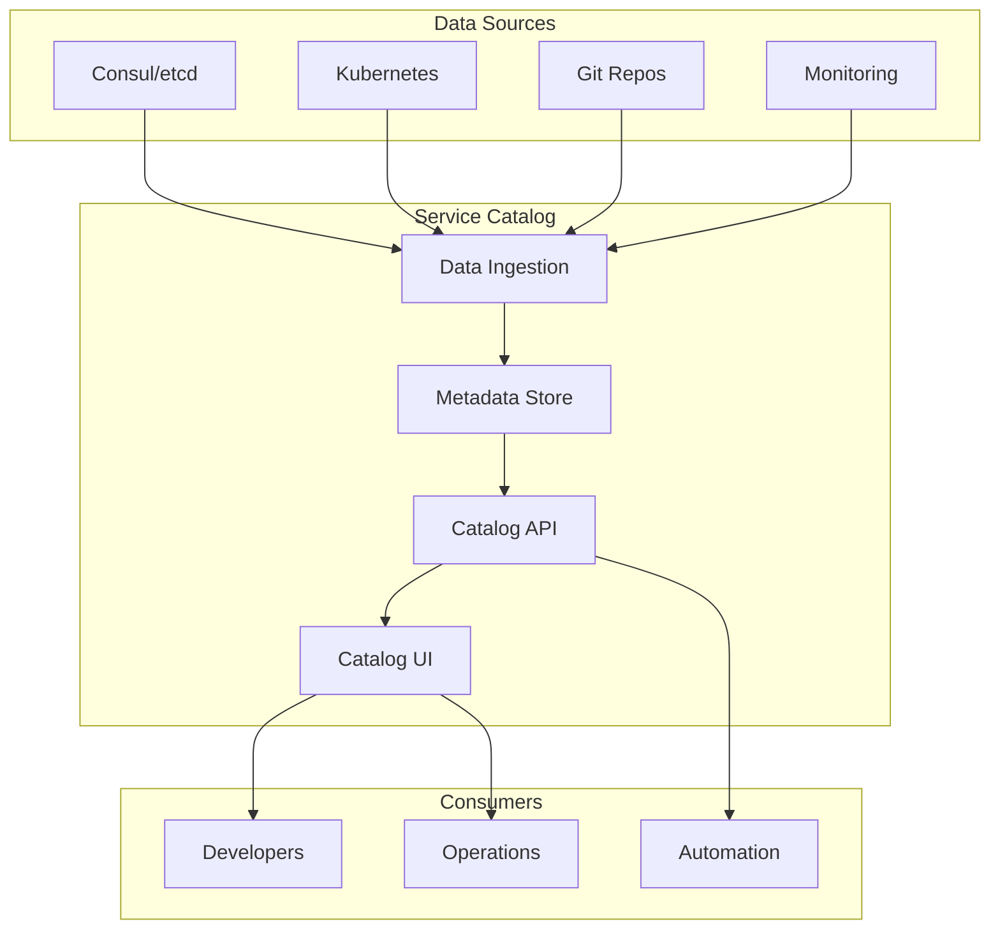

# How to Implement Service Catalog Management

Author: [nawazdhandala](https://www.github.com/nawazdhandala)

Tags: Service Catalog, Service Discovery, Microservices, DevOps, Platform Engineering

Description: Learn how to implement a service catalog for managing, documenting, and discovering services in your organization, including metadata management, ownership tracking, and integration with service discovery systems.

---

A service catalog provides a centralized registry of all services in your organization, their metadata, ownership, dependencies, and operational information. It serves as the single source of truth for understanding what services exist, who owns them, and how they interact.

## Service Catalog Architecture

A service catalog combines static metadata (ownership, documentation) with dynamic data from service discovery and monitoring systems.



## 1. Define Service Metadata Schema

Create a comprehensive schema for service metadata.

```yaml
# service-catalog-schema.yaml
type: object
required:
  - name
  - owner
  - tier
properties:
  name:
    type: string
    description: Unique service identifier
  displayName:
    type: string
    description: Human-readable service name
  description:
    type: string
    description: What this service does
  owner:
    type: object
    properties:
      team:
        type: string
      email:
        type: string
      slack:
        type: string
      oncall:
        type: string
  tier:
    type: string
    enum: [critical, high, medium, low]
    description: Service criticality tier
  lifecycle:
    type: string
    enum: [development, staging, production, deprecated]
  repository:
    type: string
    format: uri
  documentation:
    type: string
    format: uri
  runbook:
    type: string
    format: uri
  dependencies:
    type: array
    items:
      type: object
      properties:
        service:
          type: string
        type:
          enum: [hard, soft]
  endpoints:
    type: array
    items:
      type: object
      properties:
        name:
          type: string
        url:
          type: string
        type:
          enum: [http, grpc, graphql, websocket]
  sla:
    type: object
    properties:
      availability:
        type: string
      latencyP99:
        type: string
      errorBudget:
        type: string
  tags:
    type: array
    items:
      type: string
```

## 2. Implement Service Catalog API

Build an API for managing service catalog entries.

```python
from flask import Flask, request, jsonify
from typing import Dict, List, Optional
import json
import redis
from datetime import datetime
import jsonschema

app = Flask(__name__)
redis_client = redis.Redis(host='localhost', port=6379, db=0)

# Load schema
with open('service-catalog-schema.yaml') as f:
    import yaml
    SERVICE_SCHEMA = yaml.safe_load(f)

class ServiceCatalog:
    def __init__(self, redis_client):
        self.redis = redis_client
        self.catalog_key = "service_catalog"

    def validate_service(self, service_data: Dict) -> bool:
        """Validate service data against schema."""
        try:
            jsonschema.validate(service_data, SERVICE_SCHEMA)
            return True
        except jsonschema.ValidationError as e:
            raise ValueError(f"Validation error: {e.message}")

    def register_service(self, service_data: Dict) -> Dict:
        """Register or update a service in the catalog."""
        self.validate_service(service_data)

        service_name = service_data['name']
        service_data['updatedAt'] = datetime.utcnow().isoformat()

        # Check if service exists
        existing = self.get_service(service_name)
        if not existing:
            service_data['createdAt'] = service_data['updatedAt']

        # Store in Redis
        self.redis.hset(
            self.catalog_key,
            service_name,
            json.dumps(service_data)
        )

        return service_data

    def get_service(self, service_name: str) -> Optional[Dict]:
        """Get a service by name."""
        data = self.redis.hget(self.catalog_key, service_name)
        if data:
            return json.loads(data)
        return None

    def list_services(
        self,
        owner: str = None,
        tier: str = None,
        tags: List[str] = None
    ) -> List[Dict]:
        """List all services with optional filtering."""
        all_services = self.redis.hgetall(self.catalog_key)
        services = [json.loads(v) for v in all_services.values()]

        # Apply filters
        if owner:
            services = [s for s in services
                       if s.get('owner', {}).get('team') == owner]
        if tier:
            services = [s for s in services if s.get('tier') == tier]
        if tags:
            services = [s for s in services
                       if set(tags).issubset(set(s.get('tags', [])))]

        return sorted(services, key=lambda x: x['name'])

    def delete_service(self, service_name: str) -> bool:
        """Delete a service from the catalog."""
        return self.redis.hdel(self.catalog_key, service_name) > 0

    def get_dependencies(self, service_name: str) -> Dict:
        """Get service dependencies (both upstream and downstream)."""
        service = self.get_service(service_name)
        if not service:
            return {'upstream': [], 'downstream': []}

        # Get services this one depends on
        upstream = service.get('dependencies', [])

        # Find services that depend on this one
        all_services = self.list_services()
        downstream = []
        for svc in all_services:
            deps = svc.get('dependencies', [])
            for dep in deps:
                if dep.get('service') == service_name:
                    downstream.append({
                        'service': svc['name'],
                        'type': dep.get('type', 'unknown')
                    })

        return {
            'upstream': upstream,
            'downstream': downstream
        }

    def search_services(self, query: str) -> List[Dict]:
        """Search services by name, description, or tags."""
        all_services = self.list_services()
        query_lower = query.lower()

        results = []
        for service in all_services:
            if (query_lower in service['name'].lower() or
                query_lower in service.get('description', '').lower() or
                any(query_lower in tag.lower() for tag in service.get('tags', []))):
                results.append(service)

        return results

catalog = ServiceCatalog(redis_client)

@app.route('/api/v1/services', methods=['GET'])
def list_services():
    """List all services with optional filtering."""
    owner = request.args.get('owner')
    tier = request.args.get('tier')
    tags = request.args.getlist('tag')

    services = catalog.list_services(owner=owner, tier=tier, tags=tags)
    return jsonify({'services': services})

@app.route('/api/v1/services', methods=['POST'])
def register_service():
    """Register a new service."""
    try:
        service_data = request.json
        result = catalog.register_service(service_data)
        return jsonify(result), 201
    except ValueError as e:
        return jsonify({'error': str(e)}), 400

@app.route('/api/v1/services/<service_name>', methods=['GET'])
def get_service(service_name):
    """Get service details."""
    service = catalog.get_service(service_name)
    if not service:
        return jsonify({'error': 'Service not found'}), 404
    return jsonify(service)

@app.route('/api/v1/services/<service_name>', methods=['PUT'])
def update_service(service_name):
    """Update a service."""
    try:
        service_data = request.json
        service_data['name'] = service_name
        result = catalog.register_service(service_data)
        return jsonify(result)
    except ValueError as e:
        return jsonify({'error': str(e)}), 400

@app.route('/api/v1/services/<service_name>', methods=['DELETE'])
def delete_service(service_name):
    """Delete a service."""
    if catalog.delete_service(service_name):
        return '', 204
    return jsonify({'error': 'Service not found'}), 404

@app.route('/api/v1/services/<service_name>/dependencies', methods=['GET'])
def get_dependencies(service_name):
    """Get service dependencies."""
    deps = catalog.get_dependencies(service_name)
    return jsonify(deps)

@app.route('/api/v1/search', methods=['GET'])
def search_services():
    """Search services."""
    query = request.args.get('q', '')
    results = catalog.search_services(query)
    return jsonify({'results': results})

if __name__ == '__main__':
    app.run(host='0.0.0.0', port=8080)
```

## 3. Service Registration File

Define service metadata in a file that lives with the code.

`catalog-info.yaml` (in service repository):

```yaml
apiVersion: catalog/v1
kind: Service
metadata:
  name: payment-service
  displayName: Payment Service
  description: Handles payment processing and transaction management
spec:
  owner:
    team: payments-team
    email: payments@example.com
    slack: "#payments-oncall"
    oncall: payments-pagerduty
  tier: critical
  lifecycle: production
  repository: https://github.com/company/payment-service
  documentation: https://docs.company.com/payment-service
  runbook: https://runbooks.company.com/payment-service
  dependencies:
    - service: user-service
      type: hard
    - service: notification-service
      type: soft
    - service: audit-service
      type: soft
  endpoints:
    - name: API
      url: https://api.company.com/payments
      type: http
    - name: gRPC
      url: grpc://payments.internal:50051
      type: grpc
  sla:
    availability: "99.99%"
    latencyP99: "200ms"
    errorBudget: "0.01%"
  tags:
    - payments
    - financial
    - pci-compliant
```

## 4. Sync with Service Discovery

Automatically sync catalog with Consul or Kubernetes.

```python
import consul
from kubernetes import client, config
from typing import Dict, List
import schedule
import time

class CatalogSyncer:
    def __init__(self, catalog: ServiceCatalog):
        self.catalog = catalog

    def sync_from_consul(self, consul_host='localhost', consul_port=8500):
        """Sync services registered in Consul."""
        c = consul.Consul(host=consul_host, port=consul_port)

        # Get all services from Consul
        index, services = c.catalog.services()

        for service_name, tags in services.items():
            if service_name == 'consul':
                continue

            # Get service instances
            index, instances = c.health.service(service_name, passing=True)

            # Check if service exists in catalog
            catalog_entry = self.catalog.get_service(service_name)

            if not catalog_entry:
                # Create basic entry for discovered service
                self.catalog.register_service({
                    'name': service_name,
                    'displayName': service_name,
                    'description': 'Auto-discovered from Consul',
                    'owner': {
                        'team': 'unknown',
                        'email': 'unknown@example.com'
                    },
                    'tier': 'medium',
                    'lifecycle': 'production',
                    'tags': list(tags),
                    'discovered': {
                        'source': 'consul',
                        'instances': len(instances)
                    }
                })
            else:
                # Update instance count
                catalog_entry.setdefault('discovered', {})
                catalog_entry['discovered']['instances'] = len(instances)
                catalog_entry['discovered']['source'] = 'consul'
                self.catalog.register_service(catalog_entry)

    def sync_from_kubernetes(self):
        """Sync services from Kubernetes."""
        config.load_incluster_config()  # or load_kube_config() for local
        v1 = client.CoreV1Api()

        services = v1.list_service_for_all_namespaces()

        for svc in services.items:
            service_name = f"{svc.metadata.namespace}/{svc.metadata.name}"

            # Skip system namespaces
            if svc.metadata.namespace in ['kube-system', 'kube-public']:
                continue

            catalog_entry = self.catalog.get_service(service_name)

            if not catalog_entry:
                # Create basic entry
                annotations = svc.metadata.annotations or {}
                labels = svc.metadata.labels or {}

                self.catalog.register_service({
                    'name': service_name,
                    'displayName': svc.metadata.name,
                    'description': annotations.get('description', 'Kubernetes service'),
                    'owner': {
                        'team': labels.get('team', 'unknown'),
                        'email': annotations.get('owner-email', 'unknown@example.com')
                    },
                    'tier': labels.get('tier', 'medium'),
                    'lifecycle': 'production',
                    'tags': list(labels.keys()),
                    'discovered': {
                        'source': 'kubernetes',
                        'namespace': svc.metadata.namespace,
                        'type': svc.spec.type
                    }
                })

    def run_sync(self):
        """Run periodic sync."""
        schedule.every(5).minutes.do(self.sync_from_consul)
        schedule.every(5).minutes.do(self.sync_from_kubernetes)

        while True:
            schedule.run_pending()
            time.sleep(60)
```

## 5. Generate Dependency Graph

Visualize service dependencies.

```python
import networkx as nx
from typing import Dict, List

class DependencyGraph:
    def __init__(self, catalog: ServiceCatalog):
        self.catalog = catalog

    def build_graph(self) -> nx.DiGraph:
        """Build a directed graph of service dependencies."""
        G = nx.DiGraph()

        services = self.catalog.list_services()

        # Add nodes
        for service in services:
            G.add_node(
                service['name'],
                tier=service.get('tier', 'unknown'),
                owner=service.get('owner', {}).get('team', 'unknown')
            )

        # Add edges for dependencies
        for service in services:
            for dep in service.get('dependencies', []):
                G.add_edge(
                    service['name'],
                    dep['service'],
                    type=dep.get('type', 'unknown')
                )

        return G

    def get_critical_path(self, service_name: str) -> List[str]:
        """Find critical path from a service to its dependencies."""
        G = self.build_graph()

        try:
            # Get all paths to leaf nodes (services with no dependencies)
            leaf_nodes = [n for n in G.nodes() if G.out_degree(n) == 0]
            paths = []
            for leaf in leaf_nodes:
                for path in nx.all_simple_paths(G, service_name, leaf):
                    paths.append(path)
            return paths
        except nx.NetworkXNoPath:
            return []

    def find_circular_dependencies(self) -> List[List[str]]:
        """Find any circular dependencies."""
        G = self.build_graph()
        try:
            cycles = list(nx.simple_cycles(G))
            return cycles
        except:
            return []

    def get_impact_analysis(self, service_name: str) -> Dict:
        """Analyze impact if a service goes down."""
        G = self.build_graph()
        G_reversed = G.reverse()

        # Find all services that depend on this one (directly or indirectly)
        try:
            affected = list(nx.dfs_preorder_nodes(G_reversed, service_name))
            affected.remove(service_name)
        except:
            affected = []

        # Categorize by tier
        impact = {'critical': [], 'high': [], 'medium': [], 'low': []}
        for svc in affected:
            tier = G.nodes[svc].get('tier', 'medium')
            impact[tier].append(svc)

        return {
            'service': service_name,
            'affected_services': affected,
            'impact_by_tier': impact,
            'total_affected': len(affected)
        }

    def export_mermaid(self) -> str:
        """Export graph as Mermaid diagram."""
        G = self.build_graph()
        lines = ["graph LR"]

        for edge in G.edges(data=True):
            src, dst, data = edge
            edge_type = data.get('type', 'unknown')
            style = "-->" if edge_type == 'hard' else "-.->"
            lines.append(f"    {src}{style}{dst}")

        return "\n".join(lines)
```

## 6. CLI Tool

Create a CLI for interacting with the service catalog.

```python
import click
import requests
import json
from tabulate import tabulate

CATALOG_URL = "http://localhost:8080/api/v1"

@click.group()
def cli():
    """Service Catalog CLI"""
    pass

@cli.command()
@click.option('--owner', help='Filter by owner team')
@click.option('--tier', help='Filter by tier')
def list(owner, tier):
    """List all services"""
    params = {}
    if owner:
        params['owner'] = owner
    if tier:
        params['tier'] = tier

    resp = requests.get(f"{CATALOG_URL}/services", params=params)
    services = resp.json()['services']

    table = [[s['name'], s.get('tier', '-'), s.get('owner', {}).get('team', '-')]
             for s in services]
    print(tabulate(table, headers=['Name', 'Tier', 'Owner']))

@cli.command()
@click.argument('name')
def get(name):
    """Get service details"""
    resp = requests.get(f"{CATALOG_URL}/services/{name}")
    if resp.status_code == 404:
        click.echo(f"Service '{name}' not found")
        return
    print(json.dumps(resp.json(), indent=2))

@cli.command()
@click.argument('file', type=click.Path(exists=True))
def register(file):
    """Register a service from YAML file"""
    import yaml
    with open(file) as f:
        data = yaml.safe_load(f)

    # Handle catalog-info.yaml format
    if data.get('kind') == 'Service':
        service_data = {
            'name': data['metadata']['name'],
            'displayName': data['metadata'].get('displayName'),
            'description': data['metadata'].get('description'),
            **data['spec']
        }
    else:
        service_data = data

    resp = requests.post(f"{CATALOG_URL}/services", json=service_data)
    if resp.status_code == 201:
        click.echo(f"Service '{service_data['name']}' registered successfully")
    else:
        click.echo(f"Error: {resp.json()}")

@cli.command()
@click.argument('name')
def deps(name):
    """Show service dependencies"""
    resp = requests.get(f"{CATALOG_URL}/services/{name}/dependencies")
    deps = resp.json()

    click.echo(f"\nUpstream dependencies (services {name} depends on):")
    for d in deps['upstream']:
        click.echo(f"  - {d['service']} ({d.get('type', 'unknown')})")

    click.echo(f"\nDownstream dependencies (services that depend on {name}):")
    for d in deps['downstream']:
        click.echo(f"  - {d['service']} ({d.get('type', 'unknown')})")

if __name__ == '__main__':
    cli()
```

## Best Practices

1. **Automate registration** - Integrate catalog updates into CI/CD
2. **Keep metadata with code** - Store catalog-info.yaml in service repos
3. **Define ownership** - Every service must have a clear owner
4. **Track dependencies** - Maintain accurate dependency information
5. **Sync with discovery** - Combine static metadata with dynamic discovery
6. **Regular audits** - Periodically review and clean up stale entries

---

A well-maintained service catalog provides visibility into your service landscape, simplifies onboarding, and enables impact analysis for changes and incidents. By combining manual metadata with automated discovery, you create a comprehensive view of your service architecture.
