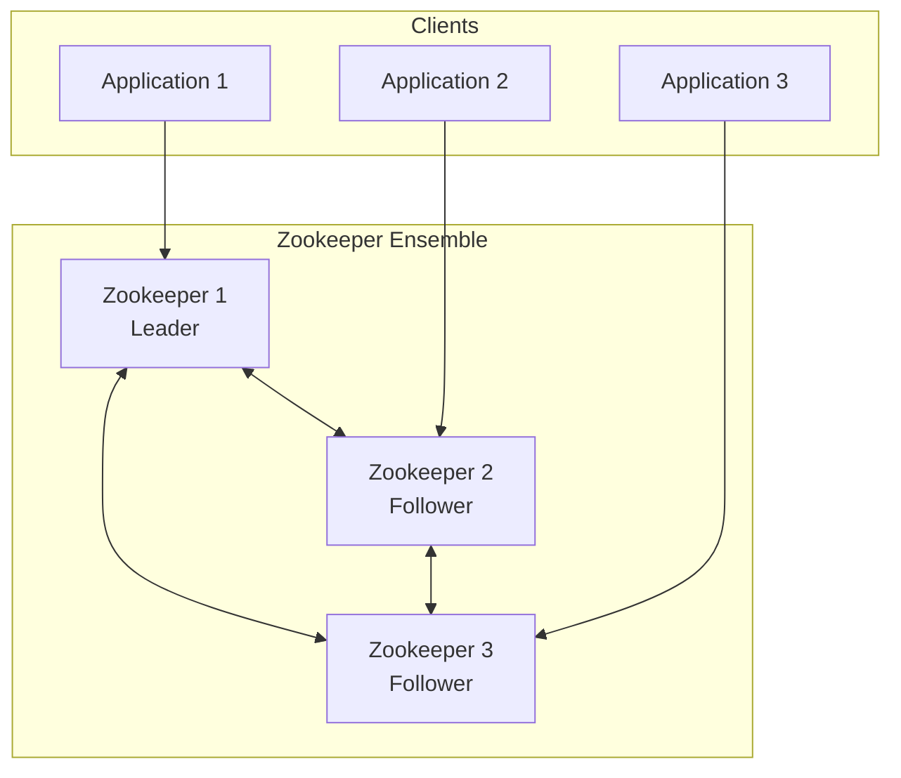

# How to Configure Zookeeper for Coordination

Author: [nawazdhandala](https://www.github.com/nawazdhandala)

Tags: Zookeeper, Coordination, Distributed Systems, Apache, DevOps

Description: Learn how to set up and configure Apache Zookeeper for distributed coordination, including cluster setup, znodes, watches, and common coordination patterns like leader election.

---

Apache Zookeeper is a centralized service for maintaining configuration information, naming, providing distributed synchronization, and group services. It provides a simple yet powerful coordination primitive that enables building complex distributed systems.

## Zookeeper Architecture

Zookeeper maintains a hierarchical namespace (similar to a filesystem) where each node is called a znode. Clients connect to any server in the ensemble, and the ensemble maintains consistency through a consensus protocol.



## 1. Install Zookeeper

Download and configure Zookeeper on your servers:

```bash
# Download Zookeeper
wget https://downloads.apache.org/zookeeper/zookeeper-3.9.1/apache-zookeeper-3.9.1-bin.tar.gz
tar -xzf apache-zookeeper-3.9.1-bin.tar.gz
sudo mv apache-zookeeper-3.9.1-bin /opt/zookeeper

# Create user and directories
sudo useradd --system --home /opt/zookeeper --shell /bin/false zookeeper
sudo mkdir -p /var/lib/zookeeper/data
sudo mkdir -p /var/lib/zookeeper/logs
sudo chown -R zookeeper:zookeeper /opt/zookeeper /var/lib/zookeeper
```

## 2. Configure Zookeeper Server

Create the main configuration file for a 3-node ensemble:

`/opt/zookeeper/conf/zoo.cfg`

```properties
# Basic time unit in milliseconds
tickTime=2000

# Number of ticks for initial synchronization
initLimit=10

# Number of ticks for sync between followers and leader
syncLimit=5

# Directory for storing snapshots
dataDir=/var/lib/zookeeper/data

# Directory for transaction logs (use fast storage)
dataLogDir=/var/lib/zookeeper/logs

# Client connection port
clientPort=2181

# Maximum client connections
maxClientCnxns=60

# Ensemble members: server.id=host:peer_port:election_port
server.1=zk1.example.com:2888:3888
server.2=zk2.example.com:2888:3888
server.3=zk3.example.com:2888:3888

# Enable admin server
admin.serverPort=8080
admin.enableServer=true

# Autopurge settings
autopurge.snapRetainCount=3
autopurge.purgeInterval=1

# 4-letter words whitelist
4lw.commands.whitelist=mntr,conf,ruok,stat,srvr
```

Create the myid file on each server:

```bash
# On server 1
echo "1" | sudo tee /var/lib/zookeeper/data/myid

# On server 2
echo "2" | sudo tee /var/lib/zookeeper/data/myid

# On server 3
echo "3" | sudo tee /var/lib/zookeeper/data/myid
```

## 3. Create Systemd Service

`/etc/systemd/system/zookeeper.service`

```ini
[Unit]
Description=Apache Zookeeper
Documentation=https://zookeeper.apache.org/doc/current/
After=network-online.target
Wants=network-online.target

[Service]
Type=forking
User=zookeeper
Group=zookeeper
Environment="JAVA_HOME=/usr/lib/jvm/java-11-openjdk"
Environment="ZOO_LOG_DIR=/var/lib/zookeeper/logs"
ExecStart=/opt/zookeeper/bin/zkServer.sh start
ExecStop=/opt/zookeeper/bin/zkServer.sh stop
ExecReload=/opt/zookeeper/bin/zkServer.sh restart
Restart=on-failure
RestartSec=10

[Install]
WantedBy=multi-user.target
```

Start Zookeeper:

```bash
sudo systemctl daemon-reload
sudo systemctl enable zookeeper
sudo systemctl start zookeeper

# Check status
/opt/zookeeper/bin/zkServer.sh status
```

## 4. Basic Znode Operations

Use the Zookeeper CLI to manage znodes:

```bash
# Connect to Zookeeper
/opt/zookeeper/bin/zkCli.sh -server localhost:2181

# Create a persistent znode
create /myapp "application data"

# Create a znode with sub-path
create /myapp/config "configuration data"

# Create an ephemeral znode (deleted when session ends)
create -e /myapp/leader "leader-1"

# Create a sequential znode
create -s /myapp/workers/worker- "worker data"
# Creates /myapp/workers/worker-0000000001

# Read znode data
get /myapp/config

# Update znode data
set /myapp/config "new configuration data"

# List children
ls /myapp

# Get znode statistics
stat /myapp/config

# Delete a znode
delete /myapp/old-config

# Delete recursively
deleteall /myapp/deprecated
```

## 5. Implement Watches

Watches allow clients to receive notifications when znodes change:

**Python Implementation:**

```python
from kazoo.client import KazooClient
from kazoo.recipe.watchers import DataWatch, ChildrenWatch
import time

class ZookeeperCoordinator:
    def __init__(self, hosts='localhost:2181'):
        self.zk = KazooClient(hosts=hosts)
        self.zk.start()
        self.config_cache = {}

    def ensure_path(self, path):
        """Create path if it doesn't exist."""
        self.zk.ensure_path(path)

    def set_config(self, key, value):
        """Store configuration value."""
        path = f"/config/{key}"
        self.zk.ensure_path("/config")

        if self.zk.exists(path):
            self.zk.set(path, value.encode())
        else:
            self.zk.create(path, value.encode())

    def get_config(self, key):
        """Get configuration value with caching."""
        if key in self.config_cache:
            return self.config_cache[key]

        path = f"/config/{key}"
        if self.zk.exists(path):
            data, stat = self.zk.get(path)
            value = data.decode()
            self.config_cache[key] = value
            return value
        return None

    def watch_config(self, key, callback):
        """Watch a configuration key for changes."""
        path = f"/config/{key}"

        @self.zk.DataWatch(path)
        def watch_node(data, stat):
            if data is not None:
                value = data.decode()
                self.config_cache[key] = value
                callback(key, value)
            return True  # Keep watching

    def watch_children(self, path, callback):
        """Watch for children changes."""
        @self.zk.ChildrenWatch(path)
        def watch_children_node(children):
            callback(path, children)
            return True  # Keep watching

    def register_service(self, service_name, instance_id, data):
        """Register a service instance (ephemeral node)."""
        path = f"/services/{service_name}/{instance_id}"
        self.zk.ensure_path(f"/services/{service_name}")

        # Ephemeral node - auto-deleted when session ends
        self.zk.create(path, data.encode(), ephemeral=True)
        return path

    def get_service_instances(self, service_name):
        """Get all instances of a service."""
        path = f"/services/{service_name}"
        if not self.zk.exists(path):
            return []

        instances = []
        children = self.zk.get_children(path)
        for child in children:
            data, stat = self.zk.get(f"{path}/{child}")
            instances.append({
                'id': child,
                'data': data.decode()
            })
        return instances

    def close(self):
        """Close the connection."""
        self.zk.stop()
        self.zk.close()

# Usage
def on_config_change(key, value):
    print(f"Configuration changed: {key} = {value}")

def on_services_change(path, children):
    print(f"Services changed at {path}: {children}")

coordinator = ZookeeperCoordinator()

# Set configuration
coordinator.set_config('database_url', 'postgresql://localhost:5432/db')

# Watch for changes
coordinator.watch_config('database_url', on_config_change)

# Register service
coordinator.register_service('api', 'api-1', '{"host": "10.0.1.10", "port": 8080}')

# Watch service instances
coordinator.watch_children('/services/api', on_services_change)

# Keep running
try:
    while True:
        time.sleep(1)
except KeyboardInterrupt:
    coordinator.close()
```

**Java Implementation:**

```java
import org.apache.zookeeper.*;
import org.apache.zookeeper.data.Stat;
import java.util.*;
import java.util.concurrent.CountDownLatch;

public class ZookeeperCoordinator implements Watcher {
    private ZooKeeper zk;
    private final Map<String, String> configCache = new HashMap<>();
    private final List<ConfigChangeListener> listeners = new ArrayList<>();

    public interface ConfigChangeListener {
        void onConfigChange(String key, String value);
    }

    public ZookeeperCoordinator(String hosts) throws Exception {
        CountDownLatch connectedSignal = new CountDownLatch(1);

        zk = new ZooKeeper(hosts, 5000, event -> {
            if (event.getState() == Event.KeeperState.SyncConnected) {
                connectedSignal.countDown();
            }
        });

        connectedSignal.await();
    }

    @Override
    public void process(WatchedEvent event) {
        if (event.getType() == Event.EventType.NodeDataChanged) {
            String path = event.getPath();
            String key = path.substring("/config/".length());

            try {
                String value = getConfig(key);
                for (ConfigChangeListener listener : listeners) {
                    listener.onConfigChange(key, value);
                }
                // Re-register watch
                watchConfig(key);
            } catch (Exception e) {
                e.printStackTrace();
            }
        }
    }

    public void setConfig(String key, String value) throws Exception {
        String path = "/config/" + key;
        ensurePath("/config");

        Stat stat = zk.exists(path, false);
        if (stat != null) {
            zk.setData(path, value.getBytes(), -1);
        } else {
            zk.create(path, value.getBytes(),
                     ZooDefs.Ids.OPEN_ACL_UNSAFE,
                     CreateMode.PERSISTENT);
        }
        configCache.put(key, value);
    }

    public String getConfig(String key) throws Exception {
        if (configCache.containsKey(key)) {
            return configCache.get(key);
        }

        String path = "/config/" + key;
        Stat stat = zk.exists(path, false);
        if (stat == null) {
            return null;
        }

        byte[] data = zk.getData(path, false, stat);
        String value = new String(data);
        configCache.put(key, value);
        return value;
    }

    public void watchConfig(String key) throws Exception {
        String path = "/config/" + key;
        zk.getData(path, this, null);
    }

    public void addListener(ConfigChangeListener listener) {
        listeners.add(listener);
    }

    private void ensurePath(String path) throws Exception {
        if (zk.exists(path, false) == null) {
            zk.create(path, new byte[0],
                     ZooDefs.Ids.OPEN_ACL_UNSAFE,
                     CreateMode.PERSISTENT);
        }
    }

    public void close() throws Exception {
        zk.close();
    }

    public static void main(String[] args) throws Exception {
        ZookeeperCoordinator coord = new ZookeeperCoordinator("localhost:2181");

        coord.addListener((key, value) -> {
            System.out.println("Config changed: " + key + " = " + value);
        });

        coord.setConfig("database_url", "postgresql://localhost:5432/db");
        coord.watchConfig("database_url");

        Thread.sleep(Long.MAX_VALUE);
    }
}
```

## 6. Configure Authentication

Enable SASL authentication for security:

`/opt/zookeeper/conf/jaas.conf`

```
Server {
    org.apache.zookeeper.server.auth.DigestLoginModule required
    user_admin="admin_password"
    user_client="client_password";
};
```

Update zoo.cfg:

```properties
# Authentication settings
authProvider.1=org.apache.zookeeper.server.auth.SASLAuthenticationProvider
requireClientAuthScheme=sasl
jaasLoginRenew=3600000
```

Set the JAAS configuration in the startup:

```bash
export SERVER_JVMFLAGS="-Djava.security.auth.login.config=/opt/zookeeper/conf/jaas.conf"
```

## 7. Monitor Zookeeper

Use the 4-letter commands for monitoring:

```bash
# Check if server is running
echo ruok | nc localhost 2181
# imok

# Get server statistics
echo stat | nc localhost 2181

# Get detailed monitoring metrics
echo mntr | nc localhost 2181

# Get server configuration
echo conf | nc localhost 2181

# List outstanding sessions
echo cons | nc localhost 2181
```

## Best Practices

1. **Use odd number of servers** - Deploy 3, 5, or 7 servers for proper quorum
2. **Separate transaction logs** - Use fast SSD storage for dataLogDir
3. **Enable autopurge** - Prevent disk from filling with old snapshots
4. **Monitor closely** - Track latency, outstanding requests, and leader elections
5. **Use ephemeral nodes** - For service registration and leader election
6. **Keep znodes small** - Default limit is 1MB, keep data under 1KB when possible

---

Zookeeper provides the foundational coordination primitives needed for building reliable distributed systems. With proper configuration of the ensemble and understanding of watches and ephemeral nodes, you can implement complex coordination patterns like leader election, distributed locks, and service discovery.
