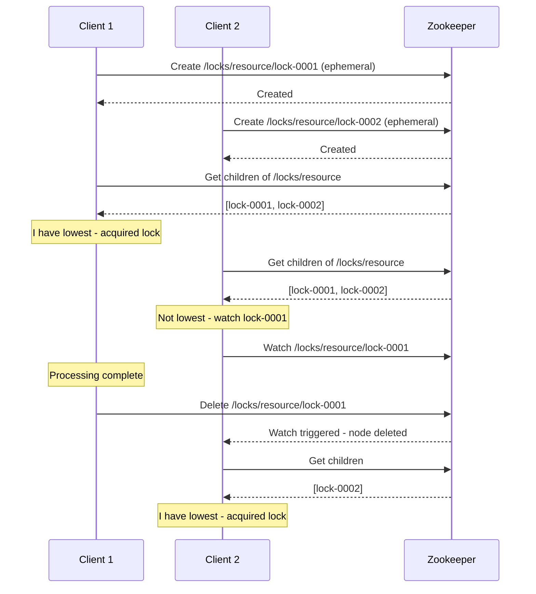

# How to Implement Distributed Locking with Zookeeper

Author: [nawazdhandala](https://www.github.com/nawazdhandala)

Tags: Zookeeper, Distributed Locking, Coordination, Apache, Concurrency

Description: Learn how to implement distributed locks using Apache Zookeeper for coordinating access to shared resources across multiple processes and machines.

---

Distributed locking is essential when multiple processes need exclusive access to a shared resource. Unlike local locks, distributed locks must handle network partitions, process failures, and partial failures gracefully. Zookeeper's ephemeral sequential nodes provide the primitives needed to build reliable distributed locks.

## How Distributed Locking Works

Zookeeper-based locks use ephemeral sequential nodes. Each client creates a node and watches the node with the next lowest sequence number. The client with the lowest sequence number holds the lock.



## 1. Basic Lock Implementation in Python

Implement a distributed lock using the Kazoo library.

```python
from kazoo.client import KazooClient
from kazoo.recipe.lock import Lock
import time
import threading

class DistributedLock:
    def __init__(self, zk_hosts='localhost:2181', lock_path='/locks'):
        self.zk = KazooClient(hosts=zk_hosts)
        self.zk.start()
        self.lock_path = lock_path
        self.zk.ensure_path(lock_path)

    def acquire_lock(self, resource_name, timeout=None):
        """Acquire a lock on a resource."""
        lock_path = f"{self.lock_path}/{resource_name}"
        lock = Lock(self.zk, lock_path)

        acquired = lock.acquire(timeout=timeout)
        if acquired:
            return lock
        return None

    def release_lock(self, lock):
        """Release a lock."""
        if lock:
            lock.release()

    def with_lock(self, resource_name, timeout=None):
        """Context manager for acquiring a lock."""
        lock_path = f"{self.lock_path}/{resource_name}"
        return Lock(self.zk, lock_path)

    def close(self):
        """Close the Zookeeper connection."""
        self.zk.stop()
        self.zk.close()

# Usage with context manager
def process_with_lock():
    dl = DistributedLock()

    try:
        with dl.with_lock('database-migration') as lock:
            print("Lock acquired, running migration...")
            # Only one process runs this at a time
            run_database_migration()
            print("Migration complete")
    except Exception as e:
        print(f"Failed to acquire lock: {e}")
    finally:
        dl.close()

# Usage with manual lock management
def manual_lock_example():
    dl = DistributedLock()

    lock = dl.acquire_lock('report-generation', timeout=30)
    if lock:
        try:
            print("Generating report...")
            generate_report()
        finally:
            dl.release_lock(lock)
    else:
        print("Could not acquire lock")

    dl.close()
```

## 2. Advanced Lock with Timeout and Retry

Implement a more robust lock with configurable retry behavior.

```python
from kazoo.client import KazooClient
from kazoo.exceptions import LockTimeout, ConnectionLoss
import time
import uuid
import logging

logging.basicConfig(level=logging.INFO)
logger = logging.getLogger(__name__)

class RobustDistributedLock:
    def __init__(self, zk_hosts='localhost:2181'):
        self.zk = KazooClient(hosts=zk_hosts)
        self.zk.add_listener(self._connection_listener)
        self.zk.start()
        self._locks = {}

    def _connection_listener(self, state):
        logger.info(f"Zookeeper connection state: {state}")

    def acquire(
        self,
        resource: str,
        timeout: float = 30,
        retry_count: int = 3,
        retry_delay: float = 1.0
    ) -> str:
        """
        Acquire a distributed lock with retry logic.
        Returns a lock_id that must be used to release the lock.
        """
        lock_path = f"/locks/{resource}"
        self.zk.ensure_path(lock_path)

        lock_id = str(uuid.uuid4())

        for attempt in range(retry_count):
            try:
                # Create ephemeral sequential node
                node_path = self.zk.create(
                    f"{lock_path}/lock-",
                    lock_id.encode(),
                    ephemeral=True,
                    sequence=True
                )
                node_name = node_path.split('/')[-1]

                # Try to acquire the lock
                if self._try_acquire(lock_path, node_name, timeout):
                    self._locks[lock_id] = node_path
                    logger.info(f"Lock acquired: {resource} ({lock_id})")
                    return lock_id

                # Failed to acquire - clean up our node
                self.zk.delete(node_path)

            except ConnectionLoss:
                logger.warning(f"Connection lost, attempt {attempt + 1}/{retry_count}")
                time.sleep(retry_delay * (attempt + 1))
                continue

            except Exception as e:
                logger.error(f"Lock acquisition failed: {e}")
                break

        raise LockTimeout(f"Failed to acquire lock for {resource}")

    def _try_acquire(self, lock_path: str, my_node: str, timeout: float) -> bool:
        """Attempt to acquire the lock using the Zookeeper recipe."""
        deadline = time.time() + timeout

        while time.time() < deadline:
            children = sorted(self.zk.get_children(lock_path))

            if not children:
                return False

            # Check if we have the lowest sequence number
            if children[0] == my_node:
                return True

            # Find the node just before ours to watch
            my_index = children.index(my_node)
            watch_node = children[my_index - 1]
            watch_path = f"{lock_path}/{watch_node}"

            # Set up a watch and wait
            event = threading.Event()

            def watch_callback(event_data):
                event.set()

            if self.zk.exists(watch_path, watch=watch_callback):
                # Wait for the watch to trigger or timeout
                remaining = deadline - time.time()
                if remaining > 0:
                    event.wait(timeout=remaining)
            else:
                # Node already deleted, try again immediately
                continue

        return False

    def release(self, lock_id: str) -> bool:
        """Release a lock using the lock_id returned by acquire()."""
        if lock_id not in self._locks:
            logger.warning(f"Lock not found: {lock_id}")
            return False

        node_path = self._locks.pop(lock_id)
        try:
            self.zk.delete(node_path)
            logger.info(f"Lock released: {lock_id}")
            return True
        except Exception as e:
            logger.error(f"Failed to release lock: {e}")
            return False

    def is_locked(self, resource: str) -> bool:
        """Check if a resource is currently locked."""
        lock_path = f"/locks/{resource}"
        try:
            children = self.zk.get_children(lock_path)
            return len(children) > 0
        except Exception:
            return False

    def close(self):
        """Release all locks and close connection."""
        for lock_id in list(self._locks.keys()):
            self.release(lock_id)
        self.zk.stop()
        self.zk.close()

# Usage
lock_manager = RobustDistributedLock()

try:
    lock_id = lock_manager.acquire('payment-processor', timeout=10)

    # Critical section - only one process at a time
    process_payment()

    lock_manager.release(lock_id)
except LockTimeout:
    print("Could not acquire lock - another process is using the resource")
finally:
    lock_manager.close()
```

## 3. Read-Write Lock Implementation

Implement a lock that allows multiple readers but only one writer.

```python
from kazoo.client import KazooClient
import threading
import time

class DistributedReadWriteLock:
    def __init__(self, zk_hosts='localhost:2181', lock_path='/rwlocks'):
        self.zk = KazooClient(hosts=zk_hosts)
        self.zk.start()
        self.lock_path = lock_path

    def _ensure_path(self, resource):
        path = f"{self.lock_path}/{resource}"
        self.zk.ensure_path(path)
        return path

    def acquire_read(self, resource: str, timeout: float = 30) -> str:
        """Acquire a read lock. Multiple readers can hold the lock."""
        base_path = self._ensure_path(resource)

        # Create read lock node
        node_path = self.zk.create(
            f"{base_path}/read-",
            b"read",
            ephemeral=True,
            sequence=True
        )
        node_name = node_path.split('/')[-1]

        deadline = time.time() + timeout

        while time.time() < deadline:
            children = self.zk.get_children(base_path)

            # Get all write locks
            write_locks = sorted([c for c in children if c.startswith('write-')])

            if not write_locks:
                # No write locks, read is granted
                return node_path

            # Check if any write lock has a lower sequence than ours
            my_seq = int(node_name.split('-')[-1])
            blocking_writes = [w for w in write_locks
                             if int(w.split('-')[-1]) < my_seq]

            if not blocking_writes:
                # No blocking write locks
                return node_path

            # Wait for the highest blocking write lock
            watch_node = blocking_writes[-1]
            watch_path = f"{base_path}/{watch_node}"

            event = threading.Event()
            if self.zk.exists(watch_path, watch=lambda e: event.set()):
                remaining = deadline - time.time()
                if remaining > 0:
                    event.wait(timeout=remaining)

        # Timeout - clean up
        self.zk.delete(node_path)
        raise TimeoutError("Could not acquire read lock")

    def acquire_write(self, resource: str, timeout: float = 30) -> str:
        """Acquire a write lock. Exclusive access."""
        base_path = self._ensure_path(resource)

        # Create write lock node
        node_path = self.zk.create(
            f"{base_path}/write-",
            b"write",
            ephemeral=True,
            sequence=True
        )
        node_name = node_path.split('/')[-1]
        my_seq = int(node_name.split('-')[-1])

        deadline = time.time() + timeout

        while time.time() < deadline:
            children = self.zk.get_children(base_path)

            # Check for any lock with lower sequence
            all_locks = sorted(children, key=lambda x: int(x.split('-')[-1]))
            blocking = [l for l in all_locks
                       if int(l.split('-')[-1]) < my_seq]

            if not blocking:
                # No blocking locks
                return node_path

            # Wait for the lock just before us
            watch_node = blocking[-1]
            watch_path = f"{base_path}/{watch_node}"

            event = threading.Event()
            if self.zk.exists(watch_path, watch=lambda e: event.set()):
                remaining = deadline - time.time()
                if remaining > 0:
                    event.wait(timeout=remaining)

        # Timeout - clean up
        self.zk.delete(node_path)
        raise TimeoutError("Could not acquire write lock")

    def release(self, lock_path: str):
        """Release any lock."""
        try:
            self.zk.delete(lock_path)
        except Exception as e:
            print(f"Error releasing lock: {e}")

    def close(self):
        self.zk.stop()
        self.zk.close()

# Usage
rwlock = DistributedReadWriteLock()

# Multiple readers
def reader(id):
    lock = rwlock.acquire_read('shared-data')
    try:
        print(f"Reader {id}: reading data...")
        time.sleep(1)
    finally:
        rwlock.release(lock)

# Single writer
def writer(id):
    lock = rwlock.acquire_write('shared-data')
    try:
        print(f"Writer {id}: writing data...")
        time.sleep(2)
    finally:
        rwlock.release(lock)

# Start multiple readers and one writer
import concurrent.futures

with concurrent.futures.ThreadPoolExecutor(max_workers=5) as executor:
    futures = []
    for i in range(4):
        futures.append(executor.submit(reader, i))
    futures.append(executor.submit(writer, 0))

    concurrent.futures.wait(futures)

rwlock.close()
```

## 4. Java Implementation

Implement distributed locks using Apache Curator.

```java
import org.apache.curator.framework.CuratorFramework;
import org.apache.curator.framework.CuratorFrameworkFactory;
import org.apache.curator.framework.recipes.locks.InterProcessMutex;
import org.apache.curator.framework.recipes.locks.InterProcessReadWriteLock;
import org.apache.curator.retry.ExponentialBackoffRetry;

import java.util.concurrent.TimeUnit;

public class DistributedLockManager {
    private final CuratorFramework client;
    private final String lockBasePath;

    public DistributedLockManager(String zkConnection, String lockBasePath) {
        this.lockBasePath = lockBasePath;
        this.client = CuratorFrameworkFactory.newClient(
            zkConnection,
            new ExponentialBackoffRetry(1000, 3)
        );
        this.client.start();
    }

    public InterProcessMutex getMutex(String resourceName) {
        return new InterProcessMutex(client, lockBasePath + "/" + resourceName);
    }

    public InterProcessReadWriteLock getReadWriteLock(String resourceName) {
        return new InterProcessReadWriteLock(client, lockBasePath + "/" + resourceName);
    }

    public void close() {
        client.close();
    }

    public static void main(String[] args) throws Exception {
        DistributedLockManager lockManager = new DistributedLockManager(
            "localhost:2181",
            "/locks"
        );

        // Simple mutex example
        InterProcessMutex mutex = lockManager.getMutex("database-migration");

        if (mutex.acquire(30, TimeUnit.SECONDS)) {
            try {
                System.out.println("Lock acquired, running migration...");
                // Critical section
                Thread.sleep(5000);
                System.out.println("Migration complete");
            } finally {
                mutex.release();
                System.out.println("Lock released");
            }
        } else {
            System.out.println("Could not acquire lock");
        }

        // Read-write lock example
        InterProcessReadWriteLock rwLock = lockManager.getReadWriteLock("shared-data");

        // Acquire read lock
        rwLock.readLock().acquire();
        try {
            System.out.println("Reading shared data...");
        } finally {
            rwLock.readLock().release();
        }

        // Acquire write lock
        if (rwLock.writeLock().acquire(10, TimeUnit.SECONDS)) {
            try {
                System.out.println("Writing shared data...");
            } finally {
                rwLock.writeLock().release();
            }
        }

        lockManager.close();
    }
}
```

## 5. Lock with Automatic Extension

Extend lock timeout automatically while work is in progress.

```python
import threading
from kazoo.client import KazooClient
from kazoo.recipe.lock import Lock

class AutoExtendingLock:
    def __init__(self, zk_hosts, resource_name, ttl=30):
        self.zk = KazooClient(hosts=zk_hosts)
        self.zk.start()
        self.lock = Lock(self.zk, f"/locks/{resource_name}")
        self.ttl = ttl
        self._stop_extension = threading.Event()
        self._extension_thread = None

    def __enter__(self):
        self.lock.acquire()
        self._start_extension()
        return self

    def __exit__(self, exc_type, exc_val, exc_tb):
        self._stop_extension.set()
        if self._extension_thread:
            self._extension_thread.join()
        self.lock.release()
        return False

    def _start_extension(self):
        """Start background thread to extend lock."""
        def extend():
            while not self._stop_extension.wait(self.ttl / 3):
                # Touch the lock node to prevent expiration
                try:
                    self.zk.set(self.lock.path, b"heartbeat")
                except Exception as e:
                    print(f"Lock extension failed: {e}")
                    break

        self._extension_thread = threading.Thread(target=extend, daemon=True)
        self._extension_thread.start()

# Usage
with AutoExtendingLock('localhost:2181', 'long-running-job') as lock:
    # Lock is automatically extended while this runs
    perform_long_running_job()
```

## Best Practices

1. **Use ephemeral nodes** - Automatically release locks when client disconnects
2. **Implement timeouts** - Prevent deadlocks from failed processes
3. **Use sequential nodes** - Fair ordering prevents starvation
4. **Handle connection loss** - Re-acquire locks after reconnection
5. **Keep lock duration short** - Minimize contention window
6. **Monitor lock metrics** - Track wait times and contention

---

Distributed locking with Zookeeper provides reliable coordination for exclusive access to shared resources. By leveraging ephemeral sequential nodes and watches, you can build robust locking mechanisms that handle failures gracefully while ensuring mutual exclusion across your distributed system.
