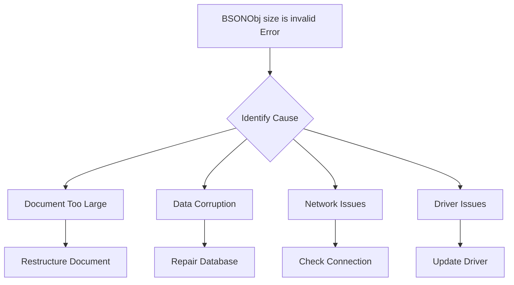

# How to Fix 'BSONObj size is invalid' Errors in MongoDB

Author: [nawazdhandala](https://www.github.com/nawazdhandala)

Tags: MongoDB, BSON, Database, Troubleshooting, Error Handling, Performance

Description: Learn how to diagnose and fix MongoDB 'BSONObj size is invalid' errors, understand BSON document size limits, and implement strategies to prevent document size issues in your applications.

---

The "BSONObj size is invalid" error in MongoDB is one of those cryptic messages that can stop your application in its tracks. This error typically occurs when MongoDB encounters a document that exceeds its size limits or when there is data corruption. Let's dive deep into understanding this error and how to fix it.

## Understanding the Error

MongoDB stores data in BSON (Binary JSON) format, which has a maximum document size of 16 megabytes. When you see the "BSONObj size is invalid" error, it usually means one of the following:

1. A document exceeds the 16MB limit
2. Data corruption in the document or collection
3. Network issues during data transfer
4. Driver compatibility issues



## Diagnosing the Problem

First, let's identify what's causing the error. Run these diagnostic commands in the MongoDB shell:

```javascript
// Check collection statistics
db.yourCollection.stats()

// Find large documents
db.yourCollection.find().forEach(function(doc) {
    var size = Object.bsonsize(doc);
    if (size > 1000000) { // Documents larger than 1MB
        print("Document ID: " + doc._id + " - Size: " + size + " bytes");
    }
});

// Check for problematic documents
db.yourCollection.aggregate([
    {
        $project: {
            _id: 1,
            docSize: { $bsonSize: "$$ROOT" }
        }
    },
    {
        $match: {
            docSize: { $gt: 10000000 } // 10MB threshold
        }
    },
    { $sort: { docSize: -1 } },
    { $limit: 10 }
]);
```

## Solution 1: Restructure Large Documents

If your documents are approaching the 16MB limit, restructure them using references instead of embedding:

```javascript
// Before: Embedded approach (can grow too large)
{
    _id: ObjectId("..."),
    userId: "user123",
    activityLog: [
        { timestamp: new Date(), action: "login", details: {...} },
        // Thousands more entries...
    ]
}

// After: Reference approach
// Main user document
{
    _id: ObjectId("..."),
    userId: "user123",
    activityLogIds: [ObjectId("..."), ObjectId("...")]
}

// Separate activity collection
{
    _id: ObjectId("..."),
    userId: "user123",
    timestamp: new Date(),
    action: "login",
    details: {...}
}
```

Here's a Node.js script to migrate large embedded arrays to separate collections:

```javascript
const { MongoClient, ObjectId } = require('mongodb');

async function migrateActivityLogs() {
    const client = new MongoClient('mongodb://localhost:27017');

    try {
        await client.connect();
        const db = client.db('yourDatabase');
        const usersCollection = db.collection('users');
        const activitiesCollection = db.collection('activities');

        const cursor = usersCollection.find({
            activityLog: { $exists: true }
        });

        while (await cursor.hasNext()) {
            const user = await cursor.next();

            if (user.activityLog && user.activityLog.length > 0) {
                // Insert activities into separate collection
                const activities = user.activityLog.map(activity => ({
                    ...activity,
                    userId: user._id,
                    createdAt: activity.timestamp || new Date()
                }));

                await activitiesCollection.insertMany(activities);

                // Remove embedded array from user document
                await usersCollection.updateOne(
                    { _id: user._id },
                    { $unset: { activityLog: "" } }
                );

                console.log(`Migrated ${activities.length} activities for user ${user._id}`);
            }
        }

        console.log('Migration completed successfully');
    } finally {
        await client.close();
    }
}

migrateActivityLogs().catch(console.error);
```

## Solution 2: Use GridFS for Large Files

If you're storing large binary data, use GridFS instead of regular documents:

```javascript
const { MongoClient, GridFSBucket } = require('mongodb');
const fs = require('fs');

async function storeFileWithGridFS(filePath, filename) {
    const client = new MongoClient('mongodb://localhost:27017');

    try {
        await client.connect();
        const db = client.db('yourDatabase');
        const bucket = new GridFSBucket(db, {
            bucketName: 'largeFiles'
        });

        // Upload file
        const uploadStream = bucket.openUploadStream(filename, {
            metadata: {
                uploadedAt: new Date(),
                contentType: 'application/pdf'
            }
        });

        const fileStream = fs.createReadStream(filePath);

        return new Promise((resolve, reject) => {
            fileStream.pipe(uploadStream)
                .on('error', reject)
                .on('finish', () => {
                    console.log(`File uploaded with ID: ${uploadStream.id}`);
                    resolve(uploadStream.id);
                });
        });
    } finally {
        await client.close();
    }
}

async function retrieveFileFromGridFS(fileId, outputPath) {
    const client = new MongoClient('mongodb://localhost:27017');

    try {
        await client.connect();
        const db = client.db('yourDatabase');
        const bucket = new GridFSBucket(db, {
            bucketName: 'largeFiles'
        });

        const downloadStream = bucket.openDownloadStream(fileId);
        const fileStream = fs.createWriteStream(outputPath);

        return new Promise((resolve, reject) => {
            downloadStream.pipe(fileStream)
                .on('error', reject)
                .on('finish', resolve);
        });
    } finally {
        await client.close();
    }
}
```

## Solution 3: Repair Corrupted Data

If the error is due to data corruption, you may need to repair the database:

```bash
# Stop MongoDB first
sudo systemctl stop mongod

# Run repair (standalone mode)
mongod --dbpath /var/lib/mongodb --repair

# For replica sets, resync from a healthy member instead
# On the corrupted member:
mongo --eval "rs.syncFrom('healthyMember:27017')"

# Or perform initial sync
sudo rm -rf /var/lib/mongodb/*
sudo systemctl start mongod
```

## Solution 4: Validate Collections

Run validation to identify and understand corruption issues:

```javascript
// Full validation
db.runCommand({ validate: "yourCollection", full: true })

// Check all collections in the database
db.getCollectionNames().forEach(function(collName) {
    var result = db.runCommand({ validate: collName });
    if (!result.valid) {
        print("Collection " + collName + " has issues:");
        printjson(result);
    }
});
```

## Solution 5: Handle the Error in Application Code

Implement proper error handling in your application:

```javascript
const { MongoClient } = require('mongodb');

class MongoDBService {
    constructor(uri) {
        this.client = new MongoClient(uri, {
            maxPoolSize: 10,
            serverSelectionTimeoutMS: 5000,
            socketTimeoutMS: 45000,
        });
    }

    async insertDocument(collection, document) {
        try {
            // Check document size before insert
            const docSize = JSON.stringify(document).length;
            const estimatedBsonSize = docSize * 1.5; // BSON is typically larger

            if (estimatedBsonSize > 15000000) { // 15MB threshold
                throw new Error(`Document too large: ${estimatedBsonSize} bytes (estimated)`);
            }

            const db = this.client.db('yourDatabase');
            const result = await db.collection(collection).insertOne(document);
            return result;

        } catch (error) {
            if (error.message.includes('BSONObj size is invalid') ||
                error.code === 10334) {
                console.error('Document size error:', error.message);
                // Handle large document - maybe split it
                return this.handleLargeDocument(collection, document);
            }
            throw error;
        }
    }

    async handleLargeDocument(collection, document) {
        // Split arrays into separate documents
        const maxArraySize = 1000;

        for (const [key, value] of Object.entries(document)) {
            if (Array.isArray(value) && value.length > maxArraySize) {
                // Store array items separately
                const db = this.client.db('yourDatabase');
                const refCollection = `${collection}_${key}`;

                const chunks = this.chunkArray(value, maxArraySize);
                const chunkIds = [];

                for (const chunk of chunks) {
                    const result = await db.collection(refCollection).insertOne({
                        parentId: document._id,
                        items: chunk,
                        createdAt: new Date()
                    });
                    chunkIds.push(result.insertedId);
                }

                document[key] = chunkIds; // Replace with references
            }
        }

        const db = this.client.db('yourDatabase');
        return db.collection(collection).insertOne(document);
    }

    chunkArray(array, size) {
        const chunks = [];
        for (let i = 0; i < array.length; i += size) {
            chunks.push(array.slice(i, i + size));
        }
        return chunks;
    }
}
```

## Prevention Strategies

Implement these strategies to prevent BSON size errors:

```javascript
// Document size monitoring middleware
function documentSizeCheck(schema) {
    schema.pre('save', function(next) {
        const doc = this.toObject();
        const size = Buffer.byteLength(JSON.stringify(doc));

        if (size > 14000000) { // 14MB warning threshold
            console.warn(`Large document warning: ${size} bytes for ${this.constructor.modelName}`);
        }

        if (size > 15500000) { // 15.5MB error threshold
            return next(new Error('Document approaching BSON size limit'));
        }

        next();
    });
}

// Usage with Mongoose
const userSchema = new mongoose.Schema({
    name: String,
    data: mongoose.Schema.Types.Mixed
});

documentSizeCheck(userSchema);
```

## Monitoring Document Sizes

Set up monitoring to catch size issues before they become errors:

```javascript
// Aggregation pipeline to monitor document sizes
async function monitorDocumentSizes(db) {
    const collections = await db.listCollections().toArray();

    for (const coll of collections) {
        const stats = await db.collection(coll.name).aggregate([
            {
                $project: {
                    docSize: { $bsonSize: "$$ROOT" }
                }
            },
            {
                $group: {
                    _id: null,
                    avgSize: { $avg: "$docSize" },
                    maxSize: { $max: "$docSize" },
                    minSize: { $min: "$docSize" },
                    totalDocs: { $sum: 1 }
                }
            }
        ]).toArray();

        if (stats.length > 0) {
            console.log(`Collection: ${coll.name}`);
            console.log(`  Average Size: ${(stats[0].avgSize / 1024).toFixed(2)} KB`);
            console.log(`  Max Size: ${(stats[0].maxSize / 1024).toFixed(2)} KB`);
            console.log(`  Total Documents: ${stats[0].totalDocs}`);
        }
    }
}
```

## Conclusion

The "BSONObj size is invalid" error in MongoDB usually indicates either document size issues or data corruption. By implementing proper document design patterns, using GridFS for large files, and adding size monitoring to your application, you can prevent these errors from occurring. Always design your schema with document growth in mind, and prefer references over deeply embedded arrays when dealing with potentially large datasets.
