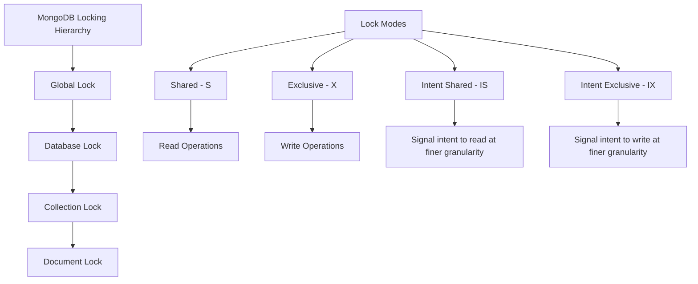

# How to Fix 'cannot acquire exclusive lock' Errors in MongoDB

Author: [nawazdhandala](https://www.github.com/nawazdhandala)

Tags: MongoDB, Locking, Database, Troubleshooting, Concurrency, Performance

Description: Learn how to diagnose and resolve MongoDB 'cannot acquire exclusive lock' errors, understand MongoDB's locking mechanism, and implement strategies to prevent lock contention issues.

---

The "cannot acquire exclusive lock" error in MongoDB occurs when an operation requiring exclusive access to a resource cannot proceed because another operation holds a conflicting lock. This error can halt critical operations like index creation, collection drops, and schema modifications. Let's explore how to diagnose and fix these issues.

## Understanding MongoDB Locking

MongoDB uses a multi-granularity locking system with different lock types:



## Diagnosing Lock Issues

First, identify what's causing the lock contention:

```javascript
// Check current operations and locks
db.currentOp({
    $or: [
        { "locks": { $exists: true } },
        { "waitingForLock": true }
    ]
})

// Find operations waiting for locks
db.currentOp({
    "waitingForLock": true
})

// Find long-running operations
db.currentOp({
    "active": true,
    "secs_running": { $gt: 5 }
})

// Check lock statistics
db.serverStatus().locks

// Detailed lock info
db.serverStatus().globalLock
```

Here's a comprehensive diagnostic script:

```javascript
function diagnoseLockIssues() {
    print("=== Lock Diagnostic Report ===\n");

    // Current lock state
    const globalLock = db.serverStatus().globalLock;
    print("Global Lock Info:");
    print("  Total time locked (microsecs): " + globalLock.totalTime);
    print("  Current queue - readers: " + globalLock.currentQueue.readers);
    print("  Current queue - writers: " + globalLock.currentQueue.writers);
    print("  Active clients - readers: " + globalLock.activeClients.readers);
    print("  Active clients - writers: " + globalLock.activeClients.writers);

    // Operations waiting for locks
    print("\nOperations Waiting for Locks:");
    db.currentOp({ "waitingForLock": true }).inprog.forEach(function(op) {
        print("  OpId: " + op.opid);
        print("  Type: " + op.op);
        print("  Namespace: " + op.ns);
        print("  Waiting: " + op.secs_running + " seconds");
        print("  ---");
    });

    // Long-running operations holding locks
    print("\nLong-Running Operations (>5s):");
    db.currentOp({
        "active": true,
        "secs_running": { $gt: 5 }
    }).inprog.forEach(function(op) {
        print("  OpId: " + op.opid);
        print("  Type: " + op.op);
        print("  Namespace: " + op.ns);
        print("  Running: " + op.secs_running + " seconds");
        print("  Locks: " + JSON.stringify(op.locks));
        print("  ---");
    });
}

diagnoseLockIssues();
```

## Common Scenarios and Solutions

### Scenario 1: Index Creation Blocking

Background index builds can still cause lock issues:

```javascript
// Problem: Index creation blocking other operations
db.largeCollection.createIndex({ field: 1 })  // Blocks collection

// Solution 1: Use background option (MongoDB 4.0 and earlier)
db.largeCollection.createIndex({ field: 1 }, { background: true })

// Solution 2: Use rolling index build on replica sets (Recommended)
// Build index on secondaries first, then step down primary

// In Node.js - check index build progress
const { MongoClient } = require('mongodb');

async function monitorIndexBuild(client, dbName, collectionName) {
    const db = client.db(dbName);

    const checkProgress = async () => {
        const ops = await db.admin().command({ currentOp: 1 });
        const indexBuilds = ops.inprog.filter(op =>
            op.command && op.command.createIndexes === collectionName
        );

        if (indexBuilds.length > 0) {
            indexBuilds.forEach(build => {
                console.log(`Index build progress: ${JSON.stringify(build.progress)}`);
            });
            setTimeout(checkProgress, 5000);
        } else {
            console.log('Index build completed');
        }
    };

    checkProgress();
}
```

### Scenario 2: Collection Operations During High Traffic

```javascript
// Problem: Cannot drop/rename collection due to active operations
db.orders.drop()  // Fails with lock error

// Solution: Graceful shutdown approach
const { MongoClient } = require('mongodb');

class CollectionManager {
    constructor(client) {
        this.client = client;
    }

    async safeDropCollection(dbName, collectionName, options = {}) {
        const { maxWaitTime = 30000, checkInterval = 1000 } = options;
        const db = this.client.db(dbName);

        const startTime = Date.now();

        while (Date.now() - startTime < maxWaitTime) {
            // Check for active operations
            const ops = await db.admin().command({
                currentOp: 1,
                ns: `${dbName}.${collectionName}`
            });

            const activeOps = ops.inprog.filter(op =>
                op.active && op.op !== 'none'
            );

            if (activeOps.length === 0) {
                // No active operations, safe to drop
                try {
                    await db.collection(collectionName).drop();
                    console.log(`Collection ${collectionName} dropped successfully`);
                    return true;
                } catch (error) {
                    if (error.code === 26) {  // NamespaceNotFound
                        console.log('Collection already dropped');
                        return true;
                    }
                    throw error;
                }
            }

            console.log(`Waiting for ${activeOps.length} operations to complete...`);
            await new Promise(resolve => setTimeout(resolve, checkInterval));
        }

        throw new Error(`Timeout waiting for collection to be free`);
    }

    async safeRenameCollection(dbName, oldName, newName, options = {}) {
        const { maxWaitTime = 30000 } = options;
        const db = this.client.db(dbName);

        const startTime = Date.now();

        while (Date.now() - startTime < maxWaitTime) {
            try {
                await db.collection(oldName).rename(newName);
                console.log(`Renamed ${oldName} to ${newName}`);
                return true;
            } catch (error) {
                if (error.code === 11600 || error.message.includes('lock')) {
                    console.log('Lock conflict, retrying...');
                    await new Promise(resolve => setTimeout(resolve, 1000));
                } else {
                    throw error;
                }
            }
        }

        throw new Error('Timeout waiting for rename operation');
    }
}
```

### Scenario 3: Compact or Repair Operations

```javascript
// Problem: Compact requires exclusive lock
db.runCommand({ compact: "largeCollection" })  // May fail

// Solution: Schedule during maintenance window
const { MongoClient } = require('mongodb');

async function scheduleCompact(client, dbName, collectionName) {
    const db = client.db(dbName);

    // Check if it's a good time to compact
    const serverStatus = await db.admin().serverStatus();
    const globalLock = serverStatus.globalLock;

    // Only proceed if queue is empty
    if (globalLock.currentQueue.readers > 0 ||
        globalLock.currentQueue.writers > 0) {
        console.log('Operations in queue, skipping compact');
        return false;
    }

    // Check active operations
    const ops = await db.admin().command({ currentOp: 1 });
    const activeOps = ops.inprog.filter(op =>
        op.active && op.secs_running > 0
    );

    if (activeOps.length > 5) {  // Too many active operations
        console.log('Too many active operations, skipping compact');
        return false;
    }

    // Proceed with compact
    console.log('Starting compact operation...');
    try {
        await db.command({ compact: collectionName, force: true });
        console.log('Compact completed successfully');
        return true;
    } catch (error) {
        console.error('Compact failed:', error.message);
        return false;
    }
}
```

### Scenario 4: Schema Validation Changes

```javascript
// Problem: Modifying collection validation requires exclusive lock
db.runCommand({
    collMod: "users",
    validator: { $jsonSchema: { ... } }
})

// Solution: Apply during low-traffic period with retry
async function updateValidation(client, dbName, collectionName, validator) {
    const db = client.db(dbName);
    const maxRetries = 5;
    let retries = 0;

    while (retries < maxRetries) {
        try {
            await db.command({
                collMod: collectionName,
                validator: validator,
                validationLevel: "moderate",
                validationAction: "warn"  // Start with warn, then switch to error
            });

            console.log('Validation updated successfully');
            return true;
        } catch (error) {
            if (error.code === 11600 || error.message.includes('lock')) {
                retries++;
                console.log(`Lock conflict, retry ${retries}/${maxRetries}`);
                await new Promise(resolve =>
                    setTimeout(resolve, 1000 * Math.pow(2, retries))
                );
            } else {
                throw error;
            }
        }
    }

    throw new Error('Failed to update validation after max retries');
}
```

## Killing Blocking Operations

When necessary, kill operations that are blocking others:

```javascript
// Find and kill blocking operations
function killBlockingOperations(maxRunTime = 300) {
    const ops = db.currentOp({ "active": true }).inprog;

    ops.forEach(function(op) {
        if (op.secs_running > maxRunTime) {
            print("Killing operation: " + op.opid);
            print("  Running for: " + op.secs_running + " seconds");
            print("  Namespace: " + op.ns);
            print("  Operation: " + op.op);

            db.killOp(op.opid);
        }
    });
}

// In Node.js
async function killLongRunningOperations(client, maxSeconds = 300) {
    const admin = client.db('admin');
    const ops = await admin.command({ currentOp: 1, active: true });

    const longRunning = ops.inprog.filter(op =>
        op.secs_running > maxSeconds && op.opid
    );

    for (const op of longRunning) {
        console.log(`Killing operation ${op.opid} (running ${op.secs_running}s)`);
        await admin.command({ killOp: 1, op: op.opid });
    }

    return longRunning.length;
}
```

## Prevention Strategies

### Connection Pool Management

```javascript
const { MongoClient } = require('mongodb');

// Properly configured connection pool
const client = new MongoClient('mongodb://localhost:27017', {
    maxPoolSize: 50,           // Limit concurrent connections
    minPoolSize: 5,            // Maintain minimum connections
    maxIdleTimeMS: 30000,      // Close idle connections
    waitQueueTimeoutMS: 5000,  // Timeout for waiting connections
    serverSelectionTimeoutMS: 5000
});

// Implement operation timeout
async function queryWithTimeout(collection, query, options = {}) {
    const { timeoutMs = 10000 } = options;

    const cursor = collection.find(query).maxTimeMS(timeoutMs);

    try {
        return await cursor.toArray();
    } catch (error) {
        if (error.code === 50) {  // MaxTimeMSExpired
            console.log('Query timed out, may indicate lock contention');
        }
        throw error;
    }
}
```

### Write Concern and Read Preference

```javascript
// Use appropriate write concern to reduce lock contention
const collection = client.db('mydb').collection('orders');

// For non-critical writes
await collection.insertOne(doc, {
    writeConcern: { w: 1, wtimeout: 5000 }
});

// Distribute reads to reduce primary lock pressure
const readCollection = client.db('mydb').collection('orders', {
    readPreference: 'secondaryPreferred'
});
```

### Monitoring and Alerting

```javascript
class LockMonitor {
    constructor(client, thresholds = {}) {
        this.client = client;
        this.thresholds = {
            queueLength: thresholds.queueLength || 10,
            waitTime: thresholds.waitTime || 5000,
            longRunningOp: thresholds.longRunningOp || 60
        };
    }

    async checkLockHealth() {
        const admin = this.client.db('admin');
        const status = await admin.serverStatus();

        const alerts = [];

        // Check queue length
        const queue = status.globalLock.currentQueue;
        if (queue.readers + queue.writers > this.thresholds.queueLength) {
            alerts.push({
                level: 'warning',
                message: `Lock queue depth: ${queue.readers + queue.writers}`,
                metric: 'queue_depth'
            });
        }

        // Check for waiting operations
        const ops = await admin.command({ currentOp: 1 });
        const waitingOps = ops.inprog.filter(op => op.waitingForLock);

        if (waitingOps.length > 0) {
            alerts.push({
                level: 'warning',
                message: `${waitingOps.length} operations waiting for locks`,
                metric: 'waiting_ops',
                details: waitingOps.map(op => ({
                    opid: op.opid,
                    ns: op.ns,
                    op: op.op
                }))
            });
        }

        // Check for long-running operations
        const longRunning = ops.inprog.filter(op =>
            op.active && op.secs_running > this.thresholds.longRunningOp
        );

        if (longRunning.length > 0) {
            alerts.push({
                level: 'critical',
                message: `${longRunning.length} long-running operations`,
                metric: 'long_running_ops',
                details: longRunning.map(op => ({
                    opid: op.opid,
                    ns: op.ns,
                    secs_running: op.secs_running
                }))
            });
        }

        return {
            healthy: alerts.length === 0,
            alerts,
            metrics: {
                queueReaders: queue.readers,
                queueWriters: queue.writers,
                activeReaders: status.globalLock.activeClients.readers,
                activeWriters: status.globalLock.activeClients.writers
            }
        };
    }

    startMonitoring(intervalMs = 10000, callback) {
        return setInterval(async () => {
            const health = await this.checkLockHealth();
            callback(health);
        }, intervalMs);
    }
}

// Usage
const monitor = new LockMonitor(client, {
    queueLength: 5,
    longRunningOp: 30
});

monitor.startMonitoring(5000, (health) => {
    if (!health.healthy) {
        console.log('Lock health alerts:', health.alerts);
        // Send to alerting system
    }
});
```

## Conclusion

MongoDB's "cannot acquire exclusive lock" error typically indicates resource contention that needs immediate attention. The key strategies for handling these issues are: understand what operations require exclusive locks, monitor lock metrics proactively, implement retry logic with exponential backoff, schedule maintenance operations during low-traffic windows, and kill blocking operations when necessary. With proper monitoring and handling, you can minimize the impact of lock contention on your application's availability.
