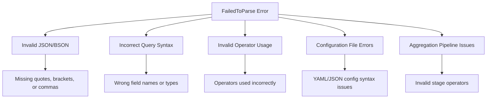

# How to Fix "FailedToParse" Errors in MongoDB

Author: [nawazdhandala](https://www.github.com/nawazdhandala)

Tags: MongoDB, Troubleshooting, Error Handling, Query Syntax, Database, Debugging

Description: Learn how to diagnose and fix MongoDB "FailedToParse" errors, understand common causes, and implement best practices to prevent parsing issues in your queries and configurations.

---

The "FailedToParse" error in MongoDB occurs when the server cannot interpret a command, query, or configuration due to syntax issues. These errors can be frustrating because they often provide limited information about what went wrong. This guide will help you identify, fix, and prevent parsing errors.

## Understanding FailedToParse Errors

FailedToParse errors occur at the parsing stage before MongoDB executes any operation. Common causes include:



## Common Causes and Solutions

### Cause 1: Invalid JSON Syntax

The most common cause is malformed JSON:

```javascript
// BAD: Missing quotes around field name
db.users.find({ name: "John" })  // This is actually fine in shell
// But this fails in strict JSON mode:
// { name: "John" } - quotes required around "name"

// BAD: Trailing comma
db.users.find({
    name: "John",
    age: 30,  // Trailing comma causes error in some contexts
})

// BAD: Single quotes instead of double quotes (in JSON)
db.users.insertOne({ 'name': 'John' })  // Works in shell
// But strict JSON requires: { "name": "John" }

// GOOD: Proper JSON
db.users.find({
    "name": "John",
    "age": 30
})
```

### Cause 2: Invalid Operator Syntax

Operators have specific syntax requirements:

```javascript
// BAD: $or without array
db.users.find({
    $or: { name: "John", name: "Jane" }  // Error!
})

// GOOD: $or with array
db.users.find({
    $or: [
        { name: "John" },
        { name: "Jane" }
    ]
})

// BAD: Comparison operator as top-level
db.users.find({
    $gt: { age: 30 }  // Error!
})

// GOOD: Comparison operator on field
db.users.find({
    age: { $gt: 30 }
})

// BAD: $elemMatch on non-array field context
db.users.find({
    name: { $elemMatch: { $eq: "John" } }  // Error if name is string
})

// GOOD: $elemMatch on array field
db.users.find({
    tags: { $elemMatch: { $eq: "active" } }
})

// BAD: Mixing query operators incorrectly
db.users.find({
    $and: {
        name: "John",
        age: 30
    }  // Error - $and needs array
})

// GOOD: Proper $and usage
db.users.find({
    $and: [
        { name: "John" },
        { age: 30 }
    ]
})
```

### Cause 3: Aggregation Pipeline Errors

Aggregation has strict syntax requirements:

```javascript
// BAD: Stage without $ prefix
db.orders.aggregate([
    { match: { status: "pending" } }  // Error!
])

// GOOD: Proper stage syntax
db.orders.aggregate([
    { $match: { status: "pending" } }
])

// BAD: Invalid accumulator in $group
db.orders.aggregate([
    {
        $group: {
            _id: "$customerId",
            total: "$amount"  // Error - needs accumulator
        }
    }
])

// GOOD: Proper accumulator usage
db.orders.aggregate([
    {
        $group: {
            _id: "$customerId",
            total: { $sum: "$amount" }
        }
    }
])

// BAD: Expression without $ in $project
db.orders.aggregate([
    {
        $project: {
            total: { multiply: ["$price", "$quantity"] }  // Error!
        }
    }
])

// GOOD: Proper expression syntax
db.orders.aggregate([
    {
        $project: {
            total: { $multiply: ["$price", "$quantity"] }
        }
    }
])

// BAD: Invalid $lookup syntax
db.orders.aggregate([
    {
        $lookup: {
            from: "customers",
            localField: "customerId",
            // Missing foreignField and as
        }
    }
])

// GOOD: Complete $lookup
db.orders.aggregate([
    {
        $lookup: {
            from: "customers",
            localField: "customerId",
            foreignField: "_id",
            as: "customerDetails"
        }
    }
])
```

### Cause 4: Configuration File Errors

MongoDB configuration files have specific format requirements:

```yaml
# BAD: Invalid YAML syntax in mongod.conf
storage:
  dbPath: /var/lib/mongodb
    journal:  # Wrong indentation!
      enabled: true

# GOOD: Proper YAML indentation
storage:
  dbPath: /var/lib/mongodb
  journal:
    enabled: true

# BAD: Invalid option
storage:
  dbPath: /var/lib/mongodb
  invalidOption: true  # FailedToParse

# GOOD: Valid options only
storage:
  dbPath: /var/lib/mongodb
  directoryPerDB: true
```

### Cause 5: Index Creation Errors

Index specifications have strict requirements:

```javascript
// BAD: Invalid index type
db.users.createIndex({ name: "invalid" })  // Error!

// GOOD: Valid index types
db.users.createIndex({ name: 1 })  // Ascending
db.users.createIndex({ name: -1 })  // Descending
db.users.createIndex({ name: "text" })  // Text index
db.users.createIndex({ location: "2dsphere" })  // Geospatial

// BAD: Invalid partial filter expression
db.users.createIndex(
    { email: 1 },
    {
        partialFilterExpression: {
            active: "true"  // String instead of boolean
        }
    }
)

// GOOD: Valid partial filter
db.users.createIndex(
    { email: 1 },
    {
        partialFilterExpression: {
            active: true
        }
    }
)

// BAD: Invalid collation
db.users.createIndex(
    { name: 1 },
    {
        collation: {
            locale: "en",
            strength: "2"  // String instead of number
        }
    }
)

// GOOD: Valid collation
db.users.createIndex(
    { name: 1 },
    {
        collation: {
            locale: "en",
            strength: 2
        }
    }
)
```

## Debugging FailedToParse Errors

Create a query validator to catch errors before execution:

```javascript
const { MongoClient } = require('mongodb');

class QueryValidator {
    constructor() {
        this.operatorRules = {
            $or: { requiresArray: true },
            $and: { requiresArray: true },
            $nor: { requiresArray: true },
            $in: { requiresArray: true },
            $nin: { requiresArray: true },
            $all: { requiresArray: true },
            $gt: { requiresValue: true },
            $gte: { requiresValue: true },
            $lt: { requiresValue: true },
            $lte: { requiresValue: true },
            $eq: { requiresValue: true },
            $ne: { requiresValue: true }
        };
    }

    validateQuery(query, path = '') {
        const errors = [];

        if (typeof query !== 'object' || query === null) {
            return errors;
        }

        for (const [key, value] of Object.entries(query)) {
            const currentPath = path ? `${path}.${key}` : key;

            if (key.startsWith('$')) {
                // Validate operator
                const operatorErrors = this.validateOperator(key, value, currentPath);
                errors.push(...operatorErrors);
            }

            // Recursively validate nested objects
            if (typeof value === 'object' && value !== null && !Array.isArray(value)) {
                const nestedErrors = this.validateQuery(value, currentPath);
                errors.push(...nestedErrors);
            }

            // Validate array elements
            if (Array.isArray(value)) {
                value.forEach((item, index) => {
                    if (typeof item === 'object' && item !== null) {
                        const nestedErrors = this.validateQuery(item, `${currentPath}[${index}]`);
                        errors.push(...nestedErrors);
                    }
                });
            }
        }

        return errors;
    }

    validateOperator(operator, value, path) {
        const errors = [];
        const rule = this.operatorRules[operator];

        if (rule) {
            if (rule.requiresArray && !Array.isArray(value)) {
                errors.push({
                    path,
                    operator,
                    message: `${operator} requires an array value`,
                    received: typeof value
                });
            }

            if (rule.requiresValue && value === undefined) {
                errors.push({
                    path,
                    operator,
                    message: `${operator} requires a value`,
                    received: 'undefined'
                });
            }
        }

        return errors;
    }

    validateAggregationPipeline(pipeline) {
        const errors = [];
        const validStages = [
            '$addFields', '$bucket', '$bucketAuto', '$collStats',
            '$count', '$facet', '$geoNear', '$graphLookup',
            '$group', '$indexStats', '$limit', '$listSessions',
            '$lookup', '$match', '$merge', '$out', '$planCacheStats',
            '$project', '$redact', '$replaceRoot', '$replaceWith',
            '$sample', '$search', '$set', '$skip', '$sort',
            '$sortByCount', '$unset', '$unwind'
        ];

        pipeline.forEach((stage, index) => {
            const stageKeys = Object.keys(stage);

            if (stageKeys.length !== 1) {
                errors.push({
                    stage: index,
                    message: 'Each stage must have exactly one operator',
                    keys: stageKeys
                });
            }

            const operator = stageKeys[0];

            if (!operator.startsWith('$')) {
                errors.push({
                    stage: index,
                    message: `Stage operator must start with $: ${operator}`,
                    suggestion: `$${operator}`
                });
            } else if (!validStages.includes(operator)) {
                errors.push({
                    stage: index,
                    message: `Unknown stage operator: ${operator}`,
                    validStages
                });
            }

            // Validate specific stages
            if (operator === '$group') {
                this.validateGroupStage(stage[operator], index, errors);
            } else if (operator === '$lookup') {
                this.validateLookupStage(stage[operator], index, errors);
            }
        });

        return errors;
    }

    validateGroupStage(group, stageIndex, errors) {
        if (!group._id && group._id !== null) {
            errors.push({
                stage: stageIndex,
                message: '$group requires an _id field'
            });
        }

        const validAccumulators = [
            '$sum', '$avg', '$min', '$max', '$first', '$last',
            '$push', '$addToSet', '$stdDevPop', '$stdDevSamp'
        ];

        for (const [field, value] of Object.entries(group)) {
            if (field === '_id') continue;

            if (typeof value !== 'object' || value === null) {
                errors.push({
                    stage: stageIndex,
                    field,
                    message: 'Group field must use an accumulator operator'
                });
                continue;
            }

            const accumulator = Object.keys(value)[0];
            if (!validAccumulators.includes(accumulator)) {
                errors.push({
                    stage: stageIndex,
                    field,
                    message: `Invalid accumulator: ${accumulator}`,
                    validAccumulators
                });
            }
        }
    }

    validateLookupStage(lookup, stageIndex, errors) {
        const required = ['from', 'as'];
        const hasLocalForeign = lookup.localField && lookup.foreignField;
        const hasPipeline = lookup.pipeline !== undefined;

        for (const field of required) {
            if (!lookup[field]) {
                errors.push({
                    stage: stageIndex,
                    message: `$lookup requires '${field}' field`
                });
            }
        }

        if (!hasLocalForeign && !hasPipeline) {
            errors.push({
                stage: stageIndex,
                message: '$lookup requires either localField/foreignField or pipeline'
            });
        }
    }
}

// Usage
const validator = new QueryValidator();

// Validate a query
const query = {
    $or: { name: "John" },  // Error: should be array
    age: { $gt: 30 }
};

const errors = validator.validateQuery(query);
if (errors.length > 0) {
    console.log('Query validation errors:', errors);
}

// Validate aggregation
const pipeline = [
    { match: { status: "active" } },  // Error: missing $
    { $group: { total: "$amount" } }   // Error: missing _id and accumulator
];

const pipelineErrors = validator.validateAggregationPipeline(pipeline);
if (pipelineErrors.length > 0) {
    console.log('Pipeline validation errors:', pipelineErrors);
}
```

## Safe Query Builder

Build queries safely with a builder pattern:

```javascript
class QueryBuilder {
    constructor() {
        this.query = {};
    }

    equals(field, value) {
        this.query[field] = value;
        return this;
    }

    gt(field, value) {
        this.ensureFieldObject(field);
        this.query[field].$gt = value;
        return this;
    }

    gte(field, value) {
        this.ensureFieldObject(field);
        this.query[field].$gte = value;
        return this;
    }

    lt(field, value) {
        this.ensureFieldObject(field);
        this.query[field].$lt = value;
        return this;
    }

    lte(field, value) {
        this.ensureFieldObject(field);
        this.query[field].$lte = value;
        return this;
    }

    in(field, values) {
        if (!Array.isArray(values)) {
            throw new Error('$in requires an array');
        }
        this.ensureFieldObject(field);
        this.query[field].$in = values;
        return this;
    }

    or(conditions) {
        if (!Array.isArray(conditions)) {
            throw new Error('$or requires an array of conditions');
        }
        this.query.$or = conditions;
        return this;
    }

    and(conditions) {
        if (!Array.isArray(conditions)) {
            throw new Error('$and requires an array of conditions');
        }
        this.query.$and = conditions;
        return this;
    }

    regex(field, pattern, options = '') {
        this.ensureFieldObject(field);
        this.query[field].$regex = pattern;
        if (options) {
            this.query[field].$options = options;
        }
        return this;
    }

    exists(field, value = true) {
        this.ensureFieldObject(field);
        this.query[field].$exists = value;
        return this;
    }

    ensureFieldObject(field) {
        if (typeof this.query[field] !== 'object' || this.query[field] === null) {
            this.query[field] = {};
        }
    }

    build() {
        return this.query;
    }
}

// Usage
const query = new QueryBuilder()
    .equals('status', 'active')
    .gte('age', 18)
    .lt('age', 65)
    .in('role', ['admin', 'moderator'])
    .build();

console.log(JSON.stringify(query, null, 2));
// {
//   "status": "active",
//   "age": { "$gte": 18, "$lt": 65 },
//   "role": { "$in": ["admin", "moderator"] }
// }
```

## Handling Parse Errors in Application Code

```javascript
const { MongoClient } = require('mongodb');

class SafeMongoClient {
    constructor(uri) {
        this.client = new MongoClient(uri);
    }

    async connect() {
        await this.client.connect();
    }

    async safeFind(dbName, collectionName, query, options = {}) {
        try {
            const collection = this.client.db(dbName).collection(collectionName);
            return await collection.find(query, options).toArray();
        } catch (error) {
            if (this.isParseError(error)) {
                const details = this.analyzeParseError(error, query);
                throw new Error(`Query parse error: ${details.message}`);
            }
            throw error;
        }
    }

    async safeAggregate(dbName, collectionName, pipeline, options = {}) {
        try {
            const collection = this.client.db(dbName).collection(collectionName);
            return await collection.aggregate(pipeline, options).toArray();
        } catch (error) {
            if (this.isParseError(error)) {
                const details = this.analyzeParseError(error, pipeline);
                throw new Error(`Pipeline parse error: ${details.message}`);
            }
            throw error;
        }
    }

    isParseError(error) {
        return error.code === 9 ||
               error.codeName === 'FailedToParse' ||
               error.message.includes('FailedToParse');
    }

    analyzeParseError(error, input) {
        const message = error.message;
        const analysis = {
            originalError: message,
            message: '',
            suggestion: ''
        };

        if (message.includes('Expected a number')) {
            analysis.message = 'A numeric value was expected but received a different type';
            analysis.suggestion = 'Check that numeric fields like $limit, $skip use numbers not strings';
        } else if (message.includes('Unknown expression')) {
            analysis.message = 'An unrecognized expression or operator was used';
            analysis.suggestion = 'Check that all operators start with $ and are spelled correctly';
        } else if (message.includes('Expected an object')) {
            analysis.message = 'An object was expected but received a different type';
            analysis.suggestion = 'Ensure operators like $match, $group receive objects';
        } else {
            analysis.message = message;
            analysis.suggestion = 'Review the query syntax and operator usage';
        }

        return analysis;
    }
}
```

## Conclusion

FailedToParse errors in MongoDB stem from syntax issues in queries, aggregation pipelines, or configurations. The key to avoiding these errors is understanding the correct syntax for operators, using query builders for complex queries, validating input before execution, and implementing proper error handling. With the validation and building tools provided in this guide, you can catch and fix parsing errors before they impact your application.
