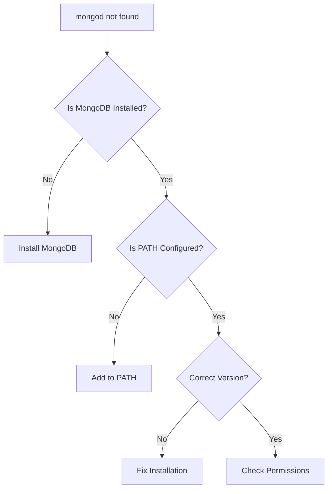

# How to Fix "mongod not found" Errors

Author: [nawazdhandala](https://www.github.com/nawazdhandala)

Tags: MongoDB, Installation, Troubleshooting, DevOps, Database, Configuration

Description: Learn how to diagnose and fix "mongod not found" errors across different operating systems. This guide covers installation verification, PATH configuration, and common setup issues.

---

The "mongod not found" error occurs when your system cannot locate the MongoDB server executable. This frustrating error can happen after installation, system updates, or configuration changes. Let's walk through how to diagnose and fix this issue across different operating systems.

## Understanding the Error

When you see "mongod: command not found" or "mongod is not recognized", it typically means:



## Diagnosing the Problem

First, let's identify what's causing the error:

```bash
# Check if mongod exists anywhere
# On Linux/macOS
which mongod
whereis mongod
find / -name "mongod" 2>/dev/null

# On Windows (PowerShell)
Get-Command mongod -ErrorAction SilentlyContinue
where.exe mongod
Get-ChildItem -Path C:\ -Filter mongod.exe -Recurse -ErrorAction SilentlyContinue

# Check if MongoDB service is installed
# Linux
systemctl status mongod
service mongod status

# macOS
brew services list | grep mongodb

# Windows
Get-Service -Name MongoDB -ErrorAction SilentlyContinue
```

## Solution 1: Install MongoDB (If Not Installed)

### Ubuntu/Debian

```bash
# Import MongoDB public GPG key
curl -fsSL https://pgp.mongodb.com/server-7.0.asc | \
   sudo gpg -o /usr/share/keyrings/mongodb-server-7.0.gpg \
   --dearmor

# Add MongoDB repository
echo "deb [ arch=amd64,arm64 signed-by=/usr/share/keyrings/mongodb-server-7.0.gpg ] https://repo.mongodb.org/apt/ubuntu jammy/mongodb-org/7.0 multiverse" | \
   sudo tee /etc/apt/sources.list.d/mongodb-org-7.0.list

# Update package database
sudo apt-get update

# Install MongoDB
sudo apt-get install -y mongodb-org

# Start MongoDB service
sudo systemctl start mongod
sudo systemctl enable mongod

# Verify installation
mongod --version
```

### RHEL/CentOS/Fedora

```bash
# Create repository file
cat << 'EOF' | sudo tee /etc/yum.repos.d/mongodb-org-7.0.repo
[mongodb-org-7.0]
name=MongoDB Repository
baseurl=https://repo.mongodb.org/yum/redhat/$releasever/mongodb-org/7.0/x86_64/
gpgcheck=1
enabled=1
gpgkey=https://pgp.mongodb.com/server-7.0.asc
EOF

# Install MongoDB
sudo yum install -y mongodb-org

# Start and enable service
sudo systemctl start mongod
sudo systemctl enable mongod

# Verify
mongod --version
```

### macOS

```bash
# Using Homebrew
brew tap mongodb/brew
brew install mongodb-community@7.0

# Start MongoDB
brew services start mongodb-community@7.0

# Verify installation
mongod --version

# If using Intel Mac, binaries are in:
# /usr/local/opt/mongodb-community@7.0/bin/

# If using Apple Silicon (M1/M2), binaries are in:
# /opt/homebrew/opt/mongodb-community@7.0/bin/
```

### Windows

```powershell
# Download MongoDB MSI installer from:
# https://www.mongodb.com/try/download/community

# Or use Chocolatey
choco install mongodb

# Or use winget
winget install MongoDB.Server

# After installation, verify
mongod --version

# Default installation path:
# C:\Program Files\MongoDB\Server\7.0\bin\mongod.exe
```

## Solution 2: Configure PATH

### Linux/macOS

```bash
# Find MongoDB installation
MONGO_PATH=$(dirname $(find /usr -name "mongod" 2>/dev/null | head -1))

# Add to PATH temporarily
export PATH=$PATH:$MONGO_PATH

# Add to PATH permanently
# For bash
echo "export PATH=\$PATH:$MONGO_PATH" >> ~/.bashrc
source ~/.bashrc

# For zsh
echo "export PATH=\$PATH:$MONGO_PATH" >> ~/.zshrc
source ~/.zshrc

# Common MongoDB paths to check:
# /usr/bin/
# /usr/local/bin/
# /opt/mongodb/bin/
# /usr/local/opt/mongodb-community@7.0/bin/
# /opt/homebrew/opt/mongodb-community@7.0/bin/
```

### Windows

```powershell
# Check current PATH
$env:PATH -split ';'

# Add MongoDB to PATH temporarily
$env:PATH += ";C:\Program Files\MongoDB\Server\7.0\bin"

# Add to PATH permanently (requires admin)
[Environment]::SetEnvironmentVariable(
    "PATH",
    $env:PATH + ";C:\Program Files\MongoDB\Server\7.0\bin",
    [EnvironmentVariableTarget]::Machine
)

# Restart terminal after adding to PATH
```

## Solution 3: Fix Broken Installation

### Reinstall MongoDB

```bash
# Ubuntu/Debian - Complete reinstall
sudo systemctl stop mongod
sudo apt-get purge mongodb-org*
sudo rm -r /var/log/mongodb
sudo rm -r /var/lib/mongodb
# Then reinstall following steps above

# RHEL/CentOS
sudo systemctl stop mongod
sudo yum remove mongodb-org*
sudo rm -r /var/log/mongodb
sudo rm -r /var/lib/mongo
# Then reinstall following steps above

# macOS
brew services stop mongodb-community
brew uninstall mongodb-community
brew cleanup
brew install mongodb-community@7.0
```

### Verify Installation Integrity

```bash
# Check if mongod binary is executable
ls -la $(which mongod)

# Check binary integrity
file $(which mongod)

# Should output something like:
# /usr/bin/mongod: ELF 64-bit LSB executable...

# Check for missing dependencies
ldd $(which mongod) | grep "not found"

# Install missing dependencies
sudo apt-get install -f  # Debian/Ubuntu
sudo yum install -y $(ldd $(which mongod) | grep "not found" | awk '{print $1}')  # RHEL
```

## Solution 4: Docker Alternative

If system installation is problematic, use Docker:

```bash
# Pull MongoDB image
docker pull mongo:7.0

# Run MongoDB container
docker run -d \
    --name mongodb \
    -p 27017:27017 \
    -v mongodb_data:/data/db \
    -e MONGO_INITDB_ROOT_USERNAME=admin \
    -e MONGO_INITDB_ROOT_PASSWORD=password \
    mongo:7.0

# Connect to MongoDB
docker exec -it mongodb mongosh

# Create alias for convenience
echo 'alias mongod="docker exec -it mongodb mongod"' >> ~/.bashrc
echo 'alias mongosh="docker exec -it mongodb mongosh"' >> ~/.bashrc
source ~/.bashrc
```

Docker Compose setup:

```yaml
# docker-compose.yml
version: '3.8'

services:
  mongodb:
    image: mongo:7.0
    container_name: mongodb
    restart: unless-stopped
    ports:
      - "27017:27017"
    environment:
      MONGO_INITDB_ROOT_USERNAME: admin
      MONGO_INITDB_ROOT_PASSWORD: password
    volumes:
      - mongodb_data:/data/db
      - mongodb_config:/data/configdb

volumes:
  mongodb_data:
  mongodb_config:
```

```bash
# Start with Docker Compose
docker-compose up -d

# Check status
docker-compose ps

# View logs
docker-compose logs -f mongodb
```

## Solution 5: Fix Service Issues

### Linux Service Management

```bash
# Check service status
sudo systemctl status mongod

# View service logs
sudo journalctl -u mongod -f

# Check MongoDB log file
sudo tail -f /var/log/mongodb/mongod.log

# Fix common service issues
# 1. Permission issues
sudo chown -R mongodb:mongodb /var/lib/mongodb
sudo chown -R mongodb:mongodb /var/log/mongodb

# 2. Data directory issues
sudo mkdir -p /var/lib/mongodb
sudo chown mongodb:mongodb /var/lib/mongodb

# 3. Reload systemd configuration
sudo systemctl daemon-reload
sudo systemctl restart mongod
```

### Create Systemd Service (if missing)

```bash
# Create service file
sudo cat << 'EOF' > /etc/systemd/system/mongod.service
[Unit]
Description=MongoDB Database Server
Documentation=https://docs.mongodb.org/manual
After=network-online.target
Wants=network-online.target

[Service]
User=mongodb
Group=mongodb
EnvironmentFile=-/etc/default/mongod
ExecStart=/usr/bin/mongod --config /etc/mongod.conf
PIDFile=/var/run/mongodb/mongod.pid
LimitFSIZE=infinity
LimitCPU=infinity
LimitAS=infinity
LimitNOFILE=64000
LimitNPROC=64000
LimitMEMLOCK=infinity
TasksMax=infinity
TasksAccounting=false
Restart=always

[Install]
WantedBy=multi-user.target
EOF

# Reload and start
sudo systemctl daemon-reload
sudo systemctl enable mongod
sudo systemctl start mongod
```

## Automated Diagnostic Script

Create a script to diagnose MongoDB issues:

```bash
#!/bin/bash
# mongodb-diagnose.sh

echo "=== MongoDB Diagnostic Tool ==="
echo ""

# Check if mongod is in PATH
echo "1. Checking PATH for mongod..."
if command -v mongod &> /dev/null; then
    echo "   Found: $(which mongod)"
    echo "   Version: $(mongod --version | head -1)"
else
    echo "   NOT FOUND in PATH"
fi

echo ""

# Search for mongod binary
echo "2. Searching for mongod binary..."
FOUND_PATHS=$(find /usr /opt /home -name "mongod" -type f 2>/dev/null)
if [ -n "$FOUND_PATHS" ]; then
    echo "   Found at:"
    echo "$FOUND_PATHS" | while read path; do
        echo "   - $path"
    done
else
    echo "   No mongod binary found"
fi

echo ""

# Check service status
echo "3. Checking service status..."
if systemctl is-active --quiet mongod 2>/dev/null; then
    echo "   Service: RUNNING"
elif service mongod status &>/dev/null; then
    echo "   Service: RUNNING (init.d)"
else
    echo "   Service: NOT RUNNING or NOT INSTALLED"
fi

echo ""

# Check data directory
echo "4. Checking data directory..."
DATA_DIR="/var/lib/mongodb"
if [ -d "$DATA_DIR" ]; then
    echo "   Directory exists: $DATA_DIR"
    echo "   Owner: $(ls -ld $DATA_DIR | awk '{print $3":"$4}')"
    echo "   Size: $(du -sh $DATA_DIR 2>/dev/null | cut -f1)"
else
    echo "   Data directory not found at $DATA_DIR"
fi

echo ""

# Check log directory
echo "5. Checking log directory..."
LOG_DIR="/var/log/mongodb"
if [ -d "$LOG_DIR" ]; then
    echo "   Directory exists: $LOG_DIR"
    if [ -f "$LOG_DIR/mongod.log" ]; then
        echo "   Latest log entries:"
        tail -5 "$LOG_DIR/mongod.log" 2>/dev/null | sed 's/^/   /'
    fi
else
    echo "   Log directory not found"
fi

echo ""

# Check port 27017
echo "6. Checking port 27017..."
if netstat -tuln 2>/dev/null | grep -q ":27017"; then
    echo "   Port 27017 is LISTENING"
elif ss -tuln 2>/dev/null | grep -q ":27017"; then
    echo "   Port 27017 is LISTENING"
else
    echo "   Port 27017 is NOT listening"
fi

echo ""

# Recommendations
echo "=== Recommendations ==="
if ! command -v mongod &> /dev/null; then
    echo "- MongoDB is not installed or not in PATH"
    echo "- Install MongoDB or add binary location to PATH"
    if [ -n "$FOUND_PATHS" ]; then
        MONGO_DIR=$(dirname "$(echo "$FOUND_PATHS" | head -1)")
        echo "- Suggested: export PATH=\$PATH:$MONGO_DIR"
    fi
fi
```

Make it executable and run:

```bash
chmod +x mongodb-diagnose.sh
./mongodb-diagnose.sh
```

## Node.js Connection Handling

Handle connection errors gracefully in your application:

```javascript
const { MongoClient } = require('mongodb');

class MongoDBConnection {
    constructor(uri, options = {}) {
        this.uri = uri;
        this.options = {
            serverSelectionTimeoutMS: 5000,
            connectTimeoutMS: 10000,
            ...options
        };
        this.client = null;
    }

    async connect() {
        try {
            this.client = new MongoClient(this.uri, this.options);
            await this.client.connect();
            console.log('Connected to MongoDB');
            return this.client;
        } catch (error) {
            this.handleConnectionError(error);
            throw error;
        }
    }

    handleConnectionError(error) {
        console.error('MongoDB connection error:', error.message);

        if (error.message.includes('ECONNREFUSED')) {
            console.log('\nPossible causes:');
            console.log('1. MongoDB server is not running');
            console.log('2. Wrong host or port in connection string');
            console.log('\nSolutions:');
            console.log('- Start MongoDB: sudo systemctl start mongod');
            console.log('- Check if mongod is installed: which mongod');
            console.log('- Verify connection string:', this.uri);
        }

        if (error.message.includes('ETIMEDOUT')) {
            console.log('\nPossible causes:');
            console.log('1. Network connectivity issues');
            console.log('2. Firewall blocking connection');
            console.log('3. MongoDB not listening on specified address');
        }

        if (error.message.includes('Authentication failed')) {
            console.log('\nPossible causes:');
            console.log('1. Wrong username or password');
            console.log('2. User does not have access to database');
        }
    }
}

// Usage
async function main() {
    const connection = new MongoDBConnection('mongodb://localhost:27017');

    try {
        const client = await connection.connect();
        const db = client.db('test');
        console.log('Database:', db.databaseName);
    } catch (error) {
        process.exit(1);
    }
}

main();
```

## Conclusion

The "mongod not found" error is typically a PATH or installation issue that can be resolved systematically. Start by verifying MongoDB is installed, then check PATH configuration, and finally verify the service is running. If system installation proves problematic, Docker provides a reliable alternative. With the diagnostic tools and solutions provided in this guide, you should be able to get MongoDB running regardless of your operating system.
