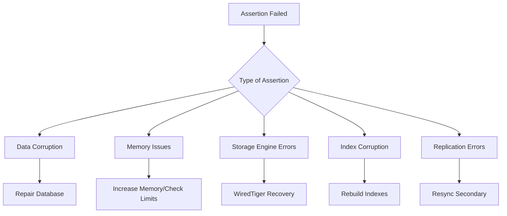

# How to Fix 'assertion failed' Errors in MongoDB

Author: [nawazdhandala](https://www.github.com/nawazdhandala)

Tags: MongoDB, Assertion Failed, Troubleshooting, Database Errors, Data Corruption, Recovery

Description: A detailed guide to diagnosing and fixing MongoDB assertion failed errors, including causes like data corruption, storage engine issues, memory problems, and step-by-step recovery procedures.

---

MongoDB assertion failures are serious errors that indicate internal inconsistencies or unexpected conditions within the database engine. When you see "assertion failed" in your MongoDB logs, it requires immediate attention. This guide covers the common causes and provides systematic approaches to resolve these issues.

## Understanding Assertion Failures

Assertion failures occur when MongoDB's internal checks detect something unexpected. They serve as safety mechanisms to prevent data corruption.



## Common Assertion Error Types

### 1. WiredTiger Assertion Failures

```bash
# Typical WiredTiger assertion error
SEVERE: WiredTiger error (28) [1234567890:123456][1234:0x7f...]:
  __wt_block_read_off, 237: block at offset 12345 cannot be read
assertion 28 WiredTiger: failed to read from file
```

**Causes:**
- Disk corruption
- Incomplete writes due to power failure
- File system errors
- Full disk

**Solutions:**

```bash
# Check disk space
df -h /var/lib/mongodb

# Check file system integrity
sudo fsck -n /dev/sda1  # Replace with your actual device

# Start MongoDB in repair mode
mongod --repair --dbpath /var/lib/mongodb

# Or use the repair command
mongod --dbpath /var/lib/mongodb --repair
```

### 2. Index Assertion Failures

```bash
# Index assertion error example
assertion 13548 index bounds check failed
assertion 17006 BTree key size too large
```

**Solution - Rebuild Indexes:**

```javascript
// In mongo shell - rebuild all indexes for a collection
db.collection.reIndex()

// Rebuild all indexes for the database
db.getCollectionNames().forEach(function(collection) {
    db[collection].reIndex();
});

// Or drop and recreate specific index
db.collection.dropIndex("field_1")
db.collection.createIndex({field: 1})
```

### 3. Memory-Related Assertions

```bash
# Memory assertion errors
assertion 16070 out of memory
assertion 17282 mmap failed
```

**Solutions:**

```bash
# Check current memory limits
ulimit -a

# Increase memory limits in /etc/security/limits.conf
mongodb soft memlock unlimited
mongodb hard memlock unlimited
mongodb soft nofile 64000
mongodb hard nofile 64000

# Check WiredTiger cache size in mongod.conf
storage:
  wiredTiger:
    engineConfig:
      cacheSizeGB: 2  # Adjust based on available RAM
```

## Diagnostic Steps

### Step 1: Check MongoDB Logs

```bash
# View recent MongoDB logs
sudo tail -500 /var/log/mongodb/mongod.log

# Search for assertion errors
sudo grep -i "assertion" /var/log/mongodb/mongod.log

# Search for specific error codes
sudo grep -E "(assertion|error|fatal)" /var/log/mongodb/mongod.log | tail -100
```

### Step 2: Verify Data Files

```bash
# Check data directory permissions
ls -la /var/lib/mongodb/

# Verify file integrity
mongod --dbpath /var/lib/mongodb --directoryperdb --storageEngine wiredTiger --validate

# Check for lock files
ls -la /var/lib/mongodb/*.lock
rm /var/lib/mongodb/mongod.lock  # Only if MongoDB is not running
```

### Step 3: Run Validation

```javascript
// Connect to MongoDB and run validation
use mydb

// Validate a specific collection
db.collection.validate({full: true})

// Validate all collections
db.getCollectionNames().forEach(function(collection) {
    print("Validating: " + collection);
    printjson(db[collection].validate({full: true}));
});
```

## Recovery Procedures

### Procedure 1: Simple Repair

```bash
# Stop MongoDB
sudo systemctl stop mongod

# Run repair
mongod --repair --dbpath /var/lib/mongodb

# Restart MongoDB
sudo systemctl start mongod

# Verify functionality
mongosh --eval "db.adminCommand('ping')"
```

### Procedure 2: WiredTiger Recovery

```bash
# Stop MongoDB
sudo systemctl stop mongod

# Backup existing data
sudo cp -r /var/lib/mongodb /var/lib/mongodb.backup

# Remove journal files (causes loss of uncommitted data)
sudo rm -rf /var/lib/mongodb/journal/*

# Remove WiredTiger lock files
sudo rm /var/lib/mongodb/WiredTiger.lock
sudo rm /var/lib/mongodb/mongod.lock

# Start MongoDB
sudo systemctl start mongod
```

### Procedure 3: Export and Reimport

When repair doesn't work, export data and reimport to a fresh database:

```bash
# Export data (if MongoDB can start)
mongodump --out /backup/dump

# Create new data directory
sudo mkdir /var/lib/mongodb-new
sudo chown mongodb:mongodb /var/lib/mongodb-new

# Update mongod.conf with new path
# dbPath: /var/lib/mongodb-new

# Start MongoDB with new directory
sudo systemctl start mongod

# Import data
mongorestore /backup/dump
```

### Procedure 4: Recover from Replica Set Secondary

If running a replica set, the safest approach is to sync from a healthy member:

```bash
# On the affected secondary
sudo systemctl stop mongod

# Clear data directory
sudo rm -rf /var/lib/mongodb/*

# Restart MongoDB - it will perform initial sync
sudo systemctl start mongod
```

```javascript
// On the primary - verify member state
rs.status()

// If needed, remove and re-add member
rs.remove("affected-host:27017")
rs.add("affected-host:27017")
```

## Prevention Strategies

### 1. Enable Journaling

```yaml
# mongod.conf
storage:
  journal:
    enabled: true
    commitIntervalMs: 100
```

### 2. Configure Write Concern

```javascript
// Application level write concern
db.collection.insertOne(
    {document: "data"},
    {writeConcern: {w: "majority", j: true}}
)
```

### 3. Monitor Disk Space

```javascript
// Check database size
db.stats()

// Check collection sizes
db.collection.stats()

// Monitor free disk space
const freeSpace = db.adminCommand({dbStats: 1}).fsFreeSize;
```

### 4. Regular Backups

```bash
# Scheduled backup script
#!/bin/bash
DATE=$(date +%Y%m%d_%H%M%S)
mongodump --out /backup/$DATE

# Keep only last 7 days
find /backup -type d -mtime +7 -exec rm -rf {} +
```

## Specific Assertion Codes and Fixes

| Code | Message | Likely Cause | Solution |
|------|---------|--------------|----------|
| 13 | Permission denied | File permissions | Check ownership of data files |
| 28 | No space left | Disk full | Free disk space or expand storage |
| 1000 | Invalid BSON | Document corruption | Repair or restore from backup |
| 10334 | BSONObj size invalid | Oversized document | Check document sizes |
| 13548 | Index key too large | Index corruption | Rebuild indexes |
| 16070 | Out of memory | Insufficient RAM | Increase memory or reduce cache |
| 17006 | Key too large | Index value exceeds limit | Use hashed index or change schema |
| 17282 | mmap failed | Memory mapping error | Check system limits |

## Monitoring for Early Detection

```javascript
// Set up assertion monitoring
db.adminCommand({
    setParameter: 1,
    logLevel: 1
});

// Create alert for assertion patterns
// Example with OneUptime integration
const assertionCheck = async () => {
    const logs = await readMongoLogs();
    const assertions = logs.filter(log => log.includes('assertion'));

    if (assertions.length > 0) {
        // Trigger alert via OneUptime
        await sendAlert({
            severity: 'critical',
            message: 'MongoDB assertion failures detected',
            details: assertions
        });
    }
};
```

## Emergency Recovery Checklist

1. **Stop MongoDB** immediately to prevent further corruption
2. **Backup current state** before any recovery attempts
3. **Check system resources** - disk space, memory, file descriptors
4. **Review logs** to identify the specific assertion and context
5. **Attempt repair** starting with least destructive methods
6. **Validate data** after recovery
7. **Monitor closely** for recurring issues
8. **Document the incident** and implement preventive measures

## Summary

MongoDB assertion failures are serious but often recoverable. The key is to act quickly, preserve evidence through backups, and follow a systematic approach to diagnosis and recovery. Most assertions stem from storage issues, memory constraints, or data corruption - all of which can be addressed with proper procedures. Implement monitoring, regular backups, and proper configuration to minimize the risk and impact of future assertion failures.
