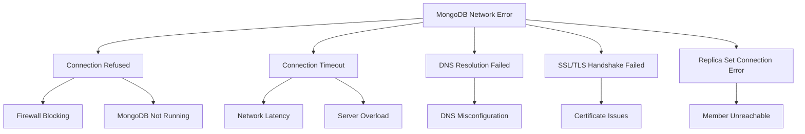
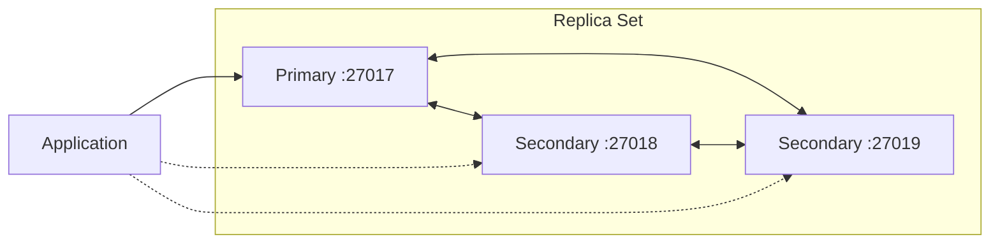

# How to Fix 'network error' Errors in MongoDB

Author: [nawazdhandala](https://www.github.com/nawazdhandala)

Tags: MongoDB, Network Error, Troubleshooting, Database, Connection Issues, DevOps

Description: A comprehensive guide to diagnosing and fixing MongoDB network errors, including connection timeouts, DNS resolution failures, firewall issues, and replica set connectivity problems.

---

MongoDB network errors can bring your application to a halt. Whether you're seeing "network error occurred while executing command", "connection refused", or "network timeout" messages, this guide will help you diagnose and fix the root cause.

## Understanding MongoDB Network Errors

Network errors in MongoDB typically fall into several categories:



## Common Error Messages and Their Causes

### 1. Connection Refused

```bash
# Typical error message
MongoNetworkError: connect ECONNREFUSED 127.0.0.1:27017
```

This usually means MongoDB is not running or not listening on the expected port.

**Diagnosis steps:**

```bash
# Check if MongoDB is running
sudo systemctl status mongod

# Check what port MongoDB is listening on
sudo netstat -tlnp | grep mongo

# Verify MongoDB configuration
cat /etc/mongod.conf | grep -A 5 "net:"
```

**Solution:**

```bash
# Start MongoDB if not running
sudo systemctl start mongod

# Enable auto-start on boot
sudo systemctl enable mongod

# If MongoDB won't start, check logs
sudo tail -100 /var/log/mongodb/mongod.log
```

### 2. Connection Timeout

```javascript
// Node.js error example
MongoNetworkTimeoutError: connection timed out after 10000ms
```

**Common causes and solutions:**

```javascript
// Increase connection timeout in your connection string
const MongoClient = require('mongodb').MongoClient;

const uri = "mongodb://localhost:27017/mydb";
const options = {
  connectTimeoutMS: 30000,      // 30 seconds
  socketTimeoutMS: 45000,       // 45 seconds
  serverSelectionTimeoutMS: 30000,
  maxPoolSize: 50,
  minPoolSize: 10
};

const client = new MongoClient(uri, options);
```

### 3. DNS Resolution Failures

When using MongoDB Atlas or replica sets with hostnames:

```bash
# Test DNS resolution
nslookup your-cluster.mongodb.net
dig your-cluster.mongodb.net

# Check /etc/resolv.conf for DNS servers
cat /etc/resolv.conf
```

**Solution for DNS issues:**

```bash
# Add reliable DNS servers
echo "nameserver 8.8.8.8" | sudo tee -a /etc/resolv.conf
echo "nameserver 8.8.4.4" | sudo tee -a /etc/resolv.conf

# Or use systemd-resolved
sudo systemctl restart systemd-resolved
```

## Firewall Configuration

Firewall rules are a common cause of network errors.

```bash
# UFW (Ubuntu)
sudo ufw allow 27017/tcp
sudo ufw allow from 10.0.0.0/8 to any port 27017

# iptables
sudo iptables -A INPUT -p tcp --dport 27017 -j ACCEPT
sudo iptables -A INPUT -p tcp -s 10.0.0.0/8 --dport 27017 -j ACCEPT

# firewalld (CentOS/RHEL)
sudo firewall-cmd --permanent --add-port=27017/tcp
sudo firewall-cmd --reload
```

## MongoDB Bind Address Configuration

By default, MongoDB only listens on localhost. To allow remote connections:

```yaml
# /etc/mongod.conf
net:
  port: 27017
  bindIp: 0.0.0.0  # Listen on all interfaces
  # Or specify specific IPs
  # bindIp: 127.0.0.1,10.0.0.5
```

After changing configuration:

```bash
sudo systemctl restart mongod
```

## SSL/TLS Connection Errors

For secure connections, certificate issues can cause network errors.

```javascript
// Node.js with SSL
const options = {
  tls: true,
  tlsCAFile: '/path/to/ca.pem',
  tlsCertificateKeyFile: '/path/to/client.pem',
  tlsAllowInvalidCertificates: false,  // Set true only for testing
  tlsAllowInvalidHostnames: false
};

const client = new MongoClient(uri, options);
```

**Diagnose SSL issues:**

```bash
# Test SSL connection
openssl s_client -connect mongodb-server:27017 -CAfile /path/to/ca.pem

# Verify certificate validity
openssl x509 -in /path/to/cert.pem -text -noout
```

## Replica Set Network Issues

Replica set connectivity requires all members to communicate.



**Check replica set status:**

```javascript
// In mongo shell
rs.status()

// Check member connectivity
rs.status().members.forEach(m => {
  print(`${m.name}: ${m.stateStr} - ${m.health === 1 ? 'healthy' : 'unhealthy'}`);
});
```

**Common replica set network fixes:**

```javascript
// Update replica set configuration with correct hostnames
cfg = rs.conf()
cfg.members[0].host = "mongo1.example.com:27017"
cfg.members[1].host = "mongo2.example.com:27017"
cfg.members[2].host = "mongo3.example.com:27017"
rs.reconfig(cfg)
```

## Connection Pooling Best Practices

Proper connection pooling prevents connection exhaustion:

```javascript
// Recommended connection options
const options = {
  maxPoolSize: 100,           // Maximum connections in pool
  minPoolSize: 10,            // Minimum connections in pool
  maxIdleTimeMS: 30000,       // Close idle connections after 30s
  waitQueueTimeoutMS: 10000,  // Wait timeout for connection
  retryWrites: true,
  retryReads: true,
  w: 'majority'
};
```

## Monitoring Network Health

Set up proactive monitoring to catch network issues early:

```javascript
// Health check endpoint
app.get('/health/mongodb', async (req, res) => {
  try {
    const start = Date.now();
    await client.db().admin().ping();
    const latency = Date.now() - start;

    res.json({
      status: 'healthy',
      latency: `${latency}ms`,
      connections: client.topology?.s?.pool?.totalConnectionCount || 'unknown'
    });
  } catch (error) {
    res.status(503).json({
      status: 'unhealthy',
      error: error.message
    });
  }
});
```

## Network Error Recovery Pattern

Implement retry logic for transient network failures:

```javascript
async function executeWithRetry(operation, maxRetries = 3) {
  let lastError;

  for (let attempt = 1; attempt <= maxRetries; attempt++) {
    try {
      return await operation();
    } catch (error) {
      lastError = error;

      if (error.name === 'MongoNetworkError') {
        const delay = Math.min(1000 * Math.pow(2, attempt), 10000);
        console.log(`Network error, retrying in ${delay}ms (attempt ${attempt}/${maxRetries})`);
        await new Promise(resolve => setTimeout(resolve, delay));
        continue;
      }

      throw error;  // Non-network errors should not retry
    }
  }

  throw lastError;
}

// Usage
const result = await executeWithRetry(() =>
  collection.findOne({ _id: documentId })
);
```

## Debugging Network Issues

Enable MongoDB driver logging for detailed diagnostics:

```javascript
// Enable debug logging
const { MongoClient, Logger } = require('mongodb');

Logger.setLevel('debug');
Logger.filter('class', ['Cursor', 'Connection', 'Server']);

// Or use connection string parameter
const uri = "mongodb://localhost:27017/mydb?loggerLevel=debug";
```

## Quick Troubleshooting Checklist

1. **Is MongoDB running?** - Check with `systemctl status mongod`
2. **Is the port open?** - Test with `telnet host 27017` or `nc -zv host 27017`
3. **Is the firewall blocking?** - Check iptables/ufw/security groups
4. **Is DNS resolving correctly?** - Use `nslookup` or `dig`
5. **Are credentials correct?** - Verify username/password/authSource
6. **Is SSL configured correctly?** - Check certificate paths and validity
7. **Is the connection string correct?** - Verify host, port, and options

## Summary

MongoDB network errors are often straightforward to diagnose once you understand the common patterns. Start by verifying basic connectivity with tools like `telnet` and `ping`, then work through firewall rules, DNS resolution, and SSL configuration. Implement proper connection pooling, retry logic, and monitoring to build resilient applications that handle transient network issues gracefully.
