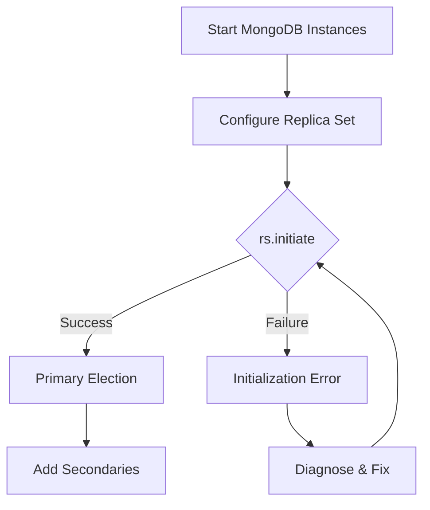
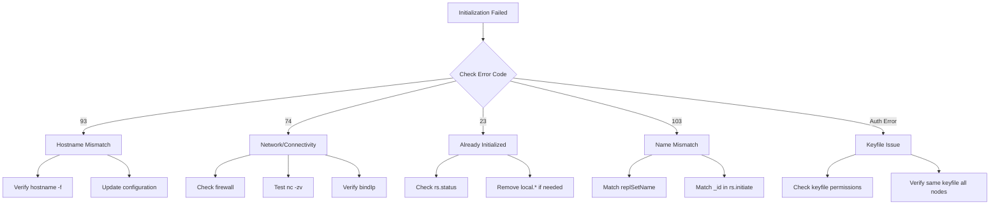

# How to Fix 'replica set initialization' Errors

Author: [nawazdhandala](https://www.github.com/nawazdhandala)

Tags: MongoDB, Replica Set, High Availability, Initialization, Troubleshooting, Database Configuration

Description: A complete guide to diagnosing and fixing MongoDB replica set initialization errors, covering configuration issues, network problems, authentication failures, and step-by-step recovery procedures.

---

Replica set initialization is a critical step in setting up MongoDB for high availability. When it fails, your cluster cannot form, leaving you without redundancy. This guide covers common initialization errors and how to resolve them.

## Understanding Replica Set Initialization



## Common Initialization Errors

### Error 1: "No host described in new configuration"

```javascript
// Error message
{
  "ok": 0,
  "errmsg": "No host described in new configuration with {_id: 0} maps to this node",
  "code": 93
}
```

**Cause:** The hostname in configuration doesn't match the server's actual hostname.

**Solution:**

```bash
# Check actual hostname
hostname -f

# Verify what MongoDB sees
mongosh --eval "db.serverStatus().host"
```

```javascript
// Use correct hostname in configuration
rs.initiate({
  _id: "rs0",
  members: [
    { _id: 0, host: "actual-hostname:27017" }  // Must match server hostname
  ]
});

// Or use IP address
rs.initiate({
  _id: "rs0",
  members: [
    { _id: 0, host: "192.168.1.10:27017" }
  ]
});
```

### Error 2: "replSetInitiate quorum check failed"

```javascript
// Error message
{
  "ok": 0,
  "errmsg": "replSetInitiate quorum check failed because not all proposed set members responded affirmatively",
  "code": 74
}
```

**Cause:** Other replica set members are unreachable.

**Diagnosis:**

```bash
# Test connectivity to other members
nc -zv member2-hostname 27017
nc -zv member3-hostname 27017

# Check if MongoDB is listening on all members
sudo netstat -tlnp | grep 27017
```

**Solution:**

```bash
# Ensure MongoDB is bound to correct interface on all members
# /etc/mongod.conf
net:
  port: 27017
  bindIp: 0.0.0.0  # Or specific IP
```

```javascript
// Initialize with only reachable members first
rs.initiate({
  _id: "rs0",
  members: [
    { _id: 0, host: "member1:27017" }
  ]
});

// Add other members after initialization
rs.add("member2:27017");
rs.add("member3:27017");
```

### Error 3: "already initialized"

```javascript
// Error message
{
  "ok": 0,
  "errmsg": "already initialized",
  "code": 23
}
```

**Cause:** Attempting to initialize an already initialized replica set.

**Solution:**

```javascript
// Check current status
rs.status();

// If you need to reinitialize (data loss warning!)
// Stop all MongoDB instances, then:
```

```bash
# Remove data and reinitialize (DESTRUCTIVE)
sudo systemctl stop mongod

# Backup first!
sudo cp -r /var/lib/mongodb /var/lib/mongodb.backup

# Remove replica set configuration
sudo rm -rf /var/lib/mongodb/local.*

sudo systemctl start mongod
```

### Error 4: "Reconfig tried to install a config that changes the replica set name"

```javascript
// Error message
{
  "ok": 0,
  "errmsg": "Reconfig tried to install a config that changes the replica set name",
  "code": 103
}
```

**Cause:** Mismatch between replSetName in mongod.conf and rs.initiate configuration.

**Solution:**

```yaml
# /etc/mongod.conf - ensure name matches
replication:
  replSetName: "rs0"  # Must match rs.initiate _id
```

```javascript
// Configuration must use same name
rs.initiate({
  _id: "rs0",  // Must match replSetName in config
  members: [
    { _id: 0, host: "member1:27017" }
  ]
});
```

### Error 5: "Authentication failed"

```javascript
// Error message
{
  "ok": 0,
  "errmsg": "command replSetInitiate requires authentication"
}
```

**Cause:** Keyfile authentication enabled but not properly configured.

**Solution:**

```bash
# Generate keyfile
openssl rand -base64 756 > /etc/mongodb-keyfile
chmod 400 /etc/mongodb-keyfile
chown mongodb:mongodb /etc/mongodb-keyfile

# Copy same keyfile to all members
scp /etc/mongodb-keyfile user@member2:/etc/mongodb-keyfile
scp /etc/mongodb-keyfile user@member3:/etc/mongodb-keyfile
```

```yaml
# /etc/mongod.conf on all members
security:
  keyFile: /etc/mongodb-keyfile
  authorization: enabled
```

## Step-by-Step Initialization Guide

### Step 1: Prepare Configuration Files

```yaml
# /etc/mongod.conf - Member 1
storage:
  dbPath: /var/lib/mongodb

systemLog:
  destination: file
  path: /var/log/mongodb/mongod.log
  logAppend: true

net:
  port: 27017
  bindIp: 0.0.0.0

replication:
  replSetName: "rs0"

security:
  keyFile: /etc/mongodb-keyfile
```

### Step 2: Start MongoDB on All Nodes

```bash
# On all members
sudo systemctl start mongod
sudo systemctl status mongod

# Verify listening
sudo netstat -tlnp | grep 27017
```

### Step 3: Initialize the Replica Set

```javascript
// Connect to one member
mongosh mongodb://member1:27017

// Initialize
rs.initiate({
  _id: "rs0",
  members: [
    { _id: 0, host: "member1:27017", priority: 2 },
    { _id: 1, host: "member2:27017", priority: 1 },
    { _id: 2, host: "member3:27017", priority: 1 }
  ]
});

// Verify initialization
rs.status();
```

### Step 4: Create Admin User (if authentication enabled)

```javascript
// Connect to primary
mongosh mongodb://member1:27017

// Switch to admin database
use admin

// Create admin user
db.createUser({
  user: "admin",
  pwd: "securepassword",
  roles: [
    { role: "root", db: "admin" }
  ]
});

// Create application user
db.createUser({
  user: "appuser",
  pwd: "apppassword",
  roles: [
    { role: "readWrite", db: "myapp" }
  ]
});
```

## Verifying Replica Set Health

```javascript
// Check replica set status
rs.status();

// Expected healthy output
{
  "set": "rs0",
  "members": [
    {
      "name": "member1:27017",
      "stateStr": "PRIMARY",
      "health": 1
    },
    {
      "name": "member2:27017",
      "stateStr": "SECONDARY",
      "health": 1
    },
    {
      "name": "member3:27017",
      "stateStr": "SECONDARY",
      "health": 1
    }
  ]
}

// Check configuration
rs.conf();

// Check if primary
rs.isMaster();
```

## Reconfiguring an Existing Replica Set

```javascript
// Get current configuration
cfg = rs.conf();

// Modify member settings
cfg.members[1].priority = 2;  // Change priority
cfg.members[2].hidden = true;  // Hide member
cfg.members[2].votes = 0;

// Apply new configuration
rs.reconfig(cfg);

// Force reconfiguration (use with caution)
rs.reconfig(cfg, { force: true });
```

## Adding and Removing Members

```javascript
// Add a new secondary
rs.add("member4:27017");

// Add with specific configuration
rs.add({
  host: "member4:27017",
  priority: 0,
  votes: 0,
  hidden: true
});

// Add an arbiter
rs.addArb("arbiter:27017");

// Remove a member
rs.remove("member4:27017");
```

## Troubleshooting Flowchart



## Common Configuration Mistakes

| Mistake | Symptom | Fix |
|---------|---------|-----|
| Wrong hostname | "No host described" | Use hostname -f or IP |
| Firewall blocking | Quorum check failed | Open port 27017 |
| bindIp: 127.0.0.1 | Members can't connect | Change to 0.0.0.0 |
| Different keyfiles | Auth failed | Copy same keyfile to all |
| Wrong replSetName | Name change error | Match all configurations |
| Missing replication config | Not a replica set member | Add replication section |

## Recovery from Failed State

```javascript
// If replica set is in bad state
// Connect to each member and check state
rs.status();

// If stuck in STARTUP or RECOVERING
// Check oplog
use local
db.oplog.rs.find().sort({ts: -1}).limit(1);

// Force member to become primary (emergency only)
cfg = rs.conf();
cfg.members = [cfg.members[0]];  // Keep only this member
rs.reconfig(cfg, {force: true});

// Then re-add other members
rs.add("member2:27017");
rs.add("member3:27017");
```

## Summary

Replica set initialization errors usually stem from hostname mismatches, network connectivity issues, or configuration inconsistencies. The key to successful initialization is ensuring all members can communicate, hostnames resolve correctly, and configurations match across all nodes. When troubleshooting, always check connectivity first, then verify configuration consistency, and finally examine MongoDB logs for specific error details. With proper preparation and these troubleshooting techniques, you can reliably initialize and maintain MongoDB replica sets.
