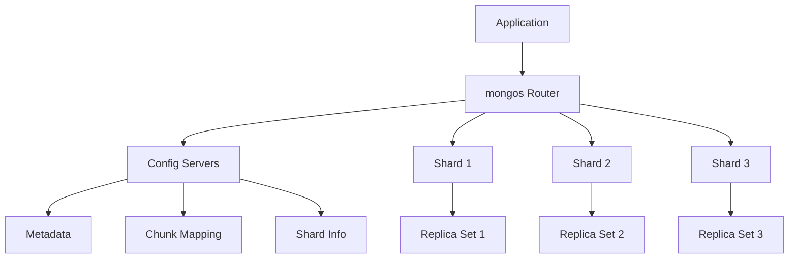
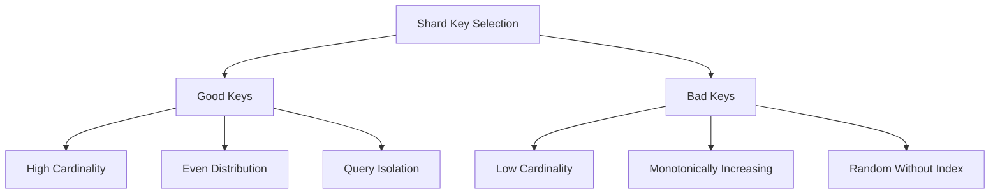
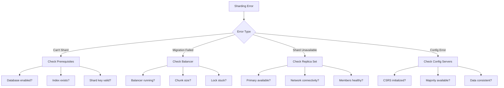

# How to Fix "sharding configuration" Errors

Author: [nawazdhandala](https://www.github.com/nawazdhandala)

Tags: MongoDB, Sharding, Configuration, Troubleshooting, Horizontal Scaling, Database Architecture

Description: A detailed guide to diagnosing and fixing MongoDB sharding configuration errors, covering shard key issues, chunk migration problems, config server errors, and balancer troubleshooting.

---

MongoDB sharding enables horizontal scaling, but configuration errors can cause data distribution problems, performance issues, or complete cluster failures. This guide covers common sharding errors and their solutions.

## Understanding MongoDB Sharding Architecture



## Common Sharding Errors

### Error 1: "sharding not enabled for database"

```javascript
// Error message
{
  "ok": 0,
  "errmsg": "sharding not enabled for database mydb",
  "code": 20
}
```

**Solution:**

```javascript
// Connect to mongos
mongosh mongodb://mongos-host:27017

// Enable sharding on the database
sh.enableSharding("mydb")

// Verify
sh.status()
```

### Error 2: "shard key must be specified"

```javascript
// Error message
{
  "ok": 0,
  "errmsg": "please specify a shard key",
  "code": 61
}
```

**Solution:**

```javascript
// Create index on shard key first (if not exists)
db.orders.createIndex({ customerId: "hashed" })

// Then shard the collection
sh.shardCollection("mydb.orders", { customerId: "hashed" })

// Or with ranged sharding
db.logs.createIndex({ timestamp: 1 })
sh.shardCollection("mydb.logs", { timestamp: 1 })
```

### Error 3: "can't shard collection already sharded"

```javascript
// Error message
{
  "ok": 0,
  "errmsg": "sharding already enabled for collection mydb.users",
  "code": 23
}
```

**Solution:**

```javascript
// Check current shard key
db.getSiblingDB("config").collections.findOne({ _id: "mydb.users" })

// If you need to change shard key (MongoDB 5.0+)
// First, check if resharding is supported
db.adminCommand({ reshardCollection: "mydb.users", key: { newField: 1 } })

// For older versions, you must:
// 1. Create new collection with correct shard key
// 2. Migrate data
// 3. Rename collections
```

### Error 4: "could not find host matching read preference"

```javascript
// Error message
{
  "ok": 0,
  "errmsg": "could not find host matching read preference { mode: \"primary\" } for set shard1",
  "code": 133
}
```

**Cause:** Shard replica set has no primary.

**Diagnosis:**

```javascript
// Check shard status
sh.status()

// Connect to specific shard and check replica set
mongosh mongodb://shard1-host:27017
rs.status()
```

**Solution:**

```javascript
// If shard is down, wait for election or force reconfiguration
rs.stepDown()  // Force new election

// If member is truly unavailable, remove it
cfg = rs.conf()
cfg.members = cfg.members.filter(m => m.host !== "unavailable-host:27017")
rs.reconfig(cfg, { force: true })
```

### Error 5: "chunk too big to move"

```javascript
// Error message
{
  "ok": 0,
  "errmsg": "chunk too big to move",
  "code": 10164
}
```

**Cause:** Jumbo chunks that exceed the chunk size limit.

**Solution:**

```javascript
// Find jumbo chunks
use config
db.chunks.find({ jumbo: true })

// Split jumbo chunks manually
sh.splitAt("mydb.orders", { customerId: "middle_value" })

// Or split at specific point
sh.splitFind("mydb.orders", { customerId: "specific_value" })

// Clear jumbo flag after splitting
db.getSiblingDB("config").chunks.updateOne(
  { _id: "chunk_id" },
  { $unset: { jumbo: "" } }
)
```

### Error 6: "config server replica set is not initialized"

```javascript
// Error message
{
  "ok": 0,
  "errmsg": "config server replica set is not initialized"
}
```

**Solution:**

```javascript
// Connect to config server
mongosh mongodb://config-server:27019

// Initialize config server replica set
rs.initiate({
  _id: "configReplSet",
  configsvr: true,
  members: [
    { _id: 0, host: "config1:27019" },
    { _id: 1, host: "config2:27019" },
    { _id: 2, host: "config3:27019" }
  ]
})
```

## Shard Key Selection

Choosing the right shard key is critical for avoiding configuration issues.

### Good vs Bad Shard Keys



### Examples

```javascript
// BAD: Low cardinality
sh.shardCollection("mydb.users", { status: 1 })  // Only few values

// BAD: Monotonically increasing (causes hotspot on last shard)
sh.shardCollection("mydb.logs", { _id: 1 })  // ObjectId increases

// GOOD: Hashed shard key for even distribution
sh.shardCollection("mydb.users", { _id: "hashed" })

// GOOD: Compound key for query isolation
sh.shardCollection("mydb.orders", { customerId: 1, _id: 1 })

// GOOD: Zone-based sharding for geographic distribution
sh.addShardTag("shard0", "US")
sh.addShardTag("shard1", "EU")
sh.addTagRange("mydb.users", { region: "US" }, { region: "USA" }, "US")
sh.addTagRange("mydb.users", { region: "EU" }, { region: "EUA" }, "EU")
```

## Balancer Issues

### Check Balancer Status

```javascript
// Check if balancer is running
sh.isBalancerRunning()

// Get balancer status
sh.getBalancerState()

// Check balancer lock
use config
db.locks.find({ _id: "balancer" })
```

### Fix Balancer Problems

```javascript
// Stop the balancer
sh.stopBalancer()

// Start the balancer
sh.startBalancer()

// Set balancer window
use config
db.settings.update(
  { _id: "balancer" },
  { $set: { activeWindow: { start: "02:00", stop: "06:00" } } },
  { upsert: true }
)

// Force chunk migration
sh.moveChunk("mydb.orders", { customerId: "value" }, "shard2")
```

### Diagnose Migration Failures

```javascript
// Check migration history
use config
db.changelog.find({ what: "moveChunk.from" }).sort({ time: -1 }).limit(10)

// Check for stuck migrations
db.locks.find({ state: { $ne: 0 } })

// Clear stuck migration lock (use with caution)
db.locks.remove({ _id: "mydb.orders" })
```

## Config Server Recovery

### Backup Config Database

```bash
# Backup config database
mongodump --host config-server:27019 --db config --out /backup/config_backup
```

### Recover Config Server

```javascript
// If majority of config servers are available
// Just restart the failed server and it will sync

// If config server replica set lost majority
// Connect to surviving member
mongosh mongodb://surviving-config:27019

// Force reconfiguration
cfg = rs.conf()
cfg.members = [{ _id: 0, host: "surviving-config:27019" }]
rs.reconfig(cfg, { force: true })

// Then add new config servers
rs.add("new-config1:27019")
rs.add("new-config2:27019")
```

## Adding and Removing Shards

### Add a New Shard

```javascript
// Add shard (replica set)
sh.addShard("shard3/shard3a:27017,shard3b:27017,shard3c:27017")

// Verify shard was added
sh.status()

// Data will automatically balance to new shard
```

### Remove a Shard (Draining)

```javascript
// Start draining the shard
use admin
db.adminCommand({ removeShard: "shard2" })

// Check draining progress
db.adminCommand({ removeShard: "shard2" })
// Look for "state": "ongoing" and chunk counts

// Move databases off the shard if needed
db.adminCommand({ movePrimary: "mydb", to: "shard1" })

// When draining is complete
db.adminCommand({ removeShard: "shard2" })
// State will show "completed"
```

## Monitoring Sharded Cluster

```javascript
// Comprehensive status
sh.status()

// Check chunk distribution
db.getSiblingDB("config").chunks.aggregate([
  { $group: { _id: "$shard", count: { $sum: 1 } } }
])

// Monitor chunk migrations
db.getSiblingDB("config").changelog.find({
  what: { $regex: /moveChunk/ }
}).sort({ time: -1 }).limit(20)

// Check for imbalanced shards
sh.status().shards.forEach(shard => {
  print(`${shard._id}: ${shard.host}`)
})
```

## Troubleshooting Flowchart



## Prevention Best Practices

1. **Plan shard key carefully** - Cannot easily change after sharding
2. **Monitor chunk distribution** - Imbalance causes hot spots
3. **Schedule balancer window** - Avoid migrations during peak hours
4. **Use dedicated config servers** - Don't co-locate with shards
5. **Test failover scenarios** - Ensure cluster survives member loss
6. **Document configuration** - Track shard key choices and zone rules

## Summary

MongoDB sharding configuration errors often stem from shard key issues, balancer problems, or infrastructure failures. The key to resolving these issues is understanding the three-component architecture (mongos, config servers, shards) and how they interact. Always plan your shard key strategy before deployment, monitor chunk distribution regularly, and maintain healthy replica sets for both shards and config servers. With proper planning and monitoring, sharding provides reliable horizontal scaling for MongoDB.
