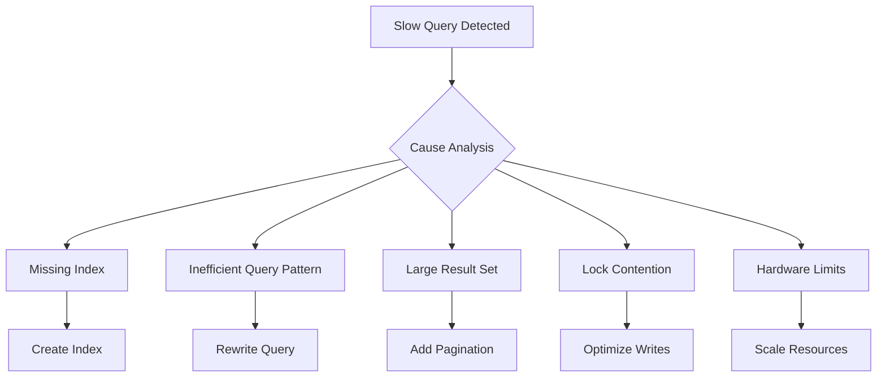

# How to Fix 'slow query' Issues in MongoDB

Author: [nawazdhandala](https://www.github.com/nawazdhandala)

Tags: MongoDB, Slow Queries, Performance, Optimization, Indexing, Query Tuning, Database

Description: A practical guide to identifying and fixing slow queries in MongoDB, covering query profiling, index optimization, explain plans, and performance tuning strategies.

---

Slow queries are the most common performance issue in MongoDB deployments. They increase response times, consume server resources, and can cascade into system-wide problems. This guide provides a systematic approach to finding and fixing slow queries.

## Understanding Slow Queries

MongoDB considers a query "slow" when it exceeds the slow operation threshold (default: 100ms). Slow queries are logged and can be analyzed through the profiler.



## Enabling the Slow Query Log

```javascript
// Set slow query threshold (in milliseconds)
db.setProfilingLevel(0, { slowms: 100 });

// Enable profiling at different levels
db.setProfilingLevel(0);  // Off - only log slow queries
db.setProfilingLevel(1);  // Log slow operations only
db.setProfilingLevel(2);  // Log all operations (use cautiously)

// Check current profiling level
db.getProfilingStatus();
```

## Finding Slow Queries

### Using the System Profiler

```javascript
// Query the system.profile collection
db.system.profile.find().limit(10).sort({ ts: -1 }).pretty();

// Find queries slower than 1 second
db.system.profile.find({
  millis: { $gt: 1000 }
}).sort({ millis: -1 });

// Find slow queries on a specific collection
db.system.profile.find({
  ns: "mydb.users",
  millis: { $gt: 100 }
}).sort({ ts: -1 });

// Find queries doing collection scans
db.system.profile.find({
  "planSummary": "COLLSCAN"
}).sort({ millis: -1 });
```

### Using MongoDB Logs

```bash
# Find slow queries in MongoDB log
grep "COMMAND" /var/log/mongodb/mongod.log | grep -E "[0-9]{4}ms"

# Using mongotop to see collection activity
mongotop 5

# Using mongostat for real-time stats
mongostat --discover
```

## Analyzing Queries with Explain

The `explain()` method is your primary tool for understanding query execution.

```javascript
// Basic explain
db.users.find({ email: "test@example.com" }).explain();

// Detailed execution stats
db.users.find({ email: "test@example.com" }).explain("executionStats");

// Full query plan with all candidates
db.users.find({ email: "test@example.com" }).explain("allPlansExecution");
```

### Understanding Explain Output

```javascript
// Key metrics to examine
{
  "queryPlanner": {
    "winningPlan": {
      "stage": "FETCH",        // or COLLSCAN, IXSCAN, etc.
      "inputStage": {
        "stage": "IXSCAN",     // Index scan - good
        "indexName": "email_1"
      }
    }
  },
  "executionStats": {
    "executionTimeMillis": 5,
    "totalDocsExamined": 1,    // Should be close to nReturned
    "totalKeysExamined": 1,
    "nReturned": 1
  }
}
```

**Key Indicators of Problems:**

| Metric | Problem Sign | Solution |
|--------|--------------|----------|
| stage: COLLSCAN | Full collection scan | Add index |
| totalDocsExamined >> nReturned | Scanning too many documents | Improve index or query |
| executionTimeMillis > 100 | Slow execution | Optimize query/index |
| totalKeysExamined >> nReturned | Inefficient index | Better index selection |

## Index Optimization

### Creating Effective Indexes

```javascript
// Single field index
db.users.createIndex({ email: 1 });

// Compound index - order matters!
db.users.createIndex({ status: 1, createdAt: -1 });

// Compound index for query + sort
// Query: find({ status: "active" }).sort({ createdAt: -1 })
db.users.createIndex({ status: 1, createdAt: -1 });

// Partial index - index only matching documents
db.orders.createIndex(
  { createdAt: -1 },
  { partialFilterExpression: { status: "pending" } }
);

// Sparse index - only index documents with the field
db.users.createIndex({ phone: 1 }, { sparse: true });
```

### The ESR Rule for Compound Indexes

**Equality - Sort - Range** is the optimal order for compound index fields.

```javascript
// Query pattern
db.orders.find({
  status: "active",        // Equality
  amount: { $gte: 100 }    // Range
}).sort({ createdAt: -1 }); // Sort

// Optimal index following ESR
db.orders.createIndex({
  status: 1,      // E - Equality first
  createdAt: -1,  // S - Sort second
  amount: 1       // R - Range last
});
```

### Covered Queries

Queries that can be satisfied entirely from the index are fastest.

```javascript
// Create index that covers the query
db.users.createIndex({ email: 1, name: 1, status: 1 });

// This query is covered - no document fetch needed
db.users.find(
  { email: "test@example.com" },
  { name: 1, status: 1, _id: 0 }  // Projection matches index
).explain("executionStats");
// Look for: "totalDocsExamined": 0
```

## Query Pattern Optimization

### Avoid $where and JavaScript Execution

```javascript
// Bad - JavaScript execution
db.users.find({
  $where: "this.age > 30"
});

// Good - Native query
db.users.find({
  age: { $gt: 30 }
});
```

### Use Projection to Limit Fields

```javascript
// Bad - fetching all fields
db.users.find({ status: "active" });

// Good - fetch only needed fields
db.users.find(
  { status: "active" },
  { name: 1, email: 1 }
);
```

### Avoid Large Skip Values

```javascript
// Bad - skipping many documents
db.users.find().skip(100000).limit(10);

// Good - use range queries
db.users.find({
  _id: { $gt: ObjectId("lastSeenId") }
}).limit(10);
```

### Optimize $in Queries

```javascript
// When using $in with large arrays
db.products.find({
  category: { $in: largeArray }
});

// Consider batch processing
const batchSize = 100;
for (let i = 0; i < largeArray.length; i += batchSize) {
  const batch = largeArray.slice(i, i + batchSize);
  const results = await db.products.find({
    category: { $in: batch }
  }).toArray();
  // Process results
}
```

## Aggregation Pipeline Optimization

```javascript
// Put $match early to reduce documents
// Bad
db.orders.aggregate([
  { $lookup: { from: "users", ... } },
  { $match: { status: "active" } }  // Match after expensive lookup
]);

// Good
db.orders.aggregate([
  { $match: { status: "active" } },  // Match first
  { $lookup: { from: "users", ... } }
]);

// Use $project early to reduce field processing
db.orders.aggregate([
  { $match: { status: "active" } },
  { $project: { orderId: 1, amount: 1, userId: 1 } },  // Reduce fields early
  { $lookup: { from: "users", ... } }
]);

// Allow disk use for large aggregations
db.orders.aggregate([...], { allowDiskUse: true });
```

## Monitoring and Alerting

### Real-time Monitoring Script

```javascript
// Monitor slow queries in real-time
const watchSlowQueries = async () => {
  const db = client.db('admin');

  while (true) {
    const slowOps = await db.command({
      currentOp: 1,
      "secs_running": { $gte: 5 }
    });

    if (slowOps.inprog.length > 0) {
      console.log('Slow operations detected:');
      slowOps.inprog.forEach(op => {
        console.log(`- ${op.ns}: ${op.secs_running}s - ${JSON.stringify(op.command)}`);
      });
    }

    await sleep(5000);
  }
};
```

### Index Usage Statistics

```javascript
// Check index usage
db.users.aggregate([
  { $indexStats: {} }
]).forEach(idx => {
  print(`${idx.name}: ${idx.accesses.ops} operations since ${idx.accesses.since}`);
});

// Find unused indexes
db.users.aggregate([
  { $indexStats: {} },
  { $match: { "accesses.ops": 0 } }
]);
```

## Configuration Tuning

### WiredTiger Cache

```yaml
# mongod.conf
storage:
  wiredTiger:
    engineConfig:
      cacheSizeGB: 4  # Adjust based on available RAM
```

### Connection Pool

```javascript
// Application connection settings
const client = new MongoClient(uri, {
  maxPoolSize: 100,
  minPoolSize: 10,
  maxIdleTimeMS: 30000,
  waitQueueTimeoutMS: 10000
});
```

### Read Preference for Replica Sets

```javascript
// Distribute read load to secondaries
const client = new MongoClient(uri, {
  readPreference: 'secondaryPreferred'
});

// For specific queries
db.collection.find().readPref('secondary');
```

## Common Slow Query Patterns and Fixes

| Pattern | Problem | Solution |
|---------|---------|----------|
| `find({})` on large collection | Full collection scan | Add filter criteria |
| `.sort()` without index | In-memory sort | Create index with sort field |
| `$regex` with leading wildcard | Can't use index | Restructure query or use text index |
| Large `$in` arrays | Inefficient scanning | Batch process or restructure |
| Missing compound index | Partial index usage | Create proper compound index |
| `$lookup` on unindexed field | Slow join | Index the foreign key field |

## Quick Optimization Checklist

1. **Enable profiling** and identify slow queries
2. **Run explain()** on slow queries
3. **Check for COLLSCAN** - add index if found
4. **Verify index usage** matches query patterns
5. **Use projections** to limit returned fields
6. **Add pagination** for large result sets
7. **Monitor index stats** and remove unused indexes
8. **Review aggregation pipelines** for optimization
9. **Check hardware metrics** - CPU, memory, disk I/O
10. **Consider read replicas** for read-heavy workloads

## Summary

Slow queries in MongoDB are usually caused by missing or inefficient indexes. Use the profiler and explain() to identify problems, then apply targeted fixes - creating proper indexes, optimizing query patterns, and tuning aggregation pipelines. Regular monitoring and proactive index management will keep your MongoDB deployment running fast.
