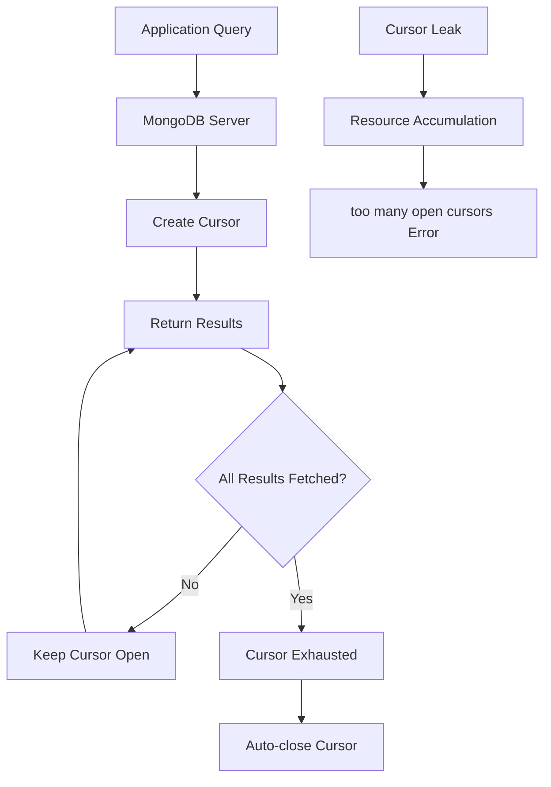

# How to Fix "too many open cursors" Errors in MongoDB

Author: [nawazdhandala](https://www.github.com/nawazdhandala)

Tags: MongoDB, Cursors, Database, Troubleshooting, Performance, Memory Management

Description: Learn how to diagnose and fix MongoDB "too many open cursors" errors, understand cursor management, and implement best practices to prevent cursor leaks in your applications.

---

The "too many open cursors" error in MongoDB occurs when your application opens more cursors than the server allows. This can lead to degraded performance, memory issues, and ultimately application failures. Let's explore how to diagnose, fix, and prevent this error.

## Understanding MongoDB Cursors

When you execute a query in MongoDB, the server returns a cursor - a pointer to the result set. Cursors consume server resources and need to be properly closed when no longer needed.



## Diagnosing the Problem

First, let's identify how many cursors are currently open:

```javascript
// Check current cursor count
db.serverStatus().metrics.cursor

// Detailed cursor information
db.aggregate([
    { $currentOp: { allUsers: true, idleCursors: true } },
    { $match: { type: "idleCursor" } },
    { $group: {
        _id: { client: "$client", appName: "$appName" },
        count: { $sum: 1 },
        cursors: { $push: {
            cursorId: "$cursor.cursorId",
            createdDate: "$cursor.createdDate",
            lastAccessDate: "$cursor.lastAccessDate"
        }}
    }},
    { $sort: { count: -1 } }
])

// Check cursor timeout settings
db.adminCommand({ getParameter: 1, cursorTimeoutMillis: 1 })
```

Monitor cursor usage over time:

```javascript
// Monitor cursor metrics
function monitorCursors() {
    const metrics = db.serverStatus().metrics.cursor;

    print("=== Cursor Metrics ===");
    print("Open cursors: " + metrics.open.total);
    print("No-timeout cursors: " + metrics.open.noTimeout);
    print("Pinned cursors: " + metrics.open.pinned);
    print("Timed out (total): " + metrics.timedOut);
}

// Run periodically
monitorCursors();
```

## Common Causes and Solutions

### Cause 1: Not Closing Cursors Properly

The most common cause is failing to close cursors after use:

```javascript
// BAD: Cursor not closed
const { MongoClient } = require('mongodb');

async function badExample() {
    const client = new MongoClient('mongodb://localhost:27017');
    await client.connect();

    const collection = client.db('test').collection('users');

    // This cursor is never closed!
    const cursor = collection.find({});

    // Only processing first item
    const firstUser = await cursor.next();
    console.log(firstUser);

    // Cursor left open - MEMORY LEAK!
}

// GOOD: Properly close cursor
async function goodExample() {
    const client = new MongoClient('mongodb://localhost:27017');
    await client.connect();

    const collection = client.db('test').collection('users');
    const cursor = collection.find({});

    try {
        const firstUser = await cursor.next();
        console.log(firstUser);
    } finally {
        await cursor.close(); // Always close!
    }
}

// BETTER: Use toArray() for small result sets
async function betterExample() {
    const client = new MongoClient('mongodb://localhost:27017');
    await client.connect();

    const collection = client.db('test').collection('users');

    // toArray() automatically closes cursor
    const users = await collection.find({}).limit(100).toArray();
    console.log(users);
}
```

### Cause 2: Cursor Timeout Disabled

Cursors with `noCursorTimeout` set never expire automatically:

```javascript
// BAD: No timeout means cursors live forever
const cursor = collection.find({}).addCursorFlag('noCursorTimeout', true);

// GOOD: If you must use noCursorTimeout, ensure cleanup
class ManagedCursor {
    constructor(collection, query, options = {}) {
        this.collection = collection;
        this.query = query;
        this.options = options;
        this.cursor = null;
    }

    async *iterate() {
        this.cursor = this.collection.find(this.query, this.options);

        if (this.options.noCursorTimeout) {
            this.cursor.addCursorFlag('noCursorTimeout', true);
        }

        try {
            while (await this.cursor.hasNext()) {
                yield await this.cursor.next();
            }
        } finally {
            await this.close();
        }
    }

    async close() {
        if (this.cursor) {
            await this.cursor.close();
            this.cursor = null;
        }
    }
}

// Usage
async function processLargeDataset() {
    const managed = new ManagedCursor(collection, {}, { noCursorTimeout: true });

    for await (const doc of managed.iterate()) {
        await processDocument(doc);
    }
    // Cursor automatically closed
}
```

### Cause 3: Exception Handling Issues

Exceptions can prevent cursor cleanup:

```javascript
// BAD: Exception prevents cursor close
async function badExceptionHandling() {
    const cursor = collection.find({});

    while (await cursor.hasNext()) {
        const doc = await cursor.next();
        processDocument(doc); // If this throws, cursor stays open
    }
}

// GOOD: Proper exception handling
async function goodExceptionHandling() {
    const cursor = collection.find({});

    try {
        while (await cursor.hasNext()) {
            const doc = await cursor.next();
            await processDocument(doc);
        }
    } catch (error) {
        console.error('Processing error:', error);
        throw error;
    } finally {
        await cursor.close(); // Always runs
    }
}

// BETTER: Use for-await-of with automatic cleanup
async function betterIteration() {
    const cursor = collection.find({});

    try {
        for await (const doc of cursor) {
            await processDocument(doc);
        }
    } catch (error) {
        console.error('Processing error:', error);
    }
    // Cursor automatically closed when iterator completes or errors
}
```

### Cause 4: Connection Pool Exhaustion

Too many concurrent operations can exhaust cursors:

```javascript
// BAD: Opening too many cursors simultaneously
async function badConcurrency() {
    const promises = [];

    for (let i = 0; i < 10000; i++) {
        // Each creates a cursor
        promises.push(collection.find({ batch: i }).toArray());
    }

    await Promise.all(promises); // Too many cursors!
}

// GOOD: Limit concurrency
async function goodConcurrency() {
    const pLimit = require('p-limit');
    const limit = pLimit(10); // Max 10 concurrent cursors

    const batches = Array.from({ length: 10000 }, (_, i) => i);

    await Promise.all(
        batches.map(batch =>
            limit(() => collection.find({ batch }).toArray())
        )
    );
}

// BETTER: Use aggregation for batch processing
async function aggregationApproach() {
    const results = await collection.aggregate([
        { $group: { _id: "$batch", docs: { $push: "$$ROOT" } } },
        { $sort: { _id: 1 } }
    ]).toArray();

    return results;
}
```

## Implementing a Cursor Manager

Create a centralized cursor management system:

```javascript
const { MongoClient } = require('mongodb');

class CursorManager {
    constructor(client) {
        this.client = client;
        this.activeCursors = new Map();
        this.maxCursors = 100;
        this.cursorTimeout = 60000; // 1 minute
    }

    async createCursor(collection, query, options = {}) {
        // Check limit
        if (this.activeCursors.size >= this.maxCursors) {
            await this.cleanupOldestCursors(10);
        }

        const cursor = collection.find(query, options);
        const cursorId = this.generateId();

        const managedCursor = {
            cursor,
            createdAt: Date.now(),
            lastAccess: Date.now(),
            collection: collection.collectionName
        };

        this.activeCursors.set(cursorId, managedCursor);

        return {
            id: cursorId,
            cursor: this.wrapCursor(cursorId, cursor)
        };
    }

    wrapCursor(cursorId, cursor) {
        const self = this;

        return {
            async next() {
                self.updateAccess(cursorId);
                return cursor.next();
            },

            async hasNext() {
                self.updateAccess(cursorId);
                return cursor.hasNext();
            },

            async toArray() {
                try {
                    return await cursor.toArray();
                } finally {
                    await self.closeCursor(cursorId);
                }
            },

            async close() {
                await self.closeCursor(cursorId);
            },

            [Symbol.asyncIterator]() {
                const originalIterator = cursor[Symbol.asyncIterator]();
                return {
                    async next() {
                        self.updateAccess(cursorId);
                        const result = await originalIterator.next();
                        if (result.done) {
                            await self.closeCursor(cursorId);
                        }
                        return result;
                    },
                    async return() {
                        await self.closeCursor(cursorId);
                        return { done: true };
                    }
                };
            }
        };
    }

    updateAccess(cursorId) {
        const managed = this.activeCursors.get(cursorId);
        if (managed) {
            managed.lastAccess = Date.now();
        }
    }

    async closeCursor(cursorId) {
        const managed = this.activeCursors.get(cursorId);
        if (managed) {
            await managed.cursor.close();
            this.activeCursors.delete(cursorId);
        }
    }

    async cleanupOldestCursors(count) {
        const sorted = [...this.activeCursors.entries()]
            .sort((a, b) => a[1].lastAccess - b[1].lastAccess);

        for (let i = 0; i < Math.min(count, sorted.length); i++) {
            const [cursorId] = sorted[i];
            await this.closeCursor(cursorId);
            console.log(`Cleaned up stale cursor: ${cursorId}`);
        }
    }

    async cleanupExpiredCursors() {
        const now = Date.now();

        for (const [cursorId, managed] of this.activeCursors) {
            if (now - managed.lastAccess > this.cursorTimeout) {
                await this.closeCursor(cursorId);
                console.log(`Closed expired cursor: ${cursorId}`);
            }
        }
    }

    startCleanupInterval(intervalMs = 30000) {
        setInterval(() => this.cleanupExpiredCursors(), intervalMs);
    }

    getStats() {
        return {
            activeCursors: this.activeCursors.size,
            maxCursors: this.maxCursors,
            cursors: [...this.activeCursors.entries()].map(([id, m]) => ({
                id,
                collection: m.collection,
                age: Date.now() - m.createdAt,
                idleTime: Date.now() - m.lastAccess
            }))
        };
    }

    generateId() {
        return `cursor_${Date.now()}_${Math.random().toString(36).substr(2, 9)}`;
    }
}

// Usage
async function main() {
    const client = new MongoClient('mongodb://localhost:27017');
    await client.connect();

    const cursorManager = new CursorManager(client);
    cursorManager.startCleanupInterval();

    const collection = client.db('test').collection('users');

    // Create managed cursor
    const { cursor } = await cursorManager.createCursor(collection, { active: true });

    for await (const doc of cursor) {
        console.log(doc);
    }
    // Cursor automatically cleaned up

    console.log('Stats:', cursorManager.getStats());
}
```

## Server-Side Configuration

Adjust server settings to handle more cursors:

```javascript
// Increase cursor timeout (MongoDB shell)
db.adminCommand({ setParameter: 1, cursorTimeoutMillis: 600000 }) // 10 minutes

// Check current settings
db.adminCommand({ getParameter: 1, cursorTimeoutMillis: 1 })
```

For mongod.conf:

```yaml
# mongod.conf
setParameter:
  cursorTimeoutMillis: 600000
```

## Monitoring and Alerting

Set up monitoring to catch cursor issues early:

```javascript
const { MongoClient } = require('mongodb');

class CursorMonitor {
    constructor(client, thresholds = {}) {
        this.client = client;
        this.thresholds = {
            warning: thresholds.warning || 500,
            critical: thresholds.critical || 800
        };
    }

    async checkCursors() {
        const admin = this.client.db('admin');
        const status = await admin.command({ serverStatus: 1 });

        const metrics = status.metrics.cursor;
        const openCursors = metrics.open.total;

        const result = {
            timestamp: new Date(),
            openCursors,
            noTimeoutCursors: metrics.open.noTimeout,
            timedOut: metrics.timedOut,
            status: 'ok'
        };

        if (openCursors >= this.thresholds.critical) {
            result.status = 'critical';
            result.message = `Critical: ${openCursors} open cursors`;
        } else if (openCursors >= this.thresholds.warning) {
            result.status = 'warning';
            result.message = `Warning: ${openCursors} open cursors`;
        }

        return result;
    }

    startMonitoring(intervalMs = 10000, callback) {
        return setInterval(async () => {
            const result = await this.checkCursors();
            callback(result);
        }, intervalMs);
    }
}

// Usage
async function setupMonitoring() {
    const client = new MongoClient('mongodb://localhost:27017');
    await client.connect();

    const monitor = new CursorMonitor(client, {
        warning: 100,
        critical: 200
    });

    monitor.startMonitoring(5000, (result) => {
        if (result.status !== 'ok') {
            console.error(`ALERT [${result.status.toUpperCase()}]:`, result.message);
            // Send to alerting system
        }
        console.log('Cursor check:', result);
    });
}
```

## Best Practices Summary

```javascript
// 1. Always use try-finally or for-await-of
async function bestPractice1(collection) {
    const cursor = collection.find({});
    try {
        for await (const doc of cursor) {
            await process(doc);
        }
    } finally {
        await cursor.close();
    }
}

// 2. Prefer toArray() for small datasets
async function bestPractice2(collection) {
    const docs = await collection.find({}).limit(1000).toArray();
    return docs;
}

// 3. Use batch processing for large datasets
async function bestPractice3(collection) {
    const batchSize = 1000;
    let skip = 0;

    while (true) {
        const batch = await collection
            .find({})
            .skip(skip)
            .limit(batchSize)
            .toArray();

        if (batch.length === 0) break;

        await processBatch(batch);
        skip += batchSize;
    }
}

// 4. Limit concurrent cursors
async function bestPractice4(collection, queries) {
    const pLimit = require('p-limit');
    const limit = pLimit(5);

    return Promise.all(
        queries.map(query => limit(() => collection.find(query).toArray()))
    );
}
```

## Conclusion

The "too many open cursors" error is almost always preventable with proper cursor management. Key takeaways: always close cursors when done, use try-finally blocks, prefer toArray() for small result sets, limit concurrency, and monitor cursor usage. By following these practices, you can ensure your MongoDB application runs reliably without cursor-related issues.
