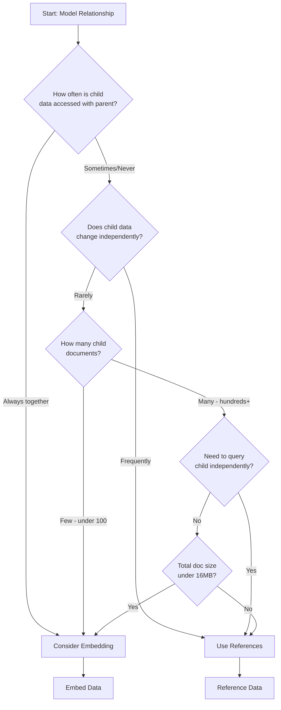

# How to Choose Between Embedding and Referencing in MongoDB

Author: [nawazdhandala](https://www.github.com/nawazdhandala)

Tags: MongoDB, Data Modeling, Schema Design, Embedding, Referencing, NoSQL

Description: Learn when to embed documents versus when to use references in MongoDB. This guide covers data modeling patterns, performance implications, and best practices for schema design.

---

One of the most important decisions when designing a MongoDB schema is whether to embed related data within a document or reference it from another collection. This choice significantly impacts query performance, data consistency, and application complexity. This guide helps you make the right decision for your use case.

## Understanding the Two Approaches

### Embedding (Denormalization)

Store related data directly within the document:

```javascript
// Embedded approach - order contains product details
{
  _id: ObjectId("..."),
  orderNumber: "ORD-001",
  customer: {
    name: "Alice Smith",
    email: "alice@example.com",
    address: {
      street: "123 Main St",
      city: "New York",
      zip: "10001"
    }
  },
  items: [
    { productName: "Laptop", price: 999, quantity: 1 },
    { productName: "Mouse", price: 49, quantity: 2 }
  ],
  total: 1097
}
```

### Referencing (Normalization)

Store related data in separate collections with references:

```javascript
// Referenced approach - order references customer and products
// Orders collection
{
  _id: ObjectId("..."),
  orderNumber: "ORD-001",
  customerId: ObjectId("customer123"),
  items: [
    { productId: ObjectId("product1"), quantity: 1 },
    { productId: ObjectId("product2"), quantity: 2 }
  ]
}

// Customers collection
{
  _id: ObjectId("customer123"),
  name: "Alice Smith",
  email: "alice@example.com"
}

// Products collection
{
  _id: ObjectId("product1"),
  name: "Laptop",
  price: 999
}
```

## Decision Framework

Use this flowchart to guide your decision:



## When to Embed

### 1. One-to-One Relationships

When data has a strict one-to-one relationship and is always accessed together:

```javascript
// User with profile - embed because profile is always needed with user
{
  _id: ObjectId("..."),
  username: "alice",
  email: "alice@example.com",
  profile: {
    firstName: "Alice",
    lastName: "Smith",
    bio: "Software developer",
    avatar: "https://example.com/avatar.jpg",
    preferences: {
      theme: "dark",
      notifications: true
    }
  }
}
```

### 2. One-to-Few Relationships

When parent document has a small, bounded number of children:

```javascript
// Blog post with comments - embed when comments are few
{
  _id: ObjectId("..."),
  title: "MongoDB Best Practices",
  content: "...",
  author: "Alice",
  comments: [
    { user: "Bob", text: "Great post!", date: new Date() },
    { user: "Charlie", text: "Very helpful", date: new Date() }
  ]
}
```

### 3. Data That Doesn't Change Often

Embed data that is relatively static:

```javascript
// Order with shipping address - address won't change after order is placed
{
  _id: ObjectId("..."),
  orderNumber: "ORD-001",
  shippingAddress: {
    street: "123 Main St",
    city: "New York",
    state: "NY",
    zip: "10001",
    country: "USA"
  }
}
```

### Embedding Benefits

- Single query retrieves all data
- Atomic updates within one document
- Better read performance
- Natural data locality

## When to Reference

### 1. One-to-Many with Large Number of Children

When the "many" side can grow unboundedly:

```javascript
// Author with books - reference because an author can have many books
// Authors collection
{
  _id: ObjectId("author1"),
  name: "Stephen King",
  bio: "..."
}

// Books collection
{
  _id: ObjectId("..."),
  title: "The Shining",
  authorId: ObjectId("author1"),
  pages: 447,
  publishedYear: 1977
}
```

### 2. Many-to-Many Relationships

When entities can relate to multiple other entities:

```javascript
// Students and courses - many-to-many relationship
// Students collection
{
  _id: ObjectId("student1"),
  name: "Alice",
  enrolledCourseIds: [
    ObjectId("course1"),
    ObjectId("course2")
  ]
}

// Courses collection
{
  _id: ObjectId("course1"),
  name: "Database Design",
  enrolledStudentIds: [
    ObjectId("student1"),
    ObjectId("student2")
  ]
}
```

### 3. Frequently Updated Independent Data

When child data changes frequently and independently:

```javascript
// Product with inventory - reference because inventory changes often
// Products collection
{
  _id: ObjectId("product1"),
  name: "Laptop",
  description: "...",
  price: 999
}

// Inventory collection
{
  _id: ObjectId("..."),
  productId: ObjectId("product1"),
  warehouseId: ObjectId("warehouse1"),
  quantity: 150,
  lastUpdated: new Date()
}
```

### 4. Data Accessed Independently

When you need to query the child data without the parent:

```javascript
// Users and their activity logs - reference because logs are queried separately
// Users collection
{
  _id: ObjectId("user1"),
  name: "Alice",
  email: "alice@example.com"
}

// ActivityLogs collection
{
  _id: ObjectId("..."),
  userId: ObjectId("user1"),
  action: "login",
  timestamp: new Date(),
  ipAddress: "192.168.1.1"
}

// Can query logs independently
db.activityLogs.find({
  timestamp: { $gte: new Date("2024-01-01") },
  action: "login"
})
```

### Referencing Benefits

- Smaller document sizes
- No data duplication
- Easier updates to shared data
- Flexible querying of related data

## Hybrid Approaches

Often the best solution combines both approaches:

### Partial Embedding

Embed frequently accessed fields, reference for full data:

```javascript
// Order with partial product embedding
{
  _id: ObjectId("..."),
  orderNumber: "ORD-001",
  items: [
    {
      productId: ObjectId("product1"),
      // Embed commonly needed fields
      productName: "Laptop",
      priceAtPurchase: 999,
      quantity: 1
    }
  ]
}
```

### Computed Patterns

Store computed summaries while referencing details:

```javascript
// Author with computed book count
{
  _id: ObjectId("author1"),
  name: "Stephen King",
  // Computed field - updated when books change
  bookCount: 64,
  latestBook: {
    title: "Holly",
    publishedYear: 2023
  }
}
```

## Common Patterns

### Extended Reference Pattern

Store a copy of frequently accessed fields:

```javascript
// Movie with extended director reference
{
  _id: ObjectId("..."),
  title: "Inception",
  director: {
    _id: ObjectId("director1"),
    name: "Christopher Nolan"  // Duplicated for quick access
  },
  year: 2010
}
```

### Subset Pattern

Embed a subset of related data:

```javascript
// Product with top reviews embedded, all reviews in separate collection
{
  _id: ObjectId("product1"),
  name: "Laptop",
  // Embed only top reviews
  topReviews: [
    { rating: 5, text: "Excellent!", user: "Alice" },
    { rating: 5, text: "Love it!", user: "Bob" }
  ],
  totalReviews: 1547,
  averageRating: 4.3
}

// All reviews in separate collection
{
  _id: ObjectId("..."),
  productId: ObjectId("product1"),
  rating: 5,
  text: "Excellent product!",
  userId: ObjectId("user1"),
  date: new Date()
}
```

### Bucket Pattern

Group related documents into buckets:

```javascript
// IoT sensor data bucketed by hour
{
  _id: ObjectId("..."),
  sensorId: "sensor-001",
  startTime: new Date("2024-01-15T10:00:00Z"),
  endTime: new Date("2024-01-15T11:00:00Z"),
  readings: [
    { timestamp: new Date("..."), value: 23.5 },
    { timestamp: new Date("..."), value: 23.7 },
    // ... up to ~200 readings per bucket
  ],
  readingCount: 120,
  avgValue: 23.6
}
```

## Performance Considerations

### Embedding Performance

```javascript
// Single query for embedded data - very fast
db.orders.findOne({ _id: orderId })

// Update embedded data - atomic
db.orders.updateOne(
  { _id: orderId },
  { $push: { items: newItem } }
)
```

### Reference Performance

```javascript
// Multiple queries or $lookup needed
db.orders.aggregate([
  { $match: { _id: orderId } },
  {
    $lookup: {
      from: "products",
      localField: "items.productId",
      foreignField: "_id",
      as: "productDetails"
    }
  }
])

// Index foreign key fields for better performance
db.orders.createIndex({ customerId: 1 })
```

## Summary Comparison

| Criteria | Embedding | Referencing |
|----------|-----------|-------------|
| Read Performance | Faster (single query) | Slower (multiple queries/$lookup) |
| Write Performance | Can be slower for large docs | Faster for small updates |
| Data Consistency | Atomic within document | Requires application logic |
| Data Duplication | Possible | Minimal |
| Document Size | Larger | Smaller |
| Schema Flexibility | Less flexible | More flexible |
| Query Complexity | Simpler | More complex |

## Best Practices

1. **Start with embedding** - MongoDB is optimized for document-based access
2. **Reference when needed** - Add references as requirements become clear
3. **Consider read/write ratio** - Embedding favors reads, referencing favors writes
4. **Monitor document growth** - Watch for documents approaching 16MB limit
5. **Index foreign keys** - Always index reference fields used in lookups
6. **Use hybrid approaches** - Combine techniques for optimal performance

Choose your data model based on how your application accesses data, not how it's structured in your mind. MongoDB's flexibility allows you to evolve your schema as requirements change.
