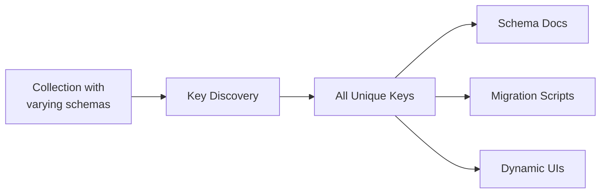

# How to Get All Unique Key Names in MongoDB Collection

Author: [nawazdhandala](https://www.github.com/nawazdhandala)

Tags: MongoDB, Schema Analysis, Keys, Aggregation, Database

Description: Learn multiple methods to extract all unique field names from a MongoDB collection including aggregation pipelines, MapReduce, and JavaScript approaches for schema discovery.

---

MongoDB's schema-less nature means documents in the same collection can have different fields. This flexibility is powerful but sometimes you need to discover what fields actually exist across your collection. This guide covers multiple approaches to extract all unique key names from MongoDB documents.

## Why Discover Field Names?

Common use cases for finding all unique keys:

- Schema documentation and analysis
- Data migration planning
- Building dynamic forms or admin interfaces
- Data quality audits
- Understanding legacy collections



## Sample Data Setup

Let's create a collection with varying document structures:

```javascript
db.products.insertMany([
  {
    name: "Laptop",
    price: 999,
    specs: { cpu: "i7", ram: "16GB" },
    tags: ["electronics", "computer"]
  },
  {
    name: "Mouse",
    price: 49,
    color: "black",
    wireless: true
  },
  {
    name: "Desk",
    price: 299,
    dimensions: { width: 60, height: 30, depth: 24 },
    material: "wood"
  },
  {
    name: "Monitor",
    price: 399,
    specs: { size: "27 inch", resolution: "4K" },
    warranty: "3 years"
  }
])
```

## Method 1: Aggregation with $objectToArray

The most efficient method for MongoDB 3.4.4+:

```javascript
// Get all unique top-level keys
db.products.aggregate([
  { $project: { keys: { $objectToArray: "$$ROOT" } } },
  { $unwind: "$keys" },
  { $group: { _id: null, allKeys: { $addToSet: "$keys.k" } } }
])

// Output:
// {
//   _id: null,
//   allKeys: ["_id", "name", "price", "specs", "tags", "color",
//             "wireless", "dimensions", "material", "warranty"]
// }
```

### Getting Key Counts

See how often each key appears:

```javascript
// Count occurrences of each key
db.products.aggregate([
  { $project: { keys: { $objectToArray: "$$ROOT" } } },
  { $unwind: "$keys" },
  { $group: {
      _id: "$keys.k",
      count: { $sum: 1 }
    }
  },
  { $sort: { count: -1 } }
])

// Output:
// { _id: "name", count: 4 }
// { _id: "price", count: 4 }
// { _id: "_id", count: 4 }
// { _id: "specs", count: 2 }
// { _id: "color", count: 1 }
// ...
```

## Method 2: Nested Keys Discovery

To discover keys in nested documents:

```javascript
// Recursive function to get nested keys
function getNestedKeys(prefix, obj) {
  const keys = [];
  for (const [key, value] of Object.entries(obj)) {
    const fullKey = prefix ? `${prefix}.${key}` : key;
    keys.push(fullKey);

    if (value && typeof value === 'object' && !Array.isArray(value)) {
      keys.push(...getNestedKeys(fullKey, value));
    }
  }
  return keys;
}

// Aggregation for one level of nesting
db.products.aggregate([
  { $project: { keys: { $objectToArray: "$$ROOT" } } },
  { $unwind: "$keys" },
  {
    $project: {
      key: "$keys.k",
      nestedKeys: {
        $cond: {
          if: { $eq: [{ $type: "$keys.v" }, "object"] },
          then: { $objectToArray: "$keys.v" },
          else: []
        }
      }
    }
  },
  { $unwind: { path: "$nestedKeys", preserveNullAndEmptyArrays: true } },
  {
    $group: {
      _id: null,
      topLevelKeys: { $addToSet: "$key" },
      nestedKeys: {
        $addToSet: {
          $concat: ["$key", ".", "$nestedKeys.k"]
        }
      }
    }
  }
])
```

### Comprehensive Nested Key Discovery

For deeply nested structures, use JavaScript:

```javascript
// Get all keys including deeply nested ones
async function getAllKeys(collectionName, sampleSize = 1000) {
  const keys = new Set();

  function extractKeys(obj, prefix = '') {
    for (const [key, value] of Object.entries(obj)) {
      const fullKey = prefix ? `${prefix}.${key}` : key;
      keys.add(fullKey);

      if (value && typeof value === 'object' && !Array.isArray(value)) {
        extractKeys(value, fullKey);
      }
    }
  }

  const cursor = db.collection(collectionName).find().limit(sampleSize);

  await cursor.forEach(doc => {
    extractKeys(doc);
  });

  return Array.from(keys).sort();
}

// Usage
const allKeys = await getAllKeys('products');
console.log(allKeys);
// ["_id", "color", "dimensions", "dimensions.depth", "dimensions.height",
//  "dimensions.width", "material", "name", "price", "specs", "specs.cpu",
//  "specs.ram", "specs.resolution", "specs.size", "tags", "warranty", "wireless"]
```

## Method 3: Using $sample for Large Collections

For large collections, sample documents instead of scanning all:

```javascript
// Get keys from a sample of documents
db.products.aggregate([
  { $sample: { size: 1000 } },  // Sample 1000 random documents
  { $project: { keys: { $objectToArray: "$$ROOT" } } },
  { $unwind: "$keys" },
  { $group: { _id: null, allKeys: { $addToSet: "$keys.k" } } }
])
```

## Method 4: Schema Analysis with Types

Get keys along with their data types:

```javascript
// Get keys with their types
db.products.aggregate([
  { $project: { keys: { $objectToArray: "$$ROOT" } } },
  { $unwind: "$keys" },
  {
    $group: {
      _id: "$keys.k",
      types: { $addToSet: { $type: "$keys.v" } },
      count: { $sum: 1 },
      sample: { $first: "$keys.v" }
    }
  },
  { $sort: { count: -1 } }
])

// Output:
// { _id: "name", types: ["string"], count: 4, sample: "Laptop" }
// { _id: "price", types: ["int", "double"], count: 4, sample: 999 }
// { _id: "specs", types: ["object"], count: 2, sample: {...} }
// { _id: "wireless", types: ["bool"], count: 1, sample: true }
```

## Method 5: MapReduce (Legacy)

For older MongoDB versions without `$objectToArray`:

```javascript
// MapReduce approach
db.products.mapReduce(
  function() {
    for (var key in this) {
      emit(key, null);
    }
  },
  function(key, values) {
    return null;
  },
  { out: { inline: 1 } }
).results.map(r => r._id);
```

## Building a Complete Schema Report

Combine techniques for a comprehensive schema analysis:

```javascript
// Generate complete schema report
async function generateSchemaReport(collectionName) {
  const report = {
    collection: collectionName,
    documentCount: await db.collection(collectionName).countDocuments(),
    fields: []
  };

  const fieldStats = await db.collection(collectionName).aggregate([
    { $sample: { size: 10000 } },
    { $project: { keys: { $objectToArray: "$$ROOT" } } },
    { $unwind: "$keys" },
    {
      $group: {
        _id: "$keys.k",
        types: { $addToSet: { $type: "$keys.v" } },
        count: { $sum: 1 },
        nullCount: {
          $sum: { $cond: [{ $eq: [{ $type: "$keys.v" }, "null"] }, 1, 0] }
        },
        samples: { $push: { $cond: [
          { $lte: [{ $rand: {} }, 0.01] },
          "$keys.v",
          "$$REMOVE"
        ]}}
      }
    },
    { $sort: { count: -1 } }
  ]).toArray();

  report.fields = fieldStats.map(f => ({
    name: f._id,
    types: f.types,
    occurrences: f.count,
    nulls: f.nullCount,
    completeness: ((f.count - f.nullCount) / f.count * 100).toFixed(1) + '%',
    samples: f.samples.slice(0, 3)
  }));

  return report;
}

// Usage
const report = await generateSchemaReport('products');
console.log(JSON.stringify(report, null, 2));
```

## Finding Schema Inconsistencies

Identify documents with missing or extra fields:

```javascript
// Find required fields (present in all documents)
const totalDocs = await db.products.countDocuments();

const requiredFields = await db.products.aggregate([
  { $project: { keys: { $objectToArray: "$$ROOT" } } },
  { $unwind: "$keys" },
  { $group: { _id: "$keys.k", count: { $sum: 1 } } },
  { $match: { count: totalDocs } },
  { $project: { _id: 1 } }
]).toArray();

console.log('Required fields:', requiredFields.map(f => f._id));

// Find optional fields (not in all documents)
const optionalFields = await db.products.aggregate([
  { $project: { keys: { $objectToArray: "$$ROOT" } } },
  { $unwind: "$keys" },
  { $group: { _id: "$keys.k", count: { $sum: 1 } } },
  { $match: { count: { $lt: totalDocs } } },
  { $project: {
      field: "$_id",
      presentIn: "$count",
      missingFrom: { $subtract: [totalDocs, "$count"] }
    }
  }
]).toArray();

console.log('Optional fields:', optionalFields);
```

## Analyzing Array Field Contents

Discover keys within array elements:

```javascript
// Analyze array element structures
db.products.aggregate([
  { $match: { tags: { $exists: true, $type: "array" } } },
  { $project: {
      tagTypes: {
        $map: {
          input: "$tags",
          as: "tag",
          in: { $type: "$$tag" }
        }
      }
    }
  },
  { $unwind: "$tagTypes" },
  { $group: { _id: "$tagTypes", count: { $sum: 1 } } }
])

// For arrays of objects, extract keys
db.orders.aggregate([
  { $unwind: "$items" },
  { $project: { keys: { $objectToArray: "$items" } } },
  { $unwind: "$keys" },
  { $group: { _id: "$keys.k", count: { $sum: 1 } } }
])
```

## Practical Applications

### Generate TypeScript Interface

```javascript
// Generate TypeScript interface from schema
async function generateInterface(collectionName) {
  const fields = await db.collection(collectionName).aggregate([
    { $sample: { size: 1000 } },
    { $project: { keys: { $objectToArray: "$$ROOT" } } },
    { $unwind: "$keys" },
    {
      $group: {
        _id: "$keys.k",
        types: { $addToSet: { $type: "$keys.v" } }
      }
    }
  ]).toArray();

  const typeMap = {
    string: 'string',
    int: 'number',
    double: 'number',
    bool: 'boolean',
    date: 'Date',
    objectId: 'ObjectId',
    array: 'any[]',
    object: 'Record<string, any>'
  };

  let interface_str = `interface ${collectionName} {\n`;

  for (const field of fields) {
    const types = field.types.map(t => typeMap[t] || 'any');
    const typeUnion = [...new Set(types)].join(' | ');
    interface_str += `  ${field._id}: ${typeUnion};\n`;
  }

  interface_str += '}';
  return interface_str;
}

const tsInterface = await generateInterface('products');
console.log(tsInterface);
```

### Create JSON Schema

```javascript
// Generate JSON Schema from collection
async function generateJsonSchema(collectionName) {
  const fields = await db.collection(collectionName).aggregate([
    { $sample: { size: 1000 } },
    { $project: { keys: { $objectToArray: "$$ROOT" } } },
    { $unwind: "$keys" },
    {
      $group: {
        _id: "$keys.k",
        types: { $addToSet: { $type: "$keys.v" } },
        count: { $sum: 1 }
      }
    }
  ]).toArray();

  const totalDocs = await db.collection(collectionName).countDocuments();

  const typeMap = {
    string: 'string',
    int: 'integer',
    double: 'number',
    bool: 'boolean',
    date: 'string',
    objectId: 'string',
    array: 'array',
    object: 'object'
  };

  const schema = {
    $schema: 'http://json-schema.org/draft-07/schema#',
    type: 'object',
    properties: {},
    required: []
  };

  for (const field of fields) {
    const jsonTypes = [...new Set(field.types.map(t => typeMap[t]))];

    schema.properties[field._id] = {
      type: jsonTypes.length === 1 ? jsonTypes[0] : jsonTypes
    };

    if (field.count === totalDocs) {
      schema.required.push(field._id);
    }
  }

  return schema;
}
```

## Performance Considerations

1. **Use $sample for large collections** - Don't scan millions of documents
2. **Run during off-peak hours** - Schema analysis can be resource-intensive
3. **Cache results** - Schema doesn't change frequently
4. **Use read preference** - Run on secondary nodes if available

```javascript
// Efficient schema discovery for large collections
async function efficientSchemaDiscovery(collectionName) {
  const sampleSizes = [100, 1000, 10000];
  let keys = new Set();
  let prevSize = 0;

  for (const size of sampleSizes) {
    const result = await db.collection(collectionName).aggregate([
      { $sample: { size } },
      { $project: { keys: { $objectToArray: "$$ROOT" } } },
      { $unwind: "$keys" },
      { $group: { _id: null, allKeys: { $addToSet: "$keys.k" } } }
    ]).toArray();

    result[0]?.allKeys.forEach(k => keys.add(k));

    // Stop if no new keys found
    if (keys.size === prevSize) break;
    prevSize = keys.size;
  }

  return Array.from(keys);
}
```

## Summary

Discovering unique keys in MongoDB collections is essential for understanding schema variations:

- Use `$objectToArray` with aggregation for efficient key extraction
- Sample large collections instead of full scans
- Include type information for complete schema analysis
- Use nested extraction for deeply structured documents
- Cache results as schema changes infrequently

These techniques help you document, migrate, and maintain MongoDB collections effectively.
