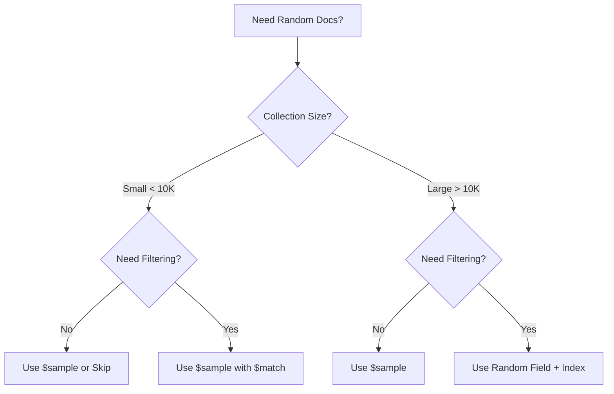

# How to Get Random Documents from MongoDB

Author: [nawazdhandala](https://www.github.com/nawazdhandala)

Tags: MongoDB, Random Sampling, Queries, Aggregation, Database

Description: Learn multiple approaches to retrieve random documents from MongoDB including $sample, random field patterns, and skip-based methods with performance comparisons.

---

Getting random documents from MongoDB is a common requirement for features like "random quote of the day," content shuffling, A/B testing, or displaying random products. MongoDB provides several approaches, each with different trade-offs. This guide covers all the methods you need to know.

## Using $sample (Recommended)

The `$sample` aggregation stage is MongoDB's built-in solution for random sampling, available since MongoDB 3.2:

```javascript
// Get 5 random documents
db.products.aggregate([
  { $sample: { size: 5 } }
])
```

### How $sample Works

MongoDB uses two different algorithms depending on conditions:

```mermaid
graph TD
    A[$sample Stage] --> B{Conditions Check}
    B -->|size < 5% of docs<br/>AND collection > 100 docs<br/>AND no $match before| C[Pseudo-Random Cursor]
    B -->|Otherwise| D[Random Sort]

    C --> E[Fast: O(N) where N = size]
    D --> F[Slower: Scans all matching docs]
```

### Basic $sample Usage

```javascript
// Get a single random document
db.quotes.aggregate([
  { $sample: { size: 1 } }
])

// Get 10 random products from a specific category
db.products.aggregate([
  { $match: { category: "electronics" } },
  { $sample: { size: 10 } }
])

// Get random documents with specific fields
db.products.aggregate([
  { $sample: { size: 5 } },
  { $project: {
      name: 1,
      price: 1,
      _id: 0
    }
  }
])
```

### $sample Limitations

Be aware of these limitations:

```javascript
// $sample may return duplicates if size > collection count
db.smallCollection.aggregate([
  { $sample: { size: 100 } }  // If collection has 50 docs, may have duplicates
])

// $sample after $match uses slower algorithm
db.products.aggregate([
  { $match: { active: true } },  // This triggers slower random sort
  { $sample: { size: 5 } }
])
```

## Random Field Pattern

For more control over randomness, add a random field to documents:

### Setup

```javascript
// Add random field to existing documents
db.products.updateMany(
  {},
  [{ $set: { random: { $rand: {} } } }]  // Adds random 0-1 value
)

// Or add random field on insert
db.products.insertOne({
  name: "New Product",
  price: 99,
  random: Math.random()
})
```

### Querying with Random Field

```javascript
// Get random documents using the random field
const randomValue = Math.random();

// Find documents with random value >= our random value
const docs = await db.products.find({
  random: { $gte: randomValue }
}).limit(5).toArray();

// If not enough results, wrap around
if (docs.length < 5) {
  const more = await db.products.find({
    random: { $lt: randomValue }
  }).limit(5 - docs.length).toArray();

  docs.push(...more);
}
```

### Indexing the Random Field

```javascript
// Create index for efficient random queries
db.products.createIndex({ random: 1 })

// Compound index for filtered random queries
db.products.createIndex({ category: 1, random: 1 })
```

### Re-shuffling Random Values

Periodically update random values for fresh randomness:

```javascript
// Update random values for all documents
db.products.updateMany(
  {},
  [{ $set: { random: { $rand: {} } } }]
)

// Update random values for subset (e.g., after document is accessed)
db.products.updateOne(
  { _id: docId },
  { $set: { random: Math.random() } }
)
```

## Skip-Based Random (Small Collections)

For small collections, skip to a random position:

```javascript
// Get collection count
const count = await db.products.countDocuments();

// Generate random skip value
const randomSkip = Math.floor(Math.random() * count);

// Get random document
const randomDoc = await db.products.findOne({}, { skip: randomSkip });
```

### Multiple Random Documents with Skip

```javascript
async function getRandomDocs(collection, count) {
  const total = await db.collection(collection).countDocuments();
  const results = [];
  const usedSkips = new Set();

  while (results.length < count && usedSkips.size < total) {
    const skip = Math.floor(Math.random() * total);

    if (!usedSkips.has(skip)) {
      usedSkips.add(skip);
      const doc = await db.collection(collection)
        .findOne({}, { skip });

      if (doc) results.push(doc);
    }
  }

  return results;
}
```

## ObjectId-Based Random

Use ObjectId's structure for random selection:

```javascript
// Generate random ObjectId for comparison
function randomObjectId() {
  const timestamp = Math.floor(Date.now() / 1000);
  const randomBytes = crypto.randomBytes(8).toString('hex');
  return new ObjectId(
    timestamp.toString(16).padStart(8, '0') + randomBytes
  );
}

// Find documents with _id greater than random
const randomDoc = await db.products.findOne({
  _id: { $gte: randomObjectId() }
});

// Fallback to first document if none found
if (!randomDoc) {
  randomDoc = await db.products.findOne({});
}
```

## Performance Comparison

Here's how the different methods compare:

| Method | Speed | Memory | Consistency | Best For |
|--------|-------|--------|-------------|----------|
| $sample | Fast* | Low | Good | General use |
| Random Field | Fast | Low | Excellent | Filtered queries |
| Skip | Slow | Low | Good | Small collections |
| ObjectId | Fast | Low | Varies | Simple cases |

*$sample is fast when conditions are met (< 5% of collection, no preceding $match)

```javascript
// Benchmark different methods
async function benchmark() {
  const iterations = 100;

  // $sample
  console.time('$sample');
  for (let i = 0; i < iterations; i++) {
    await db.products.aggregate([{ $sample: { size: 5 } }]).toArray();
  }
  console.timeEnd('$sample');

  // Random field
  console.time('Random Field');
  for (let i = 0; i < iterations; i++) {
    await db.products.find({ random: { $gte: Math.random() } })
      .limit(5).toArray();
  }
  console.timeEnd('Random Field');

  // Skip
  console.time('Skip');
  const count = await db.products.countDocuments();
  for (let i = 0; i < iterations; i++) {
    await db.products.findOne({}, { skip: Math.floor(Math.random() * count) });
  }
  console.timeEnd('Skip');
}
```

## Practical Examples

### Random Quote of the Day

```javascript
// Schema for quotes
const quoteSchema = {
  text: String,
  author: String,
  category: String,
  random: Number
};

// Get random quote
async function getRandomQuote(category = null) {
  const pipeline = [];

  if (category) {
    pipeline.push({ $match: { category } });
  }

  pipeline.push({ $sample: { size: 1 } });

  const [quote] = await db.quotes.aggregate(pipeline).toArray();
  return quote;
}
```

### Random Product Recommendations

```javascript
// Get random products excluding already viewed
async function getRandomRecommendations(excludeIds, count = 4) {
  return db.products.aggregate([
    { $match: {
        _id: { $nin: excludeIds },
        active: true,
        stock: { $gt: 0 }
      }
    },
    { $sample: { size: count } },
    { $project: {
        name: 1,
        price: 1,
        image: 1
      }
    }
  ]).toArray();
}
```

### Weighted Random Selection

```javascript
// Products with weight field for popularity-based random
// Higher weight = more likely to be selected

async function weightedRandom(count) {
  // Calculate cumulative weights
  const totalWeight = await db.products.aggregate([
    { $group: { _id: null, total: { $sum: "$weight" } } }
  ]).toArray();

  const total = totalWeight[0]?.total || 0;
  const results = [];

  for (let i = 0; i < count; i++) {
    const randomWeight = Math.random() * total;

    const [doc] = await db.products.aggregate([
      {
        $setWindowFields: {
          sortBy: { _id: 1 },
          output: {
            cumulativeWeight: {
              $sum: "$weight",
              window: { documents: ["unbounded", "current"] }
            }
          }
        }
      },
      { $match: { cumulativeWeight: { $gte: randomWeight } } },
      { $limit: 1 }
    ]).toArray();

    if (doc) results.push(doc);
  }

  return results;
}
```

### A/B Testing Sample

```javascript
// Get random sample of users for A/B test
async function getTestSample(samplePercentage, testName) {
  const count = await db.users.countDocuments({
    abTests: { $ne: testName }
  });

  const sampleSize = Math.floor(count * samplePercentage / 100);

  const sample = await db.users.aggregate([
    { $match: { abTests: { $ne: testName } } },
    { $sample: { size: sampleSize } },
    { $project: { _id: 1 } }
  ]).toArray();

  // Mark users as part of test
  await db.users.updateMany(
    { _id: { $in: sample.map(u => u._id) } },
    { $push: { abTests: testName } }
  );

  return sample.length;
}
```

### Shuffled Pagination

```javascript
// Consistent shuffled order using seed
async function getShuffledPage(seed, page, pageSize) {
  // Use seed for consistent random order
  const random = seedrandom(seed);

  return db.products.aggregate([
    {
      $addFields: {
        shuffleKey: {
          $mod: [
            { $multiply: [{ $toDouble: "$_id" }, random()] },
            1
          ]
        }
      }
    },
    { $sort: { shuffleKey: 1 } },
    { $skip: page * pageSize },
    { $limit: pageSize },
    { $project: { shuffleKey: 0 } }
  ]).toArray();
}
```

## Best Practices

### Choosing the Right Method



### Tips for Production

1. **Index random fields** - Essential for the random field pattern
2. **Avoid $sample after complex pipelines** - Triggers slower algorithm
3. **Consider caching** - Cache random results for frequently accessed data
4. **Re-shuffle periodically** - Update random fields for fresh results
5. **Test with realistic data** - Performance varies with collection size

```javascript
// Example: Cached random with TTL
const cache = new Map();

async function getCachedRandom(key, ttlMs = 60000) {
  const cached = cache.get(key);

  if (cached && Date.now() - cached.timestamp < ttlMs) {
    return cached.data;
  }

  const data = await db.products.aggregate([
    { $sample: { size: 5 } }
  ]).toArray();

  cache.set(key, { data, timestamp: Date.now() });
  return data;
}
```

## Summary

MongoDB offers multiple approaches for random document selection:

- **$sample** - Best general-purpose solution, fast for unfiltered queries
- **Random field** - Best for filtered queries with proper indexing
- **Skip-based** - Simple but slow, only for small collections
- **ObjectId-based** - Quick but inconsistent distribution

Choose based on your collection size, filtering needs, and performance requirements. For most applications, start with `$sample` and optimize with the random field pattern if you need filtered random queries.
