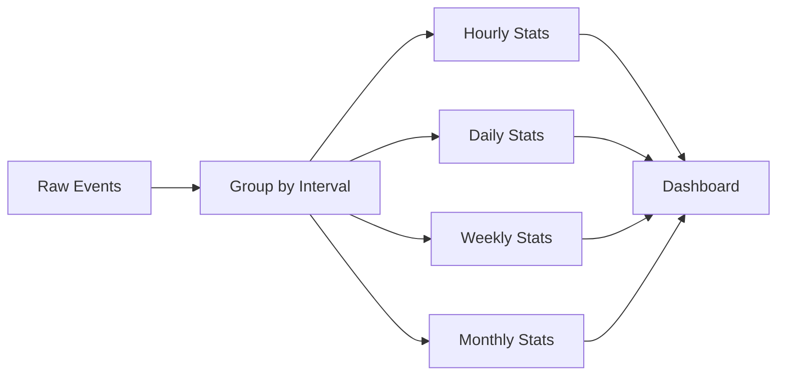

# How to Group Documents by Time Intervals in MongoDB

Author: [nawazdhandala](https://www.github.com/nawazdhandala)

Tags: MongoDB, Aggregation, Time Series, Date Grouping, Analytics, Database

Description: Learn how to group MongoDB documents by time intervals like hours, days, weeks, and months using aggregation pipelines for effective time-series analysis and reporting.

---

Grouping data by time intervals is essential for analytics, reporting, and dashboards. Whether you need hourly metrics, daily summaries, or monthly reports, MongoDB's aggregation framework provides powerful tools for time-based grouping. This guide covers all the techniques you need.

## Understanding Time-Based Grouping

Time-based grouping transforms raw timestamped data into meaningful summaries:



## Sample Data Setup

Let's create sample data to work with:

```javascript
// Sample events collection with timestamps
db.events.insertMany([
  { type: "pageview", userId: 1, timestamp: new Date("2024-01-15T08:30:00Z") },
  { type: "click", userId: 2, timestamp: new Date("2024-01-15T08:45:00Z") },
  { type: "pageview", userId: 1, timestamp: new Date("2024-01-15T09:15:00Z") },
  { type: "purchase", userId: 3, amount: 99, timestamp: new Date("2024-01-15T10:00:00Z") },
  { type: "pageview", userId: 2, timestamp: new Date("2024-01-16T14:30:00Z") },
  { type: "purchase", userId: 1, amount: 150, timestamp: new Date("2024-01-16T15:00:00Z") }
  // ... more events
])
```

## Grouping by Hour

### Using $dateTrunc (MongoDB 5.0+)

The `$dateTrunc` operator is the cleanest way to truncate dates:

```javascript
// Group events by hour
db.events.aggregate([
  {
    $group: {
      _id: {
        $dateTrunc: {
          date: "$timestamp",
          unit: "hour"
        }
      },
      eventCount: { $sum: 1 },
      uniqueUsers: { $addToSet: "$userId" }
    }
  },
  {
    $project: {
      hour: "$_id",
      eventCount: 1,
      uniqueUserCount: { $size: "$uniqueUsers" },
      _id: 0
    }
  },
  { $sort: { hour: 1 } }
])
```

### Using Date Parts (Pre-5.0)

For older MongoDB versions, use date operators:

```javascript
// Group by hour using date parts
db.events.aggregate([
  {
    $group: {
      _id: {
        year: { $year: "$timestamp" },
        month: { $month: "$timestamp" },
        day: { $dayOfMonth: "$timestamp" },
        hour: { $hour: "$timestamp" }
      },
      count: { $sum: 1 }
    }
  },
  { $sort: { "_id.year": 1, "_id.month": 1, "_id.day": 1, "_id.hour": 1 } }
])
```

### Using $dateToString

```javascript
// Group by hour with formatted string key
db.events.aggregate([
  {
    $group: {
      _id: {
        $dateToString: {
          format: "%Y-%m-%d %H:00",
          date: "$timestamp"
        }
      },
      count: { $sum: 1 }
    }
  },
  { $sort: { _id: 1 } }
])

// Output:
// { _id: "2024-01-15 08:00", count: 2 }
// { _id: "2024-01-15 09:00", count: 1 }
// { _id: "2024-01-15 10:00", count: 1 }
```

## Grouping by Day

```javascript
// Daily event summary
db.events.aggregate([
  {
    $group: {
      _id: {
        $dateTrunc: {
          date: "$timestamp",
          unit: "day"
        }
      },
      totalEvents: { $sum: 1 },
      pageviews: {
        $sum: { $cond: [{ $eq: ["$type", "pageview"] }, 1, 0] }
      },
      purchases: {
        $sum: { $cond: [{ $eq: ["$type", "purchase"] }, 1, 0] }
      },
      revenue: {
        $sum: { $ifNull: ["$amount", 0] }
      }
    }
  },
  { $sort: { _id: 1 } }
])
```

### Alternative Using $dateToString

```javascript
// Group by day with string format
db.events.aggregate([
  {
    $group: {
      _id: {
        $dateToString: {
          format: "%Y-%m-%d",
          date: "$timestamp"
        }
      },
      count: { $sum: 1 }
    }
  }
])
```

## Grouping by Week

### ISO Week Grouping

```javascript
// Group by ISO week (Monday start)
db.events.aggregate([
  {
    $group: {
      _id: {
        year: { $isoWeekYear: "$timestamp" },
        week: { $isoWeek: "$timestamp" }
      },
      count: { $sum: 1 },
      firstDay: { $min: "$timestamp" },
      lastDay: { $max: "$timestamp" }
    }
  },
  { $sort: { "_id.year": 1, "_id.week": 1 } }
])
```

### Using $dateTrunc for Weeks

```javascript
// Truncate to week start
db.events.aggregate([
  {
    $group: {
      _id: {
        $dateTrunc: {
          date: "$timestamp",
          unit: "week",
          startOfWeek: "monday"
        }
      },
      eventCount: { $sum: 1 }
    }
  },
  { $sort: { _id: 1 } }
])
```

## Grouping by Month

```javascript
// Monthly summary
db.events.aggregate([
  {
    $group: {
      _id: {
        $dateTrunc: {
          date: "$timestamp",
          unit: "month"
        }
      },
      totalEvents: { $sum: 1 },
      totalRevenue: { $sum: { $ifNull: ["$amount", 0] } },
      avgEventsPerDay: { $avg: 1 }  // Will calculate later
    }
  },
  {
    $project: {
      month: "$_id",
      totalEvents: 1,
      totalRevenue: 1,
      _id: 0
    }
  },
  { $sort: { month: 1 } }
])
```

### Month and Year String Format

```javascript
// Group by month with readable format
db.events.aggregate([
  {
    $group: {
      _id: {
        $dateToString: {
          format: "%Y-%m",
          date: "$timestamp"
        }
      },
      count: { $sum: 1 }
    }
  },
  { $sort: { _id: 1 } }
])

// Output: { _id: "2024-01", count: 6 }
```

## Custom Time Intervals

### 15-Minute Intervals

```javascript
// Group by 15-minute buckets
db.events.aggregate([
  {
    $group: {
      _id: {
        $dateTrunc: {
          date: "$timestamp",
          unit: "minute",
          binSize: 15
        }
      },
      count: { $sum: 1 }
    }
  },
  { $sort: { _id: 1 } }
])
```

### 6-Hour Intervals

```javascript
// Group by 6-hour periods
db.events.aggregate([
  {
    $group: {
      _id: {
        $dateTrunc: {
          date: "$timestamp",
          unit: "hour",
          binSize: 6
        }
      },
      count: { $sum: 1 }
    }
  }
])
```

### Pre-5.0 Custom Intervals

For MongoDB versions before 5.0, use math to create custom intervals:

```javascript
// 15-minute buckets using math
db.events.aggregate([
  {
    $addFields: {
      bucket: {
        $subtract: [
          "$timestamp",
          { $mod: [
              { $subtract: ["$timestamp", new Date("1970-01-01")] },
              15 * 60 * 1000  // 15 minutes in milliseconds
            ]
          }
        ]
      }
    }
  },
  {
    $group: {
      _id: "$bucket",
      count: { $sum: 1 }
    }
  },
  { $sort: { _id: 1 } }
])
```

## Time Zone Handling

### Grouping with Time Zone

```javascript
// Group by day in a specific time zone
db.events.aggregate([
  {
    $group: {
      _id: {
        $dateTrunc: {
          date: "$timestamp",
          unit: "day",
          timezone: "America/New_York"
        }
      },
      count: { $sum: 1 }
    }
  },
  { $sort: { _id: 1 } }
])
```

### Using $dateToString with Time Zone

```javascript
// Format with time zone
db.events.aggregate([
  {
    $group: {
      _id: {
        $dateToString: {
          format: "%Y-%m-%d",
          date: "$timestamp",
          timezone: "America/New_York"
        }
      },
      count: { $sum: 1 }
    }
  }
])
```

## Filling Missing Time Buckets

One challenge with time grouping is missing intervals. Here's how to fill gaps:

```javascript
// Generate complete date range with zero-filled gaps
db.events.aggregate([
  // First, get the date range
  {
    $group: {
      _id: null,
      minDate: { $min: "$timestamp" },
      maxDate: { $max: "$timestamp" }
    }
  },
  // Generate all dates in range
  {
    $addFields: {
      dateRange: {
        $map: {
          input: { $range: [0, { $add: [
            { $dateDiff: {
                startDate: "$minDate",
                endDate: "$maxDate",
                unit: "day"
              }
            }, 1
          ]}]},
          as: "dayOffset",
          in: {
            $dateAdd: {
              startDate: {
                $dateTrunc: { date: "$minDate", unit: "day" }
              },
              unit: "day",
              amount: "$$dayOffset"
            }
          }
        }
      }
    }
  },
  { $unwind: "$dateRange" },
  // Lookup actual counts
  {
    $lookup: {
      from: "events",
      let: { date: "$dateRange" },
      pipeline: [
        {
          $match: {
            $expr: {
              $eq: [
                { $dateTrunc: { date: "$timestamp", unit: "day" } },
                "$$date"
              ]
            }
          }
        },
        { $count: "count" }
      ],
      as: "dayEvents"
    }
  },
  {
    $project: {
      date: "$dateRange",
      count: {
        $ifNull: [{ $arrayElemAt: ["$dayEvents.count", 0] }, 0]
      }
    }
  },
  { $sort: { date: 1 } }
])
```

## Practical Dashboard Examples

### Hourly Traffic Heatmap Data

```javascript
// Get data for hourly heatmap (day of week x hour)
db.events.aggregate([
  { $match: { type: "pageview" } },
  {
    $group: {
      _id: {
        dayOfWeek: { $dayOfWeek: "$timestamp" },
        hour: { $hour: "$timestamp" }
      },
      count: { $sum: 1 }
    }
  },
  {
    $project: {
      dayOfWeek: "$_id.dayOfWeek",
      hour: "$_id.hour",
      count: 1,
      _id: 0
    }
  },
  { $sort: { dayOfWeek: 1, hour: 1 } }
])
```

### Rolling 7-Day Average

```javascript
// Calculate 7-day rolling average
db.events.aggregate([
  {
    $group: {
      _id: { $dateTrunc: { date: "$timestamp", unit: "day" } },
      dailyCount: { $sum: 1 }
    }
  },
  { $sort: { _id: 1 } },
  {
    $setWindowFields: {
      sortBy: { _id: 1 },
      output: {
        rollingAvg: {
          $avg: "$dailyCount",
          window: { documents: [-6, 0] }  // Current and 6 previous days
        }
      }
    }
  }
])
```

### Month-over-Month Comparison

```javascript
// Compare current month to previous month
db.events.aggregate([
  {
    $group: {
      _id: {
        $dateTrunc: { date: "$timestamp", unit: "month" }
      },
      count: { $sum: 1 },
      revenue: { $sum: { $ifNull: ["$amount", 0] } }
    }
  },
  { $sort: { _id: 1 } },
  {
    $setWindowFields: {
      sortBy: { _id: 1 },
      output: {
        prevMonthCount: {
          $shift: { by: -1, output: "$count" }
        },
        prevMonthRevenue: {
          $shift: { by: -1, output: "$revenue" }
        }
      }
    }
  },
  {
    $project: {
      month: "$_id",
      count: 1,
      revenue: 1,
      countChange: {
        $cond: [
          { $eq: ["$prevMonthCount", null] },
          null,
          { $subtract: ["$count", "$prevMonthCount"] }
        ]
      },
      revenueChange: {
        $cond: [
          { $eq: ["$prevMonthRevenue", null] },
          null,
          { $subtract: ["$revenue", "$prevMonthRevenue"] }
        ]
      }
    }
  }
])
```

## Performance Tips

### Index Timestamp Fields

```javascript
// Create index for time-based queries
db.events.createIndex({ timestamp: 1 })

// Compound index for filtered time queries
db.events.createIndex({ type: 1, timestamp: 1 })
```

### Pre-filter Before Grouping

```javascript
// Filter first to reduce data processed
db.events.aggregate([
  {
    $match: {
      timestamp: {
        $gte: new Date("2024-01-01"),
        $lt: new Date("2024-02-01")
      }
    }
  },
  {
    $group: {
      _id: { $dateTrunc: { date: "$timestamp", unit: "day" } },
      count: { $sum: 1 }
    }
  }
])
```

## Summary

Time-based grouping in MongoDB is powerful with the right techniques:

- Use `$dateTrunc` for clean interval boundaries (MongoDB 5.0+)
- Use `$dateToString` for formatted group keys
- Use date part operators for fine-grained control
- Handle time zones explicitly for accurate local-time grouping
- Index timestamp fields for performance
- Pre-filter data to reduce aggregation workload

These patterns form the foundation for building dashboards, analytics, and time-series reporting in your MongoDB applications.
