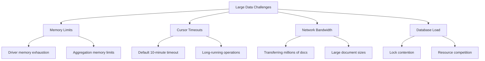

# How to Handle Large Data Workflows in MongoDB

Author: [nawazdhandala](https://www.github.com/nawazdhandala)

Tags: MongoDB, Big Data, Performance, Batch Processing, Cursors, Aggregation

Description: Learn techniques for handling large data workflows in MongoDB including cursor management, batch processing, streaming, and memory optimization for processing millions of documents efficiently.

---

Working with large datasets in MongoDB requires different strategies than handling small collections. When you're processing millions of documents, naive approaches can exhaust memory, timeout, or bring your database to a crawl. This guide covers proven techniques for handling large data workflows efficiently.

## Understanding the Challenges

Large data workflows face several challenges:



## Cursor Management

### Default Cursor Behavior

MongoDB cursors have a default timeout of 10 minutes and batch size of 101 documents (or 16MB, whichever comes first):

```javascript
// Basic cursor - may timeout for large result sets
const cursor = db.largeCollection.find({});

// This approach can fail for millions of documents
cursor.forEach(doc => {
  processDocument(doc);  // If this takes too long, cursor expires
});
```

### Using noCursorTimeout

For long-running operations, disable cursor timeout:

```javascript
// Disable cursor timeout (use carefully)
const cursor = db.largeCollection.find({}).noCursorTimeout();

try {
  while (cursor.hasNext()) {
    const doc = cursor.next();
    await processDocument(doc);
  }
} finally {
  cursor.close();  // Always close cursor when done
}
```

### Controlling Batch Size

Adjust batch size based on document size and processing time:

```javascript
// Smaller batch size for large documents or slow processing
const cursor = db.largeCollection.find({}).batchSize(100);

// Larger batch size for small documents and fast processing
const cursor = db.smallDocs.find({}).batchSize(1000);
```

## Batch Processing Patterns

### Pagination with Skip/Limit

Simple but inefficient for deep pagination:

```javascript
// Not recommended for large offsets
const pageSize = 1000;
let page = 0;

while (true) {
  const docs = await db.collection.find({})
    .skip(page * pageSize)
    .limit(pageSize)
    .toArray();

  if (docs.length === 0) break;

  await processBatch(docs);
  page++;
}
```

### Efficient Range-Based Pagination

Use indexed field for efficient pagination:

```javascript
// Recommended for large datasets
const batchSize = 1000;
let lastId = null;

while (true) {
  const query = lastId
    ? { _id: { $gt: lastId } }
    : {};

  const docs = await db.collection.find(query)
    .sort({ _id: 1 })
    .limit(batchSize)
    .toArray();

  if (docs.length === 0) break;

  await processBatch(docs);
  lastId = docs[docs.length - 1]._id;
}
```

### Processing in Chunks with Timestamps

```javascript
// Process data in time-based chunks
async function processLargeDataset(startDate, endDate, chunkDays = 1) {
  let currentStart = new Date(startDate);

  while (currentStart < endDate) {
    const chunkEnd = new Date(currentStart);
    chunkEnd.setDate(chunkEnd.getDate() + chunkDays);

    const docs = await db.events.find({
      timestamp: {
        $gte: currentStart,
        $lt: chunkEnd > endDate ? endDate : chunkEnd
      }
    }).toArray();

    console.log(`Processing ${docs.length} docs from ${currentStart}`);
    await processBatch(docs);

    currentStart = chunkEnd;
  }
}
```

## Aggregation for Large Datasets

### Handling Memory Limits

Aggregation has a 100MB memory limit per stage. Use `allowDiskUse` for larger operations:

```javascript
// Enable disk usage for memory-intensive aggregations
db.largeCollection.aggregate([
  { $match: { status: "active" } },
  { $group: {
      _id: "$category",
      total: { $sum: "$amount" },
      count: { $sum: 1 }
    }
  },
  { $sort: { total: -1 } }
], { allowDiskUse: true });
```

### Optimizing Aggregation Pipeline Order

Place operations that reduce data volume early:

```javascript
// Good - filter first, then process
db.orders.aggregate([
  // 1. Filter to reduce data volume early
  { $match: {
      createdAt: { $gte: new Date("2024-01-01") },
      status: "completed"
    }
  },
  // 2. Project only needed fields
  { $project: {
      customerId: 1,
      total: 1,
      items: 1
    }
  },
  // 3. Now do expensive operations
  { $unwind: "$items" },
  { $group: {
      _id: "$customerId",
      totalSpent: { $sum: "$total" }
    }
  }
], { allowDiskUse: true });
```

### Streaming Aggregation Results

Use cursor for aggregation results instead of loading all into memory:

```javascript
// Get aggregation cursor
const cursor = db.collection.aggregate([
  { $match: { active: true } },
  { $project: { name: 1, value: 1 } }
], { cursor: { batchSize: 100 } });

// Process results one at a time
for await (const doc of cursor) {
  await processDocument(doc);
}
```

## Bulk Write Operations

### Using Bulk Write for Updates

Process updates in batches to reduce round trips:

```javascript
// Efficient bulk updates
async function updateLargeDataset(updates) {
  const batchSize = 1000;

  for (let i = 0; i < updates.length; i += batchSize) {
    const batch = updates.slice(i, i + batchSize);

    const bulkOps = batch.map(update => ({
      updateOne: {
        filter: { _id: update.id },
        update: { $set: update.changes }
      }
    }));

    await db.collection.bulkWrite(bulkOps, { ordered: false });

    console.log(`Processed ${Math.min(i + batchSize, updates.length)} / ${updates.length}`);
  }
}
```

### Bulk Insert Pattern

```javascript
// Insert large amounts of data efficiently
async function bulkInsert(documents) {
  const batchSize = 1000;
  let inserted = 0;

  for (let i = 0; i < documents.length; i += batchSize) {
    const batch = documents.slice(i, i + batchSize);

    try {
      const result = await db.collection.insertMany(batch, {
        ordered: false  // Continue on error
      });
      inserted += result.insertedCount;
    } catch (error) {
      // Handle partial failures
      if (error.insertedCount) {
        inserted += error.insertedCount;
      }
      console.error(`Batch error: ${error.message}`);
    }
  }

  return inserted;
}
```

## Data Export and Migration

### Streaming Export

Export large collections without loading everything into memory:

```javascript
const fs = require('fs');
const { Transform } = require('stream');

async function exportToFile(collection, outputPath) {
  const cursor = db.collection(collection).find({});
  const writeStream = fs.createWriteStream(outputPath);

  let count = 0;
  writeStream.write('[\n');

  for await (const doc of cursor) {
    const prefix = count > 0 ? ',\n' : '';
    writeStream.write(prefix + JSON.stringify(doc));
    count++;

    if (count % 10000 === 0) {
      console.log(`Exported ${count} documents`);
    }
  }

  writeStream.write('\n]');
  writeStream.end();

  console.log(`Export complete: ${count} documents`);
}
```

### Collection-to-Collection Copy

```javascript
// Copy and transform data between collections
async function copyWithTransform(sourceCol, targetCol, transformFn) {
  const batchSize = 1000;
  let lastId = null;
  let processed = 0;

  while (true) {
    const query = lastId ? { _id: { $gt: lastId } } : {};

    const docs = await db.collection(sourceCol)
      .find(query)
      .sort({ _id: 1 })
      .limit(batchSize)
      .toArray();

    if (docs.length === 0) break;

    const transformed = docs.map(transformFn);
    await db.collection(targetCol).insertMany(transformed);

    lastId = docs[docs.length - 1]._id;
    processed += docs.length;
    console.log(`Processed: ${processed}`);
  }
}

// Usage
await copyWithTransform('orders', 'orders_archive', doc => ({
  ...doc,
  archived: true,
  archivedAt: new Date()
}));
```

## Memory Management Strategies

### Projection to Reduce Data Transfer

Only fetch the fields you need:

```javascript
// Bad - fetches entire documents
const docs = await db.collection.find({}).toArray();

// Good - fetch only needed fields
const docs = await db.collection.find({}, {
  projection: {
    _id: 1,
    name: 1,
    email: 1
  }
}).toArray();
```

### Processing Without Array Conversion

Avoid `toArray()` for large result sets:

```javascript
// Bad - loads all documents into memory
const allDocs = await db.collection.find({}).toArray();
allDocs.forEach(processDocument);

// Good - processes one document at a time
const cursor = db.collection.find({});
for await (const doc of cursor) {
  await processDocument(doc);
}
```

### Stream Processing with Backpressure

```javascript
const { Readable } = require('stream');

function createDocumentStream(collection, query = {}) {
  const cursor = db.collection(collection).find(query);

  return new Readable({
    objectMode: true,
    async read() {
      try {
        const doc = await cursor.next();
        if (doc) {
          this.push(doc);
        } else {
          this.push(null);  // End stream
          cursor.close();
        }
      } catch (error) {
        this.destroy(error);
      }
    }
  });
}

// Usage with pipeline
const docStream = createDocumentStream('largeCollection');
docStream
  .pipe(transformStream)
  .pipe(writeStream)
  .on('finish', () => console.log('Processing complete'));
```

## Monitoring and Progress Tracking

### Progress Logging

```javascript
async function processWithProgress(collection, processFn) {
  const total = await db.collection(collection).countDocuments();
  const cursor = db.collection(collection).find({});

  let processed = 0;
  const startTime = Date.now();

  for await (const doc of cursor) {
    await processFn(doc);
    processed++;

    if (processed % 1000 === 0) {
      const elapsed = (Date.now() - startTime) / 1000;
      const rate = processed / elapsed;
      const remaining = (total - processed) / rate;

      console.log(
        `Progress: ${processed}/${total} (${((processed/total)*100).toFixed(1)}%) ` +
        `Rate: ${rate.toFixed(0)}/s ETA: ${remaining.toFixed(0)}s`
      );
    }
  }
}
```

## Best Practices Summary

1. **Use cursor iteration** - Avoid loading entire result sets into memory
2. **Enable allowDiskUse** - For aggregations exceeding 100MB
3. **Range-based pagination** - Use indexed fields instead of skip/limit
4. **Bulk operations** - Batch writes to reduce round trips
5. **Project needed fields** - Minimize data transfer
6. **Process in chunks** - Break large operations into manageable pieces
7. **Monitor progress** - Track processing rate and estimate completion
8. **Handle errors gracefully** - Use ordered: false for resilient bulk operations

With these techniques, you can efficiently process millions of documents without overwhelming your application's memory or timing out your database connections.
