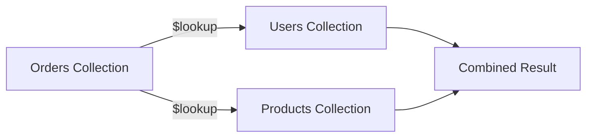
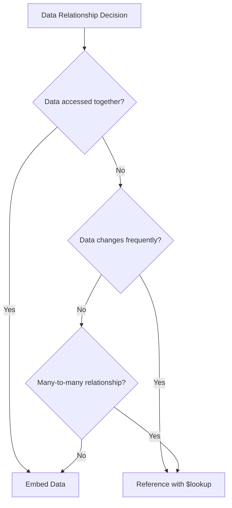

# How to Perform SQL-Like Joins in MongoDB

Author: [nawazdhandala](https://www.github.com/nawazdhandala)

Tags: MongoDB, Joins, Aggregation, $lookup, Database, NoSQL

Description: Learn how to perform SQL-like joins in MongoDB using the $lookup aggregation stage, including basic joins, nested lookups, and performance optimization techniques.

---

One of the most common questions from developers transitioning from SQL databases to MongoDB is: "How do I do joins?" While MongoDB is designed around denormalized data models, it provides powerful join capabilities through the `$lookup` aggregation stage. This guide covers everything you need to know about performing joins in MongoDB.

## Understanding MongoDB's Approach to Joins

Unlike SQL databases where joins are fundamental, MongoDB encourages embedding related data within documents. However, when you need to keep data separate (for normalization, data integrity, or storage efficiency), `$lookup` provides the solution.



## Basic $lookup Syntax

The `$lookup` stage joins documents from another collection:

```javascript
// Basic $lookup structure
db.orders.aggregate([
  {
    $lookup: {
      from: "users",           // Collection to join
      localField: "userId",     // Field from input documents
      foreignField: "_id",      // Field from the "from" collection
      as: "userDetails"         // Output array field name
    }
  }
])
```

## Sample Data Setup

Let's create sample collections to demonstrate joins:

```javascript
// Users collection
db.users.insertMany([
  { _id: 1, name: "Alice", email: "alice@example.com", tier: "premium" },
  { _id: 2, name: "Bob", email: "bob@example.com", tier: "basic" },
  { _id: 3, name: "Charlie", email: "charlie@example.com", tier: "premium" }
])

// Products collection
db.products.insertMany([
  { _id: 101, name: "Laptop", price: 999, category: "electronics" },
  { _id: 102, name: "Mouse", price: 49, category: "electronics" },
  { _id: 103, name: "Desk", price: 299, category: "furniture" }
])

// Orders collection
db.orders.insertMany([
  { _id: 1001, userId: 1, productId: 101, quantity: 1, date: new Date("2024-01-15") },
  { _id: 1002, userId: 1, productId: 102, quantity: 2, date: new Date("2024-01-16") },
  { _id: 1003, userId: 2, productId: 103, quantity: 1, date: new Date("2024-01-17") },
  { _id: 1004, userId: 3, productId: 101, quantity: 1, date: new Date("2024-01-18") }
])
```

## Basic Join Examples

### Simple One-to-One Join

Join orders with user information:

```javascript
db.orders.aggregate([
  {
    $lookup: {
      from: "users",
      localField: "userId",
      foreignField: "_id",
      as: "user"
    }
  },
  // Unwind to convert array to single object
  { $unwind: "$user" }
])
```

Result:
```javascript
{
  _id: 1001,
  userId: 1,
  productId: 101,
  quantity: 1,
  date: ISODate("2024-01-15"),
  user: { _id: 1, name: "Alice", email: "alice@example.com", tier: "premium" }
}
```

### Multiple Joins

Join orders with both users and products:

```javascript
db.orders.aggregate([
  // Join with users
  {
    $lookup: {
      from: "users",
      localField: "userId",
      foreignField: "_id",
      as: "user"
    }
  },
  { $unwind: "$user" },

  // Join with products
  {
    $lookup: {
      from: "products",
      localField: "productId",
      foreignField: "_id",
      as: "product"
    }
  },
  { $unwind: "$product" },

  // Project the final shape
  {
    $project: {
      orderId: "$_id",
      customerName: "$user.name",
      productName: "$product.name",
      quantity: 1,
      totalPrice: { $multiply: ["$product.price", "$quantity"] },
      date: 1
    }
  }
])
```

## SQL Equivalents

Here's how common SQL joins translate to MongoDB:

### INNER JOIN

```sql
-- SQL
SELECT * FROM orders
INNER JOIN users ON orders.userId = users._id
```

```javascript
// MongoDB
db.orders.aggregate([
  {
    $lookup: {
      from: "users",
      localField: "userId",
      foreignField: "_id",
      as: "user"
    }
  },
  { $unwind: "$user" }  // This makes it an INNER JOIN
])
```

### LEFT OUTER JOIN

```sql
-- SQL
SELECT * FROM orders
LEFT OUTER JOIN users ON orders.userId = users._id
```

```javascript
// MongoDB - $lookup naturally performs LEFT OUTER JOIN
db.orders.aggregate([
  {
    $lookup: {
      from: "users",
      localField: "userId",
      foreignField: "_id",
      as: "user"
    }
  },
  // Use $unwind with preserveNullAndEmptyArrays for LEFT JOIN behavior
  {
    $unwind: {
      path: "$user",
      preserveNullAndEmptyArrays: true
    }
  }
])
```

## Advanced $lookup with Pipeline

For complex join conditions, use the pipeline syntax:

```javascript
db.orders.aggregate([
  {
    $lookup: {
      from: "users",
      let: { orderUserId: "$userId" },
      pipeline: [
        { $match: { $expr: { $eq: ["$_id", "$$orderUserId"] } } },
        { $project: { name: 1, email: 1 } }  // Only include specific fields
      ],
      as: "user"
    }
  }
])
```

### Conditional Joins

Join with additional conditions:

```javascript
// Find orders with premium users only
db.orders.aggregate([
  {
    $lookup: {
      from: "users",
      let: { orderUserId: "$userId" },
      pipeline: [
        {
          $match: {
            $expr: {
              $and: [
                { $eq: ["$_id", "$$orderUserId"] },
                { $eq: ["$tier", "premium"] }
              ]
            }
          }
        }
      ],
      as: "premiumUser"
    }
  },
  // Filter to only orders with premium users
  { $match: { premiumUser: { $ne: [] } } }
])
```

## Nested Lookups

Join data from multiple levels:

```javascript
// Add a categories collection
db.categories.insertMany([
  { _id: "electronics", name: "Electronics", taxRate: 0.08 },
  { _id: "furniture", name: "Furniture", taxRate: 0.05 }
])

// Nested lookup: orders -> products -> categories
db.orders.aggregate([
  {
    $lookup: {
      from: "products",
      localField: "productId",
      foreignField: "_id",
      as: "product"
    }
  },
  { $unwind: "$product" },
  {
    $lookup: {
      from: "categories",
      localField: "product.category",
      foreignField: "_id",
      as: "category"
    }
  },
  { $unwind: "$category" },
  {
    $project: {
      orderId: "$_id",
      productName: "$product.name",
      categoryName: "$category.name",
      priceWithTax: {
        $multiply: [
          "$product.price",
          { $add: [1, "$category.taxRate"] }
        ]
      }
    }
  }
])
```

## Self Joins

Join a collection with itself:

```javascript
// Employees collection with manager references
db.employees.insertMany([
  { _id: 1, name: "CEO", managerId: null },
  { _id: 2, name: "CTO", managerId: 1 },
  { _id: 3, name: "Developer", managerId: 2 }
])

// Self join to get manager information
db.employees.aggregate([
  {
    $lookup: {
      from: "employees",
      localField: "managerId",
      foreignField: "_id",
      as: "manager"
    }
  },
  {
    $unwind: {
      path: "$manager",
      preserveNullAndEmptyArrays: true
    }
  },
  {
    $project: {
      name: 1,
      managerName: { $ifNull: ["$manager.name", "No Manager"] }
    }
  }
])
```

## Performance Optimization

### Indexing for Joins

Always index the fields used in lookups:

```javascript
// Create indexes on foreign key fields
db.orders.createIndex({ userId: 1 })
db.orders.createIndex({ productId: 1 })
db.users.createIndex({ _id: 1 })  // Usually exists by default
db.products.createIndex({ _id: 1 })  // Usually exists by default
```

### Limiting Lookup Results

Filter early to reduce data processed:

```javascript
db.orders.aggregate([
  // Filter first - process fewer documents
  { $match: { date: { $gte: new Date("2024-01-01") } } },

  // Then join
  {
    $lookup: {
      from: "users",
      localField: "userId",
      foreignField: "_id",
      as: "user"
    }
  }
])
```

### Using $lookup with Pipeline for Efficiency

```javascript
db.orders.aggregate([
  {
    $lookup: {
      from: "products",
      let: { pid: "$productId" },
      pipeline: [
        { $match: { $expr: { $eq: ["$_id", "$$pid"] } } },
        { $project: { name: 1, price: 1 } }  // Limit fields returned
      ],
      as: "product"
    }
  }
])
```

## Common Patterns

### Aggregating Joined Data

```javascript
// Total spending per user
db.orders.aggregate([
  {
    $lookup: {
      from: "products",
      localField: "productId",
      foreignField: "_id",
      as: "product"
    }
  },
  { $unwind: "$product" },
  {
    $group: {
      _id: "$userId",
      totalSpent: {
        $sum: { $multiply: ["$product.price", "$quantity"] }
      },
      orderCount: { $sum: 1 }
    }
  },
  {
    $lookup: {
      from: "users",
      localField: "_id",
      foreignField: "_id",
      as: "user"
    }
  },
  { $unwind: "$user" },
  {
    $project: {
      userName: "$user.name",
      totalSpent: 1,
      orderCount: 1
    }
  }
])
```

## When to Use Joins vs. Embedding



Consider embedding when:
- Data is always accessed together
- One-to-one or one-to-few relationships
- Data doesn't change independently

Use `$lookup` when:
- Data is accessed independently
- Many-to-many relationships
- Data changes frequently
- Avoiding data duplication is important

## Summary

MongoDB's `$lookup` provides powerful join capabilities that can handle most SQL-like join scenarios. Key takeaways:

- Use basic `$lookup` for simple joins on matching fields
- Use pipeline syntax for complex conditions and filtering
- Always index fields used in lookups
- Filter data early in the pipeline for better performance
- Consider embedding for frequently accessed related data

While MongoDB encourages document embedding, `$lookup` ensures you have the flexibility to normalize your data model when it makes sense for your application.
