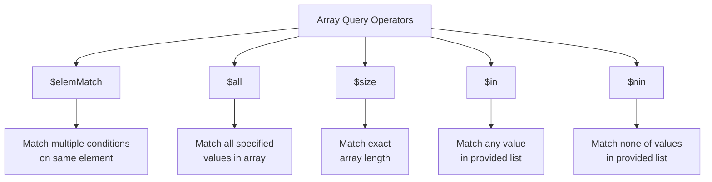

# How to Query Array Elements in MongoDB

Author: [nawazdhandala](https://www.github.com/nawazdhandala)

Tags: MongoDB, Arrays, Queries, Database, NoSQL

Description: Learn how to query array elements in MongoDB using various operators including $elemMatch, $all, $size, and positional operators for efficient array manipulation.

---

Arrays are one of MongoDB's most powerful features, allowing you to store multiple values in a single field. However, querying arrays effectively requires understanding the various operators and techniques available. This guide covers everything you need to know about querying array elements in MongoDB.

## Understanding Arrays in MongoDB

Before diving into queries, let's look at a sample document with arrays:

```javascript
// Sample document in a 'products' collection
{
  _id: ObjectId("507f1f77bcf86cd799439011"),
  name: "Laptop",
  tags: ["electronics", "computer", "portable"],
  variants: [
    { color: "silver", price: 999, stock: 50 },
    { color: "black", price: 1099, stock: 30 },
    { color: "gold", price: 1199, stock: 10 }
  ],
  ratings: [4.5, 5, 4, 4.5, 5]
}
```

## Basic Array Queries

### Matching a Single Element

The simplest array query matches documents where the array contains a specific value:

```javascript
// Find products tagged as "electronics"
db.products.find({ tags: "electronics" })

// This matches if "electronics" is anywhere in the tags array
```

### Matching the Exact Array

To match an array exactly (same elements in the same order):

```javascript
// Find products with exactly these tags in this order
db.products.find({
  tags: ["electronics", "computer", "portable"]
})

// This will NOT match if the order is different or there are extra elements
```

### Matching Multiple Elements with $all

Use `$all` to find documents where the array contains all specified elements, regardless of order:

```javascript
// Find products that have both "electronics" AND "portable" tags
db.products.find({
  tags: { $all: ["electronics", "portable"] }
})

// Order doesn't matter, and other elements can exist
```

## Querying Array Size

### Using $size

Find documents where an array has a specific number of elements:

```javascript
// Find products with exactly 3 tags
db.products.find({ tags: { $size: 3 } })
```

Note that `$size` doesn't accept ranges. For range queries on array length, use `$expr`:

```javascript
// Find products with more than 2 tags
db.products.find({
  $expr: { $gt: [{ $size: "$tags" }, 2] }
})

// Find products with 2-5 tags
db.products.find({
  $expr: {
    $and: [
      { $gte: [{ $size: "$tags" }, 2] },
      { $lte: [{ $size: "$tags" }, 5] }
    ]
  }
})
```

## Querying Arrays of Embedded Documents

### Using $elemMatch

When querying arrays of objects, `$elemMatch` ensures all conditions match the same array element:

```javascript
// Find products with a silver variant priced under 1000
db.products.find({
  variants: {
    $elemMatch: {
      color: "silver",
      price: { $lt: 1000 }
    }
  }
})
```

Without `$elemMatch`, conditions could match different elements:

```javascript
// This could match if ANY variant is silver AND ANY variant is under 1000
// (not necessarily the same variant)
db.products.find({
  "variants.color": "silver",
  "variants.price": { $lt: 1000 }
})
```

### Dot Notation for Nested Fields

Access nested fields in array elements using dot notation:

```javascript
// Find products where any variant has stock greater than 20
db.products.find({ "variants.stock": { $gt: 20 } })

// Find products where any variant is priced at exactly 999
db.products.find({ "variants.price": 999 })
```

## Positional Operators

### The $ Positional Operator

The `$` operator identifies the first matching element for updates:

```javascript
// Update the stock of the silver variant
db.products.updateOne(
  { "variants.color": "silver" },
  { $set: { "variants.$.stock": 45 } }
)
```

### The $[] All Positional Operator

Update all elements in an array:

```javascript
// Add 10 to stock of ALL variants
db.products.updateOne(
  { name: "Laptop" },
  { $inc: { "variants.$[].stock": 10 } }
)
```

### The $[identifier] Filtered Positional Operator

Update specific elements matching a condition:

```javascript
// Increase price by 50 for variants with stock less than 20
db.products.updateOne(
  { name: "Laptop" },
  { $inc: { "variants.$[elem].price": 50 } },
  { arrayFilters: [{ "elem.stock": { $lt: 20 } }] }
)
```

## Array Query Operators Reference

Here's a quick reference for array operators:



## Practical Examples

### Finding Documents with Specific Array Values

```javascript
// Find products with ratings above 4.5
db.products.find({ ratings: { $gt: 4.5 } })

// Find products with ANY rating of exactly 5
db.products.find({ ratings: 5 })

// Find products where ALL ratings are 4 or above
db.products.find({
  ratings: { $not: { $lt: 4 } }
})
```

### Combining Array Queries

```javascript
// Find products that are electronics with a black variant under $1100
db.products.find({
  tags: "electronics",
  variants: {
    $elemMatch: {
      color: "black",
      price: { $lt: 1100 }
    }
  }
})
```

### Using $in with Arrays

```javascript
// Find products tagged with any of these categories
db.products.find({
  tags: { $in: ["electronics", "furniture", "clothing"] }
})
```

## Aggregation Pipeline for Complex Array Queries

For more complex operations, use the aggregation pipeline:

```javascript
// Unwind variants and find average price per color
db.products.aggregate([
  { $unwind: "$variants" },
  { $group: {
      _id: "$variants.color",
      avgPrice: { $avg: "$variants.price" },
      totalStock: { $sum: "$variants.stock" }
    }
  },
  { $sort: { avgPrice: -1 } }
])
```

### Filtering Array Elements in Output

```javascript
// Return only variants with stock > 20
db.products.aggregate([
  { $project: {
      name: 1,
      highStockVariants: {
        $filter: {
          input: "$variants",
          as: "variant",
          cond: { $gt: ["$$variant.stock", 20] }
        }
      }
    }
  }
])
```

## Performance Considerations

### Indexing Arrays

Create indexes on array fields for better query performance:

```javascript
// Create index on tags array
db.products.createIndex({ tags: 1 })

// Create index on nested array field
db.products.createIndex({ "variants.color": 1 })

// Multikey indexes are created automatically for array fields
```

### Query Optimization Tips

1. **Use $elemMatch for multiple conditions** - Ensures conditions apply to the same element
2. **Create appropriate indexes** - Multikey indexes work well with array queries
3. **Limit array sizes** - Large arrays can impact performance
4. **Use projection** - Return only needed array elements

```javascript
// Use $slice to limit returned array elements
db.products.find(
  { name: "Laptop" },
  { ratings: { $slice: 3 } }  // Return first 3 ratings
)

// Return last 2 ratings
db.products.find(
  { name: "Laptop" },
  { ratings: { $slice: -2 } }
)
```

## Summary

Querying arrays in MongoDB requires understanding the right operators for each use case:

- Use basic equality for simple single-value matches
- Use `$all` when order doesn't matter but all elements must exist
- Use `$elemMatch` for arrays of objects with multiple conditions
- Use positional operators for targeted updates
- Use aggregation for complex transformations

Mastering these techniques will help you leverage MongoDB's flexible document model effectively and build efficient queries for your applications.
