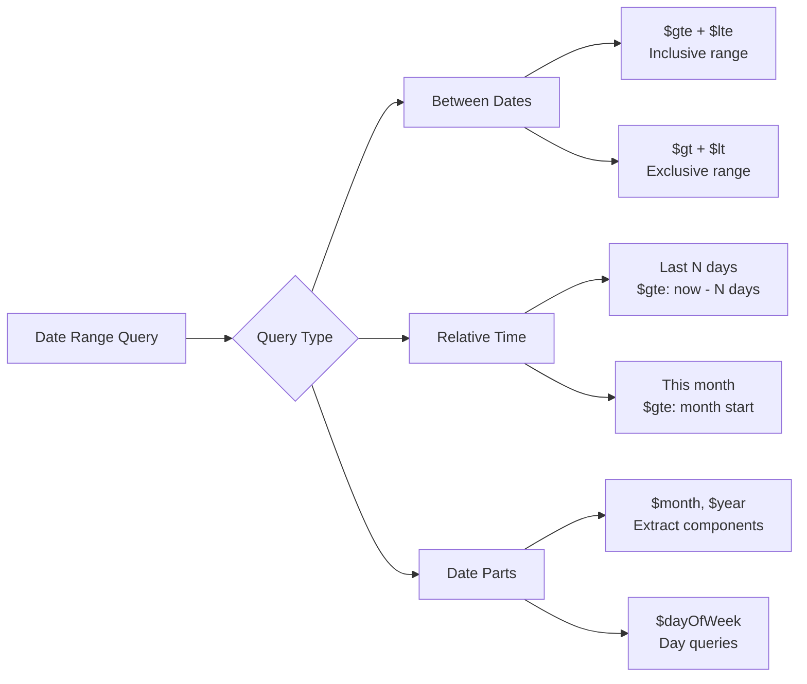

# How to Query Between Dates in MongoDB

Author: [nawazdhandala](https://www.github.com/nawazdhandala)

Tags: MongoDB, Date Queries, Queries, Database, Time Series

Description: Learn how to effectively query date ranges in MongoDB using comparison operators, handle time zones, and optimize date-based queries for better performance.

---

Date queries are fundamental to most applications - whether you're fetching recent orders, generating reports, or analyzing time-series data. MongoDB provides powerful operators for querying date ranges, but there are nuances you need to understand to get accurate results. This guide covers everything about querying dates in MongoDB.

## Understanding Dates in MongoDB

MongoDB stores dates as BSON Date type, which represents milliseconds since the Unix epoch (January 1, 1970 UTC):

```javascript
// Creating dates in MongoDB
{
  // Date constructor
  createdAt: new Date(),

  // Specific date
  eventDate: new Date("2024-06-15T10:30:00Z"),

  // ISODate helper (same as Date in shell)
  lastLogin: ISODate("2024-06-15T10:30:00Z")
}
```

## Basic Date Range Queries

### Using Comparison Operators

The most common way to query date ranges uses `$gte`, `$gt`, `$lte`, and `$lt`:

```javascript
// Sample data - orders collection
db.orders.insertMany([
  { orderId: 1, total: 99, createdAt: new Date("2024-01-15T08:00:00Z") },
  { orderId: 2, total: 150, createdAt: new Date("2024-01-20T14:30:00Z") },
  { orderId: 3, total: 75, createdAt: new Date("2024-02-01T09:15:00Z") },
  { orderId: 4, total: 200, createdAt: new Date("2024-02-15T16:45:00Z") },
  { orderId: 5, total: 125, createdAt: new Date("2024-03-01T11:00:00Z") }
])
```

### Query Between Two Dates

```javascript
// Find orders between Jan 15 and Feb 15, 2024 (inclusive)
db.orders.find({
  createdAt: {
    $gte: new Date("2024-01-15T00:00:00Z"),
    $lte: new Date("2024-02-15T23:59:59Z")
  }
})

// Alternative using $lt for exclusive end date
db.orders.find({
  createdAt: {
    $gte: new Date("2024-01-15T00:00:00Z"),
    $lt: new Date("2024-02-16T00:00:00Z")  // Day after, exclusive
  }
})
```

### Query for a Specific Day

```javascript
// Find all orders on January 20, 2024
db.orders.find({
  createdAt: {
    $gte: new Date("2024-01-20T00:00:00Z"),
    $lt: new Date("2024-01-21T00:00:00Z")
  }
})
```

## Common Date Query Patterns

### Last N Days

```javascript
// Orders from the last 7 days
const sevenDaysAgo = new Date();
sevenDaysAgo.setDate(sevenDaysAgo.getDate() - 7);

db.orders.find({
  createdAt: { $gte: sevenDaysAgo }
})

// Using $expr for dynamic calculation
db.orders.find({
  $expr: {
    $gte: [
      "$createdAt",
      { $subtract: [new Date(), 7 * 24 * 60 * 60 * 1000] }  // 7 days in ms
    ]
  }
})
```

### Current Month

```javascript
// Orders from current month
const now = new Date();
const startOfMonth = new Date(now.getFullYear(), now.getMonth(), 1);
const startOfNextMonth = new Date(now.getFullYear(), now.getMonth() + 1, 1);

db.orders.find({
  createdAt: {
    $gte: startOfMonth,
    $lt: startOfNextMonth
  }
})
```

### Last Month

```javascript
// Orders from last month
const now = new Date();
const startOfLastMonth = new Date(now.getFullYear(), now.getMonth() - 1, 1);
const startOfThisMonth = new Date(now.getFullYear(), now.getMonth(), 1);

db.orders.find({
  createdAt: {
    $gte: startOfLastMonth,
    $lt: startOfThisMonth
  }
})
```

### Year to Date

```javascript
// Orders from January 1st of current year to now
const startOfYear = new Date(new Date().getFullYear(), 0, 1);

db.orders.find({
  createdAt: {
    $gte: startOfYear,
    $lte: new Date()
  }
})
```

## Date Parts and Aggregation

### Extract Date Components

Use aggregation operators to work with date parts:

```javascript
// Group orders by month
db.orders.aggregate([
  {
    $group: {
      _id: {
        year: { $year: "$createdAt" },
        month: { $month: "$createdAt" }
      },
      totalOrders: { $sum: 1 },
      totalRevenue: { $sum: "$total" }
    }
  },
  { $sort: { "_id.year": 1, "_id.month": 1 } }
])
```

### Query by Date Parts

```javascript
// Find all orders placed in February (any year)
db.orders.find({
  $expr: { $eq: [{ $month: "$createdAt" }, 2] }
})

// Find orders placed on weekends
db.orders.find({
  $expr: {
    $in: [
      { $dayOfWeek: "$createdAt" },
      [1, 7]  // 1 = Sunday, 7 = Saturday in MongoDB
    ]
  }
})
```

## Working with Time Zones

### Understanding Time Zone Issues

MongoDB stores dates in UTC. When querying, ensure your dates account for time zones:

```javascript
// User's local time: 2024-01-15 00:00:00 EST (UTC-5)
// This is actually: 2024-01-15 05:00:00 UTC

// Wrong - uses UTC midnight
db.orders.find({
  createdAt: {
    $gte: new Date("2024-01-15T00:00:00Z")
  }
})

// Correct - account for EST time zone
db.orders.find({
  createdAt: {
    $gte: new Date("2024-01-15T05:00:00Z")  // Midnight EST = 5am UTC
  }
})

// Better - use ISO format with offset
db.orders.find({
  createdAt: {
    $gte: new Date("2024-01-15T00:00:00-05:00")  // Explicit offset
  }
})
```

### Time Zone Conversion in Aggregation

```javascript
// Group by date in a specific time zone
db.orders.aggregate([
  {
    $group: {
      _id: {
        $dateToString: {
          format: "%Y-%m-%d",
          date: "$createdAt",
          timezone: "America/New_York"
        }
      },
      orderCount: { $sum: 1 }
    }
  }
])
```

## Date Query Visualization



## Indexing for Date Queries

### Creating Date Indexes

Always index fields used in date queries:

```javascript
// Single field date index
db.orders.createIndex({ createdAt: 1 })

// Compound index for filtered date queries
db.orders.createIndex({ status: 1, createdAt: -1 })

// Index for date range + sort
db.orders.createIndex({ createdAt: -1, total: -1 })
```

### Verifying Index Usage

```javascript
// Check if query uses index
db.orders.find({
  createdAt: {
    $gte: new Date("2024-01-01"),
    $lt: new Date("2024-02-01")
  }
}).explain("executionStats")

// Look for "stage": "IXSCAN" in the output
```

## Practical Examples

### Daily Sales Report

```javascript
// Generate daily sales for the last 30 days
const thirtyDaysAgo = new Date();
thirtyDaysAgo.setDate(thirtyDaysAgo.getDate() - 30);

db.orders.aggregate([
  {
    $match: {
      createdAt: { $gte: thirtyDaysAgo },
      status: "completed"
    }
  },
  {
    $group: {
      _id: {
        $dateToString: { format: "%Y-%m-%d", date: "$createdAt" }
      },
      totalSales: { $sum: "$total" },
      orderCount: { $sum: 1 },
      avgOrderValue: { $avg: "$total" }
    }
  },
  { $sort: { _id: 1 } }
])
```

### Hour-by-Hour Activity

```javascript
// Analyze order patterns by hour
db.orders.aggregate([
  {
    $group: {
      _id: { $hour: "$createdAt" },
      orderCount: { $sum: 1 }
    }
  },
  { $sort: { _id: 1 } },
  {
    $project: {
      hour: "$_id",
      orderCount: 1,
      _id: 0
    }
  }
])
```

### Find Records Without Recent Activity

```javascript
// Find users who haven't logged in for 90 days
const ninetyDaysAgo = new Date();
ninetyDaysAgo.setDate(ninetyDaysAgo.getDate() - 90);

db.users.find({
  lastLogin: { $lt: ninetyDaysAgo }
})

// Find users who have never logged in
db.users.find({
  lastLogin: { $exists: false }
})
```

### Date Range with Other Filters

```javascript
// High-value orders from last quarter
const quarterStart = new Date("2024-01-01");
const quarterEnd = new Date("2024-04-01");

db.orders.find({
  createdAt: {
    $gte: quarterStart,
    $lt: quarterEnd
  },
  total: { $gte: 100 },
  status: "completed"
}).sort({ total: -1 })
```

## Common Pitfalls and Solutions

### Pitfall 1: String vs Date Comparison

```javascript
// Wrong - comparing string to date
db.orders.find({
  createdAt: { $gte: "2024-01-15" }  // String comparison!
})

// Correct - use Date object
db.orders.find({
  createdAt: { $gte: new Date("2024-01-15") }
})
```

### Pitfall 2: Missing Time Component

```javascript
// This might miss records from Jan 15
db.orders.find({
  createdAt: {
    $gte: new Date("2024-01-15"),
    $lte: new Date("2024-01-15")  // Same date = ~0 range
  }
})

// Correct - include full day
db.orders.find({
  createdAt: {
    $gte: new Date("2024-01-15T00:00:00Z"),
    $lt: new Date("2024-01-16T00:00:00Z")
  }
})
```

### Pitfall 3: Inconsistent Time Zone Handling

Store dates in UTC and convert for display:

```javascript
// Store in UTC
db.events.insertOne({
  name: "Conference",
  startTime: new Date("2024-06-15T14:00:00Z"),  // UTC
  timezone: "America/New_York"  // Store user's timezone separately
})
```

## Summary

Effective date querying in MongoDB requires understanding:

1. **Use proper Date objects** - Always use `new Date()` not strings
2. **Inclusive vs exclusive ranges** - `$gte/$lte` vs `$gt/$lt`
3. **Time zone awareness** - MongoDB stores UTC, convert as needed
4. **Index date fields** - Critical for query performance
5. **Use aggregation for complex date logic** - Date operators provide powerful capabilities

With these techniques, you can build efficient date-based queries for reports, analytics, and time-sensitive features in your applications.
