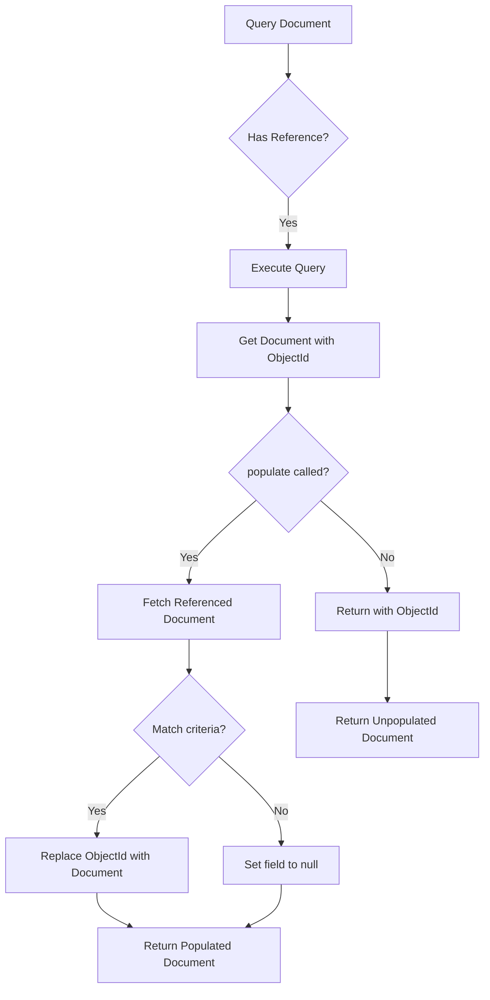

# How to Use Mongoose Populate for References

Author: [nawazdhandala](https://www.github.com/nawazdhandala)

Tags: MongoDB, Mongoose, Node.js, References, Populate, ODM

Description: Master Mongoose populate to efficiently join referenced documents in MongoDB. Learn basic and advanced populate patterns, virtual population, and performance optimization techniques.

---

Mongoose's `populate()` method is a powerful feature that allows you to automatically replace specified paths in a document with documents from other collections. It's similar to SQL joins but optimized for MongoDB's document model. This guide covers everything from basic usage to advanced patterns.

## Understanding References in Mongoose

Before using populate, you need to set up references in your schemas:

```javascript
const mongoose = require('mongoose');
const { Schema } = mongoose;

// Author schema
const authorSchema = new Schema({
  name: String,
  email: String,
  bio: String
});

// Book schema with reference to Author
const bookSchema = new Schema({
  title: String,
  pages: Number,
  author: {
    type: Schema.Types.ObjectId,
    ref: 'Author'  // Reference to Author model
  },
  publishedDate: Date
});

const Author = mongoose.model('Author', authorSchema);
const Book = mongoose.model('Book', bookSchema);
```

## Basic Populate Usage

### Simple Populate

```javascript
// Create an author and book
const author = await Author.create({
  name: 'Stephen King',
  email: 'stephen@example.com',
  bio: 'American author of horror fiction'
});

const book = await Book.create({
  title: 'The Shining',
  pages: 447,
  author: author._id,  // Store the reference
  publishedDate: new Date('1977-01-28')
});

// Query without populate - returns only ObjectId
const bookWithoutPopulate = await Book.findOne({ title: 'The Shining' });
console.log(bookWithoutPopulate.author);
// Output: ObjectId("507f1f77bcf86cd799439011")

// Query with populate - returns full author document
const bookWithPopulate = await Book.findOne({ title: 'The Shining' })
  .populate('author');
console.log(bookWithPopulate.author);
// Output: { _id: ..., name: 'Stephen King', email: '...', bio: '...' }
```

### Selecting Specific Fields

Only populate specific fields to reduce data transfer:

```javascript
// Populate only name and email
const book = await Book.findOne({ title: 'The Shining' })
  .populate('author', 'name email');  // Space-separated field names

// Or using object syntax
const book = await Book.findOne({ title: 'The Shining' })
  .populate({
    path: 'author',
    select: 'name email'  // Include these fields
  });

// Exclude specific fields
const book = await Book.findOne({ title: 'The Shining' })
  .populate({
    path: 'author',
    select: '-email'  // Exclude email
  });
```

## Multiple References

### Array of References

```javascript
// User schema with multiple book references
const userSchema = new Schema({
  username: String,
  favoriteBooks: [{
    type: Schema.Types.ObjectId,
    ref: 'Book'
  }]
});

const User = mongoose.model('User', userSchema);

// Populate array of references
const user = await User.findOne({ username: 'alice' })
  .populate('favoriteBooks');

// Each item in favoriteBooks is now a full book document
```

### Multiple Paths

Populate multiple references in one query:

```javascript
// Order schema with multiple references
const orderSchema = new Schema({
  user: { type: Schema.Types.ObjectId, ref: 'User' },
  product: { type: Schema.Types.ObjectId, ref: 'Product' },
  shippingAddress: { type: Schema.Types.ObjectId, ref: 'Address' }
});

// Populate multiple paths
const order = await Order.findById(orderId)
  .populate('user')
  .populate('product')
  .populate('shippingAddress');

// Or using array syntax
const order = await Order.findById(orderId)
  .populate(['user', 'product', 'shippingAddress']);
```

## Nested Populate

Populate references within populated documents:

```javascript
// Schema setup
const countrySchema = new Schema({ name: String, code: String });
const citySchema = new Schema({
  name: String,
  country: { type: Schema.Types.ObjectId, ref: 'Country' }
});
const userSchema = new Schema({
  name: String,
  city: { type: Schema.Types.ObjectId, ref: 'City' }
});

// Deep nested populate
const user = await User.findOne({ name: 'Alice' })
  .populate({
    path: 'city',
    populate: {
      path: 'country',
      select: 'name code'
    }
  });

// Result:
// {
//   name: 'Alice',
//   city: {
//     name: 'New York',
//     country: { name: 'United States', code: 'US' }
//   }
// }
```

## Conditional Populate

### Match Specific Documents

```javascript
// Only populate authors with specific criteria
const books = await Book.find({})
  .populate({
    path: 'author',
    match: { name: /King/ }  // Only populate if author name contains "King"
  });

// Books without matching author will have author: null
```

### Populate with Options

```javascript
const blog = await Blog.findOne({})
  .populate({
    path: 'comments',
    match: { approved: true },
    select: 'text author createdAt',
    options: {
      sort: { createdAt: -1 },
      limit: 10
    }
  });
```

## Virtual Populate

Populate documents that reference the current document (reverse lookup):

```javascript
// Author schema with virtual populate
const authorSchema = new Schema({
  name: String,
  email: String
}, {
  toJSON: { virtuals: true },
  toObject: { virtuals: true }
});

// Define virtual field for books by this author
authorSchema.virtual('books', {
  ref: 'Book',
  localField: '_id',      // Author's _id
  foreignField: 'author', // Book's author field
  justOne: false          // Return array (multiple books)
});

// Now you can populate books from author
const author = await Author.findOne({ name: 'Stephen King' })
  .populate('books');

// Output:
// {
//   name: 'Stephen King',
//   books: [
//     { title: 'The Shining', pages: 447, ... },
//     { title: 'It', pages: 1138, ... }
//   ]
// }
```

### Virtual Populate with Options

```javascript
// Virtual with count only
authorSchema.virtual('bookCount', {
  ref: 'Book',
  localField: '_id',
  foreignField: 'author',
  count: true  // Returns count instead of documents
});

// Virtual with filtering
authorSchema.virtual('recentBooks', {
  ref: 'Book',
  localField: '_id',
  foreignField: 'author',
  options: {
    sort: { publishedDate: -1 },
    limit: 5
  }
});
```

## Populate Flow



## Dynamic References

Use `refPath` for dynamic references to different collections:

```javascript
// Comment that can belong to different types
const commentSchema = new Schema({
  text: String,
  onModel: {
    type: String,
    enum: ['Blog', 'Product', 'Video']
  },
  commentableId: {
    type: Schema.Types.ObjectId,
    refPath: 'onModel'  // Dynamic reference based on onModel field
  }
});

// Create comments on different models
await Comment.create({
  text: 'Great blog post!',
  onModel: 'Blog',
  commentableId: blogId
});

await Comment.create({
  text: 'Love this product!',
  onModel: 'Product',
  commentableId: productId
});

// Populate dynamically resolves to correct collection
const comments = await Comment.find({})
  .populate('commentableId');
```

## Populating Across Databases

Mongoose can populate across database connections:

```javascript
const db1 = mongoose.createConnection('mongodb://localhost/db1');
const db2 = mongoose.createConnection('mongodb://localhost/db2');

const userSchema = new Schema({
  name: String,
  organizationId: { type: Schema.Types.ObjectId }
});

const orgSchema = new Schema({ name: String });

const User = db1.model('User', userSchema);
const Organization = db2.model('Organization', orgSchema);

// Cross-database populate
const user = await User.findOne({})
  .populate({
    path: 'organizationId',
    model: Organization  // Specify model from different connection
  });
```

## Performance Optimization

### Lean Queries

Use `lean()` for read-only operations:

```javascript
// Regular populate - returns Mongoose documents
const books = await Book.find({})
  .populate('author');

// Lean populate - returns plain JavaScript objects (faster)
const books = await Book.find({})
  .populate('author')
  .lean();
```

### Limiting Populated Fields

Always select only needed fields:

```javascript
// Inefficient - fetches all author fields
await Book.find({}).populate('author');

// Efficient - fetches only needed fields
await Book.find({}).populate('author', 'name');
```

### Avoiding N+1 Queries

Mongoose batches populate queries, but be mindful:

```javascript
// This creates multiple queries - avoid in loops
for (const bookId of bookIds) {
  const book = await Book.findById(bookId).populate('author');
}

// Better - single query with populate
const books = await Book.find({ _id: { $in: bookIds } })
  .populate('author');
```

### Using populate() vs $lookup

For complex scenarios, consider using aggregation `$lookup`:

```javascript
// Mongoose populate
const books = await Book.find({}).populate('author');

// Aggregation $lookup - more control
const books = await Book.aggregate([
  {
    $lookup: {
      from: 'authors',
      localField: 'author',
      foreignField: '_id',
      as: 'authorDetails'
    }
  },
  { $unwind: '$authorDetails' }
]);
```

## Common Patterns

### Populate on Save

```javascript
// Auto-populate after save using middleware
bookSchema.post('save', async function(doc) {
  await doc.populate('author');
});

// Or using post hooks for find
bookSchema.post('find', async function(docs) {
  for (const doc of docs) {
    await doc.populate('author');
  }
});
```

### Always Populate

Use pre-hooks to always populate:

```javascript
// Always populate author for all find queries
bookSchema.pre(/^find/, function() {
  this.populate('author', 'name email');
});

// Now all find queries auto-populate
const book = await Book.findById(id);  // Author is populated
```

### Conditional Auto-Populate

```javascript
bookSchema.pre('find', function() {
  if (this.getOptions().populateAuthor !== false) {
    this.populate('author', 'name');
  }
});

// Disable auto-populate when needed
const book = await Book.find({}).setOptions({ populateAuthor: false });
```

## Error Handling

```javascript
try {
  const book = await Book.findById(invalidId)
    .populate('author');
} catch (error) {
  if (error.name === 'CastError') {
    console.log('Invalid ID format');
  }
}

// Handle missing references gracefully
const book = await Book.findOne({ title: 'Unknown' })
  .populate('author');

if (!book.author) {
  console.log('Referenced author not found or deleted');
}
```

## Summary

Mongoose populate provides a convenient way to work with related documents:

- Use basic `populate()` for simple reference resolution
- Select specific fields to optimize data transfer
- Use virtual populate for reverse lookups
- Apply match criteria to filter populated documents
- Use `lean()` for better performance on read operations
- Consider `$lookup` aggregation for complex scenarios

Master these patterns to build efficient, maintainable MongoDB applications with Mongoose.
