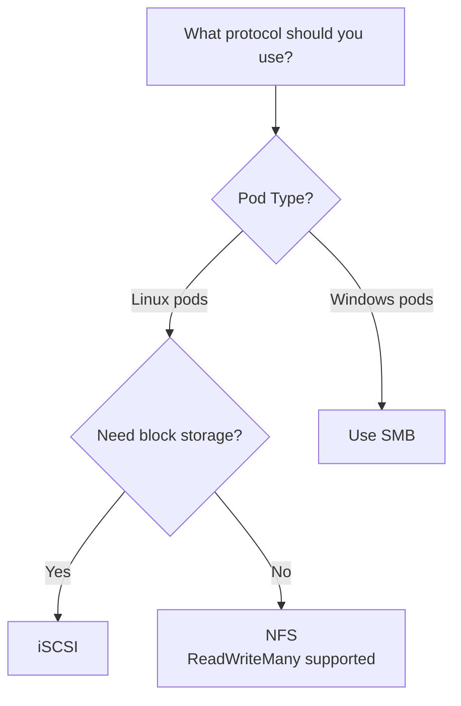

# How to Use NAS Storage with Kubernetes: NFS, SMB, and iSCSI Volumes

Author: [nawazdhandala](https://www.github.com/nawazdhandala)

Tags: Kubernetes, Storage, NFS, DevOps, Bare Metal, Self-Hosting

Description: A practical guide to connecting your NAS (Synology, QNAP, TrueNAS, or any NFS/SMB/iSCSI server) to Kubernetes clusters. Learn how to provision persistent volumes, set up dynamic provisioning with CSI drivers, and avoid common pitfalls.

---

You have a NAS sitting in your rack or closet. It has terabytes of reliable storage, maybe RAID protection, snapshots, and a web UI you already know. Meanwhile, your Kubernetes pods keep losing data every time they restart because nobody configured persistent volumes. The good news: connecting the two is straightforward once you understand the protocols and CSI drivers involved.

This guide covers the three main ways to attach NAS storage to Kubernetes: **NFS**, **SMB/CIFS**, and **iSCSI**. We'll walk through static provisioning, dynamic provisioning with CSI drivers, and production hardening tips.

## Quick Protocol Comparison

| Protocol | Best For | Strengths | Watch-outs |
| --- | --- | --- | --- |
| **NFS** | Linux workloads, ReadWriteMany access, shared configs/logs | Simple setup, wide support, works over standard Ethernet | No built-in encryption (use NFSv4 + Kerberos or VPN), file locking can be tricky |
| **SMB/CIFS** | Windows containers, hybrid environments, Azure Files compatibility | Native Windows support, AD integration | Higher overhead than NFS, requires credentials management |
| **iSCSI** | Block storage needs, databases, single-pod ReadWriteOnce | Block-level access, better performance for databases | More complex setup, one pod per volume, requires iSCSI initiator on nodes |

## Prerequisites

Before starting, ensure:

- Your NAS is reachable from all Kubernetes worker nodes (same VLAN or routed network)
- You have created a share/export on your NAS (we'll cover specifics below)
- Your nodes have the required client packages installed

### Installing NFS Client on Nodes

For Debian/Ubuntu:

The NFS client package must be installed on every Kubernetes worker node that will mount NFS volumes. Without this package, pods scheduled to these nodes will fail to start with mount errors.

```bash
# Install NFS client utilities for mounting NFS shares
# nfs-common includes mount.nfs required for NFS PersistentVolumes
sudo apt-get update && sudo apt-get install -y nfs-common
```

For RHEL/Rocky/AlmaLinux:

```bash
# Install NFS utilities for Red Hat-based distributions
# Includes mount.nfs and supporting services
sudo dnf install -y nfs-utils
```

For iSCSI support:

iSCSI requires the initiator service to be running on each node. Unlike NFS, iSCSI creates block devices that appear as local disks, enabling better database performance.

```bash
# Debian/Ubuntu - install iSCSI initiator and enable the service
sudo apt-get install -y open-iscsi
# Enable and start iscsid to handle iSCSI connections
sudo systemctl enable --now iscsid

# RHEL/Rocky - same steps with different package name
sudo dnf install -y iscsi-initiator-utils
sudo systemctl enable --now iscsid
```

## Method 1: Static NFS Volumes (Quick Start)

The simplest approach is creating a PersistentVolume (PV) and PersistentVolumeClaim (PVC) that point directly to your NAS export.

### Step 1: Create an NFS Export on Your NAS

On Synology DSM:
1. Go to **Control Panel → Shared Folder** and create a folder (e.g., `kubernetes`)
2. Go to **Control Panel → File Services → NFS** and enable NFS
3. Edit the shared folder, go to **NFS Permissions**, and add a rule:
   - Hostname/IP: `*` or your Kubernetes node CIDR (e.g., `10.0.0.0/24`)
   - Privilege: Read/Write
   - Squash: Map all users to admin (or configure appropriately)
   - Security: sys (or krb5 for Kerberos)

On TrueNAS:
1. Go to **Sharing → Unix Shares (NFS)** and add a share
2. Set the path and configure authorized networks/hosts

### Step 2: Create a PersistentVolume

This PersistentVolume definition tells Kubernetes how to connect to your NAS. The capacity is informational for NFS (it doesn't enforce quotas), but other fields like access modes and mount options directly affect how pods can use the storage.

```yaml
# nfs-pv.yaml
apiVersion: v1
kind: PersistentVolume
metadata:
  name: nfs-pv
spec:
  # Capacity is advisory only for NFS - your NAS manages actual limits
  # Still useful for resource planning and PVC matching
  capacity:
    storage: 100Gi
  accessModes:
    # ReadWriteMany allows multiple pods to mount simultaneously
    # This is NFS's key advantage - shared access across the cluster
    - ReadWriteMany
  # Retain keeps the PV data even after PVC is deleted
  # Use Delete for test environments, Retain for production
  persistentVolumeReclaimPolicy: Retain
  # StorageClass groups similar storage types together
  # PVCs request storage by class name
  storageClassName: nfs
  # Mount options passed to the mount command
  mountOptions:
    - nfsvers=4.1    # Use NFS v4.1 for better performance and security
    - hard           # Retry indefinitely on failure (safe for data integrity)
    - noatime        # Don't update access times (reduces NAS I/O)
  nfs:
    server: 192.168.1.100       # Your NAS IP address
    path: /volume1/kubernetes   # NFS export path from your NAS config
```

### Step 3: Create a PersistentVolumeClaim

A PVC is a request for storage that binds to a matching PV. Kubernetes automatically matches PVCs to PVs based on storage class, access modes, and capacity requirements.

```yaml
# nfs-pvc.yaml
apiVersion: v1
kind: PersistentVolumeClaim
metadata:
  name: nfs-pvc
  namespace: default               # PVCs are namespace-scoped unlike PVs
spec:
  accessModes:
    - ReadWriteMany                # Must match the PV's access modes
  storageClassName: nfs            # Requests binding to PVs of this class
  resources:
    requests:
      storage: 100Gi               # Must be <= PV capacity for binding to succeed
```

### Step 4: Use the Volume in a Pod

Once the PVC is bound to a PV, you can mount it into pods. The volume persists across pod restarts and can be shared between multiple pods when using ReadWriteMany access mode.

```yaml
# app-with-nfs.yaml
apiVersion: v1
kind: Pod
metadata:
  name: app-with-nfs
spec:
  containers:
    - name: app
      image: nginx:alpine
      volumeMounts:
        - name: nfs-storage        # Must match the volume name below
          mountPath: /data         # Path inside the container where NFS appears
  volumes:
    - name: nfs-storage            # Logical name referenced by volumeMounts
      persistentVolumeClaim:
        claimName: nfs-pvc         # Reference to the PVC we created above
```

Apply the manifests in order - the PV must exist before the PVC can bind, and the PVC must be bound before pods can use it:

```bash
# Create the PersistentVolume first (cluster-wide resource)
kubectl apply -f nfs-pv.yaml

# Create the PVC which will bind to the matching PV
kubectl apply -f nfs-pvc.yaml

# Verify the PVC is bound before creating the pod
kubectl get pvc nfs-pvc

# Create the pod that uses the NFS storage
kubectl apply -f app-with-nfs.yaml
```

## Method 2: Dynamic Provisioning with NFS CSI Driver

Static volumes work, but creating PVs manually doesn't scale. The **NFS CSI Driver** enables dynamic provisioning: create a PVC, and the driver automatically provisions a subdirectory on your NAS.

### Install the NFS CSI Driver

The NFS CSI driver runs as a controller deployment (handles provisioning) and a node DaemonSet (handles mounting). Installing via Helm ensures both components are correctly configured.

```bash
# Add the CSI driver Helm repo
helm repo add csi-driver-nfs https://raw.githubusercontent.com/kubernetes-csi/csi-driver-nfs/master/charts

# Fetch latest chart versions
helm repo update

# Install the driver with 2 controller replicas for high availability
helm install csi-driver-nfs csi-driver-nfs/csi-driver-nfs \
  --namespace kube-system \
  --set controller.replicas=2       # Run 2 controllers for HA
```

### Create a StorageClass

The StorageClass tells Kubernetes how to dynamically provision volumes. Each PVC referencing this class will get its own subdirectory on your NAS, automatically created and managed by the CSI driver.

```yaml
# nfs-storageclass.yaml
apiVersion: storage.k8s.io/v1
kind: StorageClass
metadata:
  name: nfs-csi
provisioner: nfs.csi.k8s.io       # CSI driver name (must match installed driver)
parameters:
  server: 192.168.1.100           # NAS IP address
  share: /volume1/kubernetes       # Base NFS export path
  # subDir: ${pvc.metadata.namespace}/${pvc.metadata.name}  # Optional: organize by namespace/name
reclaimPolicy: Retain              # Keep data when PVC is deleted (Retain for safety)
volumeBindingMode: Immediate       # Create volume immediately when PVC is created
mountOptions:
  - nfsvers=4.1                    # Use NFS v4.1 for security and performance
  - hard                           # Retry failed operations indefinitely
  - noatime                        # Reduce unnecessary metadata updates
```

### Use Dynamic Provisioning

Now PVCs automatically create volumes. When you apply a PVC, the CSI driver creates a new subdirectory on your NAS and binds a PV to it - no manual PV creation required.

```yaml
# dynamic-pvc.yaml
apiVersion: v1
kind: PersistentVolumeClaim
metadata:
  name: my-app-data
spec:
  accessModes:
    - ReadWriteMany               # NFS supports multiple pods reading/writing
  storageClassName: nfs-csi       # Reference the StorageClass we created
  resources:
    requests:
      storage: 10Gi               # Requested capacity (directory has no enforced quota)
```

Apply the StorageClass first, then create PVCs that reference it:

```bash
# Create the StorageClass (one-time setup)
kubectl apply -f nfs-storageclass.yaml

# Create a PVC - the driver automatically provisions a subdirectory
kubectl apply -f dynamic-pvc.yaml

# Verify a PV was dynamically created and bound to your PVC
kubectl get pv

# Check the PVC status - should show "Bound"
kubectl get pvc my-app-data
```

The driver creates a subdirectory on your NAS for each PVC, making cleanup and organization much easier.

## Method 3: SMB/CIFS Volumes

For Windows containers or environments with Active Directory integration, SMB is the protocol of choice.

### Install the SMB CSI Driver

The SMB CSI driver works similarly to NFS but requires credentials for authentication. Install it via Helm to get both the controller and node components.

```bash
# Add the SMB CSI driver Helm repository
helm repo add csi-driver-smb https://raw.githubusercontent.com/kubernetes-csi/csi-driver-smb/master/charts

# Update the local chart cache
helm repo update

# Install the SMB CSI driver into kube-system namespace
helm install csi-driver-smb csi-driver-smb/csi-driver-smb \
  --namespace kube-system
```

### Create a Secret with Credentials

SMB requires authentication, so store your NAS credentials in a Kubernetes Secret. This Secret is referenced by the StorageClass and used during volume mounting.

```yaml
# smb-secret.yaml
apiVersion: v1
kind: Secret
metadata:
  name: smb-creds
  namespace: default             # Must match the namespace in StorageClass parameters
type: Opaque
stringData:
  username: your-nas-username    # NAS user with access to the share
  password: your-nas-password    # User's password (consider using external secrets manager)
```

### Create a StorageClass for SMB

The SMB StorageClass references the credentials Secret and defines permissions for mounted files. Mount options control how files appear inside containers.

```yaml
# smb-storageclass.yaml
apiVersion: storage.k8s.io/v1
kind: StorageClass
metadata:
  name: smb-csi
provisioner: smb.csi.k8s.io                    # CSI driver identifier
parameters:
  source: //192.168.1.100/kubernetes            # SMB share path (UNC format)
  # Secret reference for authentication during mount
  csi.storage.k8s.io/node-stage-secret-name: smb-creds
  csi.storage.k8s.io/node-stage-secret-namespace: default
reclaimPolicy: Retain                           # Keep data when PVC deleted
volumeBindingMode: Immediate                    # Provision immediately
mountOptions:
  - dir_mode=0755                               # Directory permissions (rwxr-xr-x)
  - file_mode=0644                              # File permissions (rw-r--r--)
  - uid=1000                                    # UID for file ownership inside container
  - gid=1000                                    # GID for file ownership inside container
```

## Method 4: iSCSI Block Volumes

When you need block storage (databases like PostgreSQL, MySQL, or MongoDB), iSCSI provides better performance than file-based protocols.

### Configure iSCSI Target on Your NAS

On Synology:
1. Go to **SAN Manager → iSCSI**
2. Create a Target and a LUN
3. Note the IQN (iSCSI Qualified Name) of the target

### Create a PersistentVolume with iSCSI

iSCSI PVs connect to block devices exposed by your NAS. Unlike NFS, iSCSI presents raw block storage that Kubernetes formats with a filesystem. This provides better performance for databases but limits access to a single pod.

```yaml
# iscsi-pv.yaml
apiVersion: v1
kind: PersistentVolume
metadata:
  name: iscsi-pv
spec:
  capacity:
    storage: 50Gi                              # Must match or exceed the LUN size
  accessModes:
    - ReadWriteOnce                            # iSCSI = single pod access only
  persistentVolumeReclaimPolicy: Retain        # Keep the LUN data when PVC deleted
  storageClassName: iscsi                      # Group with other iSCSI volumes
  iscsi:
    targetPortal: 192.168.1.100:3260           # NAS IP and iSCSI port (default 3260)
    iqn: iqn.2000-01.com.synology:nas.target-1 # iSCSI Qualified Name from NAS
    lun: 1                                      # LUN number assigned in NAS config
    fsType: ext4                                # Filesystem to create on first mount
    readOnly: false                             # Allow writes to the volume
```

For dynamic iSCSI provisioning, consider the **democratic-csi** driver or your NAS vendor's CSI driver (Synology and QNAP both offer CSI drivers).

## Production Hardening Tips

### 1. Network Segmentation

Keep storage traffic on a dedicated VLAN or network segment. This prevents application traffic from competing with storage I/O and improves security by isolating storage protocols.

```yaml
# Example: Use a specific network interface for NFS
# This forces traffic through the storage network instead of the default route
mountOptions:
  - nfsvers=4.1                # NFS protocol version
  - hard                       # Retry operations until success
  - noatime                    # Skip access time updates
  - addr=10.20.0.100           # Storage network IP of NAS (bypasses default routing)
```

### 2. Resource Limits for CSI Pods

Prevent runaway CSI driver pods from affecting your cluster. Setting resource limits ensures the storage driver cannot starve other workloads during high I/O operations.

```bash
# Upgrade the CSI driver with resource constraints
helm upgrade csi-driver-nfs csi-driver-nfs/csi-driver-nfs \
  --namespace kube-system \
  --set controller.resources.limits.memory=256Mi \   # Cap controller memory
  --set controller.resources.limits.cpu=100m \       # Cap controller CPU
  --set node.resources.limits.memory=256Mi \         # Cap per-node daemonset memory
  --set node.resources.limits.cpu=100m               # Cap per-node daemonset CPU
```

### 3. Backup Your StorageClass Configurations

Your StorageClasses are infrastructure as code-store them in Git:

```bash
kubectl get storageclass -o yaml > storage-classes-backup.yaml
```

### 4. Monitor NFS Mount Health

NFS mounts can become stale if the NAS reboots or network flaps. Set up monitoring to detect issues before they cascade to application failures.

```yaml
# Example: DaemonSet that checks mount health on every node
apiVersion: apps/v1
kind: DaemonSet
metadata:
  name: nfs-health-check
spec:
  selector:
    matchLabels:
      app: nfs-health
  template:
    metadata:
      labels:
        app: nfs-health
    spec:
      containers:
        - name: checker
          image: busybox
          command:
            - /bin/sh
            - -c
            - |
              # Continuously check if the NFS mount is responsive
              while true; do
                # stat will hang or fail if the mount is stale
                if ! stat /mnt/nfs-test > /dev/null 2>&1; then
                  echo "NFS mount unhealthy"
                  # In production: send alert to monitoring system
                fi
                sleep 30   # Check every 30 seconds
              done
          volumeMounts:
            - name: nfs-vol
              mountPath: /mnt/nfs-test       # Test mount point
      volumes:
        - name: nfs-vol
          nfs:
            server: 192.168.1.100            # Your NAS IP
            path: /volume1/health-check       # Dedicated health-check export
```

### 5. Use Soft vs Hard Mounts Wisely

- **hard** (default): Operations block until the server responds. Safe for data integrity but pods hang if NAS is unreachable.
- **soft**: Operations return errors after timeout. Pods don't hang but data corruption is possible.

For databases, always use `hard`. For read-heavy caches, `soft` with retries can prevent cascading failures.

```yaml
mountOptions:
  - nfsvers=4.1   # Protocol version
  - hard          # Use 'soft,timeo=30,retrans=3' for less critical workloads
  - intr          # Allow SIGINT to interrupt hung NFS operations
```

## Vendor-Specific CSI Drivers

If you want tighter integration with your NAS features (snapshots, clones, thin provisioning), consider vendor CSI drivers:

| NAS Vendor | CSI Driver | Features |
| --- | --- | --- |
| **Synology** | [synology-csi](https://github.com/SynologyOpenSource/synology-csi) | iSCSI + snapshots, thin provisioning |
| **QNAP** | [qnap-csi](https://github.com/qnap-dev/QNAP-CSI-PlugIn) | iSCSI + NFS, snapshots |
| **TrueNAS** | [democratic-csi](https://github.com/democratic-csi/democratic-csi) | iSCSI, NFS, ZFS snapshots |
| **NetApp** | [Trident](https://github.com/NetApp/trident) | Full NetApp integration |

Example: Installing Synology CSI for iSCSI with snapshots:

```bash
# Clone the official Synology CSI repository
git clone https://github.com/SynologyOpenSource/synology-csi.git
cd synology-csi

# Create configuration from template
cp config/client-info-template.yaml config/client-info.yaml
# Edit with your NAS IP, credentials, and volume location

# Deploy all CSI components (controller, node plugin, RBAC)
kubectl apply -f deploy/kubernetes/
```

## Common Pitfalls and Solutions

### Pitfall 1: "mount.nfs: access denied by server"

**Cause:** NFS export doesn't allow your node IPs.

**Fix:** Check NAS export settings. Ensure the CIDR covers all worker nodes.

### Pitfall 2: "permission denied" when writing files

**Cause:** UID/GID mismatch between container user and NFS export.

**Fix:** Use `securityContext` to match your NAS settings:

```yaml
spec:
  securityContext:
    runAsUser: 1000     # UID that matches NFS export permissions
    runAsGroup: 1000    # GID that matches NFS export permissions
    fsGroup: 1000       # Group ownership for mounted volumes
```

Or configure NFS squashing on the NAS to map all users to a specific UID.

### Pitfall 3: Pods stuck in "ContainerCreating" state

**Cause:** Missing NFS client packages on the node.

**Fix:** Ensure `nfs-common` (Debian) or `nfs-utils` (RHEL) is installed on all nodes.

### Pitfall 4: Stale NFS handles after NAS reboot

**Cause:** NFS file handles become invalid when the NAS restarts.

**Fix:** Restart affected pods, or use `soft` mount option with monitoring to detect failures.

### Pitfall 5: Slow write performance

**Cause:** Synchronous writes (default NFS behavior).

**Fix:** Use `async` export option on NAS (with battery-backed cache) or accept the latency for data safety.

## Decision Flowchart



## TL;DR Quick Start

For most home labs and small production clusters:

1. **Install NFS client** on all nodes: `apt install nfs-common`
2. **Create an NFS export** on your NAS pointing to a folder
3. **Install NFS CSI driver**: `helm install csi-driver-nfs ...`
4. **Create a StorageClass** pointing to your NAS
5. **Create PVCs** and let the driver handle provisioning

For databases or single-pod workloads needing better performance, use iSCSI with your NAS vendor's CSI driver.

Monitor your mounts, test failover scenarios, and always have backups-your NAS is now part of your Kubernetes cluster's failure domain.

---

**Related Reading:**

- [Kubernetes Storage Layers: Ceph vs. Longhorn vs. Everything Else](https://oneuptime.com/blog/post/2025-11-27-choosing-kubernetes-storage-layers/view)
- [How moving from AWS to Bare-Metal saved us $230,000 /yr.](https://oneuptime.com/blog/post/2023-10-30-moving-from-aws-to-bare-metal/view)
- [One Big Server Is Probably Enough](https://oneuptime.com/blog/post/2025-12-12-one-big-server-is-enough/view)
