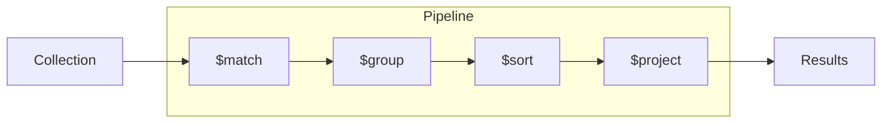
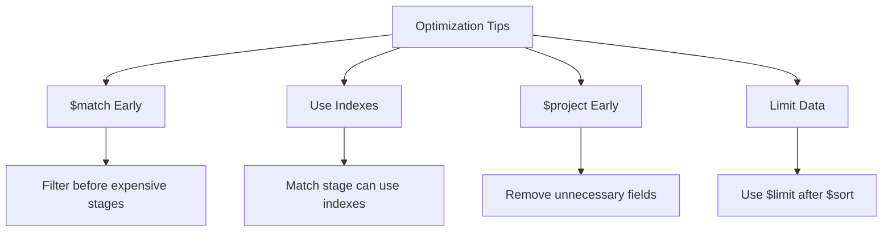

# How to Use MongoDB Aggregation Pipeline

Author: [nawazdhandala](https://www.github.com/nawazdhandala)

Tags: MongoDB, Database, Aggregation, Data Analysis, Performance

Description: Master the MongoDB aggregation pipeline with practical examples covering $match, $group, $lookup, $project, and advanced stages. Learn to build efficient data processing pipelines for analytics and reporting.

---

The MongoDB aggregation pipeline is a powerful framework for data transformation and analysis. It processes documents through a sequence of stages, where each stage transforms the documents as they pass through. This guide covers essential stages with practical examples to help you build effective pipelines.

## Understanding the Pipeline Concept

Documents flow through stages sequentially, with each stage's output becoming the next stage's input.



```javascript
// Basic pipeline structure
db.orders.aggregate([
  { $match: { status: "completed" } },    // Stage 1: Filter
  { $group: { _id: "$customerId", total: { $sum: "$amount" } } },  // Stage 2: Group
  { $sort: { total: -1 } },               // Stage 3: Sort
  { $limit: 10 }                          // Stage 4: Limit
]);
```

## Essential Pipeline Stages

### $match - Filter Documents

Use `$match` early in the pipeline to reduce the number of documents processed.

```javascript
// Filter by single condition
db.orders.aggregate([
  { $match: { status: "completed" } }
]);

// Multiple conditions
db.orders.aggregate([
  {
    $match: {
      status: "completed",
      orderDate: { $gte: new Date("2024-01-01") },
      total: { $gt: 100 }
    }
  }
]);

// Using $or, $and
db.orders.aggregate([
  {
    $match: {
      $or: [
        { priority: "high" },
        { total: { $gt: 1000 } }
      ]
    }
  }
]);
```

### $group - Aggregate Data

Group documents and perform calculations.

```javascript
// Group by field and count
db.orders.aggregate([
  {
    $group: {
      _id: "$status",
      count: { $sum: 1 }
    }
  }
]);

// Multiple accumulators
db.orders.aggregate([
  {
    $group: {
      _id: "$customerId",
      totalOrders: { $sum: 1 },
      totalSpent: { $sum: "$amount" },
      avgOrderValue: { $avg: "$amount" },
      maxOrder: { $max: "$amount" },
      minOrder: { $min: "$amount" },
      firstOrder: { $first: "$orderDate" },
      lastOrder: { $last: "$orderDate" },
      products: { $push: "$product" },
      uniqueProducts: { $addToSet: "$product" }
    }
  }
]);

// Group by multiple fields
db.orders.aggregate([
  {
    $group: {
      _id: {
        year: { $year: "$orderDate" },
        month: { $month: "$orderDate" },
        status: "$status"
      },
      count: { $sum: 1 },
      revenue: { $sum: "$amount" }
    }
  }
]);

// Group all documents (null _id)
db.orders.aggregate([
  {
    $group: {
      _id: null,
      totalRevenue: { $sum: "$amount" },
      orderCount: { $sum: 1 }
    }
  }
]);
```

### $project - Shape Output

Select, rename, and compute fields.

```javascript
// Select specific fields
db.users.aggregate([
  {
    $project: {
      name: 1,
      email: 1,
      _id: 0  // Exclude _id
    }
  }
]);

// Rename fields
db.users.aggregate([
  {
    $project: {
      fullName: "$name",
      contactEmail: "$email"
    }
  }
]);

// Compute new fields
db.orders.aggregate([
  {
    $project: {
      orderNumber: 1,
      subtotal: 1,
      tax: 1,
      total: { $add: ["$subtotal", "$tax"] },
      discountedTotal: {
        $multiply: [
          { $add: ["$subtotal", "$tax"] },
          0.9  // 10% discount
        ]
      }
    }
  }
]);

// Conditional fields
db.orders.aggregate([
  {
    $project: {
      orderNumber: 1,
      total: 1,
      category: {
        $switch: {
          branches: [
            { case: { $lt: ["$total", 50] }, then: "small" },
            { case: { $lt: ["$total", 200] }, then: "medium" },
            { case: { $gte: ["$total", 200] }, then: "large" }
          ],
          default: "unknown"
        }
      }
    }
  }
]);
```

### $sort and $limit

```javascript
// Sort and get top results
db.products.aggregate([
  { $match: { category: "electronics" } },
  { $sort: { sales: -1, rating: -1 } },  // Sort by sales desc, then rating desc
  { $limit: 10 }
]);

// Pagination with $skip and $limit
const page = 2;
const pageSize = 20;

db.products.aggregate([
  { $match: { inStock: true } },
  { $sort: { createdAt: -1 } },
  { $skip: (page - 1) * pageSize },
  { $limit: pageSize }
]);
```

### $lookup - Join Collections

```javascript
// Basic lookup
db.orders.aggregate([
  {
    $lookup: {
      from: "customers",
      localField: "customerId",
      foreignField: "_id",
      as: "customer"
    }
  },
  { $unwind: "$customer" }
]);

// Pipeline lookup with conditions
db.orders.aggregate([
  {
    $lookup: {
      from: "products",
      let: { productIds: "$items.productId" },
      pipeline: [
        { $match: { $expr: { $in: ["$_id", "$$productIds"] } } },
        { $project: { name: 1, price: 1 } }
      ],
      as: "productDetails"
    }
  }
]);
```

### $unwind - Deconstruct Arrays

```javascript
// Basic unwind
db.orders.aggregate([
  { $unwind: "$items" }
]);

// Input: { items: ["a", "b", "c"] }
// Output: { items: "a" }, { items: "b" }, { items: "c" }

// Preserve null and empty arrays
db.orders.aggregate([
  {
    $unwind: {
      path: "$items",
      preserveNullAndEmptyArrays: true
    }
  }
]);

// Include array index
db.orders.aggregate([
  {
    $unwind: {
      path: "$items",
      includeArrayIndex: "itemIndex"
    }
  }
]);
```

## Advanced Pipeline Patterns

### $facet - Multiple Pipelines

Run multiple aggregations in parallel on the same input.

```javascript
// Get stats and paginated results in one query
db.products.aggregate([
  { $match: { category: "electronics" } },
  {
    $facet: {
      // Pipeline 1: Get metadata
      metadata: [
        { $count: "totalCount" }
      ],

      // Pipeline 2: Get price statistics
      priceStats: [
        {
          $group: {
            _id: null,
            avgPrice: { $avg: "$price" },
            minPrice: { $min: "$price" },
            maxPrice: { $max: "$price" }
          }
        }
      ],

      // Pipeline 3: Get paginated data
      data: [
        { $sort: { createdAt: -1 } },
        { $skip: 0 },
        { $limit: 10 },
        { $project: { name: 1, price: 1 } }
      ]
    }
  }
]);
```

### $bucket - Categorize by Ranges

```javascript
// Group products into price ranges
db.products.aggregate([
  {
    $bucket: {
      groupBy: "$price",
      boundaries: [0, 25, 50, 100, 200, Infinity],
      default: "Other",
      output: {
        count: { $sum: 1 },
        products: { $push: "$name" }
      }
    }
  }
]);

// Auto-bucket with even distribution
db.products.aggregate([
  {
    $bucketAuto: {
      groupBy: "$price",
      buckets: 5,
      output: {
        count: { $sum: 1 },
        avgPrice: { $avg: "$price" }
      }
    }
  }
]);
```

### Window Functions with $setWindowFields

```javascript
// Running totals and rankings
db.sales.aggregate([
  {
    $setWindowFields: {
      partitionBy: "$region",
      sortBy: { date: 1 },
      output: {
        runningTotal: {
          $sum: "$amount",
          window: { documents: ["unbounded", "current"] }
        },
        rank: {
          $rank: {}
        },
        movingAvg: {
          $avg: "$amount",
          window: { documents: [-2, 0] }  // 3-day moving average
        }
      }
    }
  }
]);
```

## Practical Examples

### Example 1: Sales Dashboard

```javascript
// Complete sales analytics
db.orders.aggregate([
  // Filter to completed orders this year
  {
    $match: {
      status: "completed",
      orderDate: { $gte: new Date("2024-01-01") }
    }
  },

  // Add computed fields
  {
    $addFields: {
      month: { $month: "$orderDate" },
      dayOfWeek: { $dayOfWeek: "$orderDate" }
    }
  },

  // Group by month
  {
    $group: {
      _id: "$month",
      totalRevenue: { $sum: "$total" },
      orderCount: { $sum: 1 },
      avgOrderValue: { $avg: "$total" },
      uniqueCustomers: { $addToSet: "$customerId" }
    }
  },

  // Add customer count
  {
    $addFields: {
      customerCount: { $size: "$uniqueCustomers" }
    }
  },

  // Clean up output
  {
    $project: {
      month: "$_id",
      totalRevenue: { $round: ["$totalRevenue", 2] },
      orderCount: 1,
      avgOrderValue: { $round: ["$avgOrderValue", 2] },
      customerCount: 1,
      _id: 0
    }
  },

  // Sort by month
  { $sort: { month: 1 } }
]);
```

### Example 2: Product Recommendations

```javascript
// Find products frequently bought together
db.orders.aggregate([
  // Unwind items to work with individual products
  { $unwind: "$items" },

  // Group by order to get product pairs
  {
    $group: {
      _id: "$_id",
      products: { $push: "$items.productId" }
    }
  },

  // Only orders with multiple products
  { $match: { "products.1": { $exists: true } } },

  // Unwind twice to create pairs
  { $unwind: "$products" },
  {
    $lookup: {
      from: "orders",
      let: { orderId: "$_id", product: "$products" },
      pipeline: [
        { $match: { $expr: { $eq: ["$_id", "$$orderId"] } } },
        { $unwind: "$items" },
        { $match: { $expr: { $ne: ["$items.productId", "$$product"] } } },
        { $project: { pairedProduct: "$items.productId" } }
      ],
      as: "pairs"
    }
  },
  { $unwind: "$pairs" },

  // Count pair occurrences
  {
    $group: {
      _id: {
        product: "$products",
        pairedWith: "$pairs.pairedProduct"
      },
      count: { $sum: 1 }
    }
  },

  // Sort by frequency
  { $sort: { count: -1 } },
  { $limit: 20 }
]);
```

### Example 3: User Engagement Report

```javascript
// Analyze user activity patterns
db.events.aggregate([
  {
    $match: {
      timestamp: { $gte: new Date("2024-01-01") }
    }
  },

  // Group by user and event type
  {
    $group: {
      _id: {
        userId: "$userId",
        eventType: "$eventType"
      },
      count: { $sum: 1 },
      lastOccurrence: { $max: "$timestamp" }
    }
  },

  // Pivot to get events as columns
  {
    $group: {
      _id: "$_id.userId",
      events: {
        $push: {
          type: "$_id.eventType",
          count: "$count",
          last: "$lastOccurrence"
        }
      },
      totalEvents: { $sum: "$count" }
    }
  },

  // Calculate engagement score
  {
    $addFields: {
      engagementScore: {
        $multiply: [
          "$totalEvents",
          {
            $size: {
              $filter: {
                input: "$events",
                cond: { $gt: ["$$this.count", 5] }
              }
            }
          }
        ]
      }
    }
  },

  // Join user details
  {
    $lookup: {
      from: "users",
      localField: "_id",
      foreignField: "_id",
      as: "user"
    }
  },
  { $unwind: "$user" },

  // Final output
  {
    $project: {
      userId: "$_id",
      userName: "$user.name",
      email: "$user.email",
      totalEvents: 1,
      engagementScore: 1,
      events: 1
    }
  },

  { $sort: { engagementScore: -1 } },
  { $limit: 100 }
]);
```

## Performance Optimization



```javascript
// Good: Filter and project early
db.orders.aggregate([
  { $match: { status: "completed" } },  // Uses index, reduces documents
  { $project: { customerId: 1, amount: 1 } },  // Reduces document size
  { $group: { _id: "$customerId", total: { $sum: "$amount" } } }
]);

// Bad: Expensive operations first
db.orders.aggregate([
  { $lookup: { from: "customers", ... } },  // Expensive for all docs
  { $match: { status: "completed" } }  // Should be first!
]);

// Use explain to analyze
db.orders.explain("executionStats").aggregate([...]);
```

---

The MongoDB aggregation pipeline is an essential tool for data analysis and transformation. Start with simple pipelines using `$match`, `$group`, and `$project`, then explore advanced stages like `$facet`, `$bucket`, and `$setWindowFields` as your needs grow. Always optimize by filtering early, projecting only needed fields, and ensuring indexes support your `$match` conditions.
