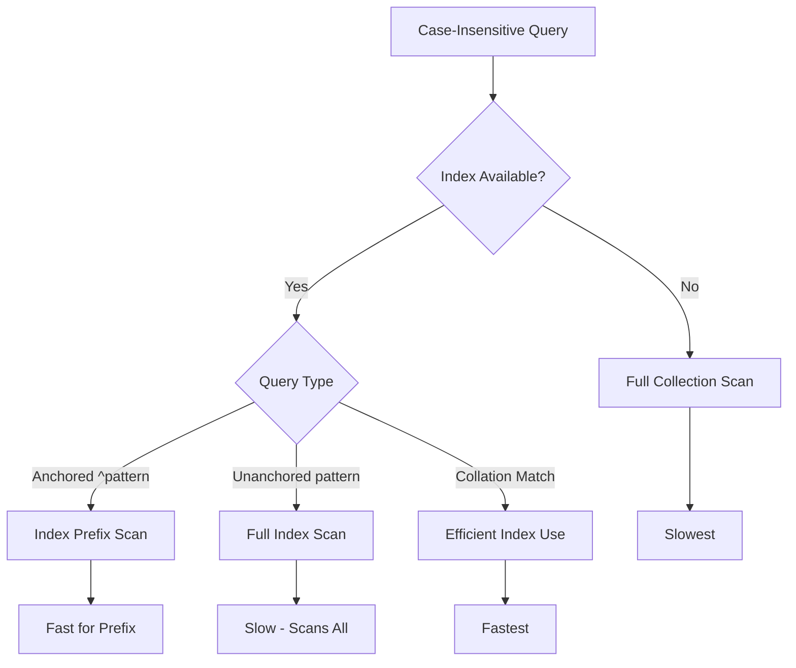
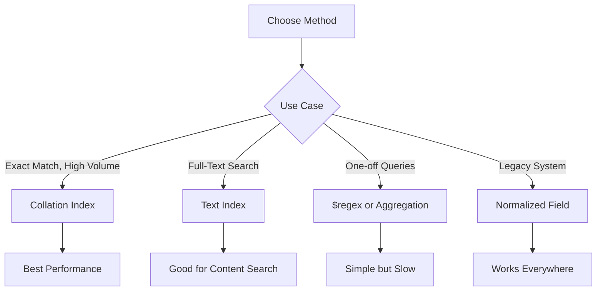

# How to Do Case-Insensitive Queries in MongoDB

Author: [nawazdhandala](https://www.github.com/nawazdhandala)

Tags: MongoDB, Database, Queries, Indexing, Text Search

Description: Learn multiple approaches for case-insensitive queries in MongoDB including regex, collation, text indexes, and storing normalized values. Understand performance implications and choose the right method.

---

Case-insensitive searches are essential for user-friendly applications. When users search for "MongoDB", they expect to find results whether the data is stored as "mongodb", "MONGODB", or "MongoDB". This guide covers all the techniques MongoDB offers for case-insensitive queries, with their trade-offs.

## Method 1: Regular Expressions with $regex

The simplest approach uses regular expressions with the case-insensitive flag.

```javascript
// Case-insensitive search using $regex with 'i' option
db.users.find({
  username: { $regex: /john/i }
});

// Or using string syntax
db.users.find({
  username: { $regex: "john", $options: "i" }
});

// Matches: "John", "JOHN", "john", "JoHn", etc.
```

### Exact Match vs Partial Match

```javascript
// Partial match - finds "john" anywhere in the string
db.users.find({
  username: { $regex: /john/i }
});
// Matches: "John", "Johnny", "BigJohn", "john_doe"

// Exact match - use anchors
db.users.find({
  username: { $regex: /^john$/i }
});
// Matches only: "John", "JOHN", "john"
// Does NOT match: "Johnny", "john_doe"

// Starts with
db.users.find({
  username: { $regex: /^john/i }
});
// Matches: "John", "Johnny", "john_doe"
// Does NOT match: "BigJohn"
```



### Performance Warning

Regex queries without anchors cannot efficiently use indexes.

```javascript
// This can use an index (anchored at start)
db.users.find({ username: { $regex: /^john/i } });

// This CANNOT efficiently use an index
db.users.find({ username: { $regex: /john/i } });

// Check with explain
db.users.find({ username: { $regex: /john/i } }).explain("executionStats");
```

## Method 2: Collation - The Recommended Approach

Collation provides locale-aware string comparison and is the most efficient method for case-insensitive queries.

```javascript
// Create an index with case-insensitive collation
db.users.createIndex(
  { username: 1 },
  { collation: { locale: "en", strength: 2 } }
);

// Query using the same collation
db.users.find({ username: "john" })
  .collation({ locale: "en", strength: 2 });

// Matches: "John", "JOHN", "john", "JoHn"
```

### Understanding Collation Strength

| Strength | Comparison Level | Example |
|----------|------------------|---------|
| 1 | Base characters only | a = A = a = A |
| 2 | Base + Case (case-insensitive) | a = A, a != a |
| 3 | Base + Case + Diacritics (default) | a != A, a != a |

```javascript
// Strength 1: Ignores case and diacritics
db.words.find({ word: "cafe" })
  .collation({ locale: "en", strength: 1 });
// Matches: "cafe", "Cafe", "CAFE", "cafe", "Cafe"

// Strength 2: Ignores case only
db.words.find({ word: "cafe" })
  .collation({ locale: "en", strength: 2 });
// Matches: "cafe", "Cafe", "CAFE"
// Does NOT match: "cafe" (with accent)
```

### Collection-Level Collation

Set a default collation for the entire collection.

```javascript
// Create collection with default collation
db.createCollection("users", {
  collation: { locale: "en", strength: 2 }
});

// All queries on this collection are case-insensitive by default
db.users.find({ username: "john" });
// Automatically case-insensitive!

// Insert data - stored as-is
db.users.insertOne({ username: "John" });
db.users.insertOne({ username: "JANE" });

// Both queries work
db.users.find({ username: "john" });  // Finds "John"
db.users.find({ username: "jane" });  // Finds "JANE"
```

## Method 3: Text Index Search

For searching within text content, text indexes provide case-insensitive full-text search.

```javascript
// Create a text index
db.articles.createIndex({ title: "text", content: "text" });

// Text search is case-insensitive by default
db.articles.find({
  $text: { $search: "MongoDB" }
});
// Matches documents containing "mongodb", "MONGODB", "MongoDB", etc.
```

### Text Index Limitations

- Only works with $text queries
- Cannot do exact matching easily
- Applies stemming (searching "running" matches "run")

## Method 4: Store Normalized Values

For frequently queried fields, store a lowercase version alongside the original.

```javascript
// Schema with normalized field
{
  _id: ObjectId("..."),
  username: "JohnDoe",           // Original case preserved
  usernameLower: "johndoe"       // Normalized for searching
}

// Create index on lowercase field
db.users.createIndex({ usernameLower: 1 });

// Query the normalized field
db.users.find({ usernameLower: "johndoe" });
```

### Implementing with Mongoose

```javascript
const userSchema = new mongoose.Schema({
  username: {
    type: String,
    required: true
  },
  usernameLower: {
    type: String,
    index: true
  }
});

// Pre-save hook to maintain lowercase field
userSchema.pre('save', function(next) {
  if (this.isModified('username')) {
    this.usernameLower = this.username.toLowerCase();
  }
  next();
});

// Static method for case-insensitive search
userSchema.statics.findByUsername = function(username) {
  return this.findOne({ usernameLower: username.toLowerCase() });
};

const User = mongoose.model('User', userSchema);

// Usage
const user = await User.findByUsername('JohnDoe');
```

### Maintaining Normalized Fields

```javascript
// When updating, always update both fields
async function updateUsername(userId, newUsername) {
  await db.collection('users').updateOne(
    { _id: userId },
    {
      $set: {
        username: newUsername,
        usernameLower: newUsername.toLowerCase()
      }
    }
  );
}

// For existing data, run a migration
db.users.find({ usernameLower: { $exists: false } }).forEach(function(doc) {
  db.users.updateOne(
    { _id: doc._id },
    { $set: { usernameLower: doc.username.toLowerCase() } }
  );
});
```

## Method 5: Aggregation $toLower

Use aggregation for ad-hoc case-insensitive queries without pre-normalization.

```javascript
// Case-insensitive search in aggregation
db.users.aggregate([
  {
    $match: {
      $expr: {
        $eq: [
          { $toLower: "$username" },
          "john"
        ]
      }
    }
  }
]);

// Case-insensitive grouping
db.products.aggregate([
  {
    $group: {
      _id: { $toLower: "$category" },
      count: { $sum: 1 },
      products: { $push: "$name" }
    }
  }
]);
```

## Comparison of Methods



| Method | Performance | Index Support | Flexibility |
|--------|-------------|---------------|-------------|
| $regex /i | Slow | Limited (anchored only) | High |
| Collation | Fast | Full | Medium |
| Text Index | Fast | Full | Medium |
| Normalized Field | Fast | Full | High |
| $toLower in $expr | Slow | None | High |

## Practical Examples

### Example 1: User Login

```javascript
// Using collation for login
async function findUserByEmail(email) {
  return db.collection('users').findOne(
    { email: email },
    { collation: { locale: "en", strength: 2 } }
  );
}

// User can log in with any case
await findUserByEmail("John@Example.COM");
// Finds user with email "john@example.com"
```

### Example 2: Search Autocomplete

```javascript
// Case-insensitive prefix search for autocomplete
async function searchUsers(prefix) {
  return db.collection('users')
    .find({
      username: { $regex: `^${escapeRegex(prefix)}`, $options: 'i' }
    })
    .limit(10)
    .toArray();
}

// Helper to escape special regex characters
function escapeRegex(string) {
  return string.replace(/[.*+?^${}()|[\]\\]/g, '\\$&');
}
```

### Example 3: Product Search

```javascript
// Combine multiple case-insensitive conditions
db.products.find({
  $and: [
    { category: { $regex: /^electronics$/i } },
    { brand: { $regex: /^apple$/i } },
    { $text: { $search: "iphone" } }
  ]
});

// Better: Use collation
db.products.createIndex(
  { category: 1, brand: 1 },
  { collation: { locale: "en", strength: 2 } }
);

db.products.find(
  { category: "electronics", brand: "apple" }
).collation({ locale: "en", strength: 2 });
```

### Example 4: Unique Constraint Case-Insensitive

```javascript
// Create unique index with case-insensitive collation
db.users.createIndex(
  { email: 1 },
  {
    unique: true,
    collation: { locale: "en", strength: 2 }
  }
);

// Now "John@Example.com" and "john@example.com" are considered duplicates
db.users.insertOne({ email: "John@Example.com" });  // Success
db.users.insertOne({ email: "john@example.com" });  // E11000 duplicate key error
```

## Common Pitfalls

### Pitfall 1: Mixing Collation

```javascript
// Index with collation
db.users.createIndex(
  { username: 1 },
  { collation: { locale: "en", strength: 2 } }
);

// Query WITHOUT collation - does NOT use the index efficiently!
db.users.find({ username: "john" });

// Query WITH matching collation - uses index
db.users.find({ username: "john" })
  .collation({ locale: "en", strength: 2 });
```

### Pitfall 2: Regex Performance

```javascript
// Avoid unanchored regex on large collections
// This scans every document
db.logs.find({ message: { $regex: /error/i } });  // Slow!

// Use text index instead for content search
db.logs.createIndex({ message: "text" });
db.logs.find({ $text: { $search: "error" } });  // Much faster
```

### Pitfall 3: Locale Differences

```javascript
// Turkish has special case rules
// "i".toUpperCase() = "I" in Turkish

// Use appropriate locale
db.users.find({ username: "istanbul" })
  .collation({ locale: "tr", strength: 2 });
```

---

For case-insensitive queries in MongoDB, collation is the recommended approach for most use cases due to its performance and index support. Use text indexes for full-text content search, store normalized fields when you need maximum compatibility, and reserve regex for simple one-off queries. Always verify your queries use indexes with `explain()` to ensure good performance at scale.
