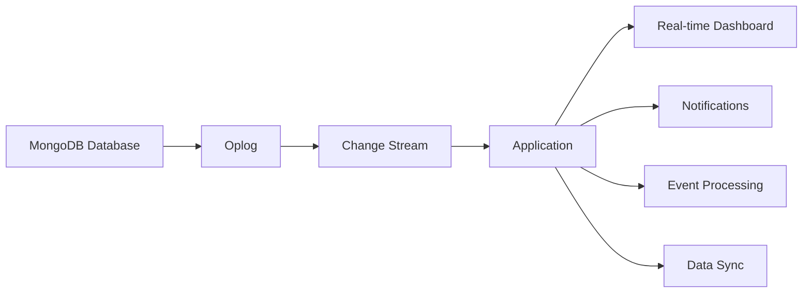

# How to Use MongoDB Change Streams

Author: [nawazdhandala](https://www.github.com/nawazdhandala)

Tags: MongoDB, Change Streams, Real-time, Event-driven, Database, Node.js

Description: Learn how to use MongoDB Change Streams to build real-time applications, implement event-driven architectures, and react to database changes instantly with practical code examples.

---

MongoDB Change Streams provide a powerful way to track real-time changes in your database without polling. They allow applications to react immediately to data modifications, making them perfect for real-time dashboards, notification systems, and event-driven architectures.

## What Are Change Streams?

Change Streams allow applications to access real-time data changes without the complexity of tailing the oplog. They provide a consistent view of changes as they occur, ordered by time, and can be resumed after failures.



## Prerequisites

Change Streams require:
- MongoDB 3.6 or later
- Replica set or sharded cluster deployment
- Majority read concern capability

## Basic Change Stream Usage

Here's how to set up a basic change stream in Node.js:

```javascript
const { MongoClient } = require('mongodb');

async function watchCollection() {
    const client = new MongoClient('mongodb://localhost:27017/?replicaSet=rs0');

    try {
        await client.connect();
        const db = client.db('myDatabase');
        const collection = db.collection('orders');

        // Create a change stream
        const changeStream = collection.watch();

        console.log('Watching for changes...');

        // Listen for changes
        changeStream.on('change', (change) => {
            console.log('Change detected:', JSON.stringify(change, null, 2));
        });

        changeStream.on('error', (error) => {
            console.error('Change stream error:', error);
        });

        // Keep the process running
        process.on('SIGINT', async () => {
            await changeStream.close();
            await client.close();
            process.exit(0);
        });

    } catch (error) {
        console.error('Connection error:', error);
    }
}

watchCollection();
```

## Change Event Types

MongoDB Change Streams emit different event types:

```javascript
const { MongoClient } = require('mongodb');

async function handleChangeTypes() {
    const client = new MongoClient('mongodb://localhost:27017/?replicaSet=rs0');
    await client.connect();

    const collection = client.db('myDatabase').collection('users');
    const changeStream = collection.watch([], { fullDocument: 'updateLookup' });

    changeStream.on('change', (change) => {
        switch (change.operationType) {
            case 'insert':
                console.log('New document inserted:');
                console.log('  ID:', change.documentKey._id);
                console.log('  Document:', change.fullDocument);
                break;

            case 'update':
                console.log('Document updated:');
                console.log('  ID:', change.documentKey._id);
                console.log('  Updated fields:', change.updateDescription.updatedFields);
                console.log('  Removed fields:', change.updateDescription.removedFields);
                console.log('  Full document:', change.fullDocument);
                break;

            case 'replace':
                console.log('Document replaced:');
                console.log('  ID:', change.documentKey._id);
                console.log('  New document:', change.fullDocument);
                break;

            case 'delete':
                console.log('Document deleted:');
                console.log('  ID:', change.documentKey._id);
                break;

            case 'drop':
                console.log('Collection dropped');
                break;

            case 'rename':
                console.log('Collection renamed to:', change.to.coll);
                break;

            case 'invalidate':
                console.log('Change stream invalidated');
                changeStream.close();
                break;

            default:
                console.log('Unknown operation:', change.operationType);
        }
    });
}
```

## Filtering Changes with Aggregation Pipeline

Use aggregation pipeline stages to filter which changes you receive:

```javascript
const { MongoClient } = require('mongodb');

async function filteredChangeStream() {
    const client = new MongoClient('mongodb://localhost:27017/?replicaSet=rs0');
    await client.connect();

    const collection = client.db('ecommerce').collection('orders');

    // Pipeline to filter changes
    const pipeline = [
        // Only watch for inserts and updates
        {
            $match: {
                operationType: { $in: ['insert', 'update'] }
            }
        },
        // Only watch for high-value orders
        {
            $match: {
                $or: [
                    { 'fullDocument.totalAmount': { $gt: 1000 } },
                    { 'updateDescription.updatedFields.status': 'shipped' }
                ]
            }
        },
        // Project only needed fields
        {
            $project: {
                operationType: 1,
                documentKey: 1,
                'fullDocument.orderId': 1,
                'fullDocument.totalAmount': 1,
                'fullDocument.status': 1,
                'updateDescription.updatedFields': 1
            }
        }
    ];

    const changeStream = collection.watch(pipeline, {
        fullDocument: 'updateLookup'
    });

    changeStream.on('change', (change) => {
        console.log('High-value order event:', change);
        // Trigger notification, update dashboard, etc.
    });
}
```

## Resumable Change Streams

Change Streams can be resumed after failures using resume tokens:

```javascript
const { MongoClient } = require('mongodb');
const fs = require('fs').promises;

class ResumableChangeStream {
    constructor(uri, dbName, collectionName) {
        this.uri = uri;
        this.dbName = dbName;
        this.collectionName = collectionName;
        this.resumeTokenFile = './resume-token.json';
        this.client = null;
        this.changeStream = null;
    }

    async start() {
        this.client = new MongoClient(this.uri);
        await this.client.connect();

        const collection = this.client.db(this.dbName).collection(this.collectionName);

        // Try to load saved resume token
        const resumeToken = await this.loadResumeToken();

        const options = {
            fullDocument: 'updateLookup'
        };

        if (resumeToken) {
            options.resumeAfter = resumeToken;
            console.log('Resuming from saved token');
        }

        this.changeStream = collection.watch([], options);

        this.changeStream.on('change', async (change) => {
            try {
                // Process the change
                await this.processChange(change);

                // Save resume token after successful processing
                await this.saveResumeToken(change._id);

            } catch (error) {
                console.error('Error processing change:', error);
            }
        });

        this.changeStream.on('error', async (error) => {
            console.error('Change stream error:', error);
            await this.restart();
        });

        console.log('Change stream started');
    }

    async processChange(change) {
        // Your business logic here
        console.log('Processing:', change.operationType, change.documentKey._id);
    }

    async loadResumeToken() {
        try {
            const data = await fs.readFile(this.resumeTokenFile, 'utf8');
            return JSON.parse(data);
        } catch (error) {
            return null;
        }
    }

    async saveResumeToken(token) {
        await fs.writeFile(this.resumeTokenFile, JSON.stringify(token));
    }

    async restart() {
        console.log('Restarting change stream...');
        if (this.changeStream) {
            await this.changeStream.close();
        }

        // Wait before reconnecting
        await new Promise(resolve => setTimeout(resolve, 5000));
        await this.start();
    }

    async stop() {
        if (this.changeStream) {
            await this.changeStream.close();
        }
        if (this.client) {
            await this.client.close();
        }
    }
}

// Usage
const watcher = new ResumableChangeStream(
    'mongodb://localhost:27017/?replicaSet=rs0',
    'myDatabase',
    'orders'
);

watcher.start();
```

## Database and Cluster Level Change Streams

Watch changes across an entire database or cluster:

```javascript
const { MongoClient } = require('mongodb');

async function watchDatabase() {
    const client = new MongoClient('mongodb://localhost:27017/?replicaSet=rs0');
    await client.connect();

    const db = client.db('myDatabase');

    // Watch entire database
    const dbChangeStream = db.watch();

    dbChangeStream.on('change', (change) => {
        console.log(`[${change.ns.coll}] ${change.operationType}:`, change.documentKey);
    });
}

async function watchCluster() {
    const client = new MongoClient('mongodb://localhost:27017/?replicaSet=rs0');
    await client.connect();

    // Watch entire cluster
    const clusterChangeStream = client.watch();

    clusterChangeStream.on('change', (change) => {
        console.log(`[${change.ns.db}.${change.ns.coll}] ${change.operationType}`);
    });
}
```

## Real-time Notification System

Build a real-time notification system using Change Streams:

```javascript
const { MongoClient } = require('mongodb');
const EventEmitter = require('events');

class NotificationService extends EventEmitter {
    constructor(mongoUri) {
        super();
        this.mongoUri = mongoUri;
        this.client = null;
        this.streams = new Map();
    }

    async connect() {
        this.client = new MongoClient(this.mongoUri);
        await this.client.connect();
        console.log('Notification service connected');
    }

    watchOrderUpdates() {
        const collection = this.client.db('ecommerce').collection('orders');

        const pipeline = [
            {
                $match: {
                    'updateDescription.updatedFields.status': { $exists: true }
                }
            }
        ];

        const changeStream = collection.watch(pipeline, {
            fullDocument: 'updateLookup'
        });

        changeStream.on('change', (change) => {
            const order = change.fullDocument;
            const newStatus = change.updateDescription.updatedFields.status;

            this.emit('orderStatusChanged', {
                orderId: order.orderId,
                customerId: order.customerId,
                status: newStatus,
                timestamp: new Date()
            });
        });

        this.streams.set('orders', changeStream);
    }

    watchInventoryAlerts() {
        const collection = this.client.db('ecommerce').collection('inventory');

        const pipeline = [
            {
                $match: {
                    operationType: 'update',
                    'fullDocument.quantity': { $lt: 10 }
                }
            }
        ];

        const changeStream = collection.watch(pipeline, {
            fullDocument: 'updateLookup'
        });

        changeStream.on('change', (change) => {
            const item = change.fullDocument;

            this.emit('lowInventory', {
                productId: item.productId,
                productName: item.name,
                currentQuantity: item.quantity,
                timestamp: new Date()
            });
        });

        this.streams.set('inventory', changeStream);
    }

    async close() {
        for (const [name, stream] of this.streams) {
            await stream.close();
            console.log(`Closed ${name} change stream`);
        }
        await this.client.close();
    }
}

// Usage
async function main() {
    const notificationService = new NotificationService(
        'mongodb://localhost:27017/?replicaSet=rs0'
    );

    await notificationService.connect();

    // Set up event handlers
    notificationService.on('orderStatusChanged', (event) => {
        console.log('Order status changed:', event);
        // Send push notification, email, etc.
    });

    notificationService.on('lowInventory', (event) => {
        console.log('Low inventory alert:', event);
        // Alert inventory team
    });

    // Start watching
    notificationService.watchOrderUpdates();
    notificationService.watchInventoryAlerts();

    console.log('Notification service running...');
}

main();
```

## Data Synchronization Between Systems

Use Change Streams for data synchronization:

```javascript
const { MongoClient } = require('mongodb');

class DataSyncService {
    constructor(sourceUri, targetUri) {
        this.sourceUri = sourceUri;
        this.targetUri = targetUri;
        this.sourceClient = null;
        this.targetClient = null;
    }

    async connect() {
        this.sourceClient = new MongoClient(this.sourceUri);
        this.targetClient = new MongoClient(this.targetUri);

        await Promise.all([
            this.sourceClient.connect(),
            this.targetClient.connect()
        ]);
    }

    async syncCollection(dbName, collectionName) {
        const sourceCollection = this.sourceClient.db(dbName).collection(collectionName);
        const targetCollection = this.targetClient.db(dbName).collection(collectionName);

        const changeStream = sourceCollection.watch([], {
            fullDocument: 'updateLookup'
        });

        changeStream.on('change', async (change) => {
            try {
                switch (change.operationType) {
                    case 'insert':
                        await targetCollection.insertOne(change.fullDocument);
                        console.log(`Synced insert: ${change.documentKey._id}`);
                        break;

                    case 'update':
                    case 'replace':
                        await targetCollection.replaceOne(
                            { _id: change.documentKey._id },
                            change.fullDocument,
                            { upsert: true }
                        );
                        console.log(`Synced update: ${change.documentKey._id}`);
                        break;

                    case 'delete':
                        await targetCollection.deleteOne({ _id: change.documentKey._id });
                        console.log(`Synced delete: ${change.documentKey._id}`);
                        break;
                }
            } catch (error) {
                console.error('Sync error:', error);
            }
        });

        console.log(`Syncing ${dbName}.${collectionName}`);
    }
}
```

## Performance Considerations

```javascript
// Batch processing for high-throughput scenarios
const { MongoClient } = require('mongodb');

class BatchProcessor {
    constructor(uri, batchSize = 100, flushInterval = 1000) {
        this.uri = uri;
        this.batchSize = batchSize;
        this.flushInterval = flushInterval;
        this.batch = [];
        this.client = null;
    }

    async start() {
        this.client = new MongoClient(this.uri);
        await this.client.connect();

        const collection = this.client.db('analytics').collection('events');
        const changeStream = collection.watch();

        // Set up periodic flush
        this.flushTimer = setInterval(() => this.flush(), this.flushInterval);

        changeStream.on('change', (change) => {
            this.batch.push(change);

            if (this.batch.length >= this.batchSize) {
                this.flush();
            }
        });
    }

    async flush() {
        if (this.batch.length === 0) return;

        const toProcess = this.batch.splice(0, this.batch.length);

        // Process batch
        console.log(`Processing batch of ${toProcess.length} changes`);

        // Your batch processing logic here
        await this.processBatch(toProcess);
    }

    async processBatch(changes) {
        // Group by operation type
        const inserts = changes.filter(c => c.operationType === 'insert');
        const updates = changes.filter(c => c.operationType === 'update');
        const deletes = changes.filter(c => c.operationType === 'delete');

        console.log(`Batch: ${inserts.length} inserts, ${updates.length} updates, ${deletes.length} deletes`);
    }
}
```

## Conclusion

MongoDB Change Streams provide a robust foundation for building real-time applications. They eliminate the need for polling, reduce latency, and provide a clean API for reacting to database changes. Whether you're building notification systems, real-time dashboards, or data synchronization pipelines, Change Streams offer a reliable and efficient solution. Remember to implement proper resume token handling for production environments to ensure no changes are missed during application restarts or failures.
