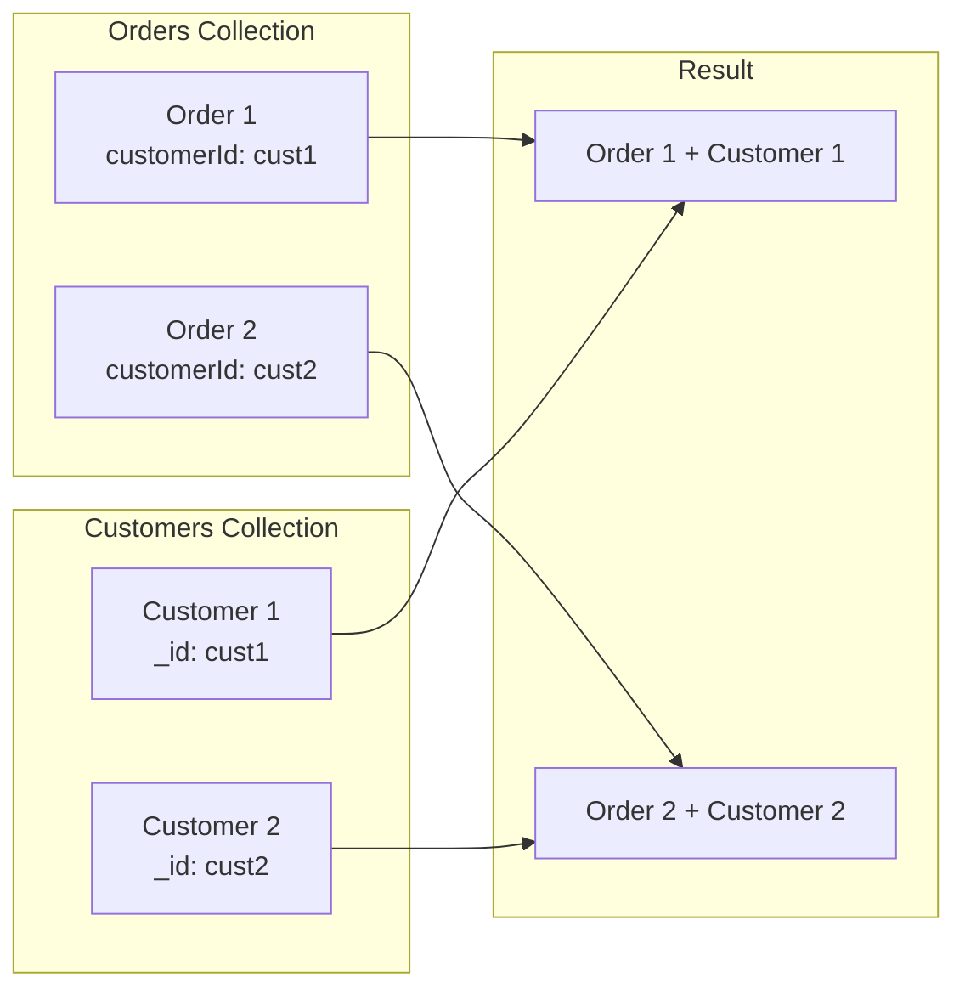
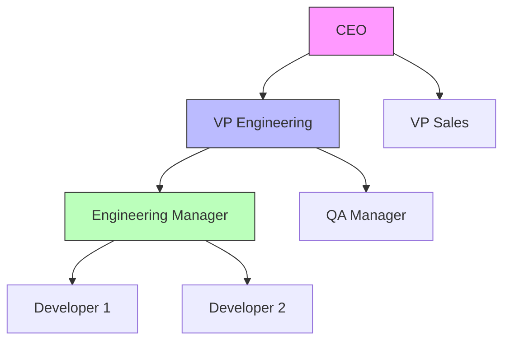

# How to Combine Multiple Collections in MongoDB

Author: [nawazdhandala](https://www.github.com/nawazdhandala)

Tags: MongoDB, Database, Aggregation, $lookup, Data Modeling

Description: Master techniques to combine data from multiple MongoDB collections using $lookup, $unionWith, and other aggregation operators. Learn join patterns, performance optimization, and when to denormalize instead.

---

While MongoDB is designed around embedded documents, real-world applications often require combining data from multiple collections. MongoDB provides powerful aggregation operators for this purpose. This guide covers all the techniques you need to join, merge, and combine collections effectively.

## Basic $lookup - Left Outer Join

The `$lookup` stage performs a left outer join between two collections, similar to SQL's LEFT JOIN.

```javascript
// Orders collection
{
  _id: ObjectId("order1"),
  customerId: ObjectId("cust1"),
  items: ["Widget", "Gadget"],
  total: 150.00
}

// Customers collection
{
  _id: ObjectId("cust1"),
  name: "John Doe",
  email: "john@example.com"
}

// Join orders with customer data
db.orders.aggregate([
  {
    $lookup: {
      from: "customers",           // Collection to join
      localField: "customerId",    // Field from orders
      foreignField: "_id",         // Field from customers
      as: "customer"               // Output array field
    }
  }
]);

// Result:
{
  _id: ObjectId("order1"),
  customerId: ObjectId("cust1"),
  items: ["Widget", "Gadget"],
  total: 150.00,
  customer: [{
    _id: ObjectId("cust1"),
    name: "John Doe",
    email: "john@example.com"
  }]
}
```



### Unwinding the Joined Array

Since `$lookup` produces an array, use `$unwind` to flatten it to a single document.

```javascript
db.orders.aggregate([
  {
    $lookup: {
      from: "customers",
      localField: "customerId",
      foreignField: "_id",
      as: "customer"
    }
  },
  {
    $unwind: {
      path: "$customer",
      preserveNullAndEmptyArrays: true  // Keep orders without customers
    }
  }
]);

// Result - customer is now an object, not array:
{
  _id: ObjectId("order1"),
  customerId: ObjectId("cust1"),
  total: 150.00,
  customer: {
    _id: ObjectId("cust1"),
    name: "John Doe"
  }
}
```

## Pipeline $lookup - Advanced Joins

The pipeline form of `$lookup` allows complex join conditions and transformations.

```javascript
// Find orders with products that are in stock
db.orders.aggregate([
  {
    $lookup: {
      from: "products",
      let: { orderItems: "$itemIds" },  // Variables from orders
      pipeline: [
        {
          $match: {
            $expr: {
              $and: [
                { $in: ["$_id", "$$orderItems"] },  // Match by ID
                { $gt: ["$stock", 0] }              // Only in-stock items
              ]
            }
          }
        },
        {
          $project: {
            name: 1,
            price: 1,
            stock: 1
          }
        }
      ],
      as: "availableProducts"
    }
  }
]);
```

### Correlated Subqueries

```javascript
// Find customers with their recent orders (last 30 days)
db.customers.aggregate([
  {
    $lookup: {
      from: "orders",
      let: { customerId: "$_id" },
      pipeline: [
        {
          $match: {
            $expr: {
              $and: [
                { $eq: ["$customerId", "$$customerId"] },
                { $gte: ["$orderDate", new Date(Date.now() - 30*24*60*60*1000)] }
              ]
            }
          }
        },
        { $sort: { orderDate: -1 } },
        { $limit: 5 }
      ],
      as: "recentOrders"
    }
  }
]);
```

## Multiple Collection Joins

Chain multiple `$lookup` stages to join more than two collections.

```javascript
// Join orders -> customers -> addresses
db.orders.aggregate([
  // First lookup: orders -> customers
  {
    $lookup: {
      from: "customers",
      localField: "customerId",
      foreignField: "_id",
      as: "customer"
    }
  },
  { $unwind: "$customer" },

  // Second lookup: customers -> addresses
  {
    $lookup: {
      from: "addresses",
      localField: "customer.addressId",
      foreignField: "_id",
      as: "shippingAddress"
    }
  },
  { $unwind: "$shippingAddress" },

  // Third lookup: orders -> products
  {
    $lookup: {
      from: "products",
      localField: "productIds",
      foreignField: "_id",
      as: "products"
    }
  },

  // Shape the final output
  {
    $project: {
      orderNumber: 1,
      customerName: "$customer.name",
      shippingCity: "$shippingAddress.city",
      products: "$products.name",
      total: 1
    }
  }
]);
```

## Union Collections with $unionWith

The `$unionWith` stage combines documents from multiple collections into a single result set.

```javascript
// Combine archived and current orders
db.orders.aggregate([
  { $match: { status: "completed" } },
  {
    $unionWith: {
      coll: "archivedOrders",
      pipeline: [
        { $match: { status: "completed" } }
      ]
    }
  },
  { $sort: { orderDate: -1 } }
]);
```

### Union Multiple Collections

```javascript
// Aggregate events from multiple sources
db.userEvents.aggregate([
  { $project: { type: 1, userId: 1, timestamp: 1, source: { $literal: "user" } } },
  {
    $unionWith: {
      coll: "systemEvents",
      pipeline: [
        { $project: { type: 1, userId: 1, timestamp: 1, source: { $literal: "system" } } }
      ]
    }
  },
  {
    $unionWith: {
      coll: "adminEvents",
      pipeline: [
        { $project: { type: 1, userId: 1, timestamp: 1, source: { $literal: "admin" } } }
      ]
    }
  },
  { $sort: { timestamp: -1 } },
  { $limit: 100 }
]);
```

## Self-Joins

Join a collection with itself for hierarchical or graph-like data.

```javascript
// Employees with their managers
db.employees.aggregate([
  {
    $lookup: {
      from: "employees",  // Same collection
      localField: "managerId",
      foreignField: "_id",
      as: "manager"
    }
  },
  { $unwind: { path: "$manager", preserveNullAndEmptyArrays: true } },
  {
    $project: {
      name: 1,
      title: 1,
      managerName: "$manager.name"
    }
  }
]);
```

### Recursive Lookups with $graphLookup

For tree structures, use `$graphLookup` for recursive joins.

```javascript
// Find all reports (direct and indirect) for a manager
db.employees.aggregate([
  { $match: { _id: ObjectId("manager1") } },
  {
    $graphLookup: {
      from: "employees",
      startWith: "$_id",
      connectFromField: "_id",
      connectToField: "managerId",
      as: "allReports",
      maxDepth: 5,
      depthField: "level"
    }
  }
]);

// Find the management chain for an employee
db.employees.aggregate([
  { $match: { name: "John Developer" } },
  {
    $graphLookup: {
      from: "employees",
      startWith: "$managerId",
      connectFromField: "managerId",
      connectToField: "_id",
      as: "managementChain",
      depthField: "level"
    }
  }
]);
```



## Performance Optimization

### Indexing for $lookup

```javascript
// Index the foreign field for faster lookups
db.customers.createIndex({ _id: 1 });  // Usually exists
db.orders.createIndex({ customerId: 1 });  // Add this!

// For pipeline lookups with complex conditions
db.products.createIndex({ categoryId: 1, stock: 1 });
```

### Limit Before Lookup

Always filter and limit before expensive `$lookup` operations.

```javascript
// Good: Filter first, then lookup
db.orders.aggregate([
  { $match: { status: "pending", createdAt: { $gte: lastWeek } } },
  { $limit: 100 },
  {
    $lookup: {
      from: "customers",
      localField: "customerId",
      foreignField: "_id",
      as: "customer"
    }
  }
]);

// Bad: Lookup all, then filter
db.orders.aggregate([
  {
    $lookup: {
      from: "customers",
      localField: "customerId",
      foreignField: "_id",
      as: "customer"
    }
  },
  { $match: { status: "pending" } }  // Too late!
]);
```

### Use Pipeline Lookup with $limit

```javascript
// Limit results within the lookup pipeline
db.users.aggregate([
  {
    $lookup: {
      from: "posts",
      let: { userId: "$_id" },
      pipeline: [
        { $match: { $expr: { $eq: ["$authorId", "$$userId"] } } },
        { $sort: { createdAt: -1 } },
        { $limit: 5 },  // Only get 5 most recent posts
        { $project: { title: 1, createdAt: 1 } }
      ],
      as: "recentPosts"
    }
  }
]);
```

## Practical Patterns

### Pattern 1: E-commerce Order Details

```javascript
async function getOrderDetails(orderId) {
  const result = await db.collection('orders').aggregate([
    { $match: { _id: ObjectId(orderId) } },

    // Get customer info
    {
      $lookup: {
        from: "customers",
        localField: "customerId",
        foreignField: "_id",
        as: "customer"
      }
    },

    // Get product details
    {
      $lookup: {
        from: "products",
        localField: "items.productId",
        foreignField: "_id",
        as: "productDetails"
      }
    },

    // Get shipping info
    {
      $lookup: {
        from: "shipments",
        localField: "_id",
        foreignField: "orderId",
        as: "shipment"
      }
    },

    { $unwind: { path: "$customer", preserveNullAndEmptyArrays: true } },
    { $unwind: { path: "$shipment", preserveNullAndEmptyArrays: true } },

    {
      $project: {
        orderNumber: 1,
        status: 1,
        total: 1,
        customerName: "$customer.name",
        customerEmail: "$customer.email",
        products: "$productDetails",
        trackingNumber: "$shipment.trackingNumber",
        estimatedDelivery: "$shipment.estimatedDelivery"
      }
    }
  ]).toArray();

  return result[0];
}
```

### Pattern 2: Social Feed with Interactions

```javascript
// Get posts with author info and engagement stats
db.posts.aggregate([
  { $match: { createdAt: { $gte: lastWeek } } },
  { $sort: { createdAt: -1 } },
  { $limit: 20 },

  // Get author details
  {
    $lookup: {
      from: "users",
      localField: "authorId",
      foreignField: "_id",
      pipeline: [
        { $project: { name: 1, avatar: 1 } }
      ],
      as: "author"
    }
  },
  { $unwind: "$author" },

  // Get comment count
  {
    $lookup: {
      from: "comments",
      localField: "_id",
      foreignField: "postId",
      pipeline: [
        { $count: "total" }
      ],
      as: "commentStats"
    }
  },

  // Get like count
  {
    $lookup: {
      from: "likes",
      localField: "_id",
      foreignField: "postId",
      pipeline: [
        { $count: "total" }
      ],
      as: "likeStats"
    }
  },

  {
    $project: {
      title: 1,
      content: 1,
      createdAt: 1,
      author: 1,
      commentCount: { $ifNull: [{ $first: "$commentStats.total" }, 0] },
      likeCount: { $ifNull: [{ $first: "$likeStats.total" }, 0] }
    }
  }
]);
```

## When to Denormalize Instead

Sometimes, embedding data is better than joining at query time.

```javascript
// Instead of joining every time...
// Embed frequently accessed data
{
  _id: ObjectId("order1"),
  customerId: ObjectId("cust1"),
  customerName: "John Doe",           // Denormalized
  customerEmail: "john@example.com",  // Denormalized
  items: [
    {
      productId: ObjectId("prod1"),
      productName: "Widget",          // Denormalized
      price: 29.99                    // Denormalized at order time
    }
  ]
}
```

| Scenario | Approach |
|----------|----------|
| Data rarely changes | Embed/Denormalize |
| Need real-time accuracy | Use $lookup |
| High read, low write | Embed/Denormalize |
| Complex reporting | Use $lookup |
| Mobile/bandwidth constrained | Embed to reduce queries |

---

MongoDB provides robust tools for combining collections through `$lookup`, `$unionWith`, and `$graphLookup`. While joins are powerful, they come with performance costs. Design your schema to minimize joins for frequent queries, use proper indexes on join fields, and consider denormalization for read-heavy workloads. The aggregation pipeline gives you the flexibility to shape your data exactly as your application needs it.
