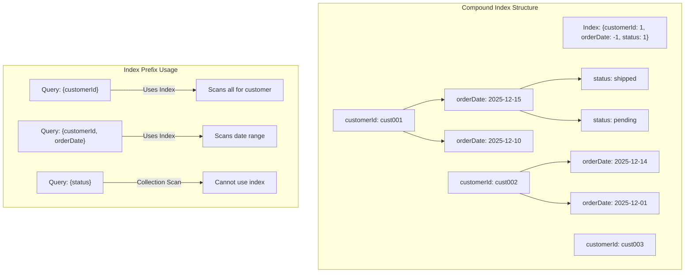

# How to Use MongoDB Compound Indexes

Author: [nawazdhandala](https://www.github.com/nawazdhandala)

Tags: MongoDB, Database, Indexes, Performance, Query Optimization

Description: Master MongoDB compound indexes to dramatically improve query performance. Learn index key ordering, the ESR rule, covered queries, and practical patterns for real-world applications.

---

Compound indexes are one of the most powerful tools for MongoDB query optimization. A single well-designed compound index can satisfy multiple query patterns and eliminate the need for separate single-field indexes. Understanding how to design and use them effectively is essential for any MongoDB application.

## What Are Compound Indexes?

A compound index contains multiple fields in a specific order. MongoDB can use the index for queries that include the index prefix - the leftmost fields in the index definition.

```javascript
// Create a compound index
db.orders.createIndex({ customerId: 1, orderDate: -1, status: 1 });

// This single index supports all these queries:
db.orders.find({ customerId: "cust123" });
db.orders.find({ customerId: "cust123", orderDate: { $gte: startDate } });
db.orders.find({ customerId: "cust123", orderDate: { $gte: startDate }, status: "shipped" });

// But NOT this query (missing the prefix):
db.orders.find({ status: "shipped" });  // Cannot use the index
```



## The ESR Rule: Equality, Sort, Range

The most important principle for compound index design is the ESR rule. Order your index fields:

1. **Equality** fields first - exact match conditions
2. **Sort** fields next - fields used in sort operations
3. **Range** fields last - operators like $gt, $lt, $in

```javascript
// Query pattern:
// Find active orders for a customer, sorted by date, in a price range
db.orders.find({
  customerId: "cust123",      // Equality
  status: "active",           // Equality
  price: { $gte: 100, $lte: 500 }  // Range
}).sort({ orderDate: -1 });    // Sort

// Optimal index following ESR rule:
db.orders.createIndex({
  customerId: 1,    // E - Equality
  status: 1,        // E - Equality
  orderDate: -1,    // S - Sort
  price: 1          // R - Range
});
```

### Why ESR Matters

```javascript
// BAD: Range before Sort
db.orders.createIndex({ customerId: 1, price: 1, orderDate: -1 });
// MongoDB must scan all matching prices, then sort in memory

// GOOD: Sort before Range
db.orders.createIndex({ customerId: 1, orderDate: -1, price: 1 });
// MongoDB returns documents already sorted, filters on price
```

## Practical Compound Index Patterns

### Pattern 1: User Activity Queries

```javascript
// Common queries:
// 1. All activity for a user
// 2. User activity in a time range
// 3. User activity of a specific type in a time range

db.activities.createIndex({
  userId: 1,
  timestamp: -1,
  activityType: 1
});

// Query 1: All user activity
db.activities.find({ userId: "user123" })
  .sort({ timestamp: -1 })
  .limit(50);

// Query 2: User activity in time range
db.activities.find({
  userId: "user123",
  timestamp: { $gte: startDate, $lte: endDate }
}).sort({ timestamp: -1 });

// Query 3: Specific activity type
db.activities.find({
  userId: "user123",
  timestamp: { $gte: startDate },
  activityType: "login"
}).sort({ timestamp: -1 });
```

### Pattern 2: E-commerce Product Catalog

```javascript
// Queries:
// 1. Products by category, sorted by popularity
// 2. Products by category and price range
// 3. Products by category, brand, and price

db.products.createIndex({
  category: 1,
  brand: 1,
  price: 1,
  popularityScore: -1
});

// Query with category and brand
db.products.find({
  category: "electronics",
  brand: "Samsung"
}).sort({ popularityScore: -1 }).limit(20);

// Query with price range
db.products.find({
  category: "electronics",
  brand: "Samsung",
  price: { $gte: 100, $lte: 1000 }
}).sort({ popularityScore: -1 });
```

### Pattern 3: Geospatial with Filters

```javascript
// Combine 2dsphere with compound fields
db.stores.createIndex({
  isOpen: 1,
  category: 1,
  location: "2dsphere"
});

// Find open coffee shops near a location
db.stores.find({
  isOpen: true,
  category: "coffee",
  location: {
    $near: {
      $geometry: { type: "Point", coordinates: [-73.97, 40.77] },
      $maxDistance: 1000
    }
  }
});
```

### Pattern 4: Multi-tenant Applications

```javascript
// Always include tenant ID as first field
db.documents.createIndex({
  tenantId: 1,
  folderId: 1,
  createdAt: -1
});

db.documents.createIndex({
  tenantId: 1,
  tags: 1,
  createdAt: -1
});

// All tenant queries use the index prefix
db.documents.find({
  tenantId: "tenant123",
  folderId: "folder456"
}).sort({ createdAt: -1 });
```

## Index Intersection vs Compound Indexes

MongoDB can combine multiple single-field indexes (index intersection), but compound indexes are usually more efficient.

```javascript
// Two single-field indexes
db.orders.createIndex({ customerId: 1 });
db.orders.createIndex({ status: 1 });

// MongoDB might intersect these for:
db.orders.find({ customerId: "cust123", status: "shipped" });

// But a compound index is more efficient:
db.orders.createIndex({ customerId: 1, status: 1 });
```

### When to Use Each

```javascript
// Use compound index when:
// - Queries consistently use multiple fields together
// - You need sorted results
// - You want covered queries

// Use separate indexes when:
// - Queries use fields independently
// - Storage space is very limited
// - Write performance is critical
```

## Analyzing Index Usage

Use `explain()` to verify your indexes are used correctly:

```javascript
// Check query execution
const explanation = db.orders.find({
  customerId: "cust123",
  orderDate: { $gte: new Date("2025-01-01") }
}).sort({ orderDate: -1 }).explain("executionStats");

console.log("Index used:", explanation.queryPlanner.winningPlan.inputStage.indexName);
console.log("Documents examined:", explanation.executionStats.totalDocsExamined);
console.log("Keys examined:", explanation.executionStats.totalKeysExamined);
console.log("Documents returned:", explanation.executionStats.nReturned);

// Ideal: keysExamined ~= docsExamined ~= nReturned
```

## Covered Queries with Compound Indexes

A covered query returns results directly from the index without accessing documents. This is the fastest possible query.

```javascript
// Index covers these fields
db.users.createIndex({
  email: 1,
  firstName: 1,
  lastName: 1,
  status: 1
});

// Covered query - only returns indexed fields
db.users.find(
  { email: "user@example.com" },
  { _id: 0, firstName: 1, lastName: 1, status: 1 }  // Projection
);

// Verify it's covered
const explain = db.users.find(
  { email: "user@example.com" },
  { _id: 0, firstName: 1, lastName: 1, status: 1 }
).explain("executionStats");

// totalDocsExamined should be 0 for covered queries
console.log("Docs examined:", explain.executionStats.totalDocsExamined);
```

## Index Direction Matters for Sorts

```javascript
// Index with specific directions
db.orders.createIndex({ customerId: 1, orderDate: -1 });

// These sorts are efficient:
db.orders.find({ customerId: "cust123" }).sort({ orderDate: -1 });  // Uses index
db.orders.find({ customerId: "cust123" }).sort({ orderDate: 1 });   // Uses index (reverse)

// For compound sorts, direction combinations matter:
db.orders.createIndex({ fieldA: 1, fieldB: -1 });

// Efficient sorts:
db.orders.find().sort({ fieldA: 1, fieldB: -1 });   // Matches index
db.orders.find().sort({ fieldA: -1, fieldB: 1 });   // Reverse of index

// Inefficient (cannot use index for sort):
db.orders.find().sort({ fieldA: 1, fieldB: 1 });    // Mixed directions
```

## Common Mistakes to Avoid

### 1. Too Many Single-Field Indexes

```javascript
// Inefficient: Many single indexes
db.orders.createIndex({ customerId: 1 });
db.orders.createIndex({ orderDate: 1 });
db.orders.createIndex({ status: 1 });
db.orders.createIndex({ total: 1 });

// Better: Strategic compound indexes
db.orders.createIndex({ customerId: 1, orderDate: -1 });
db.orders.createIndex({ status: 1, orderDate: -1 });
```

### 2. Wrong Field Order

```javascript
// If most queries filter by status first
// BAD
db.orders.createIndex({ orderDate: 1, status: 1 });

// GOOD
db.orders.createIndex({ status: 1, orderDate: -1 });
```

### 3. Ignoring Cardinality

Place high-cardinality fields (more unique values) before low-cardinality fields:

```javascript
// status has 5 values, customerId has millions
// BAD: Low cardinality first
db.orders.createIndex({ status: 1, customerId: 1 });

// GOOD: High cardinality first (for equality matches)
db.orders.createIndex({ customerId: 1, status: 1 });
```

### 4. Redundant Indexes

```javascript
// This index:
db.orders.createIndex({ customerId: 1, status: 1, orderDate: -1 });

// Makes this one redundant:
db.orders.createIndex({ customerId: 1 });  // Already covered by prefix

// Also redundant:
db.orders.createIndex({ customerId: 1, status: 1 });  // Already covered
```

## Index Maintenance Script

```javascript
// Find potentially redundant indexes
function findRedundantIndexes(collectionName) {
  const indexes = db[collectionName].getIndexes();
  const redundant = [];

  for (let i = 0; i < indexes.length; i++) {
    for (let j = 0; j < indexes.length; j++) {
      if (i === j) continue;

      const keysI = Object.keys(indexes[i].key);
      const keysJ = Object.keys(indexes[j].key);

      // Check if index i is a prefix of index j
      if (keysI.length < keysJ.length) {
        const isPrefix = keysI.every((key, idx) =>
          keysJ[idx] === key &&
          indexes[i].key[key] === indexes[j].key[key]
        );

        if (isPrefix) {
          redundant.push({
            redundantIndex: indexes[i].name,
            coveredBy: indexes[j].name
          });
        }
      }
    }
  }

  return redundant;
}

// Usage
findRedundantIndexes("orders");
```

## Summary

Compound indexes are essential for MongoDB performance:

1. **Follow the ESR rule** - Equality, Sort, Range
2. **Consider query patterns** - Design indexes around your actual queries
3. **Use explain()** - Verify indexes are used correctly
4. **Aim for covered queries** - Include projected fields in the index
5. **Watch direction** - Match sort directions for efficient sorting
6. **Avoid redundancy** - Remove indexes covered by compound index prefixes

A well-designed compound index can replace multiple single-field indexes while providing better performance and lower storage overhead.
