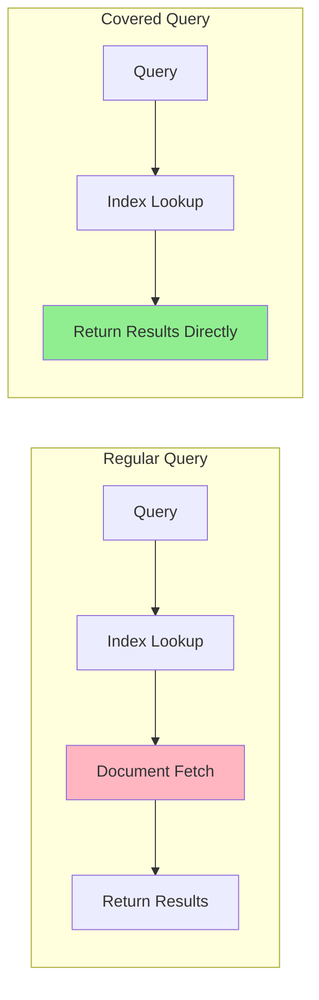

# How to Use MongoDB Covered Queries

Author: [nawazdhandala](https://www.github.com/nawazdhandala)

Tags: MongoDB, Database, Performance, Query Optimization, Indexes

Description: Learn how to use MongoDB covered queries to achieve maximum query performance by returning results directly from indexes without accessing documents, with practical examples and optimization techniques.

---

Covered queries are the fastest type of query in MongoDB. When a query is "covered," MongoDB returns results directly from the index without ever reading the actual documents. This eliminates disk I/O for document retrieval, dramatically improving performance for read-heavy workloads.

## What Makes a Query Covered?

A query is covered when:

1. All fields in the query filter are part of the index
2. All fields in the projection are part of the index
3. No fields in the projection require document access
4. The `_id` field is excluded from projection (unless indexed)



## Creating Covered Queries

### Basic Covered Query Example

```javascript
// Create an index that covers the query
db.users.createIndex({
  email: 1,
  firstName: 1,
  lastName: 1,
  status: 1
});

// Covered query - all fields from index
const users = await db.users.find(
  { email: "user@example.com" },         // Query uses indexed field
  { _id: 0, firstName: 1, lastName: 1 }  // Projection only includes indexed fields
).toArray();

// Verify it's covered
const explain = db.users.find(
  { email: "user@example.com" },
  { _id: 0, firstName: 1, lastName: 1 }
).explain("executionStats");

console.log("Total docs examined:", explain.executionStats.totalDocsExamined);
// Should be 0 for covered query
```

### Verify a Query is Covered

```javascript
function isQueryCovered(explainResult) {
  const stats = explainResult.executionStats;

  // A covered query examines 0 documents
  if (stats.totalDocsExamined === 0 && stats.nReturned > 0) {
    return true;
  }

  // Check for IXSCAN with no FETCH stage
  const plan = explainResult.queryPlanner.winningPlan;
  return checkPlanForCovered(plan);
}

function checkPlanForCovered(plan) {
  // If we see FETCH, it's not covered
  if (plan.stage === 'FETCH') {
    return false;
  }

  // IXSCAN without FETCH is covered
  if (plan.stage === 'IXSCAN') {
    return true;
  }

  // Check input stages
  if (plan.inputStage) {
    return checkPlanForCovered(plan.inputStage);
  }

  return false;
}

// Usage
const explain = db.users.find(
  { email: "test@example.com" },
  { _id: 0, email: 1, firstName: 1 }
).explain("executionStats");

console.log("Query is covered:", isQueryCovered(explain));
```

## Practical Covered Query Patterns

### Pattern 1: User Lookup by Email

```javascript
// Index for email lookups
db.users.createIndex({
  email: 1,
  displayName: 1,
  avatarUrl: 1,
  status: 1
});

// Covered query for user preview
async function getUserPreview(email) {
  return await db.users.findOne(
    { email: email },
    {
      _id: 0,
      email: 1,
      displayName: 1,
      avatarUrl: 1,
      status: 1
    }
  );
}

// Returns user info without document access
const preview = await getUserPreview("john@example.com");
```

### Pattern 2: Product Listing

```javascript
// Index for product listings
db.products.createIndex({
  category: 1,
  status: 1,
  name: 1,
  price: 1,
  thumbnailUrl: 1
});

// Covered query for category listing
async function getProductListing(category, page = 1, limit = 20) {
  return await db.products.find(
    { category: category, status: "active" },
    {
      _id: 0,
      name: 1,
      price: 1,
      thumbnailUrl: 1
    }
  )
  .sort({ name: 1 })
  .skip((page - 1) * limit)
  .limit(limit)
  .toArray();
}
```

### Pattern 3: Search Autocomplete

```javascript
// Index for autocomplete
db.searchTerms.createIndex({
  prefix: 1,
  term: 1,
  popularity: -1
});

// Covered autocomplete query
async function getAutocompleteSuggestions(prefix, limit = 10) {
  return await db.searchTerms.find(
    { prefix: prefix.toLowerCase().slice(0, 3) },
    { _id: 0, term: 1 }
  )
  .sort({ popularity: -1 })
  .limit(limit)
  .toArray();
}
```

### Pattern 4: Metrics and Counts

```javascript
// Index for metrics queries
db.events.createIndex({
  eventType: 1,
  timestamp: 1,
  userId: 1
});

// Covered count query
async function getEventCount(eventType, startDate, endDate) {
  // Count queries can be covered too
  return await db.events.countDocuments({
    eventType: eventType,
    timestamp: { $gte: startDate, $lte: endDate }
  });
}

// Covered distinct query (returns unique userIds from index)
async function getUniqueUsers(eventType, startDate, endDate) {
  return await db.events.distinct("userId", {
    eventType: eventType,
    timestamp: { $gte: startDate, $lte: endDate }
  });
}
```

### Pattern 5: Existence Checks

```javascript
// Index for existence checks
db.reservations.createIndex({
  resourceId: 1,
  startTime: 1,
  endTime: 1
});

// Covered existence check
async function hasConflictingReservation(resourceId, startTime, endTime) {
  const conflict = await db.reservations.findOne(
    {
      resourceId: resourceId,
      startTime: { $lt: endTime },
      endTime: { $gt: startTime }
    },
    { _id: 0, resourceId: 1 }  // Only need to know if it exists
  );

  return conflict !== null;
}
```

## The _id Field Challenge

By default, MongoDB includes `_id` in results. Since `_id` might not be in your index, you must exclude it:

```javascript
// NOT covered - _id is returned but not in index
db.users.find(
  { email: "user@example.com" },
  { firstName: 1, lastName: 1 }  // _id included by default
);

// Covered - explicitly exclude _id
db.users.find(
  { email: "user@example.com" },
  { _id: 0, firstName: 1, lastName: 1 }
);

// Alternative: Include _id in the index
db.users.createIndex({ email: 1, _id: 1, firstName: 1, lastName: 1 });

// Now this is covered
db.users.find(
  { email: "user@example.com" },
  { _id: 1, firstName: 1, lastName: 1 }
);
```

## Covered Queries with Sorting

Sorts can also be covered if the sort field is in the index:

```javascript
// Index with sort field included
db.orders.createIndex({
  customerId: 1,
  orderDate: -1,
  orderId: 1,
  total: 1
});

// Covered query with sort
const orders = await db.orders.find(
  { customerId: "cust123" },
  { _id: 0, orderId: 1, orderDate: 1, total: 1 }
)
.sort({ orderDate: -1 })
.limit(10)
.toArray();
```

## Aggregation Pipeline Covered Queries

Aggregations can also be covered with careful stage design:

```javascript
// Index
db.transactions.createIndex({
  accountId: 1,
  date: 1,
  amount: 1,
  type: 1
});

// Covered aggregation
const result = await db.transactions.aggregate([
  {
    $match: {
      accountId: "acc123",
      date: { $gte: startDate, $lte: endDate }
    }
  },
  {
    $project: {
      _id: 0,
      date: 1,
      amount: 1,
      type: 1
    }
  },
  {
    $group: {
      _id: "$type",
      total: { $sum: "$amount" },
      count: { $sum: 1 }
    }
  }
]).toArray();
```

## Limitations of Covered Queries

### 1. Array Fields Break Coverage

```javascript
// Index on array field
db.posts.createIndex({ tags: 1, title: 1 });

// NOT covered - multikey indexes require document access
db.posts.find(
  { tags: "mongodb" },
  { _id: 0, title: 1 }
);
```

### 2. Embedded Documents Need Full Path

```javascript
// Index
db.users.createIndex({ "address.city": 1, "address.country": 1, name: 1 });

// Covered - using indexed paths
db.users.find(
  { "address.city": "New York" },
  { _id: 0, "address.city": 1, "address.country": 1 }
);

// NOT covered - requesting full embedded document
db.users.find(
  { "address.city": "New York" },
  { _id: 0, address: 1 }  // Needs full address object
);
```

### 3. Text Search Cannot Be Covered

```javascript
// Text index
db.articles.createIndex({ content: "text", title: 1 });

// NOT covered - text search always fetches documents
db.articles.find(
  { $text: { $search: "mongodb" } },
  { _id: 0, title: 1 }
);
```

## Monitoring Covered Query Performance

```javascript
// Create a helper to analyze query coverage
async function analyzeQueryCoverage(collection, filter, projection) {
  const explain = await db[collection]
    .find(filter, projection)
    .explain("executionStats");

  const stats = explain.executionStats;
  const plan = explain.queryPlanner.winningPlan;

  return {
    isCovered: stats.totalDocsExamined === 0,
    documentsExamined: stats.totalDocsExamined,
    keysExamined: stats.totalKeysExamined,
    documentsReturned: stats.nReturned,
    executionTimeMs: stats.executionTimeMillis,
    indexUsed: getIndexName(plan),
    recommendation: stats.totalDocsExamined > 0
      ? "Add missing projection fields to index or exclude _id"
      : "Query is optimally covered"
  };
}

function getIndexName(plan) {
  if (plan.indexName) return plan.indexName;
  if (plan.inputStage) return getIndexName(plan.inputStage);
  return "none";
}

// Usage
const analysis = await analyzeQueryCoverage(
  "users",
  { email: "test@example.com" },
  { _id: 0, firstName: 1, lastName: 1 }
);

console.log(analysis);
```

## Design Strategy for Covered Queries

1. **Identify hot queries** - Find your most frequent read operations
2. **List required fields** - Determine the minimum fields needed
3. **Create covering index** - Include query, sort, and projection fields
4. **Exclude _id** - Remember to project `_id: 0`
5. **Verify with explain** - Confirm totalDocsExamined is 0
6. **Monitor performance** - Track query times before and after

```javascript
// Before: Slow query examining documents
// totalDocsExamined: 50000, executionTimeMillis: 250

// After: Covered query
// totalDocsExamined: 0, executionTimeMillis: 5

// 50x performance improvement!
```

## Summary

Covered queries provide the best possible read performance in MongoDB:

1. **Design indexes for coverage** - Include all queried and projected fields
2. **Exclude _id** - Use `{ _id: 0 }` in projections
3. **Verify with explain()** - Check that totalDocsExamined is 0
4. **Balance index size** - Wider indexes use more memory
5. **Understand limitations** - Array fields and text search cannot be covered

When implemented correctly, covered queries can improve read performance by 10-100x by eliminating document fetches entirely.
