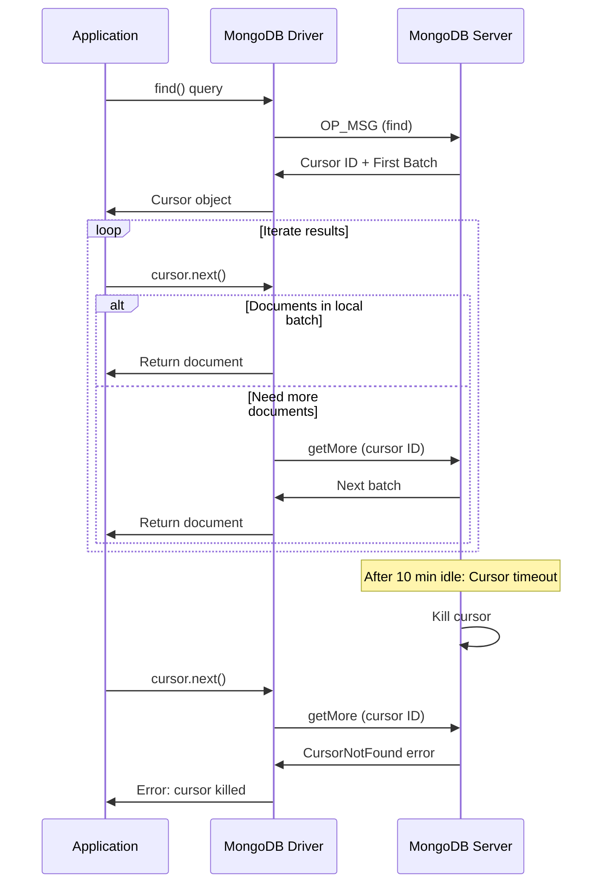

# How to Fix 'cursor killed' Errors in MongoDB

Author: [nawazdhandala](https://www.github.com/nawazdhandala)

Tags: MongoDB, Database, Troubleshooting, Cursors, Performance

Description: Learn how to diagnose and fix MongoDB cursor killed errors caused by timeouts, server restarts, and resource constraints, with strategies for robust cursor handling and batch processing.

---

The "cursor killed" or "cursor not found" error occurs when MongoDB terminates an active cursor before your application finishes iterating through results. This can happen for various reasons including timeouts, server restarts, or manual cursor termination. Understanding cursor lifecycle management is essential for building reliable MongoDB applications.

## Understanding Cursors

When you execute a query in MongoDB, it returns a cursor - a pointer to the result set. The cursor maintains state on the server and returns documents in batches.



## Common Causes

### 1. Cursor Timeout (Default: 10 minutes)

MongoDB automatically kills cursors that have been idle for 10 minutes:

```javascript
// Slow processing causes timeout
const cursor = db.largeCollection.find({});

for await (const doc of cursor) {
  await processDocument(doc);  // Takes > 10 minutes total
  // Error: cursor killed after timeout
}
```

### 2. Server Restart or Failover

When a MongoDB server restarts or a replica set fails over, all cursors on that server are invalidated:

```javascript
// During failover, cursors are lost
const cursor = db.collection.find({}).sort({ _id: 1 });

while (await cursor.hasNext()) {
  const doc = await cursor.next();
  // If failover happens here, cursor is invalid
}
```

### 3. Manual Cursor Termination

Cursors can be killed manually by administrators:

```bash
# Admin kills long-running cursors
db.currentOp().inprog.forEach(function(op) {
  if (op.secs_running > 300) {
    db.killOp(op.opid);
  }
});
```

### 4. Resource Constraints

When MongoDB runs low on resources, it may kill cursors to free memory.

## Solutions

### Solution 1: Use noCursorTimeout

Prevent automatic cursor timeout (use with caution):

```javascript
// Disable cursor timeout
const cursor = db.largeCollection.find({}).noCursorTimeout();

try {
  for await (const doc of cursor) {
    await processDocument(doc);
  }
} finally {
  // IMPORTANT: Always close noCursorTimeout cursors
  await cursor.close();
}

// With MongoDB driver options
const cursor = db.largeCollection.find({}, {
  noCursorTimeout: true
});

// Clean up pattern
async function processWithNoCursorTimeout(collection, query, processor) {
  const cursor = collection.find(query).noCursorTimeout();

  try {
    let count = 0;
    for await (const doc of cursor) {
      await processor(doc);
      count++;

      // Log progress
      if (count % 1000 === 0) {
        console.log(`Processed ${count} documents`);
      }
    }
    return count;
  } finally {
    await cursor.close();
  }
}
```

### Solution 2: Implement Resumable Iteration

Use a sortable field to resume from where you left off:

```javascript
async function processAllDocuments(collection, query, batchSize = 1000) {
  let lastId = null;
  let processedCount = 0;

  while (true) {
    // Build query with resume point
    const queryWithResume = lastId
      ? { ...query, _id: { $gt: lastId } }
      : query;

    const batch = await collection
      .find(queryWithResume)
      .sort({ _id: 1 })
      .limit(batchSize)
      .toArray();

    if (batch.length === 0) {
      break;  // No more documents
    }

    // Process batch
    for (const doc of batch) {
      await processDocument(doc);
      processedCount++;
    }

    // Save resume point
    lastId = batch[batch.length - 1]._id;
    console.log(`Processed ${processedCount} documents, last ID: ${lastId}`);
  }

  return processedCount;
}

// Usage
await processAllDocuments(db.users, { status: "active" });
```

### Solution 3: Use Change Streams for Resumable Processing

For real-time or long-running processing, change streams are more reliable:

```javascript
async function processWithChangeStream(collection, pipeline = []) {
  let resumeToken = await loadResumeToken();  // Load from persistent storage

  const options = resumeToken
    ? { resumeAfter: resumeToken }
    : { fullDocument: 'updateLookup' };

  const changeStream = collection.watch(pipeline, options);

  changeStream.on('change', async (change) => {
    try {
      await processChange(change);
      resumeToken = change._id;
      await saveResumeToken(resumeToken);  // Persist for recovery
    } catch (error) {
      console.error('Error processing change:', error);
    }
  });

  changeStream.on('error', async (error) => {
    console.error('Change stream error:', error);
    // Restart with resume token
    setTimeout(() => processWithChangeStream(collection, pipeline), 5000);
  });

  return changeStream;
}
```

### Solution 4: Batch Processing with Aggregation

Use aggregation with $limit and $skip for controlled batching:

```javascript
async function batchProcess(collection, pipeline, batchSize = 1000) {
  let skip = 0;
  let hasMore = true;

  while (hasMore) {
    const batch = await collection.aggregate([
      ...pipeline,
      { $skip: skip },
      { $limit: batchSize }
    ]).toArray();

    if (batch.length === 0) {
      hasMore = false;
      break;
    }

    // Process batch
    await Promise.all(batch.map(processDocument));

    skip += batchSize;
    console.log(`Processed batch at offset ${skip}`);

    // Small delay to prevent overwhelming the server
    await new Promise(resolve => setTimeout(resolve, 100));
  }
}

// Better: Use _id-based pagination (more efficient for large collections)
async function efficientBatchProcess(collection, pipeline, batchSize = 1000) {
  let lastId = null;

  while (true) {
    const matchStage = lastId
      ? { $match: { _id: { $gt: lastId } } }
      : { $match: {} };

    const batch = await collection.aggregate([
      matchStage,
      ...pipeline,
      { $sort: { _id: 1 } },
      { $limit: batchSize }
    ]).toArray();

    if (batch.length === 0) break;

    await Promise.all(batch.map(processDocument));
    lastId = batch[batch.length - 1]._id;
  }
}
```

### Solution 5: Handle Cursor Errors Gracefully

Implement retry logic that can resume from the last processed document:

```javascript
async function robustIteration(collection, query, processor) {
  let lastProcessedId = null;
  let retries = 0;
  const maxRetries = 5;

  while (retries < maxRetries) {
    try {
      const resumeQuery = lastProcessedId
        ? { ...query, _id: { $gt: lastProcessedId } }
        : query;

      const cursor = collection.find(resumeQuery).sort({ _id: 1 });

      for await (const doc of cursor) {
        await processor(doc);
        lastProcessedId = doc._id;
      }

      // Successfully completed
      return;

    } catch (error) {
      if (isCursorError(error)) {
        retries++;
        console.log(`Cursor error, retry ${retries}/${maxRetries} from ID ${lastProcessedId}`);
        await new Promise(resolve => setTimeout(resolve, 1000 * retries));
      } else {
        throw error;
      }
    }
  }

  throw new Error(`Failed after ${maxRetries} retries`);
}

function isCursorError(error) {
  const cursorErrors = [
    'cursor not found',
    'cursor killed',
    'CursorNotFound',
    'cursor id not valid'
  ];

  return cursorErrors.some(msg =>
    error.message?.toLowerCase().includes(msg.toLowerCase()) ||
    error.codeName === 'CursorNotFound'
  );
}
```

### Solution 6: Use maxTimeMS for Bounded Operations

Set a maximum time for cursor operations:

```javascript
// Fail fast if query takes too long
const cursor = db.collection
  .find({ status: "pending" })
  .maxTimeMS(30000);  // 30 second timeout

try {
  const results = await cursor.toArray();
  return results;
} catch (error) {
  if (error.code === 50) {  // ExceededTimeLimit
    console.log('Query exceeded time limit, using fallback');
    return await fallbackQuery();
  }
  throw error;
}
```

## Monitoring Cursors

Track cursor usage to prevent issues:

```javascript
// Check current cursor count
async function getCursorStats() {
  const status = await db.adminCommand({ serverStatus: 1 });

  return {
    totalOpen: status.metrics.cursor.open.total,
    pinned: status.metrics.cursor.open.pinned,
    noTimeout: status.metrics.cursor.open.noTimeout,
    timedOut: status.metrics.cursor.timedOut
  };
}

// List current operations with cursors
async function listActiveCursors() {
  const ops = await db.adminCommand({ currentOp: true });

  return ops.inprog.filter(op =>
    op.cursor && op.cursor.cursorId
  ).map(op => ({
    cursorId: op.cursor.cursorId,
    ns: op.ns,
    runningTimeMs: op.microsecs_running / 1000,
    client: op.client
  }));
}

// Periodic monitoring
setInterval(async () => {
  const stats = await getCursorStats();
  console.log('Cursor stats:', stats);

  if (stats.noTimeout > 100) {
    console.warn('Too many noCursorTimeout cursors!');
  }
}, 60000);
```

## Best Practices

1. **Prefer toArray() for small results** - If your result set fits in memory, use `toArray()` to fetch everything at once

2. **Use batch processing for large datasets** - Process in chunks with resume capability

3. **Close cursors explicitly** - Especially when using `noCursorTimeout`

4. **Set appropriate batch sizes** - Balance between network round trips and memory usage

5. **Implement idempotent processing** - Handle duplicate processing after cursor recovery

6. **Monitor cursor metrics** - Track open cursors and timeout rates

```javascript
// Good pattern: Explicit cursor management
async function safeIteration(collection, query) {
  const cursor = collection.find(query).batchSize(100);

  try {
    while (await cursor.hasNext()) {
      const doc = await cursor.next();
      await processDocument(doc);
    }
  } finally {
    await cursor.close();  // Always close
  }
}
```

## Summary

Cursor killed errors can be prevented and handled with proper strategies:

1. **Use noCursorTimeout** for long operations (with proper cleanup)
2. **Implement resumable iteration** using `_id` or timestamp fields
3. **Batch process large datasets** to avoid long-lived cursors
4. **Add retry logic** that can resume from the last position
5. **Monitor cursor metrics** to catch issues early
6. **Set reasonable timeouts** with maxTimeMS

With these patterns, your application will handle cursor termination gracefully and recover from failures without data loss.
