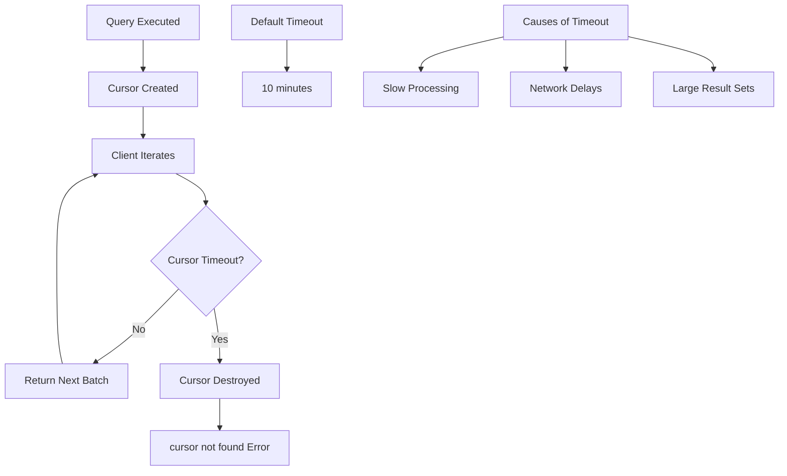
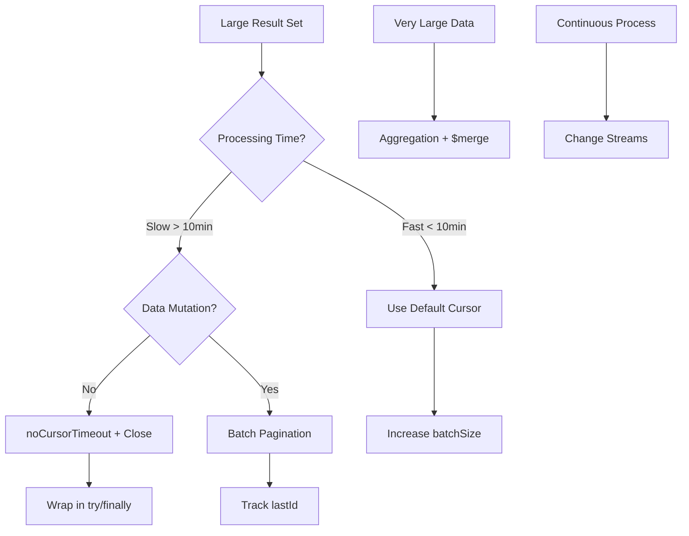

# How to Fix "cursor not found" Errors in MongoDB

Author: [nawazdhandala](https://www.github.com/nawazdhandala)

Tags: MongoDB, Database, Error Handling, Performance, Node.js

Description: Diagnose and resolve MongoDB cursor not found errors by understanding cursor lifecycle, timeout settings, and implementing batch processing patterns for large result sets.

---

The "cursor not found" error in MongoDB occurs when your application tries to continue iterating through query results, but the server-side cursor has been destroyed. This typically happens during long-running operations on large datasets. Understanding cursor behavior and implementing proper handling patterns will help you avoid this error.

## Understanding the Error

The error typically appears as:

```
MongoServerError: cursor id 1234567890 not found
CursorNotFound: Cursor not found (namespace: 'mydb.mycollection', id: 1234567890)
```



## Why Cursors Expire

MongoDB cursors have a default timeout of 10 minutes. If your application takes longer than that between `getMore` requests (fetching the next batch), the cursor expires.

Common causes:
1. Processing each document takes too long
2. Network latency between batches
3. Application pauses (GC, other operations)
4. Very large result sets
5. Primary failover in replica sets

## Solution 1: Use noCursorTimeout

Disable the automatic cursor timeout. Use with caution and always close cursors explicitly.

```javascript
// Node.js driver
const cursor = collection.find({}).noCursorTimeout();

try {
  for await (const doc of cursor) {
    await processDocument(doc);  // Even slow processing is OK
  }
} finally {
  await cursor.close();  // Always close manually!
}

// Mongoose
const cursor = Model.find({}).cursor({ noCursorTimeout: true });

cursor.on('data', async (doc) => {
  await processDocument(doc);
});

cursor.on('end', () => {
  cursor.close();
});

cursor.on('error', (err) => {
  cursor.close();
  console.error(err);
});
```

**Warning:** Forgetting to close a `noCursorTimeout` cursor can cause server resource leaks.

## Solution 2: Batch Processing with Pagination

Instead of a single long-running cursor, process data in batches using pagination.

```javascript
async function processInBatches(collection, query, batchSize = 1000) {
  let lastId = null;
  let processedCount = 0;

  while (true) {
    // Build query with pagination
    const paginatedQuery = lastId
      ? { ...query, _id: { $gt: lastId } }
      : query;

    const batch = await collection
      .find(paginatedQuery)
      .sort({ _id: 1 })
      .limit(batchSize)
      .toArray();

    if (batch.length === 0) {
      break;  // No more documents
    }

    // Process the batch
    for (const doc of batch) {
      await processDocument(doc);
      processedCount++;
    }

    // Update cursor position
    lastId = batch[batch.length - 1]._id;

    console.log(`Processed ${processedCount} documents`);
  }

  return processedCount;
}

// Usage
await processInBatches(db.collection('orders'), { status: 'pending' });
```

### Pagination with Non-ID Fields

```javascript
async function paginateByDate(collection, startDate, endDate, batchSize = 1000) {
  let lastDate = startDate;
  let lastId = null;

  while (lastDate < endDate) {
    const query = lastId
      ? {
          $or: [
            { createdAt: { $gt: lastDate } },
            { createdAt: lastDate, _id: { $gt: lastId } }
          ],
          createdAt: { $lt: endDate }
        }
      : {
          createdAt: { $gte: lastDate, $lt: endDate }
        };

    const batch = await collection
      .find(query)
      .sort({ createdAt: 1, _id: 1 })
      .limit(batchSize)
      .toArray();

    if (batch.length === 0) break;

    for (const doc of batch) {
      await processDocument(doc);
    }

    const lastDoc = batch[batch.length - 1];
    lastDate = lastDoc.createdAt;
    lastId = lastDoc._id;
  }
}
```

## Solution 3: Increase Batch Size

Fetch more documents per batch to reduce round trips.

```javascript
// Default batch size is 101 documents for first batch, then 16MB or 101 docs
const cursor = collection.find({}).batchSize(5000);

for await (const doc of cursor) {
  // Process document
}
```

**Trade-off:** Larger batches use more memory but reduce server round trips.

## Solution 4: Stream Processing

Process documents as a stream to handle backpressure properly.

```javascript
const { Transform } = require('stream');
const { pipeline } = require('stream/promises');

// Create a transform stream for processing
const processor = new Transform({
  objectMode: true,
  async transform(doc, encoding, callback) {
    try {
      const result = await processDocument(doc);
      callback(null, result);
    } catch (error) {
      callback(error);
    }
  }
});

// Process with proper backpressure
async function streamProcess(collection, query) {
  const cursor = collection.find(query).stream();

  const results = [];
  const collector = new Transform({
    objectMode: true,
    transform(doc, encoding, callback) {
      results.push(doc);
      callback();
    }
  });

  await pipeline(cursor, processor, collector);
  return results;
}
```

## Solution 5: Aggregation with $merge or $out

For data transformation tasks, use aggregation to write results directly.

```javascript
// Process and write to new collection - no cursor timeout issues
await collection.aggregate([
  { $match: { status: 'pending' } },
  {
    $addFields: {
      processedAt: new Date(),
      status: 'processed'
    }
  },
  {
    $merge: {
      into: 'processedOrders',
      on: '_id',
      whenMatched: 'replace',
      whenNotMatched: 'insert'
    }
  }
]).toArray();

// Or use $out to replace entire collection
await collection.aggregate([
  { $match: { active: true } },
  { $project: { name: 1, email: 1 } },
  { $out: 'activeUsers' }
]).toArray();
```

## Solution 6: Retry Logic for Cursor Errors

Implement retry logic that handles cursor errors gracefully.

```javascript
async function processWithRetry(collection, query, options = {}) {
  const { batchSize = 1000, maxRetries = 3 } = options;

  let lastProcessedId = null;
  let totalProcessed = 0;
  let retryCount = 0;

  while (true) {
    try {
      const paginatedQuery = lastProcessedId
        ? { ...query, _id: { $gt: lastProcessedId } }
        : query;

      const cursor = collection
        .find(paginatedQuery)
        .sort({ _id: 1 })
        .batchSize(batchSize);

      for await (const doc of cursor) {
        await processDocument(doc);
        lastProcessedId = doc._id;
        totalProcessed++;
        retryCount = 0;  // Reset on success
      }

      break;  // Completed successfully

    } catch (error) {
      if (error.code === 43 || error.message.includes('cursor not found')) {
        retryCount++;

        if (retryCount >= maxRetries) {
          throw new Error(`Max retries exceeded at document ${lastProcessedId}`);
        }

        console.log(`Cursor expired, retrying from ${lastProcessedId}...`);
        continue;  // Retry from last position
      }

      throw error;  // Re-throw other errors
    }
  }

  return totalProcessed;
}
```

## Solution 7: Change Stream for Continuous Processing

For ongoing processing needs, use Change Streams instead of polling with cursors.

```javascript
const pipeline = [
  { $match: { operationType: { $in: ['insert', 'update'] } } }
];

const changeStream = collection.watch(pipeline, {
  fullDocument: 'updateLookup'
});

changeStream.on('change', async (change) => {
  await processDocument(change.fullDocument);
});

changeStream.on('error', (error) => {
  console.error('Change stream error:', error);
  // Implement reconnection logic
});

// Change streams handle their own cursor management
```

## Replica Set Considerations

Cursor not found errors can occur during replica set elections.

```javascript
// Configure for replica set resilience
const client = new MongoClient(uri, {
  readPreference: 'primaryPreferred',
  retryReads: true,
  retryWrites: true
});

// Use read concern for consistency
const cursor = collection
  .find({})
  .readConcern('majority');
```

## Monitoring and Debugging

### Check Open Cursors

```javascript
// Server-side cursor stats
const serverStatus = await db.command({ serverStatus: 1 });
console.log('Open cursors:', serverStatus.metrics.cursor.open.total);
console.log('Timed out cursors:', serverStatus.metrics.cursor.timedOut);

// Current operations
const currentOps = await db.admin().command({
  currentOp: true,
  '$or': [
    { op: 'getmore' },
    { 'cursor': { $exists: true } }
  ]
});
```

### Logging Cursor Activity

```javascript
// Add cursor lifecycle logging
client.on('commandStarted', (event) => {
  if (event.commandName === 'getMore') {
    console.log(`getMore on cursor ${event.command.getMore}`);
  }
});

client.on('commandFailed', (event) => {
  if (event.commandName === 'getMore') {
    console.error(`Cursor operation failed: ${event.failure}`);
  }
});
```

## Best Practices Summary



| Scenario | Solution |
|----------|----------|
| Simple iteration, fast processing | Default cursor with larger batchSize |
| Slow processing, no timeout risk | noCursorTimeout with explicit close |
| Very large datasets | Batch pagination by _id |
| Data transformation | Aggregation with $merge/$out |
| Continuous processing | Change Streams |
| Unreliable network | Retry logic with position tracking |

---

Cursor not found errors are a signal that your query results are too large or processing is too slow for a single cursor lifecycle. Choose the appropriate strategy based on your data size and processing requirements. For most cases, batch pagination provides the best balance of simplicity and reliability. Always monitor your cursor usage and implement proper error handling to gracefully recover from cursor timeouts.
