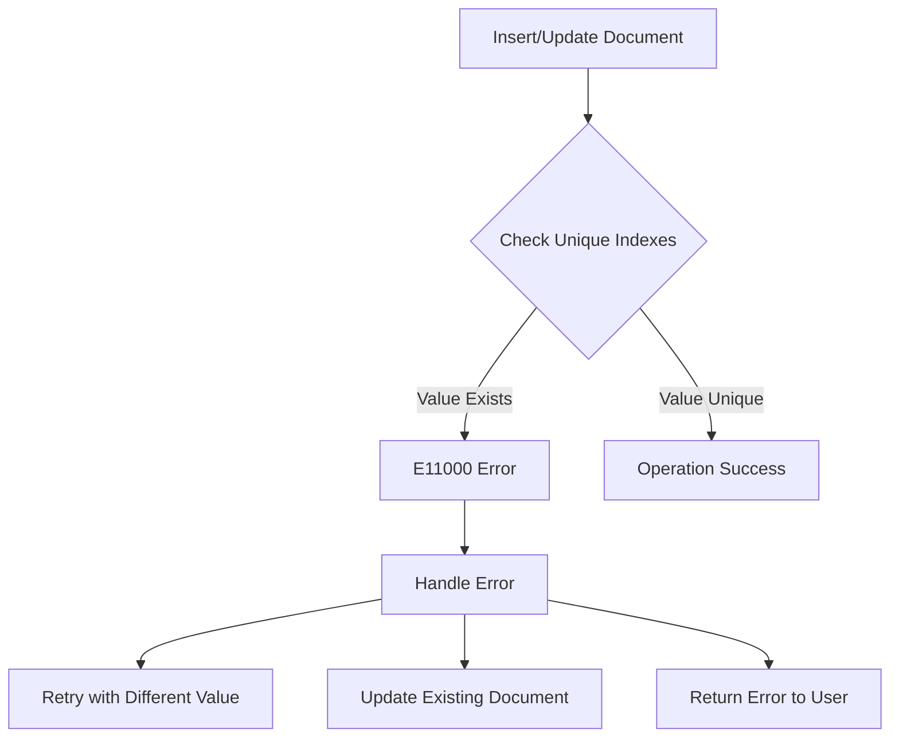

# How to Fix "E11000 duplicate key error" in MongoDB

Author: [nawazdhandala](https://www.github.com/nawazdhandala)

Tags: MongoDB, Database, Error Handling, Indexing, Node.js

Description: Learn how to diagnose and fix the E11000 duplicate key error in MongoDB, including understanding unique indexes, handling race conditions, and implementing proper error handling strategies.

---

The E11000 duplicate key error is one of the most common errors you will encounter when working with MongoDB. This error occurs when you attempt to insert or update a document with a value that already exists in a field with a unique index. Understanding why this happens and how to fix it is essential for building robust applications.

## Understanding the E11000 Error

When MongoDB throws an E11000 error, it looks something like this:

```
MongoServerError: E11000 duplicate key error collection: mydb.users index: email_1 dup key: { email: "john@example.com" }
```

This error message tells you:
- The collection where the error occurred (`mydb.users`)
- The index that was violated (`email_1`)
- The duplicate value (`john@example.com`)



## Common Causes of E11000 Errors

### 1. Explicit Unique Index Violations

The most straightforward cause is when you have defined a unique index and try to insert a duplicate value.

```javascript
// Creating a unique index on the email field
db.users.createIndex({ email: 1 }, { unique: true });

// First insert works fine
db.users.insertOne({ email: "john@example.com", name: "John" });

// Second insert with same email throws E11000
db.users.insertOne({ email: "john@example.com", name: "Jane" });
// Error: E11000 duplicate key error collection: mydb.users index: email_1
```

### 2. The _id Field Collision

Every MongoDB document has a unique `_id` field. If you manually specify an `_id` that already exists, you will get an E11000 error.

```javascript
// First document
db.products.insertOne({ _id: "SKU001", name: "Widget" });

// Attempting to insert with same _id
db.products.insertOne({ _id: "SKU001", name: "Gadget" });
// Error: E11000 duplicate key error on _id
```

### 3. Compound Unique Index Violations

Compound unique indexes require the combination of fields to be unique.

```javascript
// Create compound unique index
db.inventory.createIndex(
  { warehouse: 1, product: 1 },
  { unique: true }
);

// First insert
db.inventory.insertOne({ warehouse: "NYC", product: "Widget", qty: 100 });

// Same combination throws error
db.inventory.insertOne({ warehouse: "NYC", product: "Widget", qty: 50 });
// Error: E11000 duplicate key error
```

### 4. Null Values in Unique Indexes

A common gotcha is that `null` values are treated as actual values in unique indexes. Multiple documents with missing fields will collide.

```javascript
db.users.createIndex({ username: 1 }, { unique: true });

// Both of these have username = null (missing field)
db.users.insertOne({ email: "john@example.com" });
db.users.insertOne({ email: "jane@example.com" });
// Second insert fails - duplicate null value
```

## Solutions and Fixes

### Solution 1: Use Partial Indexes for Optional Fields

When a field is optional but should be unique when present, use a partial index.

```javascript
// Only index documents where username exists and is not null
db.users.createIndex(
  { username: 1 },
  {
    unique: true,
    partialFilterExpression: { username: { $exists: true, $ne: null } }
  }
);

// Now both of these work
db.users.insertOne({ email: "john@example.com" }); // No username
db.users.insertOne({ email: "jane@example.com" }); // No username

// But duplicates still fail when username is present
db.users.insertOne({ username: "john123", email: "john@example.com" });
db.users.insertOne({ username: "john123", email: "jane@example.com" }); // Error!
```

### Solution 2: Use Upsert Operations

When you want to insert if not exists, or update if exists, use upsert.

```javascript
// Using updateOne with upsert
db.users.updateOne(
  { email: "john@example.com" },
  {
    $set: { name: "John Doe", lastLogin: new Date() },
    $setOnInsert: { createdAt: new Date() }
  },
  { upsert: true }
);
```

### Solution 3: Implement Proper Error Handling

In your application code, catch and handle E11000 errors appropriately.

```javascript
// Node.js with native MongoDB driver
async function createUser(userData) {
  try {
    const result = await db.collection('users').insertOne(userData);
    return { success: true, id: result.insertedId };
  } catch (error) {
    if (error.code === 11000) {
      // Parse the error to find which field caused the duplicate
      const field = Object.keys(error.keyPattern)[0];
      return {
        success: false,
        error: `A user with this ${field} already exists`
      };
    }
    throw error; // Re-throw other errors
  }
}

// Usage
const result = await createUser({
  email: "john@example.com",
  name: "John"
});

if (!result.success) {
  console.log(result.error); // "A user with this email already exists"
}
```

### Solution 4: Handle Race Conditions

In high-concurrency scenarios, use findOneAndUpdate with upsert to prevent race conditions.

```javascript
// Instead of check-then-insert (race condition prone)
async function registerUserSafe(email, userData) {
  try {
    const result = await db.collection('users').findOneAndUpdate(
      { email: email },
      {
        $setOnInsert: {
          ...userData,
          createdAt: new Date()
        }
      },
      {
        upsert: true,
        returnDocument: 'after'
      }
    );

    // Check if this was an insert or an existing document
    if (result.lastErrorObject?.updatedExisting) {
      return { success: false, error: 'Email already registered' };
    }

    return { success: true, user: result.value };
  } catch (error) {
    // Still handle potential E11000 from compound indexes
    if (error.code === 11000) {
      return { success: false, error: 'Duplicate value detected' };
    }
    throw error;
  }
}
```

### Solution 5: Clean Up Duplicate Data

If you are adding a unique index to existing data with duplicates, you need to clean up first.

```javascript
// Find duplicates
const duplicates = await db.collection('users').aggregate([
  {
    $group: {
      _id: "$email",
      count: { $sum: 1 },
      ids: { $push: "$_id" }
    }
  },
  {
    $match: { count: { $gt: 1 } }
  }
]).toArray();

// Remove duplicates (keeping the first one)
for (const dup of duplicates) {
  const idsToRemove = dup.ids.slice(1); // Keep first, remove rest
  await db.collection('users').deleteMany({
    _id: { $in: idsToRemove }
  });
}

// Now you can create the unique index
db.collection('users').createIndex({ email: 1 }, { unique: true });
```

### Solution 6: Use Sparse Indexes (Legacy Approach)

For older MongoDB versions, sparse indexes skip documents where the indexed field is missing.

```javascript
// Sparse unique index - only indexes documents with the field
db.users.createIndex(
  { socialSecurityNumber: 1 },
  { unique: true, sparse: true }
);
```

Note: Partial indexes are preferred over sparse indexes in modern MongoDB as they offer more flexibility.

## Best Practices

1. **Always handle E11000 in your application code** - Do not let duplicate key errors crash your application.

2. **Use meaningful error messages** - Parse the error to tell users which field caused the issue.

3. **Consider upsert operations** - When dealing with idempotent operations, upsert prevents duplicates naturally.

4. **Test your indexes** - Before deploying, ensure your unique indexes work with your data patterns.

5. **Monitor for duplicates** - Set up alerts for E11000 errors to catch data integrity issues early.

```javascript
// Mongoose schema example with proper error handling
const userSchema = new mongoose.Schema({
  email: {
    type: String,
    required: true,
    unique: true,
    lowercase: true,
    trim: true
  },
  username: {
    type: String,
    unique: true,
    sparse: true
  }
});

// Handle duplicate key errors gracefully
userSchema.post('save', function(error, doc, next) {
  if (error.name === 'MongoServerError' && error.code === 11000) {
    const field = Object.keys(error.keyPattern)[0];
    next(new Error(`${field} already exists`));
  } else {
    next(error);
  }
});
```

## Debugging Tips

When you encounter E11000 errors, use these commands to investigate:

```javascript
// List all indexes on a collection
db.users.getIndexes();

// Check for duplicate values before creating index
db.users.aggregate([
  { $group: { _id: "$email", count: { $sum: 1 } } },
  { $match: { count: { $gt: 1 } } }
]);

// Drop a problematic index if needed
db.users.dropIndex("email_1");
```

---

The E11000 duplicate key error is a sign that MongoDB is protecting your data integrity. By understanding unique indexes, implementing proper error handling, and using upsert operations where appropriate, you can build applications that handle duplicates gracefully while maintaining data consistency.
