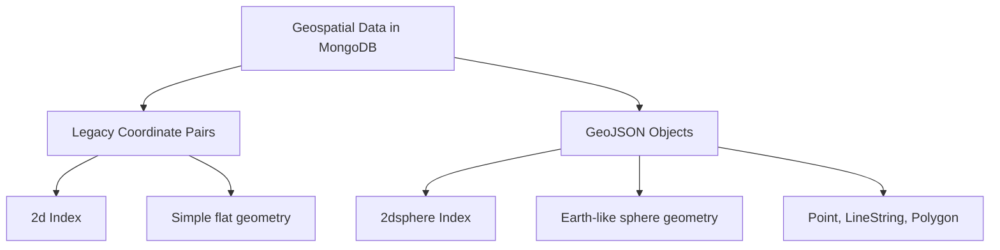

# How to Use MongoDB Geospatial Queries

Author: [nawazdhandala](https://www.github.com/nawazdhandala)

Tags: MongoDB, Geospatial, GeoJSON, Location, Database, Maps

Description: Master MongoDB geospatial queries to build location-aware applications. Learn about GeoJSON, spatial indexes, proximity searches, and real-world use cases with practical code examples.

---

MongoDB's geospatial capabilities enable powerful location-based features in your applications. From finding nearby restaurants to calculating delivery routes, geospatial queries are essential for modern applications. This guide covers everything you need to know to implement effective location-based features.

## Understanding Geospatial Data

MongoDB supports two types of geospatial data:



## GeoJSON Format

GeoJSON is the recommended format for geospatial data:

```javascript
// Point - represents a single location
{
    type: "Point",
    coordinates: [-73.856077, 40.848447]  // [longitude, latitude]
}

// LineString - represents a path
{
    type: "LineString",
    coordinates: [
        [-73.856077, 40.848447],
        [-73.857234, 40.849123],
        [-73.858901, 40.850567]
    ]
}

// Polygon - represents an area (first and last points must match)
{
    type: "Polygon",
    coordinates: [[
        [-73.856077, 40.848447],
        [-73.857234, 40.849123],
        [-73.858901, 40.850567],
        [-73.856077, 40.848447]  // Closes the polygon
    ]]
}

// Polygon with hole
{
    type: "Polygon",
    coordinates: [
        // Outer ring
        [[-73.95, 40.80], [-73.95, 40.85], [-73.90, 40.85], [-73.90, 40.80], [-73.95, 40.80]],
        // Inner ring (hole)
        [[-73.94, 40.81], [-73.94, 40.84], [-73.91, 40.84], [-73.91, 40.81], [-73.94, 40.81]]
    ]
}

// MultiPoint
{
    type: "MultiPoint",
    coordinates: [
        [-73.856077, 40.848447],
        [-73.857234, 40.849123]
    ]
}

// GeometryCollection
{
    type: "GeometryCollection",
    geometries: [
        { type: "Point", coordinates: [-73.856077, 40.848447] },
        { type: "LineString", coordinates: [[-73.856077, 40.848447], [-73.857234, 40.849123]] }
    ]
}
```

## Creating Geospatial Indexes

Set up indexes for efficient geospatial queries:

```javascript
// 2dsphere index for GeoJSON data (recommended)
db.locations.createIndex({ location: "2dsphere" })

// Compound index with geospatial field
db.stores.createIndex({ location: "2dsphere", category: 1 })

// 2d index for legacy coordinate pairs
db.places.createIndex({ coordinates: "2d" })

// 2d index with bounds for flat surface calculations
db.map.createIndex({ position: "2d" }, {
    min: -500,
    max: 500,
    bits: 32
})
```

## Setting Up Location Data

Create collections with proper geospatial structure:

```javascript
const { MongoClient, ObjectId } = require('mongodb');

async function setupLocationData() {
    const client = new MongoClient('mongodb://localhost:27017');
    await client.connect();

    const db = client.db('geospatial');

    // Create stores collection with validation
    await db.createCollection('stores', {
        validator: {
            $jsonSchema: {
                bsonType: 'object',
                required: ['name', 'location', 'category'],
                properties: {
                    name: { bsonType: 'string' },
                    location: {
                        bsonType: 'object',
                        required: ['type', 'coordinates'],
                        properties: {
                            type: { enum: ['Point'] },
                            coordinates: {
                                bsonType: 'array',
                                minItems: 2,
                                maxItems: 2,
                                items: { bsonType: 'double' }
                            }
                        }
                    },
                    category: { bsonType: 'string' }
                }
            }
        }
    });

    // Create 2dsphere index
    await db.collection('stores').createIndex({ location: '2dsphere' });

    // Insert sample data
    await db.collection('stores').insertMany([
        {
            name: 'Coffee Shop A',
            location: { type: 'Point', coordinates: [-73.856077, 40.848447] },
            category: 'cafe',
            rating: 4.5
        },
        {
            name: 'Restaurant B',
            location: { type: 'Point', coordinates: [-73.857234, 40.849123] },
            category: 'restaurant',
            rating: 4.2
        },
        {
            name: 'Bookstore C',
            location: { type: 'Point', coordinates: [-73.858901, 40.850567] },
            category: 'retail',
            rating: 4.8
        }
    ]);

    await client.close();
}
```

## Basic Geospatial Queries

### Find Nearby Locations ($near)

```javascript
// Find locations near a point
db.stores.find({
    location: {
        $near: {
            $geometry: {
                type: 'Point',
                coordinates: [-73.856077, 40.848447]
            },
            $maxDistance: 1000,  // meters
            $minDistance: 100    // meters (optional)
        }
    }
})

// Using $nearSphere (similar but uses spherical geometry)
db.stores.find({
    location: {
        $nearSphere: {
            $geometry: {
                type: 'Point',
                coordinates: [-73.856077, 40.848447]
            },
            $maxDistance: 1000
        }
    }
})
```

### Find Within a Circle ($geoWithin + $centerSphere)

```javascript
// Find all stores within 5km of a point
db.stores.find({
    location: {
        $geoWithin: {
            $centerSphere: [
                [-73.856077, 40.848447],
                5 / 6378.1  // Convert km to radians (Earth radius = 6378.1 km)
            ]
        }
    }
})
```

### Find Within a Polygon ($geoWithin + $geometry)

```javascript
// Define a neighborhood boundary
const neighborhoodBoundary = {
    type: 'Polygon',
    coordinates: [[
        [-73.95, 40.80],
        [-73.95, 40.85],
        [-73.90, 40.85],
        [-73.90, 40.80],
        [-73.95, 40.80]
    ]]
};

// Find all stores within the boundary
db.stores.find({
    location: {
        $geoWithin: {
            $geometry: neighborhoodBoundary
        }
    }
})
```

### Find Intersecting Geometries ($geoIntersects)

```javascript
// Find delivery zones that include a specific point
db.deliveryZones.find({
    area: {
        $geoIntersects: {
            $geometry: {
                type: 'Point',
                coordinates: [-73.856077, 40.848447]
            }
        }
    }
})

// Find routes that pass through an area
db.routes.find({
    path: {
        $geoIntersects: {
            $geometry: {
                type: 'Polygon',
                coordinates: [[
                    [-73.95, 40.80],
                    [-73.95, 40.85],
                    [-73.90, 40.85],
                    [-73.90, 40.80],
                    [-73.95, 40.80]
                ]]
            }
        }
    }
})
```

## Advanced Geospatial Queries

### Aggregation with $geoNear

```javascript
// Find nearby stores with distance calculation
db.stores.aggregate([
    {
        $geoNear: {
            near: {
                type: 'Point',
                coordinates: [-73.856077, 40.848447]
            },
            distanceField: 'distance',  // Calculated distance in meters
            maxDistance: 5000,
            query: { category: 'cafe' },  // Additional filter
            spherical: true,
            distanceMultiplier: 0.001  // Convert to km
        }
    },
    {
        $project: {
            name: 1,
            category: 1,
            distance: { $round: ['$distance', 2] }  // Round to 2 decimals
        }
    },
    { $limit: 10 }
])

// Group nearby locations by category
db.stores.aggregate([
    {
        $geoNear: {
            near: { type: 'Point', coordinates: [-73.856077, 40.848447] },
            distanceField: 'distance',
            maxDistance: 2000,
            spherical: true
        }
    },
    {
        $group: {
            _id: '$category',
            count: { $sum: 1 },
            avgDistance: { $avg: '$distance' },
            nearest: { $min: '$distance' },
            stores: { $push: { name: '$name', distance: '$distance' } }
        }
    },
    { $sort: { count: -1 } }
])
```

## Building a Location Service

Complete location service implementation:

```javascript
const { MongoClient, ObjectId } = require('mongodb');

class LocationService {
    constructor(client, dbName) {
        this.client = client;
        this.db = client.db(dbName);
    }

    // Find nearest locations with pagination
    async findNearby(collectionName, coordinates, options = {}) {
        const {
            maxDistance = 5000,
            limit = 20,
            skip = 0,
            filter = {},
            includeDistance = true
        } = options;

        const collection = this.db.collection(collectionName);

        if (includeDistance) {
            // Use aggregation to include distance
            const pipeline = [
                {
                    $geoNear: {
                        near: { type: 'Point', coordinates },
                        distanceField: 'distance',
                        maxDistance,
                        query: filter,
                        spherical: true
                    }
                },
                { $skip: skip },
                { $limit: limit }
            ];

            return collection.aggregate(pipeline).toArray();
        }

        // Simple query without distance
        return collection.find({
            ...filter,
            location: {
                $near: {
                    $geometry: { type: 'Point', coordinates },
                    $maxDistance: maxDistance
                }
            }
        }).skip(skip).limit(limit).toArray();
    }

    // Find locations within a bounding box
    async findInBoundingBox(collectionName, bbox, options = {}) {
        const { filter = {}, limit = 100 } = options;
        const [swLng, swLat, neLng, neLat] = bbox;

        return this.db.collection(collectionName).find({
            ...filter,
            location: {
                $geoWithin: {
                    $box: [
                        [swLng, swLat],  // Southwest corner
                        [neLng, neLat]   // Northeast corner
                    ]
                }
            }
        }).limit(limit).toArray();
    }

    // Find locations within a polygon (e.g., city boundary)
    async findInPolygon(collectionName, polygon, options = {}) {
        const { filter = {} } = options;

        return this.db.collection(collectionName).find({
            ...filter,
            location: {
                $geoWithin: {
                    $geometry: polygon
                }
            }
        }).toArray();
    }

    // Calculate if point is within delivery zone
    async isWithinDeliveryZone(point, zoneId) {
        const zone = await this.db.collection('deliveryZones').findOne({
            _id: new ObjectId(zoneId),
            area: {
                $geoIntersects: {
                    $geometry: { type: 'Point', coordinates: point }
                }
            }
        });

        return zone !== null;
    }

    // Find all zones that cover a point
    async findCoveringZones(point) {
        return this.db.collection('deliveryZones').find({
            area: {
                $geoIntersects: {
                    $geometry: { type: 'Point', coordinates: point }
                }
            }
        }).toArray();
    }

    // Search with text and location
    async searchNearby(collectionName, searchText, coordinates, options = {}) {
        const { maxDistance = 5000, limit = 20 } = options;

        // First, ensure text and geo indexes exist
        // await collection.createIndex({ name: 'text', description: 'text' });
        // await collection.createIndex({ location: '2dsphere' });

        return this.db.collection(collectionName).aggregate([
            {
                $geoNear: {
                    near: { type: 'Point', coordinates },
                    distanceField: 'distance',
                    maxDistance,
                    spherical: true
                }
            },
            {
                $match: {
                    $or: [
                        { name: { $regex: searchText, $options: 'i' } },
                        { description: { $regex: searchText, $options: 'i' } }
                    ]
                }
            },
            { $limit: limit }
        ]).toArray();
    }

    // Get statistics for an area
    async getAreaStatistics(polygon) {
        return this.db.collection('stores').aggregate([
            {
                $match: {
                    location: {
                        $geoWithin: { $geometry: polygon }
                    }
                }
            },
            {
                $group: {
                    _id: '$category',
                    count: { $sum: 1 },
                    avgRating: { $avg: '$rating' }
                }
            },
            { $sort: { count: -1 } }
        ]).toArray();
    }
}

// Usage
async function main() {
    const client = new MongoClient('mongodb://localhost:27017');
    await client.connect();

    const locationService = new LocationService(client, 'geospatial');

    // Find nearby cafes
    const nearbyCafes = await locationService.findNearby('stores',
        [-73.856077, 40.848447],
        {
            maxDistance: 2000,
            filter: { category: 'cafe' },
            limit: 10
        }
    );

    console.log('Nearby cafes:', nearbyCafes);

    await client.close();
}

main();
```

## Real-World Use Cases

### Store Locator with Filtering

```javascript
async function findStores(userLocation, filters) {
    const { category, minRating, maxDistance = 5000, openNow } = filters;

    const matchStage = {};
    if (category) matchStage.category = category;
    if (minRating) matchStage.rating = { $gte: minRating };

    if (openNow) {
        const now = new Date();
        const currentHour = now.getHours();
        const currentDay = now.getDay();

        matchStage['hours.day'] = currentDay;
        matchStage['hours.open'] = { $lte: currentHour };
        matchStage['hours.close'] = { $gt: currentHour };
    }

    return db.stores.aggregate([
        {
            $geoNear: {
                near: { type: 'Point', coordinates: userLocation },
                distanceField: 'distance',
                maxDistance,
                query: matchStage,
                spherical: true
            }
        },
        {
            $addFields: {
                distanceKm: { $divide: ['$distance', 1000] },
                walkingTime: { $divide: ['$distance', 83.33] }  // ~5km/h walking
            }
        },
        {
            $project: {
                name: 1,
                category: 1,
                rating: 1,
                address: 1,
                distance: { $round: ['$distanceKm', 2] },
                walkingTime: { $round: ['$walkingTime', 0] }
            }
        },
        { $limit: 20 }
    ]).toArray();
}
```

### Delivery Zone Management

```javascript
class DeliveryZoneService {
    constructor(db) {
        this.db = db;
    }

    // Create a delivery zone
    async createZone(zone) {
        const { name, polygon, deliveryFee, minOrder } = zone;

        return this.db.collection('deliveryZones').insertOne({
            name,
            area: { type: 'Polygon', coordinates: polygon },
            deliveryFee,
            minOrder,
            active: true,
            createdAt: new Date()
        });
    }

    // Check if address is deliverable and get fee
    async checkDelivery(coordinates) {
        const zones = await this.db.collection('deliveryZones').find({
            active: true,
            area: {
                $geoIntersects: {
                    $geometry: { type: 'Point', coordinates }
                }
            }
        }).sort({ deliveryFee: 1 }).toArray();

        if (zones.length === 0) {
            return {
                deliverable: false,
                message: 'Sorry, we do not deliver to this location'
            };
        }

        const bestZone = zones[0];
        return {
            deliverable: true,
            zone: bestZone.name,
            deliveryFee: bestZone.deliveryFee,
            minOrder: bestZone.minOrder
        };
    }

    // Find restaurants that deliver to a location
    async findDeliveringRestaurants(coordinates, options = {}) {
        const { cuisine, maxDeliveryFee } = options;

        const deliverableZones = await this.db.collection('deliveryZones').find({
            active: true,
            area: {
                $geoIntersects: {
                    $geometry: { type: 'Point', coordinates }
                }
            }
        }).toArray();

        const zoneIds = deliverableZones.map(z => z._id);

        const filter = { deliveryZones: { $in: zoneIds } };
        if (cuisine) filter.cuisine = cuisine;

        return this.db.collection('restaurants').aggregate([
            { $match: filter },
            {
                $lookup: {
                    from: 'deliveryZones',
                    localField: 'deliveryZones',
                    foreignField: '_id',
                    as: 'zones'
                }
            },
            {
                $addFields: {
                    deliveryInfo: {
                        $filter: {
                            input: '$zones',
                            as: 'zone',
                            cond: { $in: ['$$zone._id', zoneIds] }
                        }
                    }
                }
            },
            {
                $project: {
                    name: 1,
                    cuisine: 1,
                    rating: 1,
                    deliveryFee: { $min: '$deliveryInfo.deliveryFee' },
                    estimatedTime: '$deliveryTime'
                }
            },
            ...(maxDeliveryFee ? [{ $match: { deliveryFee: { $lte: maxDeliveryFee } } }] : []),
            { $sort: { rating: -1 } }
        ]).toArray();
    }
}
```

### Ride-Sharing Driver Matching

```javascript
class DriverMatchingService {
    constructor(db) {
        this.db = db;
    }

    // Update driver location (called frequently)
    async updateDriverLocation(driverId, coordinates) {
        return this.db.collection('drivers').updateOne(
            { _id: new ObjectId(driverId) },
            {
                $set: {
                    location: { type: 'Point', coordinates },
                    lastUpdated: new Date()
                }
            }
        );
    }

    // Find available drivers near pickup location
    async findNearbyDrivers(pickupLocation, options = {}) {
        const { maxDistance = 5000, vehicleType, limit = 10 } = options;

        const filter = {
            status: 'available',
            lastUpdated: { $gte: new Date(Date.now() - 60000) }  // Active in last minute
        };

        if (vehicleType) filter.vehicleType = vehicleType;

        return this.db.collection('drivers').aggregate([
            {
                $geoNear: {
                    near: { type: 'Point', coordinates: pickupLocation },
                    distanceField: 'distance',
                    maxDistance,
                    query: filter,
                    spherical: true
                }
            },
            {
                $addFields: {
                    estimatedArrival: {
                        $divide: ['$distance', 8.33]  // ~30km/h in city
                    }
                }
            },
            {
                $project: {
                    name: 1,
                    vehicleType: 1,
                    rating: 1,
                    distance: { $round: ['$distance', 0] },
                    estimatedArrival: { $round: ['$estimatedArrival', 0] }
                }
            },
            { $sort: { distance: 1 } },
            { $limit: limit }
        ]).toArray();
    }
}
```

## Performance Optimization

```javascript
// Create optimal indexes
db.locations.createIndex({ location: '2dsphere', category: 1, rating: -1 });

// Use $geoWithin instead of $near when distance order doesn't matter
// $geoWithin can use index more efficiently

// For high-volume updates, consider using capped collections for real-time locations
db.createCollection('driverLocations', {
    capped: true,
    size: 100000000,  // 100MB
    max: 100000       // Max 100k documents
});

// Batch location updates
async function batchUpdateLocations(updates) {
    const bulkOps = updates.map(({ driverId, coordinates }) => ({
        updateOne: {
            filter: { _id: driverId },
            update: {
                $set: {
                    location: { type: 'Point', coordinates },
                    lastUpdated: new Date()
                }
            }
        }
    }));

    return db.collection('drivers').bulkWrite(bulkOps);
}
```

## Conclusion

MongoDB's geospatial features provide a powerful foundation for location-aware applications. Key takeaways: always use GeoJSON format with 2dsphere indexes for accuracy, use $geoNear aggregation when you need distance calculations, combine geospatial queries with other filters for efficient searches, and remember that coordinates are in [longitude, latitude] order. With these tools, you can build sophisticated location features like store locators, delivery systems, and ride-sharing platforms.
